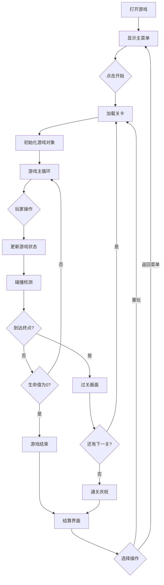
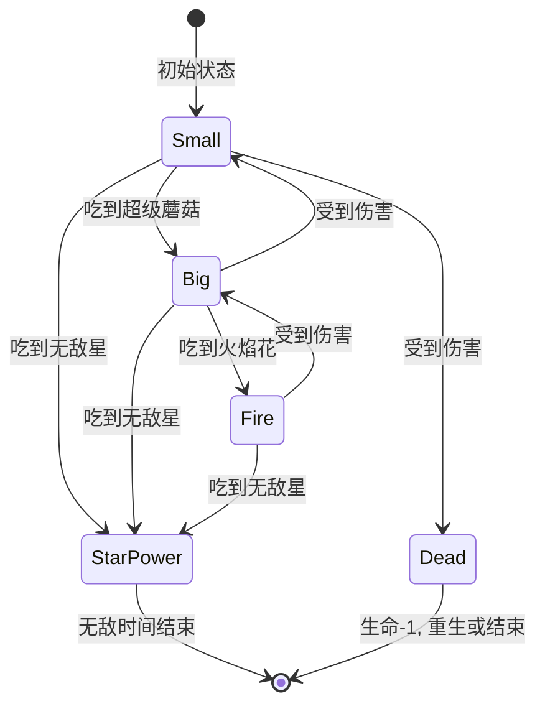

# 超级玛丽游戏 - 产品需求文档 (PRD)

## 1. 产品概述

一款基于Web的像素风格平台跳跃游戏，复刻经典《超级马里奥兄弟》的核心玩法。玩家控制马里奥角色在2D横版关卡中奔跑、跳跃、收集金币、踩踏敌人、躲避障碍物，最终到达终点旗帜完成关卡。目标用户为怀旧游戏爱好者和休闲游戏玩家。

**市场价值**: 提供无需下载安装的即时游戏体验，支持现代浏览器运行，具有教学演示和娱乐双重价值。

## 2. 核心功能

### 2.1 用户角色

| 角色 | 操作方式 | 核心权限 |
|------|---------|---------|
| 玩家 | 键盘/触屏 | 控制角色移动、跳跃、暂停/继续游戏 |

### 2.2 功能模块

1. **主菜单界面**: 游戏标题动画、开始按钮、操作说明、音效开关
2. **游戏主界面**: 角色渲染、场景地图、物理引擎、碰撞检测、UI状态栏
3. **游戏结算界面**: 得分统计、生命值显示、重新开始/返回菜单

### 2.3 页面详情

| 页面名称 | 模块名称 | 功能描述 |
|-----------|-------------|---------------------|
| 主菜单界面 | 标题区域 | 像素艺术风格的"SUPER MARIO"标题动画，带闪烁效果 |
| 主菜单界面 | 开始区域 | "PRESS START"按钮带呼吸灯效果，点击后进入游戏 |
| 主菜单界面 | 操作指南 | 显示键盘控制说明(方向键/WASD移动，空格跳跃) |
| 主菜单界面 | 设置选项 | 音效和背景音乐开关 |
| 游戏主界面 | 场景画布 | Canvas渲染的游戏世界，包含地面、管道、砖块、问号方块 |
| 游戏主界面 | 角色系统 | 马里奥角色，支持左右移动、跑步、跳跃、蹲下动作 |
| 游戏主界面 | 物理系统 | 重力模拟、碰撞检测、平台判定、敌人AI |
| 游戏主界面 | 状态栏 | 显示当前分数、金币数、剩余生命、当前世界/关卡、时间倒计时 |
| 游戏主界面 | 敌人系统 | 栗子怪(Goomba)、乌龟(Koopa)等经典敌人，巡逻AI |
| 游戏主界面 | 收集系统 | 金币收集(加分)、蘑菇道具(变大)、星星道具(无敌) |
| 游戏主界面 | 关卡设计 | 包含3个难度递增的完整关卡，每关有独特的地形布局 |
| 游戏结算界面 | 结果展示 | 胜利/失败提示，最终得分，打破记录提示 |
| 游戏结算界面 | 操作按钮 | "再玩一次"、"返回主菜单"选项 |

## 3. 核心流程

### 3.1 游戏主流程

玩家打开游戏 → 显示主菜单(带背景音乐) → 点击"START GAME" → 加载关卡数据 → 初始化游戏对象 → 进入游戏循环(更新逻辑+渲染画面) → 玩家操控马里奥前进 → 收集金币/道具/消灭敌人获得分数 → 到达终点旗帜 → 显示过关画面 → 进入下一关卡 或 返回主菜单

### 3.2 角色状态机

## 4. 用户界面设计

### 4.1 设计风格

**整体美学方向**: 复古像素艺术 + 现代视觉增强

- **主色调**:
  - 天空蓝: `#5C94FC` (经典NES天空色)
  - 地面棕: `#C84C0C` (砖块地面)
  - 管道绿: `#00A800` (经典管道色)
  - 马里奥红: `#E52521` (帽子/衣服)
  - 金币黄: `#FCA044` (硬币/奖励)

- **辅助色**:
  - 云朵白: `#FCFCFC`
  - 草地绿: `#00A800`
  - 砖块橙: `#C84C0C`
  - 问号块黄: `#FCA044`

- **字体选择**:
  - 标题字体: `Press Start 2P` (Google Fonts像素字体)
  - UI字体: `Press Start 2P` (保持一致性)

- **按钮风格**: 3D像素风按钮，带按下凹陷效果和阴影层次
- **布局风格**: 居中单页面，Canvas占据主要视口区域
- **图标风格**: 纯CSS/SVG绘制的像素艺术图标

### 4.2 页面设计概览

| 页面名称 | 模块名称 | UI元素描述 |
|-----------|-------------|-------------|
| 主菜单界面 | 背景 | 滚动的云朵和山丘背景视差效果，蓝色渐变天空 |
| 主菜单界面 | 标题 | 大号像素字"SUPER MARIO"，彩虹渐变色，轻微上下浮动动画 |
| 主菜单界面 | 按钮 | 3D立体按钮，hover时发光，active时下压反馈 |
| 主菜单界面 | 说明文字 | 小号像素字，半透明黑色背景框，显示操作指南 |
| 游戏主界面 | 顶部状态栏 | 固定在Canvas上方，左对齐显示分数/金币/生命，右对齐显示世界/时间 |
| 游戏主界面 | 游戏画布 | 全宽度Canvas，像素完美渲染，60FPS流畅动画 |
| 游戏主界面 | 暂停遮罩 | 半透明黑色覆盖层，中央显示"PAUSED"文字 |
| 游戏结算界面 | 结果卡片 | 居中卡片式布局，大字号显示VICTORY/GAME OVER |
| 游戏结算界面 | 统计信息 | 表格式展示最终得分、收集金币数、击败敌人数、用时 |

### 4.3 响应式设计

- **桌面优先策略**: 以1920x1080为基准分辨率设计
- **Canvas自适应**: 保持16:9宽高比，根据窗口大小自动缩放
- **移动端适配**: 支持触摸虚拟按键(左右方向键+跳跃键)
- **全屏模式**: 支持浏览器全屏API，提供沉浸式体验
- **触控优化**: 移动端显示虚拟方向键，防止误触

### 4.4 音效设计

- **背景音乐**: 8-bit风格循环BGM，使用Web Audio API合成
- **音效类型**:
  - 跳跃音效: 短促上升音调
  - 收集金币: 清脆金属声
  - 踩踏敌人: 低沉撞击声
  - 吃道具: 魔法音效
  - 死亡音效: 下降音调
  - 过关音效: 胜利旋律片段
