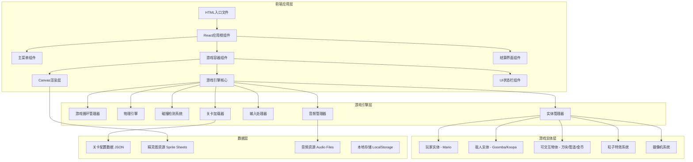
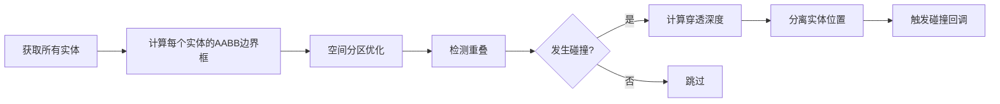

# 超级玛丽游戏 - 技术架构文档

## 1. 架构设计

采用纯前端架构，所有游戏逻辑在浏览器端执行，无需后端服务。基于HTML5 Canvas进行高性能渲染，使用游戏循环模式处理更新与绘制。



## 2. 技术选型

| 技术领域 | 选择方案 | 版本 | 选型理由 |
|---------|---------|------|---------|
| **前端框架** | React | 18.x | 组件化开发，状态管理清晰，生态成熟 |
| **构建工具** | Vite | 5.x | 极速热更新，原生ESM支持，构建速度快 |
| **样式方案** | CSS Modules + Tailwind CSS | 3.x | 像素级样式控制 + 快速布局工具类 |
| **游戏渲染** | HTML5 Canvas API | 原生 | 2D游戏最佳选择，性能优秀，兼容性好 |
| **字体资源** | Press Start 2P | Google Fonts | 经典像素字体，完美契合游戏主题 |
| **音频处理** | Web Audio API | 原生 | 8-bit音效合成，无需外部音频文件 |
| **状态管理** | React useState/useReducer | 内置 | 轻量级状态管理，适合游戏状态切换 |
| **动画系统** | requestAnimationFrame | 原生 | 浏览器原生高性能动画API |

## 3. 项目结构

```
mimo/
├── public/
│   └── index.html                    # HTML入口
├── src/
│   ├── main.jsx                      # React入口文件
│   ├── App.jsx                       # 应用根组件
│   ├── components/
│   │   ├── MainMenu.jsx              # 主菜单组件
│   │   ├── GameContainer.jsx         # 游戏容器组件
│   │   ├── GameHUD.jsx               # 游戏状态栏组件
│   │   ├── GameOverScreen.jsx        # 结算界面组件
│   │   └── MobileControls.jsx        # 移动端虚拟按键
│   ├── engine/
│   │   ├── GameLoop.js               # 游戏循环管理器
│   │   ├── Physics.js                # 物理引擎(重力/速度/摩擦)
│   │   ├── CollisionDetector.js      # AABB碰撞检测
│   │   ├── Camera.js                 # 摄像机跟随系统
│   │   ├── InputHandler.js           # 键盘/触摸输入处理
│   │   ├── AudioManager.js           # 音频管理器(Web Audio API)
│   │   ├── ParticleSystem.js         # 粒子特效系统
│   │   └── Renderer.js               # Canvas渲染器
│   ├── entities/
│   │   ├── Player.js                 # 玩家实体(Mario)
│   │   ├── Enemy.js                  # 敌人基类
│   │   ├── Goomba.js                 # 栗子怪实体
│   │   ├── Koopa.js                  # 乌龟实体
│   │   ├── Block.js                  # 可破坏/可敲击方块
│   │   ├── Coin.js                   # 金币实体
│   │   ├── Pipe.js                   # 管道障碍物
│   │   ├── PowerUp.js                # 道具基类
│   │   └── Flag.py                   # 终点旗帜
│   ├── levels/
│   │   ├── Level1.js                 # 第一关配置数据
│   │   ├── Level2.js                 # 第二关配置数据
│   │   ├── Level3.js                 # 第三关配置数据
│   │   └── TileMap.js                # 地图瓦片解析器
│   ├── utils/
│   │   ├── Constants.js              # 游戏常量定义
│   │   ├── SpriteRenderer.js         # 精灵图绘制工具
│   │   └── Helpers.js                # 通用辅助函数
│   ├── hooks/
│   │   ├── useGameEngine.js          # 游戏引擎Hook
│   │   └── useKeyboard.js            # 键盘输入Hook
│   ├── styles/
│   │   ├── global.css                # 全局样式
│   │   ├── pixel-art.css             # 像素艺术样式
│   │   └── animations.css            # 动画关键帧
│   └── assets/
│       └── sprites/                  # 精灵图资源(CSS绘制或内嵌)
├── package.json
├── vite.config.js
├── tailwind.config.js
└── postcss.config.js
```

## 4. 核心模块详细设计

### 4.1 游戏循环(GameLoop)

采用固定时间步长(Fixed Timestep)模式确保物理一致性:

```javascript
// 伪代码示意
class GameLoop {
  constructor() {
    this.FPS = 60;
    this.frameTime = 1000 / this.FPS;
    this.accumulator = 0;
    this.lastTime = 0;
  }

  start() {
    requestAnimationFrame(this.loop.bind(this));
  }

  loop(currentTime) {
    const deltaTime = currentTime - this.lastTime;
    this.lastTime = currentTime;
    this.accumulator += deltaTime;

    while (this.accumulator >= this.frameTime) {
      this.update(this.frameTime);  // 固定步长更新
      this.accumulator -= this.frameTime;
    }

    this.render();  // 尽可能频繁渲染
    requestAnimationFrame(this.loop.bind(this));
  }
}
```

### 4.2 物理引擎(Physics)

实现简化的2D物理系统:

| 物理参数 | 数值 | 说明 |
|---------|------|------|
| 重力加速度 | 0.6 px/frame² | 向下的恒定力 |
| 最大下落速度 | 12 px/frame | 终端速度限制 |
| 跳跃初速度 | -12 px/frame | 负值表示向上 |
| 移动加速度 | 0.8 px/frame² | 地面行走加速 |
| 空中加速度 | 0.4 px/frame² | 空中控制减弱 |
| 最大水平速度 | 6 px/frame | 右跑最大速度 |
| 摩擦系数 | 0.85 | 松开按键后的减速 |
| 地面摩擦力 | 0.9 | 地面上的减速系数 |

### 4.3 碰撞检测(CollisionDetector)

使用AABB(轴对齐包围盒)算法:



**碰撞层级(Layers)**:
- Layer 1: 地形(地面、砖块、管道) - 不可穿越
- Layer 2: 敌人 - 可被踩踏
- Layer 3: 收集物(金币、道具) - 触发即消失
- Layer 4: 危险区(岩浆、尖刺) - 即死判定
- Layer 5: 终点旗帜 - 过关触发

### 4.4 摄像机系统(Camera)

平滑跟随玩家的侧滚摄像机:

- **跟随目标**: 玩家(Mario)的位置
- **视口大小**: 与Canvas尺寸一致
- **边界限制**: 不显示关卡左侧空白区域
- **平滑插值**: 使用Lerp实现平滑跟随
- **死亡锁定**: 玩家死亡时停止跟随

### 4.5 输入处理(InputHandler)

统一键盘和触屏输入:

| 操作 | 键盘按键 | 触屏按钮 | 功能 |
|------|---------|---------|------|
| 左移 | ArrowLeft / A | 左虚拟键 | 角色向左移动 |
| 右移 | ArrowRight / D | 右虚拟键 | 角色向右移动 |
| 跳跃 | Space / W / Up | 跳跃按钮 | 角色跳跃 |
| 蹲下 | ArrowDown / S | 下蹲按钮 | 大马里奥蹲下 |
| 跑步 | Shift | 跑步按钮 | 加速移动 |
| 暂停 | Escape / P | 暂停按钮 | 暂停/继续游戏 |

### 4.6 音频管理(AudioManager)

使用Web Audio API生成8-bit风格音效:

```javascript
// 音效生成示例
class AudioManager {
  playJumpSound() {
    const oscillator = this.audioContext.createOscillator();
    const gainNode = this.audioContext.createGain();

    oscillator.type = 'square';
    oscillator.frequency.setValueAtTime(400, this.currentTime);
    oscillator.frequency.exponentialRampToValueAtTime(600, this.currentTime + 0.1);

    gainNode.gain.setValueAtTime(0.3, this.currentTime);
    gainNode.gain.exponentialRampToValueAtTime(0.01, this.currentTime + 0.1);

    oscillator.connect(gainNode);
    gainNode.connect(this.destination);

    oscillator.start();
    oscillator.stop(this.currentTime + 0.1);
  }
}
```

## 5. 关卡数据结构

### 5.1 地图瓦片编码

使用二维数组表示关卡地图:

```javascript
const TILE_TYPES = {
  EMPTY: 0,          // 空气
  GROUND: 1,         // 实心地面
  BRICK: 2,          // 可破坏砖块
  QUESTION_BLOCK: 3, // 问号方块
  UNDERGROUND_BRICK: 4, // 地下砖块
  PIPE_TOP_LEFT: 5,  // 管道左上
  PIPE_TOP_RIGHT: 6, // 管道右上
  PIPE_BODY_LEFT: 7, // 管道左身
  PIPE_BODY_RIGHT: 8,// 管道右身
  FLAG_POLE: 9,      // 旗杆
  FLAG: 10,          // 旗帜
};

// 示例关卡数据片段
const levelData = [
  [0,0,0,0,0,0,0,0,0,0,0,0,0,0,0,0],
  [0,0,0,0,0,0,3,0,0,0,0,0,3,0,0,0],
  [0,0,0,0,0,0,0,0,0,0,2,2,0,0,0,0],
  [0,0,0,0,0,0,0,0,0,0,0,0,0,0,0,0],
  [1,1,1,1,1,1,1,1,1,1,1,1,1,1,9,10],
];
```

### 5.2 实体配置数据

```javascript
const entityConfig = {
  enemies: [
    { type: 'goomba', x: 500, y: 0 },
    { type: 'koopa', x: 800, y: 0 },
  ],
  coins: [
    { x: 300, y: 200, animated: true },
    { x: 600, y: 150, animated: false },
  ],
  powerUps: [
    { type: 'mushroom', blockX: 8, blockY: 2 },
    { type: 'star', hiddenBlockX: 12, hiddenBlockY: 2 },
  ],
};
```

## 6. 性能优化策略

### 6.1 渲染优化

- **脏矩形技术(Dirty Rectangles)**: 只重绘发生变化的区域
- **对象池(Object Pooling)**: 预先创建粒子/敌人对象，避免GC压力
- **离屏Canvas缓存**: 缓存静态元素(背景、静态地形)减少重复绘制
- **图层分层**: 背景层→地形层→实体层→前景层→UI层

### 6.2 物理优化

- **空间哈希网格(Spatial Hashing)**: 只检测相邻区域的碰撞
- **碰撞过滤**: 不同Layer间选择性检测
- **休眠机制**: 屏幕外实体暂停物理更新

### 6.3 资源优化

- **精灵图集(Sprite Sheet)**: 合并多张小图为一张大图
- **按需加载**: 关卡资源在进入时才加载
- **内存管理**: 离开关卡时释放上一关资源

## 7. 数据持久化

使用LocalStorage存储游戏进度:

```javascript
const STORAGE_KEYS = {
  HIGH_SCORE: 'mario_high_score',
  CURRENT_LEVEL: 'mario_current_level',
  SOUND_ENABLED: 'mario_sound_enabled',
  MUSIC_ENABLED: 'mario_music_enabled',
};
```

**存储内容**:
- 历史最高分
- 当前解锁到的关卡
- 音效/音乐偏好设置
- 最佳通关时间(每关)

## 8. 浏览器兼容性

| 浏览器 | 最低版本 | 支持特性 |
|--------|---------|---------|
| Chrome | 80+ | 完整支持 |
| Firefox | 75+ | 完整支持 |
| Safari | 13+ | 完整支持 |
| Edge | 80+ | 完整支持 |
| 移动Chrome | 80+ | 支持触控(需虚拟按键) |
| 移动Safari | 13+ | 支持触控(需虚拟按键) |

**降级方案**: 不支持Canvas的浏览器显示静态截图+下载提示
