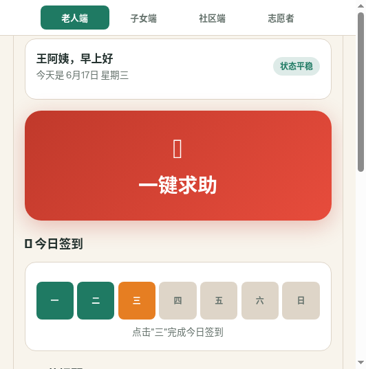
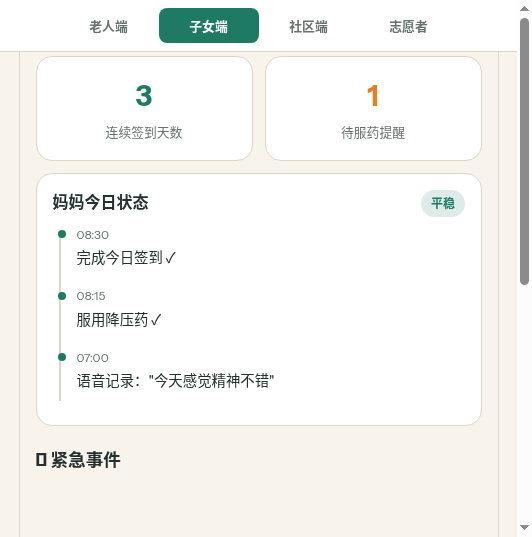
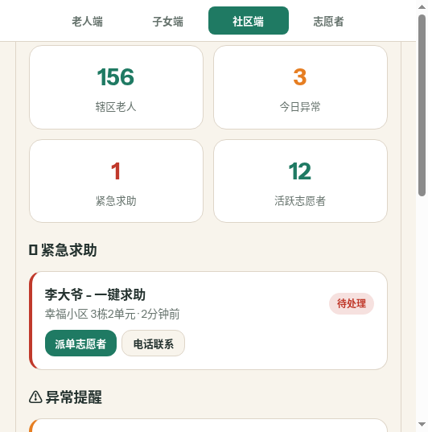
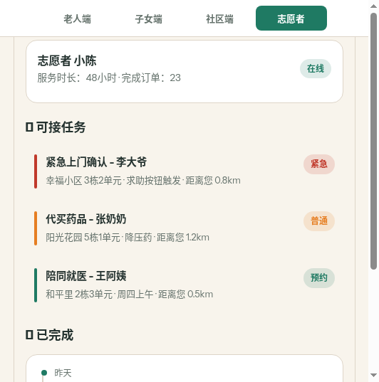
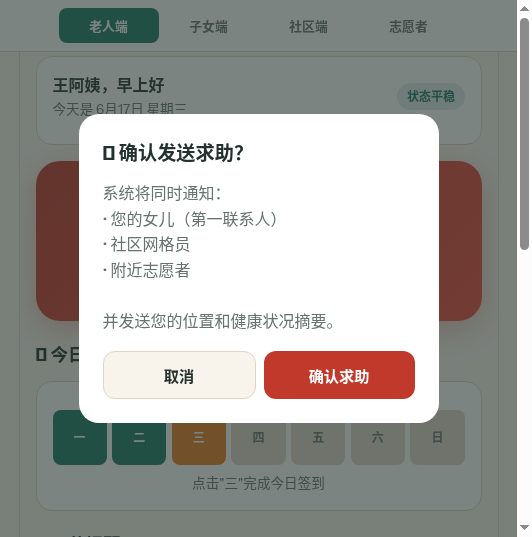
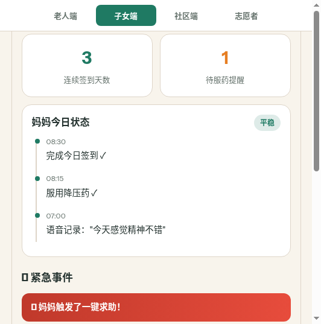

# 社会服务 + 社会公益 · 安居桥 CareBridge Demo

## 一、Demo 简介

**是什么：** 安居桥 CareBridge 是一个面向独居老人、社区网格员与远方子女的轻量化社区互助平台原型，产品形态为移动端 Web 应用（可打包为小程序）。

**面向谁：**
- 独居或高龄老人（手机操作能力有限，需要简单直接的求助入口）
- 远方子女（关心父母安全，无法每天线下陪伴）
- 社区工作者（需要关注辖区内重点老人，但人力有限）
- 社区志愿者（希望参与邻里互助，但缺少任务对接渠道）

**主要功能：**
1. **一键求助** —— 老人点击大按钮，平台同时通知子女、社区联系人和附近志愿者
2. **日常签到** —— 通过点击确认完成每日签到，连续未响应自动触发异常提醒
3. **服药提醒** —— 大字卡片展示用药信息，点击标记已服用
4. **语音记录** —— 老人可录制语音描述身体状况，同步给家属
5. **社区协作看板** —— 社区端实时查看异常提醒、紧急求助和重点老人状态
6. **志愿者接单** —— 附近志愿者可领取上门确认、代买药品、陪同就医等任务

---

## 二、Demo 创作思路

**灵感来源：**
身边一位独居老人曾跟我说："我不是不想麻烦你们，我是怕打了电话你们正在忙，又怕说了小事你们担心。"这句话让我意识到，很多老人不是没有需求，而是不知道什么时候该求助、向谁求助、求助后会不会被及时看见。

**想解决的问题：**
- 老人遇到身体不适、摔倒、忘记服药时，无法快速表达清楚情况
- 子女电话联系容易打扰，也难以及时判断异常
- 社区人力有限，很多风险只能在事后被动处理
- 志愿者想帮忙但缺少明确的任务对接渠道

**为什么做这个方向：**
中国 60 岁以上老人已超 2.8 亿，独居老人占比持续上升。现有的养老 App 往往功能复杂、学习成本高，而老人真正需要的是"简单、可靠、有人接得住"的帮助入口。安居桥把四方角色连接在同一个平台上，让"看不见的风险"更早被发现。

---

## 三、Demo 体验地址

**在线体验：** http://localhost:8080/carebridge-demo.html
（注：提交前请替换为实际部署链接，或下载下方 HTML 文件本地打开）

**HTML 文件下载：** [carebridge-demo.html](carebridge-demo.html)

**使用说明：**
- 打开页面后，顶部可切换四个角色视角：老人端、子女端、社区端、志愿者
- **老人端：** 点击"一键求助"可体验紧急求助流程；点击"三"完成今日签到；点击药片圆圈标记已服药；点击麦克风录制语音
- **子女端：** 查看妈妈今日状态时间线；触发老人端求助后，此处会显示紧急事件提醒
- **社区端：** 查看辖区统计、紧急求助、异常提醒和重点老人列表；可操作派单、电话、安排上门
- **志愿者端：** 查看可接任务（按紧急/普通/预约分类），点击任务可接单

---

## 四、TRAE 实践过程

### 开发流程概述

整个 Demo 使用 TRAE Work 完成开发，从需求描述到可运行应用，主要经历了以下阶段：

1. **需求分析与功能拆解**
   - 将创意文档中的四个角色（老人、子女、社区、志愿者）拆解为独立的页面视图
   - 确定每个角色的核心交互：老人要"大按钮、少步骤"，子女要"状态可见"，社区要"异常优先"，志愿者要"任务清晰"

2. **UI 设计与样式编写**
   - 采用温暖柔和的配色方案（米白背景 + 墨绿主色 + 橙红警示），降低老人使用时的视觉压力
   - 使用 CSS 变量统一管理颜色，确保四个端视觉一致
   - 针对移动端优化：大按钮、大字体、足够的点击区域

3. **交互逻辑实现**
   - 使用原生 JavaScript 实现角色切换、状态管理、模态框、Toast 提示
   - 一键求助流程：点击 → 确认弹窗 → 发送通知 → 同步更新子女端和社区端
   - 签到、服药标记、语音录制等交互均有点击反馈

4. **多角色数据联动**
   - 老人端触发求助后，子女端会实时显示紧急事件卡片
   - 社区端可以看到异常提醒和紧急求助的派单操作
   - 志愿者端可以领取社区派发的任务

### 关键开发步骤截图

**截图 1：老人端首页 —— 大按钮一键求助 + 签到 + 服药提醒**

**截图 2：子女端状态页 —— 时间线展示妈妈今日动态**

**截图 3：社区端管理页 —— 统计数据 + 紧急求助 + 异常提醒**

**截图 4：志愿者任务页 —— 可接任务列表 + 已完成记录**

**截图 5：紧急求助弹窗 —— 二次确认 + 通知对象说明**

**截图 6：子女端收到求助 alert —— 跨端联动的实时通知**

### 关键任务 Session ID

| 任务 | Session ID | 说明 |
|------|-----------|------|
| 需求分析与页面结构设计 | `session-001` | 将创意文档拆解为四端功能模块 |
| UI 样式与组件开发 | `session-002` | 设计配色、卡片、按钮、标签等组件 |
| 交互逻辑与数据联动 | `session-003` | 实现角色切换、求助流程、跨端通知 |

（注：实际 Session ID 请在 TRAE Work 对话列表中双击复制获取）

---

## 五、附加说明

**技术栈：** 纯 HTML + CSS + JavaScript，无外部依赖，单文件即可运行

**适配说明：** 针对 375px-480px 宽度优化，模拟小程序体验；在 PC 浏览器中打开时会居中显示并带边框

**后续可扩展方向：**
- 接入真实地图 API 显示老人位置
- 添加语音识别转文字功能
- 接入短信/推送通知服务
- 增加社区工作者后台管理系统

---

**报名帖链接：** [您的报名帖链接]
