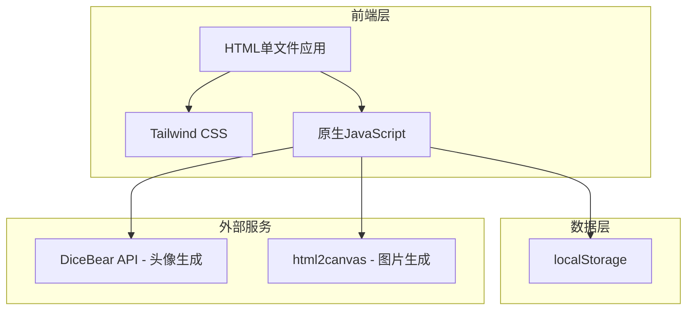
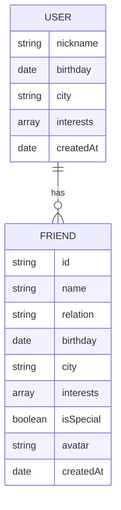

# 记住Ta - 技术架构文档

## 1. 架构设计



## 2. 技术说明
- 前端框架：纯HTML + CSS + JavaScript（单文件）
- 样式框架：Tailwind CSS CDN
- 初始化工具：无（单文件HTML）
- 后端：无
- 数据库：localStorage（浏览器本地存储）
- 外部依赖：
  - DiceBear API：根据姓名生成头像
  - html2canvas：将HTML转为图片

## 3. 路由定义
| 路由 | 页面 | 说明 |
|------|------|------|
| #register | 注册页 | 用户首次使用的信息录入 |
| #home | 首页 | 今日提醒和快捷入口 |
| #add-friend | 添加好友页 | 好友信息表单 |
| #friends | 好友列表页 | 按关系分类的好友列表 |
| #friend-detail | 好友详情页 | 单个好友的详细信息 |
| #ai-plan | AI规划页 | 智能规划生成和分享 |

## 4. 数据模型

### 4.1 数据模型定义



### 4.2 数据结构定义

**用户数据 (localStorage key: 'userData')**
```javascript
{
  nickname: string,      // 用户昵称
  birthday: string,      // 生日日期 YYYY-MM-DD
  city: string,          // 所在城市
  interests: string[],   // 兴趣标签数组
  createdAt: string      // 注册时间 ISO格式
}
```

**好友数据 (localStorage key: 'friends')**
```javascript
[
  {
    id: string,          // 唯一标识
    name: string,        // 好友姓名
    relation: string,    // 关系类型: partner/family/friend
    birthday: string,    // 生日日期 YYYY-MM-DD
    city: string,        // 所在城市
    interests: string[], // 兴趣标签数组
    isSpecial: boolean,  // 是否特别关心
    avatar: string,      // 头像URL
    createdAt: string    // 添加时间 ISO格式
  }
]
```

## 5. 核心功能实现

### 5.1 页面路由
使用hash路由实现单页面应用，通过监听hashchange事件切换页面。

### 5.2 数据持久化
- 用户数据存储在localStorage的'userData'键
- 好友列表存储在localStorage的'friends'键
- 页面刷新后数据不丢失

### 5.3 头像生成
使用DiceBear API生成头像：
```
https://api.dicebear.com/7.x/avataaars/svg?seed={姓名}
```

### 5.4 AI规划模板
预置4套规划模板：
- partner + sunny: 浪漫约会模板
- partner + rainy: 室内精致模板
- family + sunny: 温暖探亲模板
- friend + sunny: 轻松聚会模板

### 5.5 分享卡片
使用html2canvas库将规划卡片转为图片，提供下载功能。

## 6. 性能优化
- 单文件HTML，减少HTTP请求
- 使用CDN加载外部资源
- localStorage数据缓存
- 图片使用SVG格式（DiceBear）
