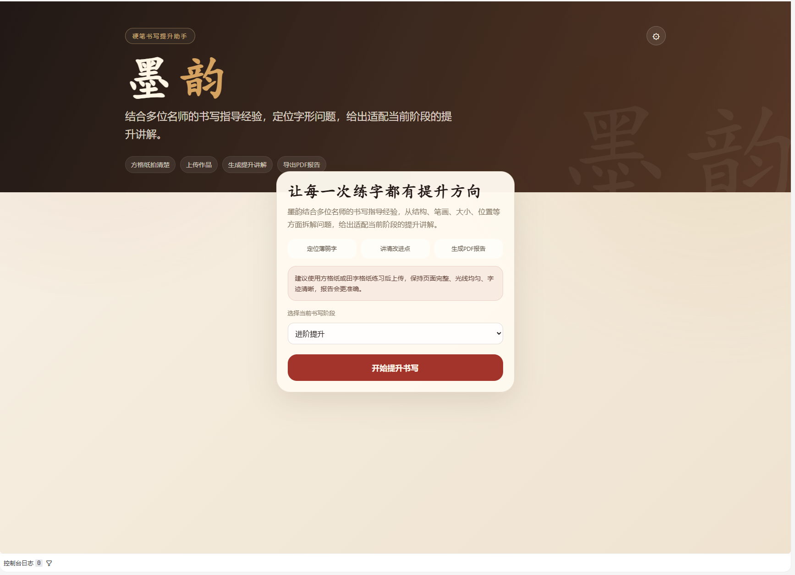
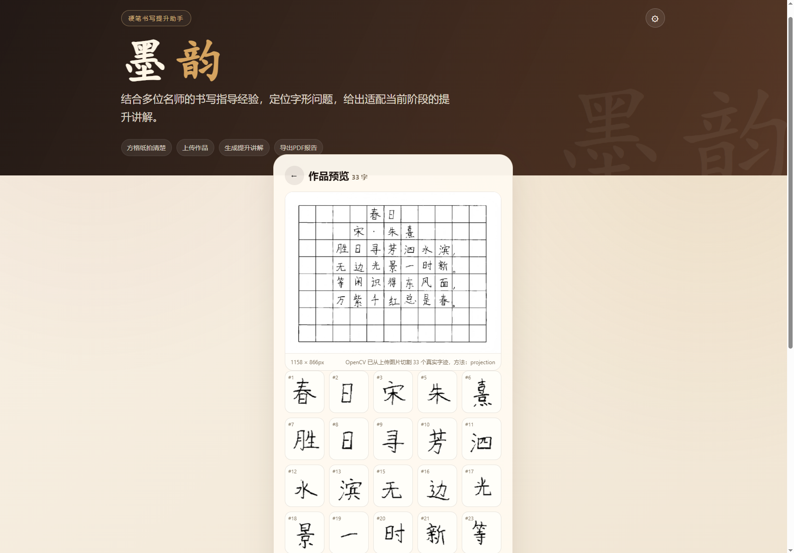
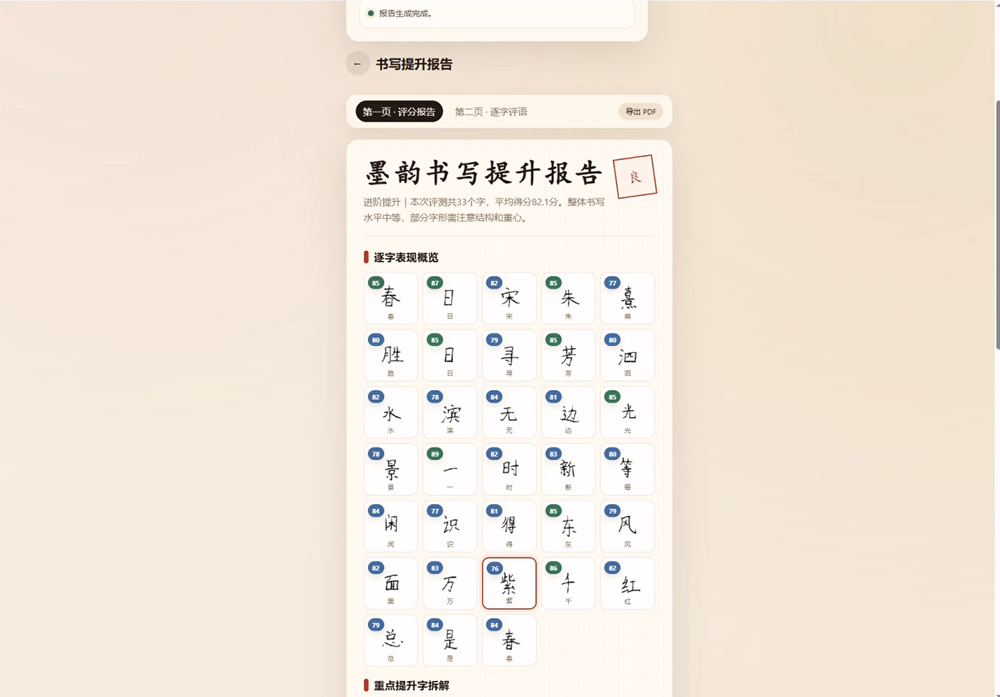
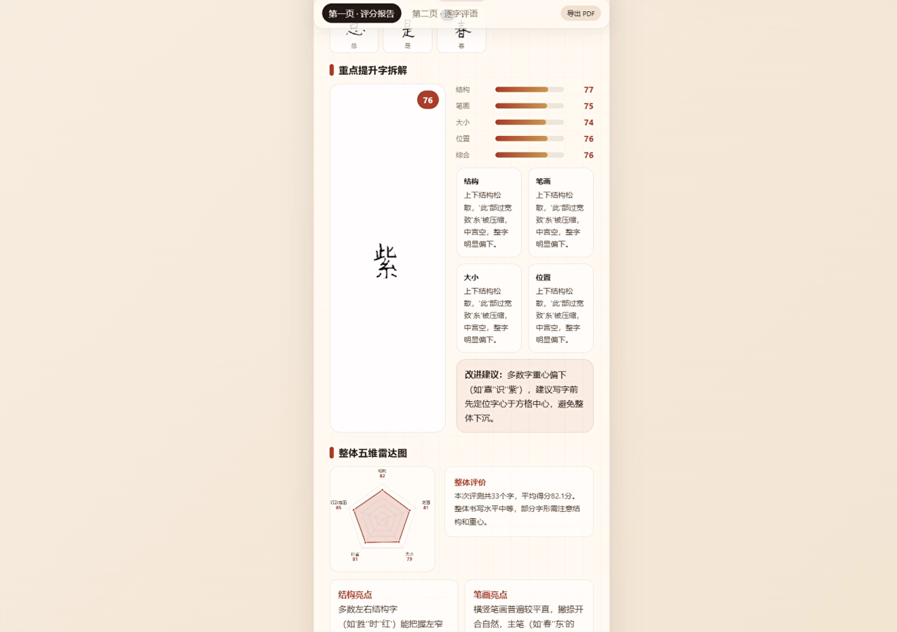
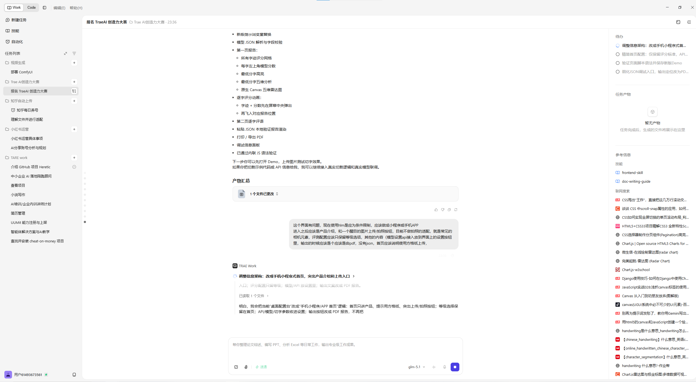
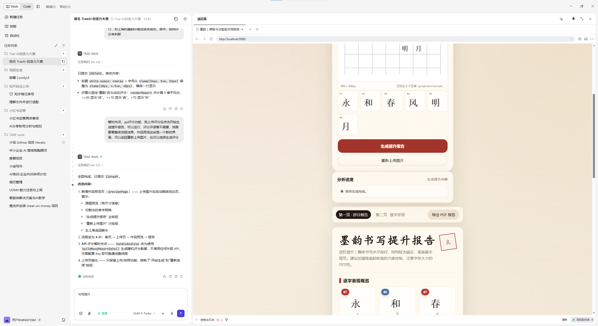
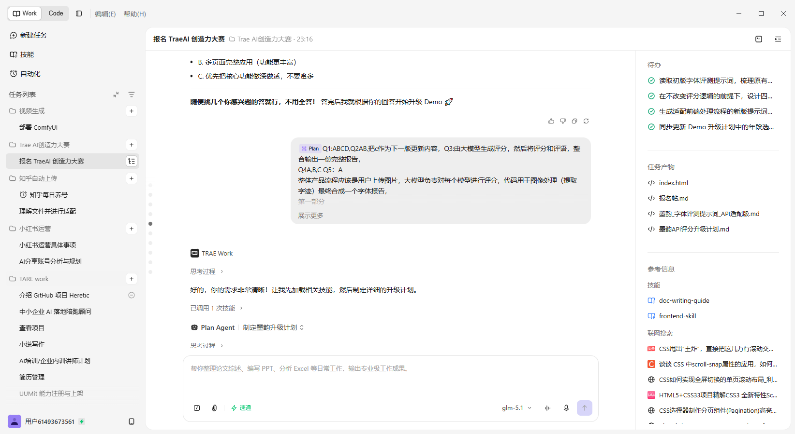
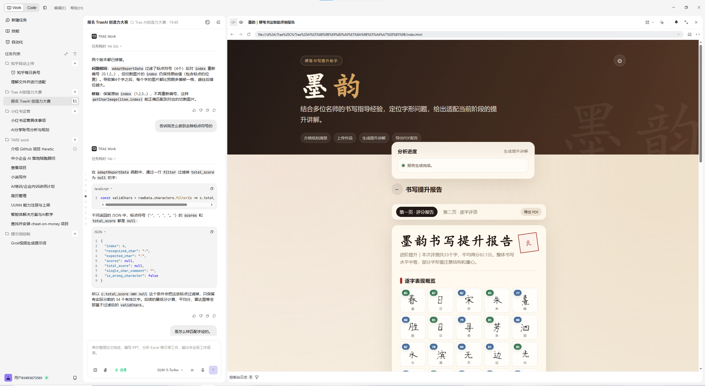

【标签】学习工作

# 【学习工作赛道】墨韵——AI 硬笔书法智能评测 Demo

## 0. 先和大家打个招呼吧 👋

大家好，我是一名 AI 产品经理。这次参赛作品叫 **墨韵**，是一个能帮助学生、书法爱好者和书法老师快速看懂字迹问题的硬笔书法智能评测 Demo。

做这个 Demo 的原因一方面来自工作：我在工作中多次收到过类似的产品需求，大家都希望 AI 能把“主观审美”变成更清晰的反馈，比如哪里写得不稳、哪个字需要重点练、老师怎样更快批改学生作业。另一方面也来自我自己的真实痛点：我的字本身不算好看，也希望有一个足够简单的工具，能让我拍一张练字作品，就知道自己应该从哪里开始提升。

这个 Demo 基本是在和 **TRAE** 一轮轮对话中做出来的。我把产品需求一点点讲给 TRAE：先做网页，再做报告页，再接入真实图片，再处理单字切割、雷达图、逐字评分和大模型 JSON。过程中最让我有感触的是，很多原本以为要自己慢慢查资料才能解决的问题，比如 OpenCV 切图、标点过滤后分数和字迹错位、动画触发时序，TRAE 都能帮我分析原因，再给出能直接修改的代码方案。

对我来说，这次不是“让 AI 一次生成一个页面”，而是像和一个开发搭档一起打磨产品：我负责判断方向、提出问题和体验反馈，TRAE 负责快速实现、排查问题和补齐技术细节。这个过程让我感觉，很多原本离普通创作者很远的 AI 应用开发，现在真的可以一步步做出来。

---

## 1. Demo 简介

**是什么：** 墨韵是一款 Web 端硬笔书法智能评测 Demo。用户上传一张真实书法作品图片后，系统会自动切割单字，结合视觉大模型生成逐字评分、可视化雷达图、重点字分析和个性化提升建议。

**面向谁：** 墨韵主要面向三类用户：一是书法爱好者自测，帮助自学者快速了解自己的字形问题；二是学生练字提升，让孩子每次练习后都能知道具体改哪里；三是书法培训机构的教师提效，辅助老师完成批量初筛和重点问题定位。同时，墨韵也关注教育资源不均衡地区的学生。很多孩子没有专业书法老师长期指导，练字时只能得到“好看/不好看”的模糊评价，很难知道自己到底是结构松散、主笔不突出，还是字在格子里偏上偏下。墨韵希望用 AI 帮助这些学生获得更接近专业老师的一对一测评指导，让没有书法老师的孩子也能得到具体、可理解、可持续改进的书写反馈。

**主要功能：**

1. **真实字迹切割：** 使用真实书法作品图片作为测试样例，通过 OpenCV 从原图中切割出每个有效汉字。
2. **大模型逐字评分：** 基于千问视觉大模型，从结构、笔画、大小、位置四个维度输出逐字评分、单字评语和整体建议。
3. **可视化评测报告：** 生成总分、雷达图、逐字表现概览、重点字拆解和改进建议，让用户一眼看懂薄弱点。

**Demo 演示效果图：**

---

## 2. Demo 创作思路

**灵感来源：** 这个想法同时来自工作和个人体验。作为 AI 产品经理，我在工作中多次遇到类似需求：用户希望 AI 不只是给一个“好看/不好看”的判断，而是能把主观评价拆成更明确的结构化反馈。我自己写字也不够好看，平时想提升时经常不知道该先改结构、笔画还是整体位置，所以希望做一个足够简单的工具，让普通人拍一张作品就能知道下一步怎么练。

**想解决的问题：** 墨韵希望把书法老师的观察拆解成学生能理解的数据和建议。系统不只给一个总分，而是把每个字拆成结构、笔画、大小、位置等维度，让用户知道“哪个字需要改”“为什么需要改”“下一次应该怎么改”。

**为什么做这个方向：** 书法课已进入中小学教育体系，练字是高频需求，但现有工具大多停留在字帖、视频教学或拍照存档层面，缺少“拍一张真实作品图，立刻得到专业评测报告”的体验。AI 视觉识别和大模型分析可以把传统书法批改数字化，为学生、家长、书法爱好者和培训机构提供更低门槛的辅助评测工具。

**典型使用场景：**

- **书法爱好者自测：** 自学者上传自己的临摹或日常书写作品，快速了解结构、笔画、大小、位置等方面的薄弱点。
- **学生练字提升：** 学生每天完成练字后拍照上传，获得逐字评分和改进建议，知道下一次练习该重点调整哪里。
- **书法培训机构教师提效：** 老师面对多名学生作业时，可以先用系统批量初筛，再把精力集中到共性问题和重点学生上。
- **教育资源不足地区：** 缺少专业书法老师的学生，也能获得具体、可理解、可持续改进的书写反馈。

---

## 3. Demo 体验地址

本作品选择官方要求中的第二种体验方式：**交互式可体验的 HTML 格式文件，使用 Zip 格式打包上传到社区**。

请下载附件中的 `moyun-demo.zip`，解压后打开 `moyun-demo.html`，点击页面中的“一键体验真实样例”即可查看完整评测流程。

**当前 Demo 形态说明：** 初赛 Demo 是一个可离线运行的演示版本，目的是让评委无需配置 API Key、无需安装依赖、无需启动后端服务，也能完整体验“真实作品图片 → 单字切割 → 大模型评分 → 可视化报告”的评测链路。当前演示样例使用预生成的大模型评测 JSON；后续产品版本可接入在线视觉模型 API，实现用户上传任意书法图片后的实时评测。

**Demo 附件内容：**

- `moyun-demo.html` — 可离线运行的完整 Demo，内含真实字迹切片和报告渲染逻辑。
- `trae测试.jpg` — 原始书法作品图片，内容为朱熹《春日》的硬笔书写样例。
- `千问模型评测输出.json` — 千问视觉大模型对测试图片生成的完整结构化评测结果。
- `字体评测提示词.txt` — 发送给大模型的评测提示词，包含评分角色、输出格式、标点处理和七维内部评分规则。

**报名帖：** 已附上通过的报名帖文件 `报名帖.md`，便于评审核对报名信息和作品方向。

---

## 4. TRAE 实践过程

整个项目从零开始，使用 TRAE IDE 的 AI 对话功能完成开发和多轮迭代。实践过程不是一次性生成页面，而是围绕“产品形态、UI 流程、真实评测链路、后端切图能力”持续调整。

### 4.1 产品形态调整

项目最初从网页 Demo 起步，之后根据参赛展示和真实使用场景，逐步调整为“可离线体验的评测 Demo + 可扩展到 UniApp / 小程序 / App 的产品架构”。这个阶段重点明确了墨韵不是单纯展示页，而是围绕上传作品、切割单字、生成报告的完整评测工具。

### 4.2 UI 与流程设计

通过 TRAE 辅助设计首页、上传页、预览页和报告页，让用户路径更清晰：先选择书写阶段，再上传真实作品图片，随后预览切出的单字，最后生成包含总分、逐字评分、重点字和雷达图的报告。界面采用中国风视觉设计，使用宣纸色背景、印章色按钮和书法字体氛围，尽量让工具气质与书写场景匹配。

### 4.3 整体产品优化升级

在报告页中，TRAE 协助完善了逐字表现概览、分数卡片、重点字拆解、雷达图和全部评语等模块。这个阶段重点优化了报告的可读性：评委或用户不需要理解复杂模型输出，只要看页面就能知道整体水平、薄弱维度和最需要改进的字。

### 4.4 后端服务代码升级

为了让 Demo 使用真实字迹，而不是前端 Canvas 生成的假字，我在 TRAE 辅助下复用并升级了后端 OpenCV 切图服务。后端负责读取真实书法图片，完成作品区域识别、透视校正、格子检测、空白过滤和单字切割，再把切出的真实字迹返回给前端报告页展示。

### 4.5 关键问题修复

**标点过滤后 index 重新编号导致分数和字迹错位。** 千问视觉大模型返回的 JSON 中，标点符号也占一个 index 位。如果过滤标点后用新数组下标匹配图片和评分，后续字符就会错位。解决方案是保留原始 index，用原始 index 建立切割图像与评分数据的映射关系。

**UniApp 中 Canvas 获取方式不兼容。** 在 Web 页面中可以使用 `document.getElementById` 获取 Canvas，但小程序运行时不支持直接操作 DOM。解决方案是改用 `uni.createCanvasContext`，通过 `canvas-id` 获取绘图上下文。

**报告动画触发时序不稳定。** 报告生成后，如果显示状态和动画变量分多次设置，浏览器可能先渲染静态状态，导致动画丢失。解决方案是把相关状态放在同一帧中触发，使用 `nextTick` 或 `requestAnimationFrame` 保证动画时序一致。

### 4.6 关键 Session ID

- **Session 1** — 前端页面框架搭建与视觉设计：`326998570061883:49a9141e70bd0518ea234c414d73ab30_6a315c0c63c305ad86a697f9.6a32bc1266eb1125e62fc16a.6a32bc1266eb1125e62fc168:TRAE Work CN.0.1.21.no_sid.no_ppe.T(2026/6/17 23:24:02)`
- **Session 2** — 后端切割服务开发与报告页动画优化：`326998570061883:83e9213c155e5ce5fd3e28d5d8c7105c_6a315c0c63c305ad86a697f9.6a32ceaa3dfb0dfa99058b9b.6a32ceaa3dfb0dfa99058b99:TRAE Work CN.0.1.21.no_sid.no_ppe.T(2026/6/18 00:43:22)`
- **Session 3** — UniApp 跨平台迁移与真实数据对接：`326998570061883:1ec021a35de97a89324e14ead279705d_6a315c0c63c305ad86a697f9.6a32d13b3dfb0dfa99058c36.6a32d13b3dfb0dfa99058c34:TRAE Work CN.0.1.21.no_sid.no_ppe.T(2026/6/18 00:54:19)`

---

## 5. 评测链路说明

### 5.1 当前 Demo 是离线演示还是实时评测

当前初赛 Demo 是离线演示版本。为了降低评委体验门槛，我把真实测试图片、单字切割结果和千问视觉大模型输出 JSON 都打包进附件中。评委打开 `moyun-demo.html` 后，点击“一键体验真实样例”即可看到完整评测报告。

这个设计不是为了替代真实 API，而是为了保证初赛作品可稳定体验。在线模型调用通常需要 API Key、网络环境和后端服务，如果直接要求评委配置环境，会影响体验效率。因此初赛版本采用“预生成模型结果 + 离线报告渲染”的方式展示完整产品链路。

### 5.2 大模型评分如何产生

我先将真实书法作品图片发送给千问视觉大模型，并使用专门设计的书法评测提示词约束输出格式。提示词要求模型扮演小学五、六年级汉字书写智能评测助手，识别图片中的汉字和标点，并对每个有效汉字输出结构化 JSON。

模型内部参考七个书写观察点：间架结构、笔画组合、偏旁部首、字形正、布白均、主笔展、格盛满。为了让学生和家长更容易理解，最终报告将这些观察点映射为结构、笔画、大小、位置四个维度，并额外生成整体表现、亮点分析和改进建议。

### 5.3 真实图片如何切割

Demo 中展示的逐字图片来自真实书法作品 `trae测试.jpg`，不是前端 Canvas 临时生成的假字。切割流程由 OpenCV 完成，主要步骤包括读取原图、检测作品主体区域、透视校正、识别格子、过滤空白格、去除田字格参考线干扰，再将有效汉字导出为 Base64 图片嵌入离线 Demo 中。

### 5.4 标点过滤后如何保证字迹与分数对应

真实诗文中包含逗号、句号等标点。千问视觉大模型会识别这些标点，并在 JSON 中保留它们的原始 `index`，但标点本身不参与评分。页面渲染时会先筛选出 `total_score !== null` 的有效汉字，再用原始 `index` 查找对应的切割图片。这样即使中间存在标点或空格，字迹图片和大模型评分也能保持一一对应。

### 5.5 未来如何扩展到真实上传和在线评测

后续产品版本可以在当前 Demo 基础上扩展为完整在线评测系统：用户上传任意书法作品后，后端调用 OpenCV 完成作品区域识别、透视校正和单字切割，再将图片提交给视觉大模型；大模型按固定 JSON Schema 返回逐字评分和改进建议，前端继续使用同一套报告渲染逻辑生成评测报告。

---

## 6. 技术亮点

1. **真实书法图片自动切割：** Demo 使用真实书法作品作为样例，通过 OpenCV 完成作品区域检测、透视校正、格子识别和单字切割，报告中的单字图像来自真实字迹。
2. **视觉大模型逐字评分：** 字迹评分和评语由千问视觉大模型生成，每个有效汉字都有结构、笔画、大小、位置四维评分和个性化建议。
3. **标点过滤与 index 对齐：** 标点会被识别但不参与评分，页面使用模型返回的原始 index 匹配单字图像和评分数据，避免过滤标点后出现错位。
4. **七维内部评分体系：** 间架结构、笔画组合、偏旁部首、字形正、布白均、主笔展、格盛满七个内部维度综合评估，再映射为学生更容易理解的四维结果。
5. **可扩展产品架构：** 当前 Demo 使用预生成 JSON 展示完整链路，后续可以直接替换为在线视觉模型 API 返回的 JSON，实现任意图片实时评测。

---

## 7. 后续计划

1. 接入在线视觉大模型 API，实现用户上传任意书法图片后的实时评测。
2. 完善教师端功能，支持班级作业批量上传、学生报告归档和阶段性进步对比。
3. 增加历史报告与成长曲线，让学生看到长期练字变化。
4. 继续优化图像切割算法，提升对不同纸张、拍摄角度和光照环境的适应能力。
5. 完成 UniApp 小程序版本发布，让手机拍照评测流程更自然。
