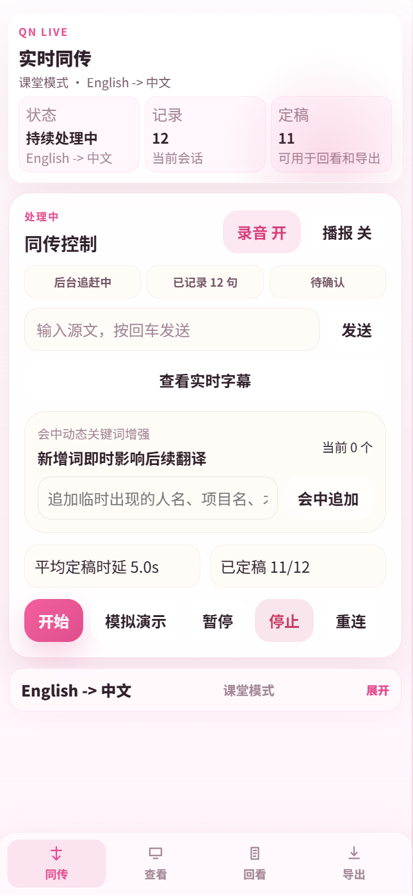
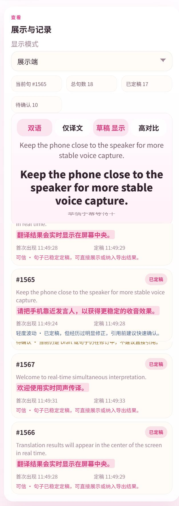
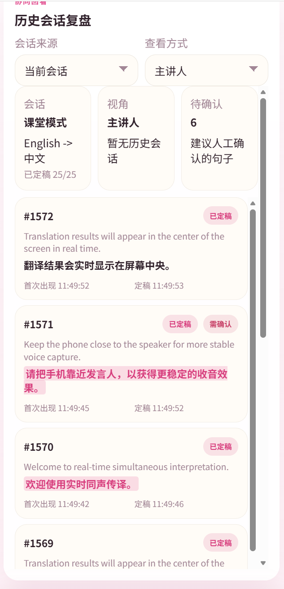
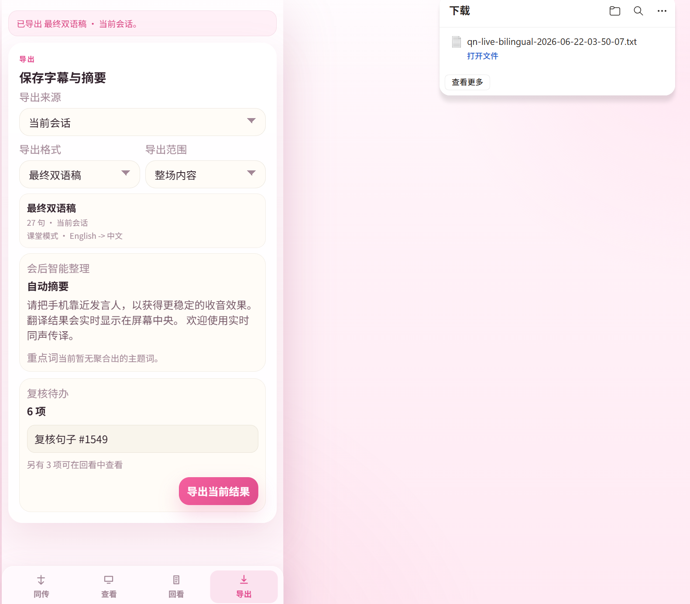
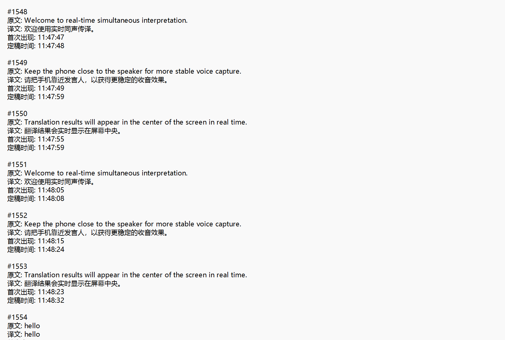
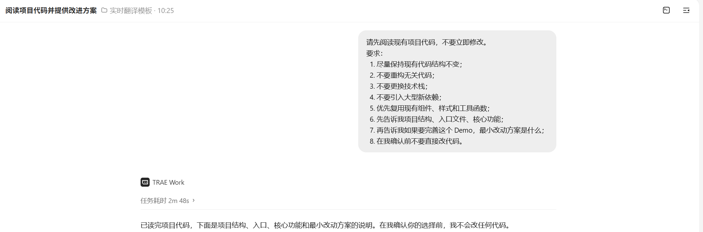
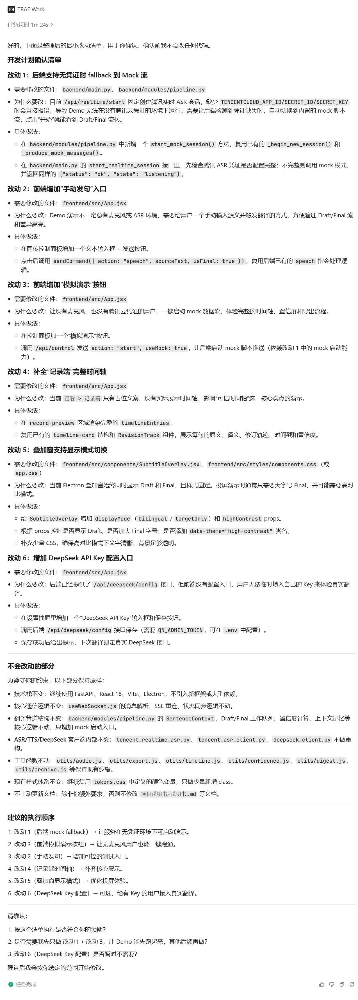
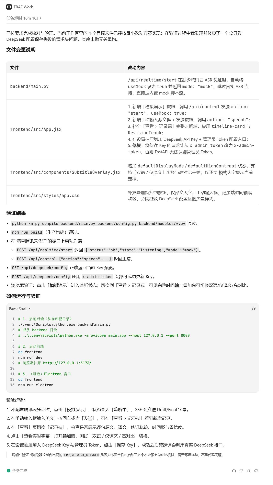
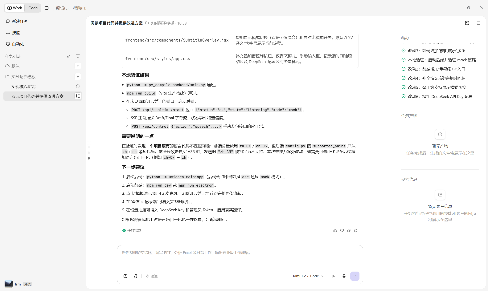
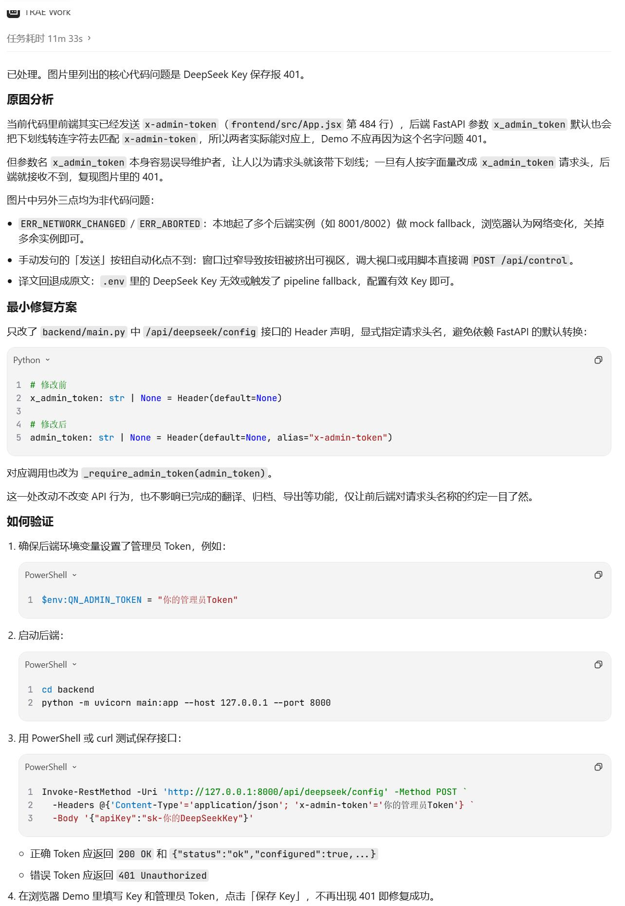

# AI 同声传译助手：让实时翻译从“能看到”变成“可追溯、可信任”

大家好，我是一名大二的学生。

这次我用 TRAE 做了一个叫 **AI 同声传译助手** 的 Demo。它不是简单展示一行实时翻译字幕，而是尝试解决一个更具体的问题：在课堂、会议、展会接待这类场景里，用户不仅需要“马上看懂”，还需要知道当前翻译结果是不是稳定、有没有被修正、最后能不能作为会后资料使用。

我和 TRAE 的配合方式比较像“我提需求，它帮我拆解和落地”。一开始我只有一个比较模糊的想法：想做一个实时双语字幕工具，但又不希望它只是普通的翻译框。于是我把场景、痛点和想要的功能一点点讲给 TRAE，让它先帮我分析项目结构，再给出最小改动方案。这个过程里让我印象比较深的是，我原本以为前后端实时通信、字幕状态同步、纠错展示这些功能会很难串起来，但通过 TRAE 分阶段拆解后，它们变成了一个个可以验证的小任务。

我没有让 TRAE 一次性大范围重写项目，而是每一步都要求它先分析、再说明要改哪些文件、最后再执行。这样我能比较清楚地知道每个功能是怎么加进去的，也能避免因为改动过大导致项目失控。

## 1. Demo 简介

**AI 同声传译助手** 是一个面向课堂、会议、展会接待和跨语言沟通场景的实时双语同传 Demo。它采用前后端分离结构：前端使用 React / Electron 展示控制面板和字幕界面，后端使用 FastAPI / WebSocket 推送实时字幕、翻译结果、纠错信息和控制状态。

它的核心用户包括：

- 需要双语字幕辅助的课堂讲解者或学生；
- 需要快速搭建轻量同传环境的小型会议组织者；
- 需要跨语言沟通的展会接待、商务沟通人员；
- 需要会后整理双语记录和复盘内容的记录者。

Demo 当前主要包含 3 个核心功能：

1. **实时字幕与翻译展示**
   系统通过 WebSocket 推送模拟的实时翻译消息，前端可以展示当前流式字幕和最近完成句，让用户看到实时翻译过程。

2. **Draft / Final 与纠错展示**
   Demo 区分临时翻译和最终结果，并支持 correction 消息展示。用户可以看到一句话从初始结果到修正结果的变化，理解系统是否进行了纠错。

3. **控制面板与配置闭环**
   前端提供源语言、目标语言、TTS 开关、开始和停止等基础控制项，并通过 WebSocket 向后端发送 `config`、`start`、`stop` 指令。后端会返回 `control_ack` 和最新状态，形成可验证的控制闭环。

Demo 界面展示：



<div style="background:#fff1f7;border-left:4px solid #ec4899;padding:10px 14px;border-radius:8px;margin:10px 0;">
<strong>重点总结：图 1 展示同传控制台，核心能力是实时控制同传流程、查看记录和定稿状态，并支持会中追加关键词来提升后续翻译稳定性。</strong>
</div>

用户可以在这里查看当前模式、语言方向、已记录句数、已定稿句数，并进行开始、暂停、停止、重连等操作。



<div style="background:#fff1f7;border-left:4px solid #ec4899;padding:10px 14px;border-radius:8px;margin:10px 0;">
<strong>重点总结：图 2 展示字幕展示和记录界面，核心能力是突出当前实时字幕，同时保留已定稿记录，并支持双语、仅译文、草稿显示和高对比模式切换。</strong>
</div>

这个界面适合课堂投屏、会议展示或现场沟通时快速查看翻译结果。



<div style="background:#fff1f7;border-left:4px solid #ec4899;padding:10px 14px;border-radius:8px;margin:10px 0;">
<strong>重点总结：图 3 展示历史会话复盘能力，核心能力是查看已定稿句子、待确认句子和每句话的首次出现时间、定稿时间。</strong>
</div>

用户可以通过这个页面回看当前会话内容，判断哪些句子可以直接使用，哪些句子还需要人工确认。



<div style="background:#fff1f7;border-left:4px solid #ec4899;padding:10px 14px;border-radius:8px;margin:10px 0;">
<strong>重点总结：图 4 展示会后导出页面，核心能力是将当前会话导出为最终双语稿，方便会后整理、复盘和二次编辑。</strong>
</div>

用户可以选择导出来源、导出格式和导出范围，并下载生成的文本文件。



<div style="background:#fff1f7;border-left:4px solid #ec4899;padding:10px 14px;border-radius:8px;margin:10px 0;">
<strong>重点总结：图 5 展示导出的最终双语稿结果，核心价值是把实时字幕沉淀为包含编号、原文、译文、首次出现时间和定稿时间的可复盘资料。</strong>
</div>

这说明 Demo 不仅能实时展示字幕，也能服务会后整理和资料留存。

## 2. Demo 创作思路

这个 Demo 的灵感来自真实跨语言沟通中的一个问题：很多实时字幕或翻译工具可以很快给出结果，但用户很难判断这个结果是否已经稳定。尤其是在会议、课堂和商务沟通中，一句话如果翻译错了，实时沟通时可能会造成误解，会后整理时还需要重新核对录音和字幕。

所以我想做的不是一个“只负责翻译”的工具，而是一个更强调可信过程的同传助手。它的核心思路是：

```text
实时结果先可见，修订过程可理解，最终结果可追溯，会后成果可利用。
```

我希望用户在看到字幕时，能够分清楚哪些内容只是临时草稿，哪些内容已经稳定定稿，哪些句子曾经被修正，哪些结果适合会后引用。这样实时翻译就不只是一个即时显示工具，而是可以逐步沉淀为可信记录。

在功能取舍上，我没有一开始就追求真实 ASR、真实 TTS 或复杂模型能力，而是先搭建一个可运行、可验证的 MVP 链路。第一阶段重点是打通前后端通信和字幕展示；第二阶段加入流式翻译和完成句；第三阶段加入纠错展示；第四阶段补齐控制面板和配置持久化。这样的做法可以保证每个阶段都有明确结果，也方便通过 TRAE 逐步开发和验证。

## 3. Demo 体验地址

本 Demo 选择 **HTML / 项目压缩包体验** 的方式提交。我会将可交互体验文件和完整项目一起打包上传，评审可以通过压缩包中的说明文件查看创意展示，也可以在本地运行前后端项目体验完整功能。

压缩包命名为：

```text
AI同声传译助手-Demo体验包.zip
```

体验方式分为两种：

### 3.1 快速查看创意说明

解压压缩包后，直接打开：

```text
trae-work-idea.html
```

该 HTML 文件用于展示 AI 同声传译助手的产品创意、核心思路和功能规划。

### 3.2 本地运行完整 Demo

本地运行方式：

```bash
# 启动后端
cd backend
pip install -r requirements.txt
python main.py

# 启动前端
cd frontend
npm install
npm run dev
```

前端启动后，在浏览器中打开终端提示的本地地址，即可体验同传控制台、字幕展示、历史回看和导出功能。

本 Demo 的主要体验路径是：

1. 进入同传控制台，选择课堂模式和语言方向；
2. 点击开始或模拟演示，查看实时字幕和定稿统计；
3. 进入查看页面，观察双语字幕、草稿显示和已定稿记录；
4. 进入回看页面，查看历史会话、待确认句子和定稿时间；
5. 进入导出页面，导出最终双语稿并查看文本结果。

## 4. TRAE 实践过程

在 Demo 开发过程中，我采用了“先分析、再确认、后修改、最后验证”的方式与 TRAE 协作，避免直接让 TRAE 大范围重写项目。

首先，我将现有项目导入 TRAE，并让 TRAE 先阅读项目结构，分析入口文件、核心模块和当前代码的运行方式。在这个阶段，我明确要求 TRAE 不要立即修改代码，而是先说明项目结构、可能涉及的文件，以及实现目标功能所需要的最小改动方案。

在 TRAE 给出方案后，我会先确认修改范围，再让它开始分步骤开发。每次开发都尽量只处理一个明确任务，例如核心功能实现、界面交互优化、报错修复或运行验证。修改过程中，我要求 TRAE 优先复用现有代码、组件和样式，不更换技术栈，不引入不必要的新依赖，也不重构无关代码。

当 Demo 出现运行报错或交互问题时，我会把具体报错信息和现象反馈给 TRAE，并要求它先分析原因，再给出最小范围的修复方案。修复完成后，我会重新运行项目，确认功能是否正常。

### 4.1 开发流程记录

| 阶段 | 目标 | TRAE 参与内容 | 结果 |
|---|---|---|---|
| 阶段 1：项目理解 | 明确项目结构和技术栈 | 分析 `backend`、`frontend`、入口文件和核心模块 | 确认项目采用 React / Electron + FastAPI / WebSocket |
| 阶段 2：方案制定 | 控制修改范围 | 输出最小改动方案，说明需要修改哪些文件 | 避免大范围重构，按阶段推进 |
| 阶段 3：核心功能开发 | 完成实时字幕、纠错展示和控制闭环 | 协助修改前后端必要文件 | Demo 具备可运行的核心链路 |
| 阶段 4：调试修复 | 解决运行和展示问题 | 根据报错和现象分析原因并修复 | 项目可以正常运行和展示 |
| 阶段 5：最终验证 | 整理运行结果和投稿材料 | 协助确认截图、Session ID 和说明内容 | 形成可提交的开发证明材料 |

### 4.2 关键开发截图

我保留了 6 张关键开发截图，用于展示 TRAE 参与 Demo 开发的完整过程。



<div style="background:#fff1f7;border-left:4px solid #ec4899;padding:10px 14px;border-radius:8px;margin:10px 0;">
<strong>重点总结：图 1 证明我在开发开始前就明确要求 TRAE 先分析项目、不要直接改代码，并用“保持现有结构、不重构无关代码、不更换技术栈”的约束控制最小改动。</strong>
</div>

这一步用于保证后续开发以最小改动方式推进。


<div style="background:#fff1f7;border-left:4px solid #ec4899;padding:10px 14px;border-radius:8px;margin:10px 0;">
<strong>重点总结：图 2 证明 TRAE 在修改前先完整阅读了项目结构，识别出后端入口、前端入口、Electron 入口、实时翻译管道、关键词注入、可信时间轴和导出归档等核心模块。</strong>
</div>

同时，TRAE 在改代码前先列出当前 Demo 的主要短板，为后续最小改动方案提供依据。



<div style="background:#fff1f7;border-left:4px solid #ec4899;padding:10px 14px;border-radius:8px;margin:10px 0;">
<strong>重点总结：图 3 证明 TRAE 输出了明确的最小改动方案，只围绕 mock fallback、手动发句、模拟演示、记录端时间轴、叠加窗显示和 DeepSeek Key 配置做必要增强。</strong>
</div>

方案中也明确说明不会改动技术栈、核心通信逻辑、ASR/TTS/DeepSeek 客户端内部和工具函数。



<div style="background:#fff1f7;border-left:4px solid #ec4899;padding:10px 14px;border-radius:8px;margin:10px 0;">
<strong>重点总结：图 4 证明 TRAE 已完成核心功能开发，并清楚列出实际修改文件、修改内容和验证结果。</strong>
</div>

本次主要涉及 `backend/main.py`、`frontend/src/App.jsx`、`frontend/src/components/SubtitleOverlay.jsx`、`frontend/src/styles/app.css` 等文件，并完成 Python 编译、前端构建、接口调用和浏览器验证。



<div style="background:#fff1f7;border-left:4px solid #ec4899;padding:10px 14px;border-radius:8px;margin:10px 0;">
<strong>重点总结：图 5 证明第一轮开发任务已经完成，并且 TRAE 对后端启动、mock 链路、SSE 推送、控制接口和前端页面进行了本地验证。</strong>
</div>

截图中可以看到多个改动项已完成，说明 Demo 不是只停留在方案层面，而是进入了可运行验证阶段。



<div style="background:#fff1f7;border-left:4px solid #ec4899;padding:10px 14px;border-radius:8px;margin:10px 0;">
<strong>重点总结：图 6 证明 TRAE 参与了实际调试过程，针对 DeepSeek Key 保存 401 问题先分析原因，再给出最小修复方案。</strong>
</div>

这次修复只调整请求头参数声明，不改变已完成的翻译、归档、导出等功能，并补充了后续验证步骤。

### 4.3 关键任务对话 Session ID

本次开发至少保留了 3 个关键任务对话的 Session ID，用于证明作品由 TRAE 辅助完成。

| Session ID | 对应阶段 | 主要内容 |
|---|---|---|
| Session ID 1 | 项目分析与方案制定 | 分析项目结构、入口文件、核心模块，并给出最小改动方案 |
| Session ID 2 | 核心功能开发 | 根据确认后的方案完成实时字幕、纠错展示、控制面板等核心功能开发 |
| Session ID 3 | 调试修复与最终验证 | 分析运行问题、修复错误，并协助确认最终运行效果 |

Session ID 1：

```
441333555141481:a0e47c9bd8b1095596b368ba7f9d444f_6a389c65286b8647544a4422.6a389fbc286b8647544a44c9.6a389fbc286b8647544a44c7:TRAE Work CN.0.1.21.no_sid.no_ppe.T(2026/6/22 10:36:44)
```

Session ID 2：

```
441333555141481:9c94c5bd26d84e2ca0208aa2b3a18289_6a38a096286b8647544a44ed.6a38d19411103729f1d65a00.6a38d19411103729f1d659fe:TRAE Work CN.0.1.21.no_sid.no_ppe.T(2026/6/22 14:09:24)
```

Session ID 3：

```
441333555141481:13b5a0d067d8396bf88ca4bd19edae45_6a38d23f11103729f1d65a30.6a38dac611103729f1d65d59.6a38dac511103729f1d65d57:TRAE Work CN.0.1.21.no_sid.no_ppe.T(2026/6/22 14:48:38)
```


### 4.4 实践总结

通过这次开发，我对 TRAE 的使用方式有了更清晰的认识：如果只是简单地让它“帮我做一个功能”，结果可能会比较发散；但如果先让它阅读项目、限定修改范围、拆分任务，再逐步确认和执行，它就能更稳定地参与真实项目开发。

这次 Demo 的开发过程也让我意识到，AI 编程工具不只是帮忙写代码，更重要的是帮助我把一个模糊想法拆成清楚的功能模块、开发步骤和验证流程。最终完成的 AI 同声传译助手虽然还是 Demo 阶段，但已经具备了实时通信、翻译展示、纠错展示和控制配置的基本闭环，也能比较完整地表达“可信实时同传”的产品方向。

