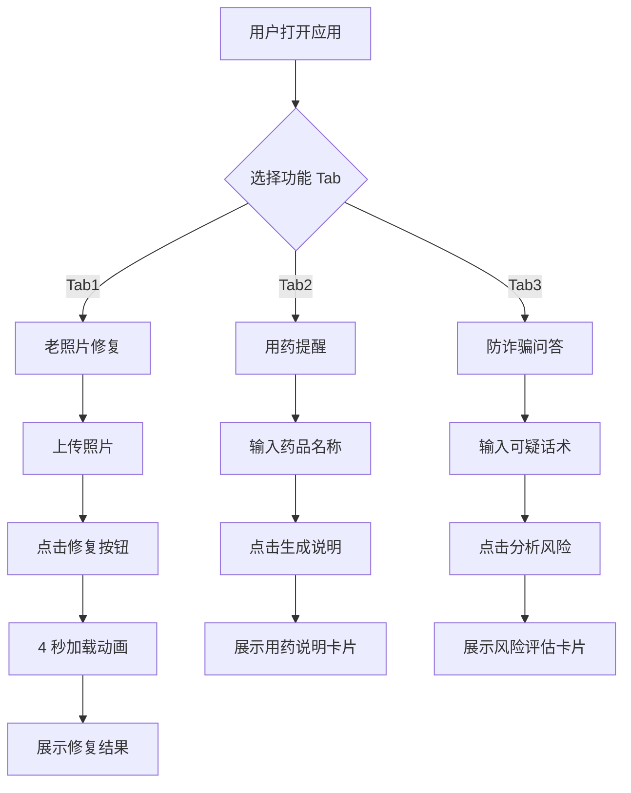

# 银发守护 - 产品需求文档 (PRD)

## 1. 产品概述

银发守护是一款专为老年人设计的数字生活助手交互 Demo，用于 TRAE AI 创造力大赛报名。产品通过 AI 技术帮助老年人解决三大核心需求：老照片修复与回忆、用药提醒与管理、防诈骗识别与教育。

- **主要目的**：降低老年人使用数字技术的门槛，提供温暖关怀的数字生活体验
- **解决问题**：老照片数字化修复、用药信息管理、电信诈骗防范
- **目标用户**：60 岁以上老年人群体及其家属
- **市场价值**：响应老龄化社会需求，展现 AI 技术在银发经济中的人文关怀

## 2. 核心功能

### 2.1 功能模块

1. **老照片修复 Tab**：AI 照片修复、年代识别、场景描述、回忆故事生成
2. **用药提醒 Tab**：药品信息查询、用法用量展示、注意事项提醒
3. **防诈骗问答 Tab**：诈骗话术识别、风险评估、应对建议、真实案例展示

### 2.2 页面详情

| 页面名称 | 模块名称 | 功能描述 |
|---------|---------|---------|
| 老照片修复 | 上传区域 | 支持拖拽或点击上传老照片（模拟功能） |
| 老照片修复 | 修复动画 | 4 秒渐进式加载动画，包含年代检测、划痕修复、人物识别等阶段 |
| 老照片修复 | 结果卡片 | 展示修复后照片、年代推测、场景描述、回忆故事 |
| 用药提醒 | 输入区域 | 药品名称输入框（预设阿莫西林、降压药等） |
| 用药提醒 | 说明卡片 | 超大字体展示药品名称、用法用量、注意事项、存储方式 |
| 防诈骗问答 | 输入区域 | 诈骗话术输入框 |
| 防诈骗问答 | 风险卡片 | 风险等级（高/中/低）、诈骗类型、应对建议、真实案例 |

## 3. 核心流程

### 老照片修复流程
用户进入 Tab1 → 上传或拖拽照片 → 点击"修复"按钮 → 观看 4 秒温馨加载动画 → 查看修复结果卡片（包含照片预览、年代推测、场景描述、回忆故事）

### 用药提醒流程
用户进入 Tab2 → 输入药品名称 → 点击"生成说明"按钮 → 查看大字版用药说明卡片（药品名称、用法用量、注意事项、存储方式）

### 防诈骗问答流程
用户进入 Tab3 → 输入可疑话术 → 点击"分析风险"按钮 → 查看风险评估卡片（风险等级、诈骗类型、应对建议、真实案例）

## 4. 用户界面设计

### 4.1 设计风格

- **配色方案**：
  - 主色：暖橙 #FF8C00（温暖、活力）
  - 背景：米白 #FFF8DC（柔和、舒适）
  - 文字：深褐 #3E2723（高对比度、易读）
  
- **字体规范**：
  - 标题：24px+，加粗
  - 正文：18px+，常规
  - 药品名称：32px+，超大字体
  
- **按钮样式**：圆角矩形，暖橙色背景，白色文字，hover 时轻微放大

- **布局风格**：卡片式布局，大间距，清晰的视觉层次

- **图标/Emoji**：使用 Emoji 图标增加亲和力（📸 💊 🛡️）

### 4.2 页面设计概览

| 页面名称 | 模块名称 | UI 元素 |
|---------|---------|--------|
| 老照片修复 | 上传区域 | 虚线边框拖拽区、上传图标、提示文字 |
| 老照片修复 | 加载动画 | 进度条、阶段文字变化、温馨图标 |
| 老照片修复 | 结果卡片 | 照片预览、年代标签、场景描述文本、回忆故事文本 |
| 用药提醒 | 输入区域 | 大字体输入框、生成按钮 |
| 用药提醒 | 说明卡片 | 超大药品名称、分点说明列表、图标装饰 |
| 防诈骗问答 | 输入区域 | 大字体输入框、分析按钮 |
| 防诈骗问答 | 风险卡片 | 风险等级徽章、诈骗类型标签、建议列表、案例文本 |

### 4.3 响应式设计

- **桌面优先**：最大宽度 1200px，居中显示
- **移动端适配**：
  - 字体自动调整（最小 16px）
  - 按钮全宽显示
  - 卡片垂直堆叠
  - 触摸友好的点击区域（最小 44x44px）

### 4.4 交互细节

- **加载动画**：温馨的文字变化（"检测照片年代…" → "修复划痕…" → "识别场景中的人物…"），配合柔和的进度条
- **卡片展示**：淡入动画，从下向上滑入
- **按钮反馈**：点击时轻微缩放，hover 时颜色加深
- **Tab 切换**：平滑过渡，当前 Tab 高亮显示

## 5. 数据预设

### 5.1 药品数据（3 种）
1. **阿莫西林**：每日 3 次，每次 1 片，饭后服用
2. **降压药**：每日 1 次，每次 1 片，早晨服用
3. **降糖药**：每日 2 次，每次 1 片，餐前 30 分钟服用

### 5.2 诈骗场景（3 种）
1. **冒充亲属诈骗**："我是你孙子，我被抓了，快打钱" → 高风险
2. **中奖诈骗**："恭喜您中了 50 万大奖，请先缴纳手续费" → 高风险
3. **保健品诈骗**："这个保健品能治百病，现在打折只要 998" → 中风险

### 5.3 照片修复结果
- 年代推测：1980 年代左右
- 场景描述：照片中有一位穿着中山装的老人在院子里，旁边有一棵大树
- 回忆故事：这是一张充满温情的家庭合影，记录了那个年代朴实而美好的生活瞬间

## 6. 底部信息

固定底部栏："由 TRAE 驱动 | TRAE AI 创造力大赛参赛作品"
