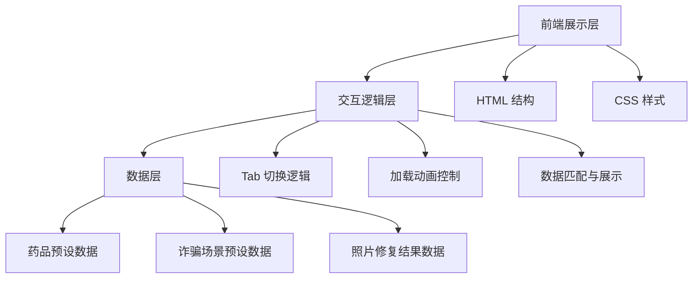

# 银发守护 - 技术架构文档

## 1. 架构设计



## 2. 技术说明

- **前端**：纯 HTML5 + CSS3 + 原生 JavaScript（ES6+）
- **样式方案**：内联 CSS，使用 CSS 变量管理主题色
- **动画方案**：CSS 动画 + JavaScript 定时器控制
- **数据方案**：所有数据内置于 JS 对象中，无需后端
- **文件结构**：单文件 `index.html`，包含所有 HTML、CSS、JS

## 3. 路由定义

| 路由 | 用途 |
|------|------|
| index.html | 单页面应用，包含三个 Tab 功能 |

## 4. 数据结构定义

### 4.1 药品数据
```javascript
{
  name: "药品名称",
  dosage: "用法用量",
  precautions: "注意事项",
  storage: "存储方式"
}
```

### 4.2 诈骗场景数据
```javascript
{
  keywords: ["关键词数组"],
  riskLevel: "high/medium/low",
  fraudType: "诈骗类型",
  suggestions: ["建议数组"],
  case: "真实案例描述"
}
```

### 4.3 照片修复结果
```javascript
{
  era: "年代推测",
  scene: "场景描述",
  story: "回忆故事"
}
```

## 5. 设计规范

- **配色**：暖橙 #FF8C00、米白 #FFF8DC、深褐 #3E2723
- **字体**：正文 18px、标题 24px+、药品名称 32px+
- **圆角**：卡片 16px、按钮 12px
- **阴影**：柔和暖色阴影
- **响应式断点**：768px（移动端）
