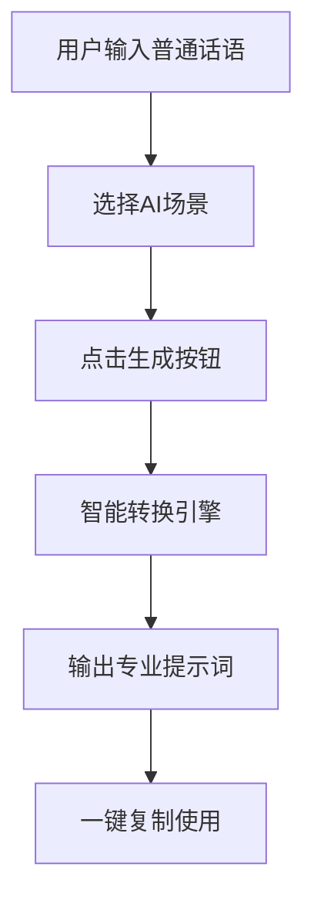

# 产品需求文档 (PRD)

## 1. 产品概述

**PromptCraft 智提示** —— 一款将普通话语智能转换为专业AI提示词的工具，帮助用户克服"不会写提示词"的痛点，让AI创作效果更上一层楼。

- 普通用户只需用自然语言描述需求，即可生成适用于Midjourney、ChatGPT、Claude、Stable Diffusion等多种AI工具的专业提示词
- 参赛赛道：AI 创意工具 | 创意名称：PromptCraft 智提示

## 2. 核心功能

### 2.1 用户角色
| 角色 | 使用方式 | 核心权限 |
|------|---------|---------|
| 访客用户 | 无需注册，直接使用 | 使用全部转换功能 |

### 2.2 功能模块
1. **主交互区**: 输入框 + AI场景选择 + 生成按钮
2. **提示词输出区**: 格式化展示生成的提示词
3. **场景模板库**: 预设多种AI场景快速生成
4. **历史记录**: 本地保存最近转换记录

### 2.3 页面详情
| 页面 | 模块名称 | 功能描述 |
|------|---------|---------|
| 首页 | 主交互区 | 输入普通话语，选择AI场景，生成提示词 |
| 首页 | 场景模板库 | 展示预设场景模板（绘画、写作、编程、对话等） |
| 首页 | 输出展示区 | 展示生成的提示词，支持一键复制 |
| 首页 | 历史记录 | 显示最近转换历史，点击可复用 |

## 3. 核心流程

用户使用流程：
1. 用户在输入框输入普通话语（如：画一只可爱的猫咪）
2. 选择目标AI场景（绘画/写作/编程/对话等）
3. 点击"生成"按钮
4. 系统智能转换为专业提示词
5. 用户可复制、使用或再次编辑

## 4. 用户界面设计

### 4.1 设计风格
- **主题**: 深色科技风 + 渐变霓虹光效，营造AI/未来感
- **主色调**: 深紫 #1a1a2e 为底，搭配霓虹紫 #a855f7 和霓虹蓝 #3b82f6
- **按钮风格**: 圆角玻璃拟态按钮，带发光效果
- **字体**: 展示用 Orbitron (科技感)，正文用 Inter
- **布局**: 单页应用，中央卡片式布局，垂直流
- **图标**: 使用 Emoji + 线性图标混搭

### 4.2 页面设计概览
| 页面 | 模块名称 | UI元素 |
|------|---------|--------|
| 首页 | 顶部导航 | Logo + 标题 + 简介 |
| 首页 | 场景选择器 | 横向滚动的圆形场景卡片 |
| 首页 | 输入区 | 大文本框，placeholder提示 |
| 首页 | 生成按钮 | 霓虹渐变按钮，发光效果 |
| 首页 | 输出区 | 代码块风格展示，可复制 |
| 首页 | 历史记录 | 侧边或底部折叠面板 |

### 4.3 响应式设计
- 桌面优先，移动端自适应
- 触摸设备优化按钮尺寸

### 4.4 动效设计
- 页面加载：卡片依次淡入上浮
- 按钮悬停：发光增强 + 轻微放大
- 生成时：按钮loading动画 + 输出区闪烁
- 复制成功：toast提示弹出

## 5. 技术方案

### 5.1 技术栈
- 单文件 HTML + CSS + JavaScript
- 无需后端，纯前端实现
- 使用本地存储保存历史记录

### 5.2 核心特性
- 预设多种场景提示词模板
- 智能关键词提取和格式化
- 本地历史记录存储
- 一键复制功能
