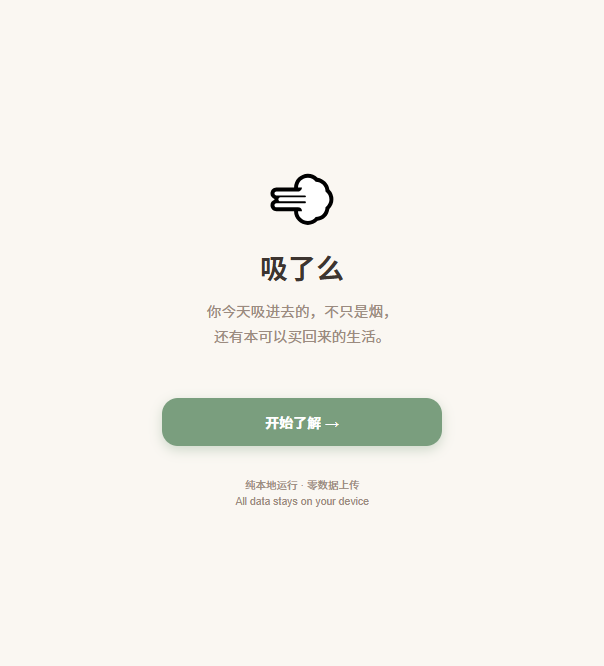
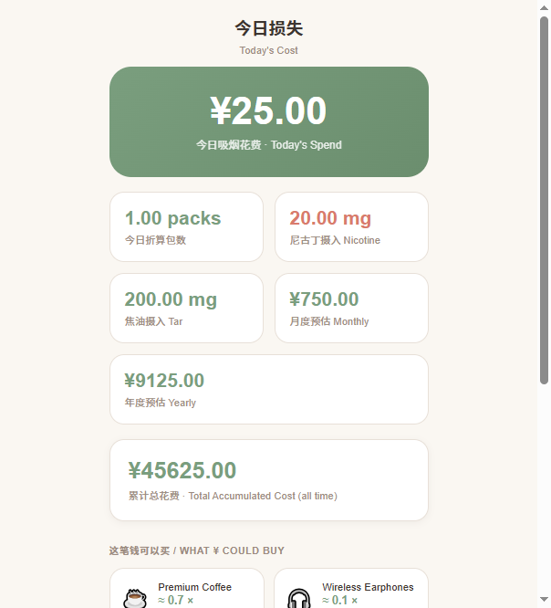

# 吸了么 SmokeLoss v0.1

## 参赛Demo · TRAE AI Creativity Contest

> 轻量化本地戒烟劝导工具 — 金钱+健康损耗可视化 — 温和情绪冲击

---

## Project Overview

**SmokeLoss** is a lightweight, offline-first quit-smoking visualization tool that translates daily cigarette consumption into tangible monetary and health costs. Built for the TRAE AI Creativity Contest, it targets contestants who smoke and want a gentle, non-preachy nudge toward awareness.

**Key differentiator**: No AI/LLM, no internet, no accounts. Pure frontend logic running entirely in the browser.

---

## 核心特性 Features

- ✅ **Pure local operation** — fully functional offline, no backend
- ✅ **Zero data collection** — all data stored in browser `localStorage` only
- ✅ **No account system** — open and use immediately
- ✅ **No LLM/AI** — pure JavaScript calculation, no external API calls
- ✅ **Mobile-first** — optimized for 390px width, portrait smartphone display
- ✅ **Compliant health disclaimer** — all data labeled as estimates, not medical advice
- ✅ **Gentle tone** — warm color palette, soft cards, no horror/shock aesthetics

---

## 功能页面 Pages

| # | Page | Description |
|---|------|-------------|
| 1 | **Welcome** | Core slogan + one-button entry |
| 2 | **User Entry** | Gender, age, smoking years, brand, daily count, price, nicotine/tar |
| 3 | **Today's Loss** | Daily cost, nicotine/tar intake, monthly/yearly projection, life-item conversion |
| 4 | **Quit Benefits** | Weekly/monthly/yearly savings if quitting, life-item equivalents |
| 5 | **Share Poster** | Screenshot-ready card with nickname, costs, slogan |

---

## 参赛截图 Screenshots

### 欢迎页 · Welcome


### 今日损失 · Today's Loss


### 分享海报 · Share Poster


---

## 技术栈 Tech Stack

- **HTML5 + CSS3 + Vanilla JavaScript** — zero npm, zero dependencies
- **localStorage** — data persistence, no server
- **No frameworks, no CDN** — 100% self-contained

---

## 本地运行 Local Run

### 方式一：直接双击（最简）
```
Double-click index.html
```

### 方式二：本地静态服务器（推荐 for mobile）
```bash
# Python 3
cd smoke-loss-demo
python -m http.server 8080

# Node.js
npx serve .
```

访问 `http://localhost:8080`

---

## 项目结构 Directory Structure

```
smoke-loss-demo/
├── index.html          # Entry + all 5 pages (SPA)
├── css/                # (reserved, styles embedded in index.html)
├── js/
│   ├── storage.js      # localStorage read/write module
│   ├── calculator.js   # Core calculation logic
│   └── app.js          # Page routing and interactions
├── assets/             # Reserved for icons
├── README.md           # This file
└── SELF_TEST.md        # Self-test report
```

---

## 数据结构 Data Schema

Stored in `localStorage` under key `smoke_loss_user_config`:

```json
{
  "brand": "custom",
  "brandName": "自定义",
  "pricePerPack": 25,
  "cigarettesPerPack": 20,
  "nicotineMgPerCig": 1.0,
  "tarMgPerCig": 10,
  "dailyCigarettes": 20,
  "smokingYears": 5,
  "age": 35,
  "gender": "male"
}
```

---

## 计算公式 Formulas

All results are **estimated values** for cost reference only. Not medical advice.

| Formula | Description |
|---------|-------------|
| `dailyCost = (dailyCigarettes / cigarettesPerPack) * pricePerPack` | Daily spend |
| `dailyNicotine = dailyCigarettes * nicotineMgPerCig` | Daily nicotine (mg) |
| `dailyTar = dailyCigarettes * tarMgPerCig` | Daily tar (mg) |
| `monthlyCost = dailyCost * 30` | Monthly projection |
| `yearlyCost = dailyCost * 365` | Yearly projection |
| `totalAccumulated = dailyCost * 365 * smokingYears` | Historical total |

---

## 合规声明 Compliance

1. All health-related data are **theoretical estimates only**, for cost reference. Not medical advice.
2. No smoking cessation treatment or diagnosis is provided. Consult a medical professional for health concerns.
3. No user data is collected, stored externally, or transmitted over any network.
4. Copy is gentle and non-alarming. No absolute medical diagnoses, no extreme fear tactics.

---

## 合规交付说明 Compliance Delivery Notes

### 1. 运行架构声明
本项目为纯前端单文件实现，完全离线运行：
- 无后端服务依赖
- 无任何网络请求（不含API调用、资源加载、数据上传）
- 无大模型依赖（无LLM、无AI接口、无外部智能服务）

### 2. 健康数据声明
所有健康相关数据均为**估算值**：
- 尼古丁、焦油摄入量为理论计算值
- 仅作生活成本提醒用途
- 不构成任何医学建议或健康诊断
- 戒烟医疗需求请咨询专业医疗机构

### 3. 计算基数声明
- 每包香烟固定为 **20支**（硬编码基数）
- 该参数为行业通用标准，不向用户开放修改入口
- 用户可调整的参数：每日支数、单包价格、尼古丁含量、焦油含量

---

## 参赛说明 Contest Note

- **Project type**: Standalone HTML/CSS/JS web app — no build step required
- **Target users**: Adult smokers in domestic market; bilingual EN/ZH interface
- **Competition track**: TRAE AI Creativity Contest — lightweight, quick demo
- **Demo advantage**: Instant run, zero config, works on any smartphone browser

---

## 自测验收清单 Self-Test Checklist

- [ ] All 5 pages load and navigate correctly
- [ ] No network requests, no external resource loading
- [ ] `localStorage` saves and restores user data correctly
- [ ] Calculation formulas produce correct results
- [ ] Health disclaimers visible on all relevant pages
- [ ] Zero negative number inputs cause errors
- [ ] Mobile layout (390px) renders without horizontal overflow
- [ ] Page refresh preserves user config
- [ ] Brand selection auto-fills nicotine/tar defaults

