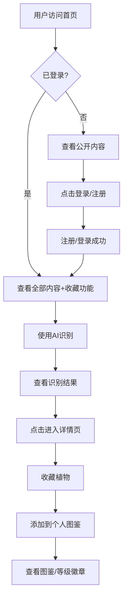

# 草木志 - PRD文档

## 1. Product Overview

**草木志**是一款沉浸式植物知识探索平台，融合AI图像识别与古籍智慧，为用户打造自然之美的数字体验。

- **核心目标**：让用户通过拍照识别植物，了解植物知识和古籍记载，构建个人植物图鉴
- **市场价值**：结合传统文化与现代科技，提供差异化的植物科普体验

## 2. Core Features

### 2.1 User Roles

| Role | Registration Method | Core Permissions |
|------|---------------------|------------------|
| 普通用户 | 手机号注册 | 浏览植物、AI识别、收藏管理、查看古籍 |

### 2.2 Feature Module

1. **登录/注册页**：用户认证、表单验证、第三方登录入口
2. **首页**：Hero区域、AI识别、每日推荐、分类导航、热门草木、古籍精选、数据统计
3. **详情页**：植物大图、标签页切换（概览/价值/文化/古籍）、收藏分享、相关推荐
4. **图鉴页**：个人资料、等级徽章、收藏列表（多视图）、筛选搜索、识别历史、数据统计
5. **个人中心页**：用户资料、功能菜单、编辑资料、修改密码

### 2.3 Page Details

| Page Name | Module Name | Feature description |
|-----------|-------------|---------------------|
| 登录/注册页 | 登录表单 | 手机号+密码登录、记住我、忘记密码 |
| 登录/注册页 | 注册表单 | 手机号+验证码+密码+昵称、用户协议 |
| 首页 | Hero区域 | 动态渐变背景、飘落叶子动画、大标题、搜索框、快捷标签 |
| 首页 | AI识别 | 上传/拖拽图片、加载动画、Top3识别结果、置信度展示 |
| 首页 | 每日推荐 | 大幅卡片展示、换一换功能、视差滚动效果 |
| 首页 | 分类导航 | 8个分类横向滚动卡片、点击筛选 |
| 首页 | 热门草木 | 网格布局、卡片悬停动效、收藏功能 |
| 首页 | 古籍精选 | 米黄色背景、竖排文字、印章装饰 |
| 首页 | 数据统计 | 大数字滚动动画、已收录草木数、古籍条数、识别次数 |
| 详情页 | 首屏大图 | 全宽高清图、渐变遮罩、多图滑动、浮动收藏按钮 |
| 详情页 | 标签页 | 概览/价值/文化/古籍切换、内容淡入淡出动画 |
| 详情页 | 古籍标签页 | 古籍选择器、传统排版、AI翻译、古今对比 |
| 详情页 | 收藏分享 | 星星飞入动画、分享卡片生成 |
| 详情页 | 相关推荐 | 同类植物推荐、横向滚动卡片 |
| 图鉴页 | 个人资料 | 渐变背景、头像、昵称、等级徽章、统计数字 |
| 图鉴页 | 等级徽章 | 当前徽章展示、进度条、徽章列表、升级动画 |
| 图鉴页 | 收藏列表 | 网格/列表/时间线三视图切换、卡片悬停操作 |
| 图鉴页 | 筛选搜索 | 名称搜索、分类筛选、排序功能 |
| 图鉴页 | 识别历史 | 时间线展示、记录详情、删除功能 |
| 图鉴页 | 数据统计 | 柱状图/饼图、探索成就卡片 |
| 个人中心页 | 功能菜单 | 我的图鉴、识别历史、编辑资料、修改密码、退出登录 |

## 3. Core Process

## 4. User Interface Design

### 4.1 Design Style

- **主色调**：#2D5A3D（森林绿）、#1A3A2A（深绿）、#4A7C59（中绿）
- **辅色**：#D4A574（琥珀金）、#F5E6D3（暖米色）、#C4956A（古铜）
- **背景色**：#FAF7F2（米白）、#F0EBE3（浅灰米）
- **强调色**：#E07A5F（珊瑚红）、#81B29A（薄荷绿）
- **字体**：中文使用 "Noto Sans SC"，英文使用 "Inter"
- **圆角**：卡片 16px，按钮 12px，标签 20px
- **阴影**：多层柔和阴影（0 4px 20px rgba(45,90,61,0.08)）
- **风格**：自然清新、丝滑动效、玻璃拟态

### 4.2 Page Design Overview

| Page Name | Module Name | UI Elements |
|-----------|-------------|-------------|
| 首页 | Hero区域 | 动态渐变背景、SVG叶子飘落动画、渐变文字标题、大圆角搜索框、快捷标签 |
| 首页 | AI识别 | 大虚线边框上传区、拖拽高亮动画、加载叶子旋转、环形置信度进度条 |
| 首页 | 每日推荐 | 大幅卡片、视差滚动图片、换一换按钮旋转动画 |
| 首页 | 热门草木 | 网格卡片、悬停上浮+阴影加深、收藏心形图标 |
| 首页 | 古籍精选 | 米黄色纸张背景、竖排文字、红色印章装饰、传统纹样分隔线 |
| 详情页 | 首屏大图 | 全宽50vh图片、渐变遮罩、白色文字、浮动圆形收藏按钮 |
| 详情页 | 古籍标签页 | 古籍选择器、传统排版、AI翻译卡片、现代研究折叠面板 |
| 图鉴页 | 个人资料 | 渐变背景+叶子纹理、圆形头像、等级徽章动画、统计数字 |
| 图鉴页 | 收藏列表 | 响应式网格/列表/时间线视图、卡片悬停操作按钮 |
| 登录/注册页 | 表单卡片 | 毛玻璃效果背景、浮动动画、输入框绿色光晕边框 |

### 4.3 Responsiveness

- **手机端**：单列布局、底部固定导航栏（图标+文字）、触摸优化
- **平板端**：双列布局、响应式网格
- **桌面端**：最大宽度 1200px、多列布局
- **断点**：768px（手机/平板）、1024px（平板/桌面）

### 4.4 动画效果

- **页面切换**：淡入 + 上移（opacity 0→1, translateY 30px→0, 0.5s）
- **卡片悬停**：上浮 8px + 阴影加深 + 微缩放 1.02
- **按钮点击**：缩放 0.96 + 涟漪效果
- **收藏动画**：星星放大 → 金色填充 → 粒子爆炸 → 飞入效果
- **数字滚动**：从0滚动到目标值的计数动画
- **叶子飘落**：多个叶子以不同速度和轨迹飘落
- **滚动触发**：元素进入视口时依次淡入（stagger 0.15s）
