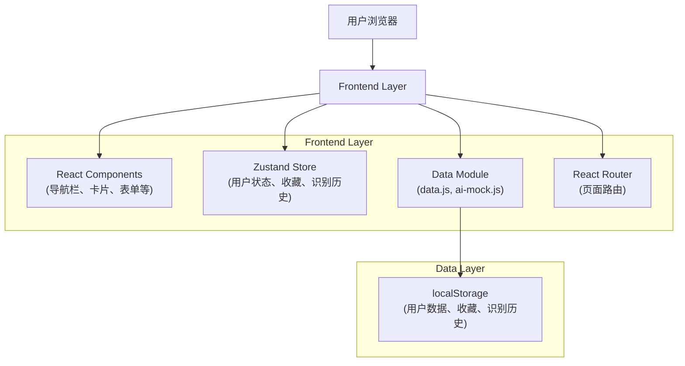
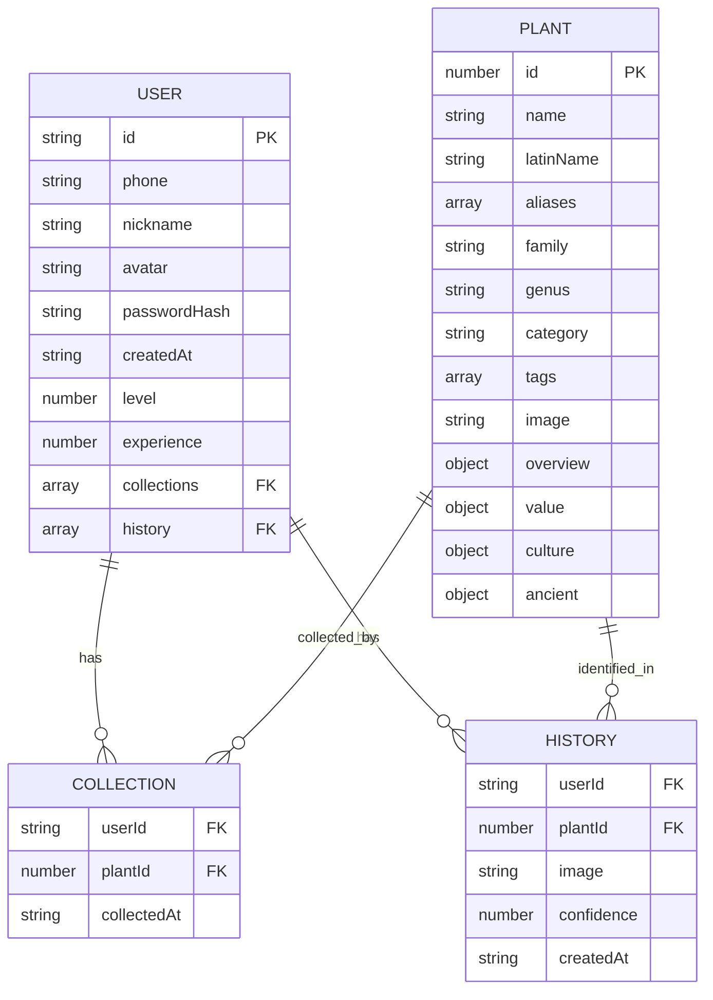

# 草木志 - 技术架构文档

## 1. Architecture Design



## 2. Technology Description

- **Frontend**: React@18 + TypeScript + TailwindCSS@3 + Vite
- **State Management**: Zustand
- **Routing**: React Router DOM
- **Icons**: Lucide React
- **Data Storage**: localStorage (纯前端，无需后端)

## 3. Route Definitions

| Route | Purpose | Protected |
|-------|---------|-----------|
| `/` | 首页 | 否 |
| `/login` | 登录/注册页 | 否 |
| `/detail/:id` | 植物详情页 | 否 |
| `/collection` | 个人图鉴页 | 是 |
| `/profile` | 个人中心页 | 是 |

## 4. Data Model

### 4.1 Data Model Definition



### 4.2 Data Structure

**User**:
```typescript
interface User {
  id: string;
  phone: string;
  nickname: string;
  avatar: string;
  passwordHash: string;
  createdAt: string;
  collections: number[];
  history: HistoryItem[];
  level: number;
  experience: number;
  identificationCount: number;
  streakDays: number;
}
```

**Plant**:
```typescript
interface Plant {
  id: number;
  name: string;
  latinName: string;
  aliases: string[];
  family: string;
  genus: string;
  category: string;
  tags: string[];
  image: string;
  images: string[];
  overview: {
    description: string;
    habitat: string;
    distribution: string;
    features: string;
    floweringPeriod: string;
  };
  value: {
    medicinal: string;
    edible: string;
    ecological: string;
    ornamental: string;
  };
  culture: {
    meaning: string;
    poem: string;
    story: string;
  };
  ancient: {
    benCaoGangMu?: {
      original: string;
      translation: string;
      usage: string;
      volume: string;
    };
    shenNongBenCao?: {
      original: string;
      grade: string;
      property: string;
      efficacy: string;
    };
    zhiWuMingShi?: {
      original: string;
      description: string;
    };
  };
}
```

**HistoryItem**:
```typescript
interface HistoryItem {
  id: string;
  plantId: number;
  image: string;
  confidence: number;
  createdAt: string;
}
```

## 5. Project Structure

```
src/
├── components/
│   ├── common/
│   │   ├── Navbar.tsx          # 导航栏组件
│   │   ├── Footer.tsx          # 页脚组件
│   │   ├── Button.tsx          # 按钮组件
│   │   ├── Card.tsx            # 卡片组件
│   │   ├── Toast.tsx           # Toast通知组件
│   │   └── Loading.tsx         # 加载动画组件
│   ├── home/
│   │   ├── HeroSection.tsx     # Hero区域
│   │   ├── AiRecognition.tsx   # AI识别模块
│   │   ├── DailyRecommend.tsx  # 每日推荐
│   │   ├── CategoryNav.tsx     # 分类导航
│   │   ├── HotPlants.tsx       # 热门草木
│   │   ├── AncientSection.tsx  # 古籍精选
│   │   └── StatsSection.tsx    # 数据统计
│   ├── detail/
│   │   ├── PlantGallery.tsx    # 植物图片画廊
│   │   ├── TabContent.tsx      # 标签页内容
│   │   ├── AncientTab.tsx      # 古籍标签页
│   │   ├── RelatedPlants.tsx   # 相关推荐
│   │   └── FloatingActions.tsx # 浮动操作按钮
│   └── collection/
│       ├── ProfileCard.tsx     # 个人资料卡
│       ├── BadgeSystem.tsx     # 等级徽章系统
│       ├── CollectionList.tsx  # 收藏列表
│       ├── HistoryTimeline.tsx # 识别历史时间线
│       └── StatsChart.tsx      # 数据统计图表
├── pages/
│   ├── Home.tsx                # 首页
│   ├── Login.tsx               # 登录/注册页
│   ├── Detail.tsx              # 详情页
│   ├── Collection.tsx          # 图鉴页
│   └── Profile.tsx             # 个人中心页
├── store/
│   └── useStore.ts             # Zustand状态管理
├── data/
│   └── plantsData.ts           # 植物数据(200种)
├── utils/
│   ├── auth.ts                 # 认证工具函数
│   ├── aiMock.ts               # 模拟AI识别
│   ├── storage.ts              # localStorage操作
│   └── helpers.ts              # 辅助函数
├── hooks/
│   ├── useAuth.ts              # 认证Hook
│   ├── useScrollAnimation.ts   # 滚动动画Hook
│   └── useIntersection.ts      # 视口监听Hook
├── styles/
│   ├── animations.css          # 动画样式
│   └── ancient.css             # 古籍样式
├── App.tsx                     # 主应用组件
├── main.tsx                    # 入口文件
└── index.css                   # 全局样式
```

## 6. Core Features Implementation

### 6.1 认证系统

- 使用 Zustand 管理全局认证状态
- localStorage 存储用户数据和 token
- 密码使用简单加密（btoa/atob）
- 路由守卫保护需要登录的页面

### 6.2 AI识别

- 模拟识别函数（1.5-3秒延迟）
- 根据图片文件名智能匹配植物
- 返回 Top3 候选结果及置信度
- 识别历史记录到 localStorage

### 6.3 收藏系统

- 收藏/取消收藏植物
- 收藏时触发星星飞入动画
- 等级徽章系统（5个等级）
- 进度计算和升级动画

### 6.4 古籍展示

- 传统排版设计（米黄色纸张、竖排文字）
- 三种古籍数据源切换
- AI翻译对比展示
- 现代研究关联

## 7. 动画效果实现

- CSS transitions + keyframes 实现大部分动画
- IntersectionObserver 实现滚动触发动画
- 叶子飘落使用 CSS 动画 + JavaScript 随机化
- 收藏动画使用 CSS 粒子效果 + JavaScript 控制

## 8. 响应式设计

- TailwindCSS 断点：sm(640px)、md(768px)、lg(1024px)、xl(1280px)
- 手机端：单列布局、底部固定导航
- 平板端：双列布局
- 桌面端：多列布局，最大宽度 1200px
