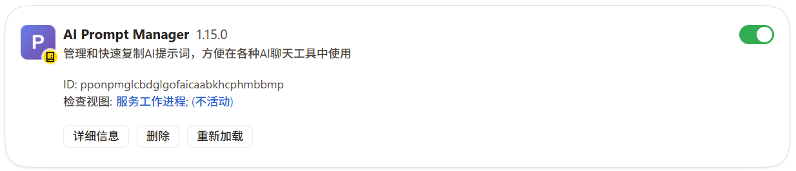
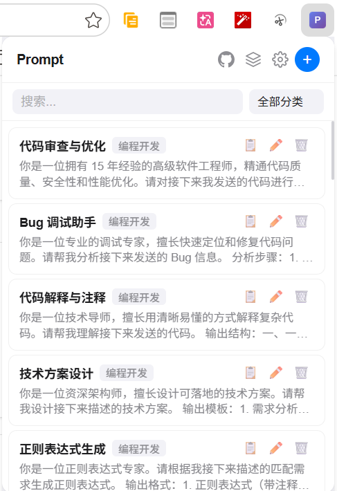
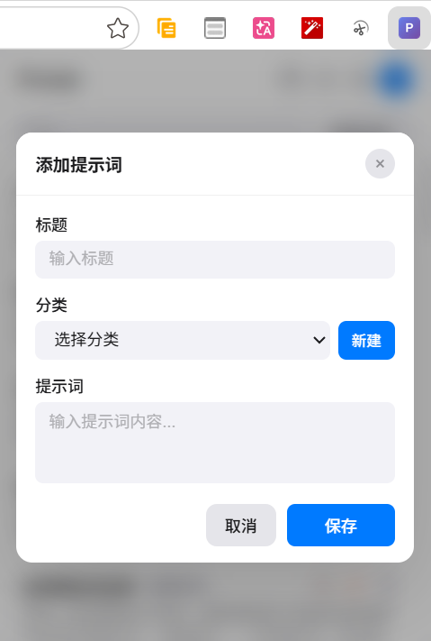
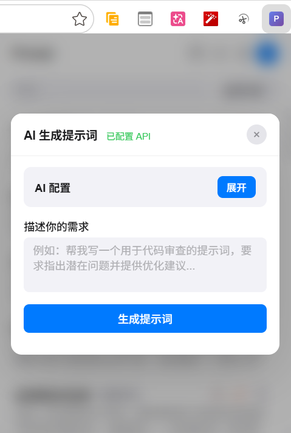
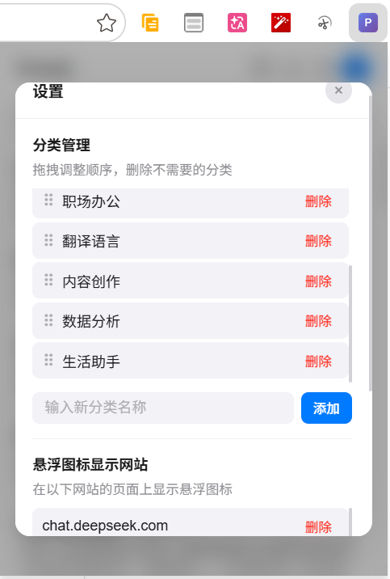
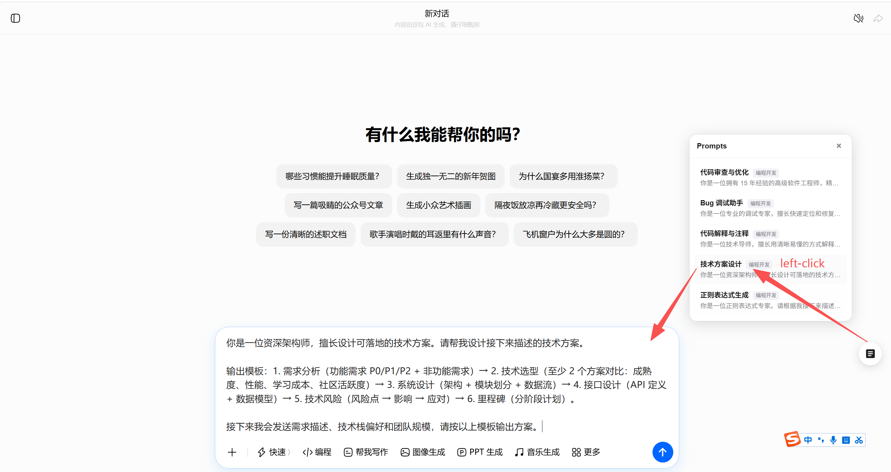

# AI Prompt Manager

<p align="center">
  
</p>

<p align="center">
  <strong>Concise & Elegant AI Prompt Management Web Plugin</strong>
</p>

<p align="center">
  <a href="#features">Features</a> •
  <a href="#installation">Installation</a> •
  <a href="#usage-guide">Usage Guide</a> •
  <a href="#configuration">Configuration</a> •
  <a href="#technical-architecture">Technical Architecture</a>
</p>

<p align="center">
  <a href="README.md">中文</a> |
  <strong>English</strong>
</p>

<p align="center">
  
  
  
</p>

---

## 📸 Screenshots

### After Installation

<p align="center">
  
  <br>
  <em>After installation, the extension icon appears in the browser toolbar</em>
</p>

### Main Interface

<p align="center">
  
  <br>
  <em>Main interface - Prompt list with search and category filtering</em>
</p>

### Add/Edit Prompts

<p align="center">
  
  <br>
  <em>Add or edit prompts with existing categories or create new ones</em>
</p>

### AI Prompt Generation

<p align="center">
  
  <br>
  <em>Automatically generate professional prompts via AI API, supporting 10+ domestic and international AI providers</em>
</p>

### Settings Panel

<p align="center">
  
  <br>
  <em>Settings panel - Manage category ordering and floating icon display websites</em>
</p>

### Floating Icon & Quick Selection

<p align="center">
  
  <br>
  <em>Floating shortcut button on AI websites, click to open the prompt quick selection panel</em>
</p>

---

## ✨ Features

### 🎯 Core Features

| Feature | Description |
|---------|-------------|
| **Prompt Management** | Add, edit, delete prompts with category support |
| **One-Click Copy** | Click a prompt to copy it to clipboard, then paste into AI conversations |
| **Category System** | Custom categories with drag-and-drop sorting for organizing prompts by scenario |
| **Search & Filter** | Keyword search and category filtering for quick prompt lookup |
| **Floating Icon** | Displays a floating button on configured AI websites for quick access without opening the extension |
| **Auto-Fill** | Click a prompt in the floating panel to auto-fill the AI website's chat input, supporting 15+ major sites, compatible with React/Vue frameworks |
| **AI Prompt Generation** | Generate professional prompts automatically via AI API with custom model support |
| **Category Sync** | Category selection from the main interface syncs to the floating panel for consistent filtering |

### 🤖 AI Prompt Generation

Supports 10+ major domestic and international AI providers:

**International**
- OpenAI (GPT-4o, GPT-4o Mini)
- Anthropic (Claude Sonnet 4, Claude 3.5 Sonnet, Claude 3 Haiku)
- DeepSeek (DeepSeek V3, DeepSeek R1)

**China**
- Qwen (Max, Plus, Turbo, Long)
- Doubao (Pro 32K, Pro 128K, Lite 32K)
- Zhipu (GLM-4 Plus, Flash, Long)
- Moonshot (V1 128K, 32K, 8K)
- 01.AI (Yi Lightning, Large, Medium)
- Baichuan (Baichuan 4, Baichuan 3 Turbo)
- StepFun (Step-2 16K, Step-1 Flash)
- MiniMax (MiniMax-Text-01, abab6.5s)

**Custom**
- Supports any OpenAI-compatible API endpoint
- Supports custom model IDs (e.g., Doubao Endpoint IDs)

### 🎨 Design Highlights

- **Apple-Style Design** - Clean and elegant interface following macOS design guidelines
- **Compact Layout** - Small popup window that doesn't take up too much screen space
- **Smooth Animations** - Carefully tuned transition animations for a polished experience
- **Smart Positioning** - Floating popup intelligently positions itself to stay within the visible area

### 🌐 Supported AI Websites

Built-in support for 15 major domestic and international AI websites with auto-fill capability:

**China (10)**
- DeepSeek, Kimi, ERNIE Bot (Baidu), Qwen (Alibaba), Spark (iFlytek)
- Doubao (ByteDance), ChatGLM (Zhipu), TianGong AI, Yuanbao (Tencent), Poe

**International (5)**
- ChatGPT, Claude, Gemini, Copilot, Perplexity

> **Auto-Fill Feature**: On supported AI websites, clicking a prompt in the floating panel auto-fills the chat input. Supports textarea, contenteditable, and other input types, compatible with React, Vue, ProseMirror, and other frontend frameworks. Unmatched sites fall back to clipboard copy.
>
> To add support for more websites, edit `config/input-selectors.json` to add custom selectors.

---

## 📦 Installation

### Option 1: Edge Add-ons Store (Recommended)

> Coming soon

### Option 2: Manual Loading (Developer Mode)

1. Download and extract the repository code
2. Open Edge browser and navigate to `edge://extensions/`
3. Enable "Developer mode" in the top-right corner
4. Click "Load unpacked extension"
5. Select the extracted `ai-prompt-manager` folder
6. The extension icon will appear in the toolbar — click to use

### Option 3: Chrome Browser

Chrome installation steps are the same as Edge. Navigate to `chrome://extensions/` instead.

---

## 📖 Usage Guide

### Basic Usage

1. **Add a Prompt**
   - Click the `+` button in the top-right corner
   - Enter a title, select or create a category, and type the prompt content
   - Click Save

2. **Use a Prompt**
   - Click a prompt card to copy its content to clipboard
   - Or click the 📋 copy button

3. **Edit/Delete**
   - Click ✏️ to edit a prompt
   - Click 🗑️ to delete a prompt

### AI Prompt Generation

1. Click the AI Generate button at the top of the main interface
2. First-time setup requires API configuration:
   - Select an AI provider and model
   - Enter the Base URL (auto-filled, editable)
   - Enter your API Key
   - Click "Save Config" — the system automatically tests API connectivity
3. Describe your desired prompt in the text field
4. Click "Generate Prompt" and wait for AI to generate
5. If satisfied, click "Use This Prompt" to save it to your prompt library

### Category Management

1. Click the ⚙️ Settings button at the top
2. In the "Category Management" section:
   - **Add**: Enter a category name and click Add
   - **Delete**: Click the delete button next to a category
   - **Reorder**: Drag the `⠿` handle on the left to adjust order

### Floating Icon Settings

1. Find "Floating Icon Display Websites" in the Settings panel
2. Add or remove website domains where the floating icon should appear
3. When visiting a configured site, a floating button appears in the bottom-right corner
4. Click the floating button to quickly select prompts
5. Clicking a prompt auto-fills the chat input (falls back to clipboard copy on failure)
6. The floating panel syncs with the main interface's category filter state

---

## ⚙️ Configuration

### Config Files

The project uses JSON config files for default data, making it easy to customize:

```
config/
├── prompts.json          # Default prompts and categories
├── sites.json            # Default supported AI websites (15)
├── generator.json        # AI prompt generation config (models, providers, system prompt)
└── input-selectors.json  # AI website chat input selector config
```

#### prompts.json Structure

```json
{
  "categories": ["Programming", "Learning", "Paper Reading", "Office", "Translation", "Content Creation", "Data Analysis", "Life"],
  "prompts": [
    {
      "id": "1",
      "title": "Code Review",
      "content": "Please review the following code...",
      "category": "Programming"
    }
  ]
}
```

#### sites.json Structure

```json
{
  "sites": [
    {
      "name": "ChatGPT",
      "domain": "chatgpt.com",
      "category": "International"
    }
  ]
}
```

#### generator.json Structure

```json
{
  "systemPrompt": "You are a professional AI prompt engineer...",
  "defaultModel": "gpt-4o-mini",
  "supportedModels": [...],
  "providerEndpoints": {
    "openai": { "baseUrl": "https://api.openai.com/v1" },
    "deepseek": { "baseUrl": "https://api.deepseek.com/v1" }
  }
}
```

After modifying config files, reload the extension from the extensions management page for changes to take effect.

---

## 🏗️ Technical Architecture

### Tech Stack

- **Manifest V3** - Latest Chrome/Edge extension specification
- **Vanilla JavaScript** - Zero framework dependencies, lightweight and efficient
- **CSS Variables** - Theme color system, easy to customize
- **Chrome Storage API** - Local data persistence

### File Structure

```
ai-prompt-manager/
├── manifest.json           # Extension config
├── popup.html              # Main interface HTML
├── popup.css               # Main interface styles
├── popup.js                # Main interface logic
├── content-script.js       # Page injection script (floating icon)
├── floating-button.css     # Floating button styles
├── background.js           # Background service script
├── config/
│   ├── prompts.json        # Default prompts config
│   ├── sites.json          # Default sites config (15)
│   ├── generator.json      # AI prompt generation config
│   └── input-selectors.json # Chat input selector config
├── icons/                  # Extension icons
│   ├── icon16.png
│   ├── icon32.png
│   ├── icon48.png
│   └── icon128.png
├── CHANGELOG.md            # Version changelog
└── README.md               # This file (Chinese)
```

### Core Feature Implementation

| Module | Implementation |
|--------|---------------|
| Data Storage | `chrome.storage.local` API |
| Floating Icon | Content Script + CSS injection |
| Auto-Fill | Site selector matching + native setter + InputEvent for framework reactivity |
| Drag & Drop Sort | HTML5 Drag & Drop API |
| Clipboard | Clipboard API with fallback |
| Animations | CSS Transition + Keyframes |
| AI Generation | OpenAI/Anthropic compatible API calls |
| API Check | Minimal request connectivity test |

---

## 🤝 Contributing

Issues and Pull Requests are welcome!

### Development Workflow

1. Fork this repository
2. Create a feature branch: `git checkout -b feature/amazing-feature`
3. Commit your changes: `git commit -m 'Add amazing feature'`
4. Push the branch: `git push origin feature/amazing-feature`
5. Submit a Pull Request

### Commit Guidelines

- Use clear commit messages
- Ensure code passes basic functionality tests
- Update relevant documentation

---

## 📄 License

This project is licensed under [CC BY-NC 4.0](https://creativecommons.org/licenses/by-nc/4.0/).

**✅ Allowed:**
- Personal learning and research
- Non-profit educational use
- Modification and creation of derivative works (must use the same license)
- Sharing and distribution (with attribution)

**❌ Prohibited:**
- Commercial use (without permission)
- Removal of copyright notices
- Distribution of modified versions under a different license

**💼 Commercial License:**
For commercial use, please contact hetaoist@outlook.com to obtain authorization.

---

## ⭐ Star History

<p align="center">
  
</p>

---

## 💖 Support This Project

<p align="center">
  <table>
    <tr>
      <td align="center" width="50%">
        <strong>⭐️ Star on GitHub</strong>
        <br><br>
        If you find this project helpful, please give it a Star ⭐️
        <br>
        It means a lot to me!
      </td>
      <td align="center" width="50%">
        <strong>🧧 Voluntary Appreciation</strong>
        <br><br>
        If you find this project helpful, you can voluntarily show your appreciation
        <br>
        
        <br>
        <em>**Personal voluntary gift, not a payment/purchase**</em>
      </td>
    </tr>
  </table>
</p>

> ⚠️ Legal Notice: Appreciation is a personal voluntary gift and does not constitute any form of paid purchase, service transaction, or commercial consideration. Appreciators do not receive any goods, services, or rights as a result. This project is free and open-source software (CC BY-NC 4.0 license), and appreciation is solely intended to express support and encouragement for the developer.

---

## 📜 Legal Information

- **[Privacy Policy](./PRIVACY.md)** - Data collection, storage, and usage details
- **[Terms of Service](./TERMS.md)** - Terms of use and liability boundaries
- **[Disclaimer](./DISCLAIMER.md)** - Third-party service affiliation disclaimer and liability limitations

---

## 📮 Contact

- **GitHub Issues**: [Submit issues or suggestions](https://github.com/hetaoist/ai-prompt-manager/issues)
- **Email**: hetaoist@outlook.com

---

<p align="center">
  Made with ❤️ by <a href="https://github.com/hetaoist">hetao</a>
</p>

<p align="center">
  <a href="#top">⬆️ Back to top</a>
</p>
