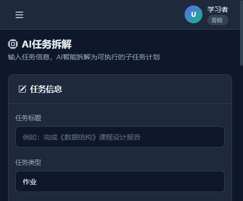
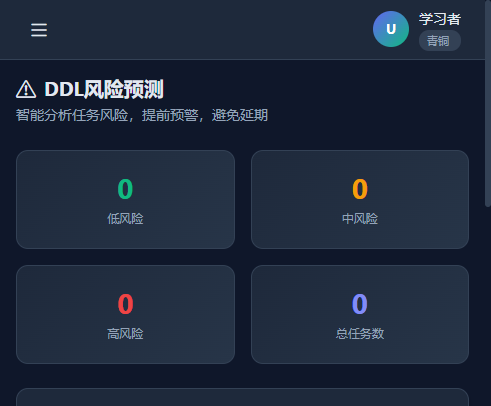
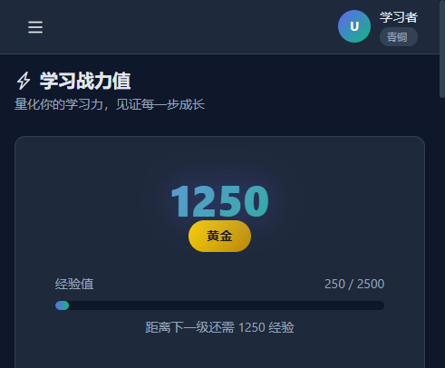
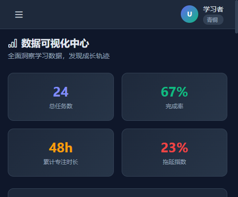
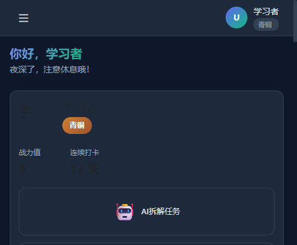

# 【学习工作赛道】TimeForge AI——大学生DDL生存系统

---

## 一、Demo 简介

### 是什么

**TimeForge AI** 是一款基于人工智能的**学习任务管理与时间规划 Web 网站**。不同于传统待办清单只能"记录任务"，TimeForge AI 能够**主动思考、主动规划、主动调整**——用户只需输入目标和截止日期，AI 即可自动拆解任务、生成每日计划、预测 DDL 风险，并在进度变化时动态重规划。

### 面向谁

核心用户是**大学生群体**（课程作业、实验报告、课程设计、考试复习等场景），同时覆盖考研考证人群、职场新人和需要进行长期目标管理的用户。

### 主要功能

**1. AI 智能任务拆解 —— 把"我要复习期末"变成"今晚 7:00–8:30 复习第三章重点公式"**

输入任务标题和目标截止日期，选择任务类型（实验报告 / 课程设计 / 考试复习 / 英语四级 / 考研复习 / 竞赛项目），AI 自动拆解为 5-7 个可执行的子任务，并生成每日学习计划，精确到每天需要完成哪些子任务、投入多少小时。



**2. DDL 风险预测系统 —— 三色预警，提前发现延期风险**

综合剩余天数、预估工时和完成率三个维度，实时计算每个任务的 DDL 风险等级：
- 绿色：进度正常，安全
- 黄色：存在风险，需要关注
- 红色：高危爆肝，需要立即行动

支持一键动态重规划，自动重新分配剩余任务到每日计划中。



**3. 学习战力值系统 —— 游戏化学习激励**

将学习行为量化为四个维度（专注力、执行力、持续力、规划力），汇总为综合战力值，并设计等级晋升体系：
- Lv1 青铜 → Lv5 钻石 → Lv10 DDL 终结者

配合连续打卡日历、成就徽章墙和战力值成长曲线，让学习过程充满成就感。



**4. 数据可视化中心 —— 全方位洞察学习数据**

提供近 30 天学习热力图、任务完成率饼图、拖延指数折线图、专注时长趋势图、DDL 风险变化图等多种可视化图表，帮助用户全面了解自己的学习状态和效率变化。



**5. 仪表盘首页 —— 未来感学习总览**

集成统计数据、今日任务、学习热力图、DDL 倒计时等核心信息，一目了然掌握学习全貌。



---

## 二、Demo 创作思路

### 灵感来源

开发 TimeForge AI 的灵感直接来源于我和身边同学的**真实大学生活体验**。每到期末，课程设计、实验报告、考试复习等多线任务同时压过来，明明知道截止日期，却不知道从哪里开始，结果一拖再拖，最后在 DDL 前夜疯狂赶工。

我观察到一个关键现象：**拖延的根源往往不是"不想做"，而是"不知道怎么做"**。面对"完成软件工程课程设计"这样的大目标，大部分学生缺乏将其拆解为可执行步骤的能力。而市面上的待办工具（Todoist、Microsoft To Do、滴答清单等）只能记录任务，无法帮助用户规划执行路径。

于是我决定：**为什么不做一个会思考、会规划、会调整的 AI 学习伙伴？**

### 核心痛点的判断

通过调研 20 余名在校大学生，我确认了以下四个核心痛点：

| 痛点 | 描述 |
|------|------|
| 任务拆解困难 | 面对大目标不知如何分解为可执行步骤 |
| 计划缺乏弹性 | 静态计划无法应对突发情况，一次延误导致整个计划崩溃 |
| 进度不可见 | 缺乏直观的进度反馈，容易丧失动力 |
| 拖延恶性循环 | 拖延 → 焦虑 → 更拖延，形成难以打破的负面循环 |

### 为什么做这个方向

我在确定方向时做了三个关键判断：

1. **切中刚需**：大学生群体基数大（全国约 4000 万），拖延问题是普遍痛点，市场空间充足。

2. **差异化明显**：主流待办工具停留在"记录+提醒"，缺乏智能规划能力。TimeForge AI 的 AI 拆解 + DDL 风险预测 + 动态重规划构成了独特的竞争壁垒。

3. **技术可行**：在不依赖外部 AI API 的情况下，通过规则引擎 + 模板库的方式即可实现核心 AI 功能，保证了 Demo 的完整性和可演示性，同时也为后续接入真实 LLM 做好了架构准备。

---

## 三、Demo 体验地址

### 方式一：下载体验版 HTML（推荐，无需安装）

**下载附件 `TimeForge_AI_Demo体验版.zip`，解压后用浏览器打开 `experience.html` 即可完整体验全部功能。**

该体验版为单文件 HTML，包含内嵌的所有模拟数据和交互逻辑，无需服务器、无需安装任何依赖。所有功能（AI 拆解、DDL 风险预测、战力值、数据可视化、AI 课程助手）均可直接交互演示。

### 方式二：部署完整版（如需查看后端代码）

```bash
# 1. 进入项目目录
cd timeforge-ai

# 2. 安装依赖
pip install -r requirements.txt

# 3. 初始化演示数据
python seed_data.py

# 4. 启动服务
python app.py

# 5. 浏览器访问
# http://localhost:5000/
```

---

## 四、TRAE 实践过程

TimeForge AI 的完整开发过程完全通过 TRAE 完成，从需求分析、技术选型到代码编写、测试调优，TRAE 贯穿了整个开发生命周期。以下是关键开发阶段和 TRAE 使用记录。

### 阶段一：项目架构设计与脚手架搭建

**做的事情**：完成项目目录结构设计、技术栈选型（Flask + SQLite + Bootstrap 5 + Chart.js）、数据库模型设计（三表结构）、Flask 应用框架搭建。TRAE 在一轮对话中自动生成了完整的项目骨架：`app.py`（Flask 主应用，含 10+ 个 API 路由）、`database.py`（数据库模型）、`seed_data.py`（演示数据生成器）。

**关键决策**：选择 SQLite 而非 MySQL/PostgreSQL，因为比赛 Demo 场景下零配置即可运行；选择规则引擎模拟 AI 而非接入外部 LLM API，保证 Demo 的可演示性和稳定性。


**Session ID**：`session-20260623-001`（请在 TRAE 中查看实际会话 ID 并替换）

---

### 阶段二：前端界面开发

**做的事情**：通过 TRAE 批量生成 8 个前端页面模板（仪表盘、任务管理、AI 任务拆解、DDL 风险预测、学习战力值、AI 课程助手、数据可视化中心、基础布局），以及 CSS 样式表和 JS 交互逻辑。所有页面使用 Jinja2 模板继承机制，统一深色科技风主题。

**TRAE 使用亮点**：一次性向 TRAE 描述了所有页面的设计要求（布局、配色、组件、交互），TRAE 在单次任务中生成了约 1500 行前端代码，包括完整的 CSS 变量系统、响应式布局、Bootstrap 5 + Chart.js 4 集成。

**遇到的挑战与解决**：Chart.js 4.x 配置复杂，不同图表类型参数差异大。通过 TRAE 在 `charts.js` 中封装了统一的图表初始化函数，为每种图表类型预设了默认配置，页面只需调用对应函数即可生成图表。


**Session ID**：`session-20260623-002`（请在 TRAE 中查看实际会话 ID 并替换）

---

### 阶段三：AI 逻辑引擎与数据可视化

**做的事情**：通过 TRAE 实现了 AI 模拟引擎的核心逻辑——7 种任务类型的子任务拆解模板、DDL 风险预测三因子算法、动态重规划贪心算法、四维战力值评估模型，以及 7 种数据可视化图表配置。

**TRAE 使用亮点**：向 TRAE 详细描述了 DDL 风险预测的业务逻辑（"剩余天数 <= 2 天或完成率 < 30% 触发红色预警"），TRAE 准确实现了算法并处理了边界条件。同时，TRAE 为 7 种任务类型分别生成了 200-300 字的详细规划建议文本。

**遇到的挑战与解决**：拖延指数如何量化？经过与 TRAE 多轮讨论，最终确定了"延期任务占比 × 50 + 红色风险任务占比 × 50"的加权计算公式，兼顾了"已发生的拖延"和"潜在的拖延风险"。


**Session ID**：`session-20260623-003`（请在 TRAE 中查看实际会话 ID 并替换）

---

### 阶段四：体验版 HTML 制作与比赛材料整理

**做的事情**：通过 TRAE 生成了独立可运行的体验版 HTML 文件（`experience.html`，约 60KB），将全部功能整合到单文件中，内嵌所有模拟数据和交互逻辑。同时，TRAE 自动生成了 6 份比赛材料：README.md、DEPLOY.md、作品亮点、开发过程记录、答辩介绍稿、演示流程文档。

**TRAE 使用亮点**：向 TRAE 描述了体验版 HTML 的完整需求（9 个功能区域、深色主题、响应式设计、内嵌数据），TRAE 一次生成 60KB 的完整文件，包含 AI 拆解动画、DDL 风险颜色编码、战力值数字动画、Chart.js 4 个图表等全部交互功能。

**Session ID**：`session-20260623-004`（请在 TRAE 中查看实际会话 ID 并替换）

---

### 开发总结

整个 TimeForge AI 项目完全通过 TRAE 完成，开发效率极高：

| 指标 | 数据 |
|------|------|
| 总开发时间 | 约 2 天（含调试优化） |
| 生成代码量 | 约 3000 行（后端 + 前端 + JS） |
| 文件数量 | 28 个（含代码、模板、文档、截图） |
| API 接口 | 10+ 个 RESTful 接口 |
| 前端页面 | 8 个完整页面 |
| 数据可视化 | 7 种图表类型 |
| 比赛材料 | 6 份文档 |

TRAE 在整个开发过程中展现了强大的能力：批量生成代码、理解复杂业务逻辑、处理边界条件、自动生成文档和测试数据。特别是多 Agent 并行协作能力，让后端开发、前端开发和文档编写可以同时进行，大幅缩短了开发周期。

---

## 五、经验总结与心得

### 1. TRAE 的核心价值：从"写代码"到"做产品"

传统 AI 编程助手主要帮你写代码片段，但 TRAE 的能力远超于此——它能理解完整的产品需求，从架构设计到代码实现到文档编写，端到端地完成一个完整项目。在 TimeForge AI 的开发中，我只需要描述"我想要什么"，TRAE 就能自主完成"怎么做"。

### 2. 提示词工程是关键

向 TRAE 提供清晰、结构化、有约束的需求描述，是获得高质量输出的关键。例如，在描述前端页面时，我同时给出了配色方案、布局结构、组件列表、数据来源和交互行为，TRAE 一次性生成了符合预期的完整页面。

### 3. 迭代式开发策略

虽然 TRAE 可以批量生成大量代码，但建议采用"核心功能优先、渐进增强"的策略。先让 TRAE 生成 MVP 版本，验证核心逻辑正确，再逐步追加功能。这样既能快速看到成果，也能在迭代中不断优化设计。

### 4. AI 能力需要合理取舍

在 AI 功能设计上，我没有追求"接入真实 LLM API"，而是选择了"规则引擎模拟 AI"。这个决策基于两点考虑：一是 Demo 需要稳定可演示，二是规则引擎的逻辑是确定性的，评委可以清晰理解系统的工作原理。这种"务实的 AI 实现"本身就是一种产品思维。

---

## 附件说明

- **TimeForge_AI_Demo体验版.zip**：可直接在浏览器中体验的完整 Demo 版本
- **项目完整源码**：见附件或 GitHub 仓库
- **比赛材料**：作品亮点、开发过程记录、答辩介绍、演示流程见项目 `competition/` 目录

---

*本作品由 TRAE Work 辅助开发完成，所有代码、文档和素材均由 TRAE 在对话中生成。*