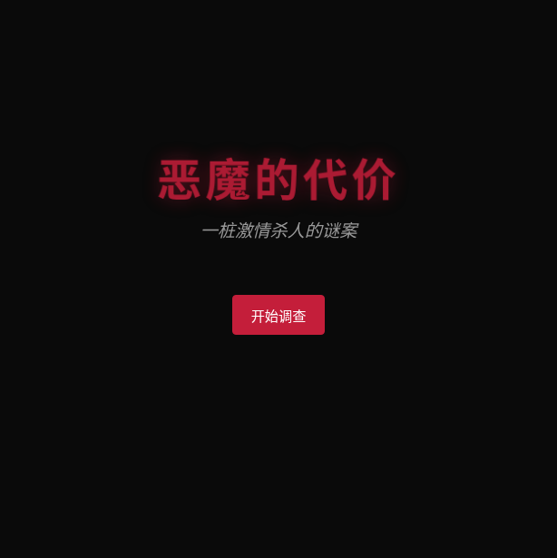
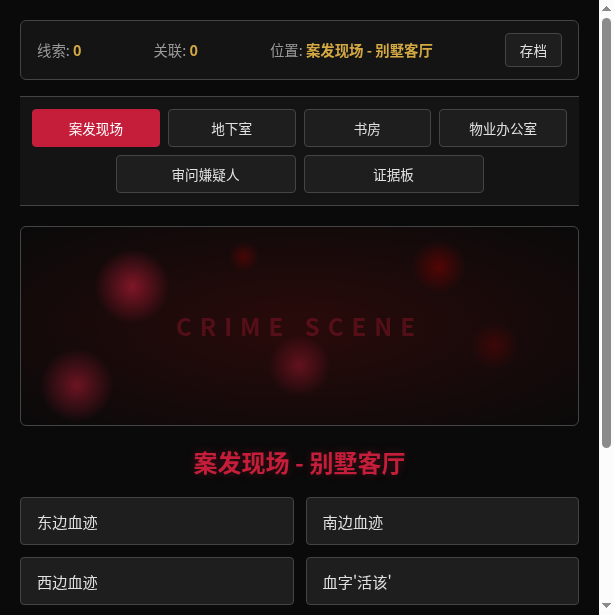
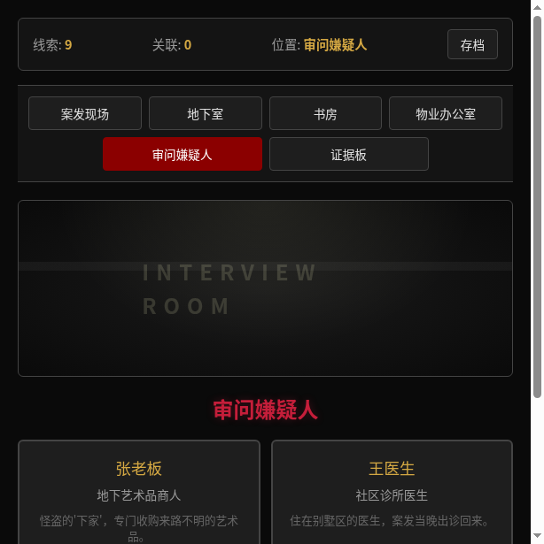
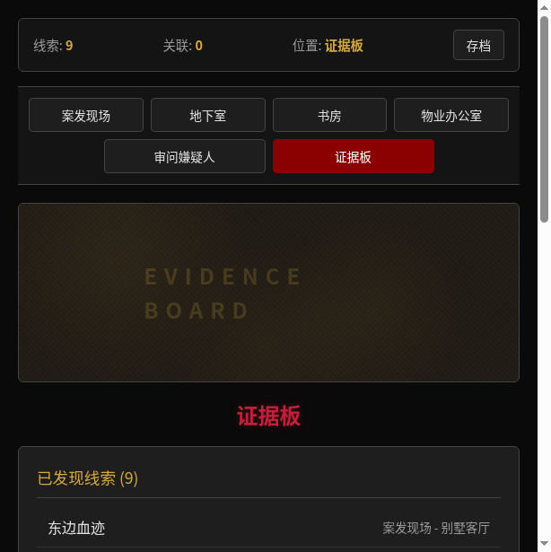
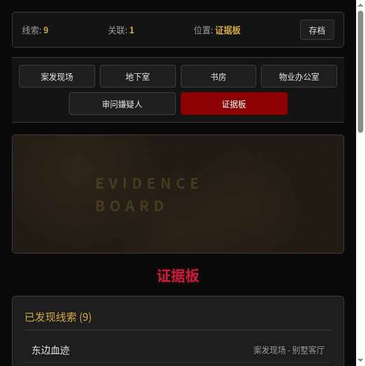
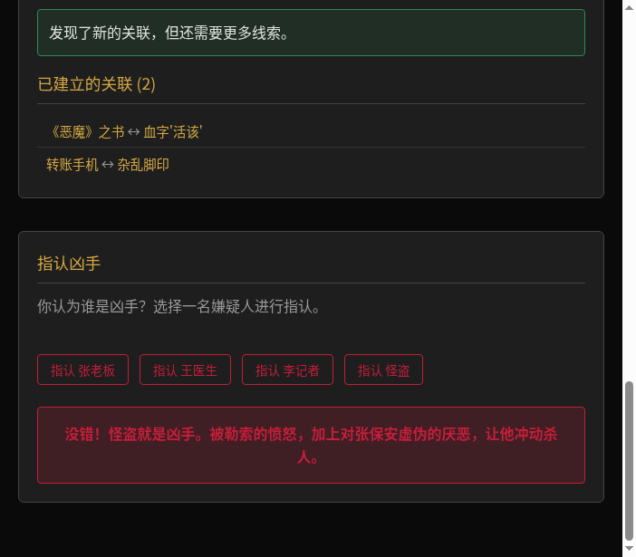

## 0. 先和大家打个招呼吧 👋

**我是谁：** 一名热爱推理小说的产品经理，平时喜欢剧本杀和悬疑剧，一直想做一个能让人"亲自当侦探"的互动游戏。

**我是怎么用 TRAE 把 Demo 做出来的：**

说实话，我没有什么前端开发经验，之前连 Vue 是什么都不太清楚。但 TRAE 让我感觉像是在和一个懂技术的朋友聊天——我把脑子里想的游戏玩法一句句讲给它听，它就能帮我写出代码。

最让我觉得"原来这么简单"的时刻，是当我告诉 TRAE"我想在证据板上把两条线索关联起来"的时候。它不仅帮我实现了下拉选择器，还自动处理了关联验证的逻辑。放在以前，我可能要花好几天去查文档、写代码、调试，但 TRAE 几分钟就搞定了。

它帮我跨过的最大的坎，是把这个游戏从"需要 Python 后端 + 一堆配置文件"的复杂项目，变成了一个"只有一个 HTML 文件、双击就能打开"的纯前端项目。这意味着任何人下载 ZIP 包就能直接玩，不需要装任何环境。这个转变让我意识到，技术门槛从来不是创意的阻碍。

---

## 一、Demo 简介

**是什么：** 一款基于网页的沉浸式文字推理破案游戏，打开浏览器即可游玩。

**面向用户：** 推理小说/悬疑剧爱好者、剧本杀玩家、喜欢烧脑解谜的休闲玩家（16-35 岁）。

**核心功能：**

| 功能 | 说明 |
|---|---|
| 现场搜证 | 在 4 个场景中搜索 13 条线索，每条线索都有独立描述和关联关系 |
| 审问嫌疑人 | 对 4 名嫌疑人进行审讯，部分对话需要先发现特定线索才能解锁 |
| 证据关联 | 在证据板上将两条线索关联，系统给出推理分析，还原事件真相 |
| 指认真凶 | 收集足够线索并建立关键关联后，指认你认为的真凶 |
| 存档系统 | 随时保存进度，下次打开浏览器继续调查 |

---

## 二、Demo 创作思路

**灵感来源：** 经典推理小说和悬疑剧一直很受欢迎，但能让人"亲自当侦探"的互动体验并不多。我想做一个让玩家真正进入案发现场、搜集线索、审问嫌疑人、建立证据关联、最终推理出真凶的网页游戏。

**想解决的问题：** 市面上的推理游戏要么门槛太高（硬核桌游），要么太浅（选择题式手游），缺少一种"有真实调查感、但又不至于劝退"的中间态体验。

**为什么做这个方向：** 传统剧本杀需要 4-8 人组局、2-4 小时，门槛很高。本游戏将完整推理体验压缩到 20-30 分钟的单人流程中，打开浏览器即可开始，大幅降低享受推理乐趣的成本。

---

## 三、Demo 体验地址

**下载 ZIP 包：** 解压后双击 `恶魔的代价.html` 即可在浏览器中打开游玩，无需安装任何依赖。

---

## 四、TRAE 实践过程

### 用 TRAE 完成 Demo 开发的完整流程

#### Step 1：向 TRAE 提出需求

我向 TRAE 描述了我的创意：
> "我想开发一款推理破案网页游戏，玩家进入案发现场搜集线索、审问嫌疑人、建立证据关联、最终指认真凶。故事是：怪盗偷画后被保安勒索，冲动杀人。需要暗黑悬疑风格，打开浏览器就能玩。"

TRAE 立即帮我拆解了任务：
1. 确定技术栈（Vue 3 + 纯 HTML 单文件）
2. 设计游戏数据（证据、嫌疑人、关联规则）
3. 开发前端组件（场景、导航、对话系统）
4. 开发验证逻辑（证据关联、指认真凶）
5. 联调测试

#### Step 2：TRAE 协助架构设计

TRAE 建议使用 **Vue 3 Composition API + 纯 HTML 单文件** 的方案：
- 不需要配置 Webpack/Vite，直接用 CDN 引入 Vue 3
- 使用 Import Map 管理模块依赖
- 所有游戏数据（证据、嫌疑人、关联规则）直接内嵌在 HTML 中
- 验证逻辑（证据关联、指认真凶）在前端直接执行，无需后端

这个方案让我能快速迭代，不用花时间配置构建工具，最终交付物只有一个 HTML 文件，双击即可打开。

#### Step 3：迭代开发过程

**第一轮：基础框架（Vue 3 + Flask）**
- TRAE 生成了完整的项目结构（25+ 个文件）
- 实现了标题画面、介绍序列、案发现场场景
- 但导航栏在点击线索后消失，游戏无法推进

**第二轮：Bug 修复**
- 我向 TRAE 反馈："进行到案发现场，选择了线索后，只有存档按钮，游戏无法推进"
- TRAE 诊断出是 Vue 3 组件命名问题：`<nav-bar>` 被浏览器当作原生 HTML `<nav>` 元素处理
- 修复方案：改名为 `<scene-nav>`，导航栏恢复正常

**第三轮：功能完善**
- 补充了审问嫌疑人、证据板关联、指认真凶等核心玩法
- 修复了关联验证 Bug（前后端字段名不一致：`valid` vs `success`）
- 添加了存档/读档系统

**第四轮：纯 HTML 化（最终交付）**
- 将 Vue 3 + Flask 项目转换为纯 HTML 单文件
- 所有游戏数据从 Python 字典转为 JavaScript 常量内嵌
- 异步 API 调用改为同步函数调用
- 最终交付物只有一个 `恶魔的代价.html`，打包为 ZIP 上传

#### Step 4：TRAE 协助制作报名材料

TRAE 帮我：
- 撰写了报名帖内容（创意名称、用户痛点、价值意义）
- 生成了 HTML DEMO 报名帖（暗黑悬疑风格，含游戏截图）
- 整理了 6 张关键步骤截图

---

### 开发关键步骤截图

**1. 标题画面 — 暗黑悬疑风格**

**2. 案发现场 — 搜集线索**

**3. 审问嫌疑人 — 4 名嫌疑人**

**4. 证据板 — 关联推理**

**5. 关联成功 — 推理分析**

**6. 指认真凶 — 通关结局**

---

### 关键任务 Session ID

| 时间 | Session ID | 任务内容 |
|---|---|---|
| 2026/6/22 19:26 | `3476035865427543:9a90889c9024b5601816aa0bc034f302_6a391881dcfdf07f2ebaf5f5.6a391bc7747a46564f7cb928.6a391bc7e0677c22676fb29a` | 游戏框架搭建与组件开发 |
| 2026/6/22 19:30 | `3476035865427543:cf309dc5c0dc6f312875e57f8668eef7_6a391881dcfdf07f2ebaf5f5.6a391cde747a46564f7cb934.6a391cde5aac1a8925ff1af6` | Bug 修复与功能完善 |
| 2026/6/22 19:36 | `3476035865427543:6ccfc439cb0e5a8cc663499a16835d47_6a391881dcfdf07f2ebaf5f5.6a391e01747a46564f7cb940.6a391e01263fbb6316dbbe71` | 报名帖与 HTML DEMO 制作 |

---

### 开发技术栈

- **前端：** Vue 3 Composition API + 纯 HTML 单文件（无构建步骤）
- **数据：** 所有游戏数据内嵌为 JavaScript 常量
- **验证：** 前端同步函数替代后端 API
- **样式：** 纯 CSS 变量 + 暗黑悬疑主题
- **音效：** Web Audio API 程序化生成

---

### 踩坑与解决方案

| 问题 | 原因 | 解决方案 |
|---|---|---|
| 导航栏消失 | Vue 3 将 `<nav-bar>` 识别为原生 HTML 元素 | 改名为 `<scene-nav>` |
| 关联总是失败 | 前后端字段名不一致（`valid` vs `success`） | 统一字段名，后改为纯前端验证 |
| 场景切换无动画 | 组件复用导致 Vue 不重新渲染 | 添加 `:key` 强制刷新 |
| 位置显示英文 ID | `gameData.scenes` 缺少 interview/board | 补充场景数据 |

---

## 报名帖链接

[恶魔的代价 — TRAE AI 创造力大赛报名帖](https://forum.trae.cn/t/topic/40104)

---

**恶魔的代价 · TRAE AI 创造力大赛 · 生活娱乐赛道**
