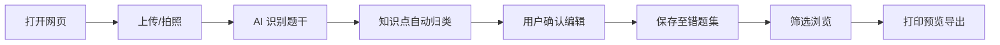

## 1. 产品概述

AI 错题整理助手是一款面向中小学生及家长的网页端工具,通过拍照上传试卷错题,AI 自动识别题干并按知识点归类,一键生成可打印的错题集,解决手工抄写耗时、纸质本易丢失、复习查找低效的痛点。

- 目标用户:中小学生、初高中家长、学科辅导老师
- 核心价值:免费、轻量化、零门槛,将错题整理时间从 1 小时压缩至 3 分钟
- 产品定位:学习工作赛道的效率工具,强调"拍即整、整即得、得即用"

## 2. 核心功能

### 2.1 用户角色
| 角色 | 注册方式 | 核心权限 |
|------|---------|---------|
| 普通用户 | 免登录直接使用 | 拍照上传、错题归类、打印预览、本地导出 |
| 注册用户 | 邮箱/手机注册 | 云端同步、多设备访问、历史错题归档 |

### 2.2 功能模块
1. **首页**:产品介绍、核心流程演示、快速入口
2. **拍照整理**:拍照/上传试卷、AI 识别题干、知识点自动归类、编辑确认
3. **错题集**:错题列表浏览、按学科/知识点筛选、错题详情、打印预览导出

### 2.3 页面详情
| 页面名称 | 模块名称 | 功能描述 |
|---------|---------|---------|
| 首页 | Hero 区 | 标语 + 拍照演示动画 + 立即开始按钮 |
| 首页 | 核心流程 | 拍照→识别→归类→打印 四步图示 |
| 首页 | 功能亮点 | 知识点归类、批量打印、免费使用等卡片 |
| 拍照整理 | 上传区 | 拖拽/点击上传、拍照、多张批量 |
| 拍照整理 | AI 处理中 | 识别进度、题干提取、知识点匹配动画 |
| 拍照整理 | 结果编辑 | 题干预览、知识点修正、难度标记、保存 |
| 错题集 | 筛选栏 | 学科、知识点、难度、时间筛选 |
| 错题集 | 错题列表 | 卡片式展示,缩略图+题干+知识点标签 |
| 错题集 | 打印预览 | A4 排版预览、勾选打印、导出 PDF |

## 3. 核心流程

用户打开网页 → 进入拍照整理页 → 上传/拍摄试卷照片 → AI 自动识别题干文本与知识点 → 用户确认或修正归类 → 保存至错题集 → 在错题集页筛选浏览 → 勾选需要复习的错题 → 打印预览并导出。

## 4. 用户界面设计

### 4.1 设计风格
- **主色调**:深墨蓝(#1B2A4E) + 暖米纸色(#F5F1E8),营造"数字笔记本"质感
- **强调色**:荧光黄(#FFE066)用于高亮重点,珊瑚红(#FF6B6B)用于错题标记
- **字体**:标题用 "Fraunces" 衬线体(教科书气质),正文用 "Plus Jakarta Sans"
- **布局**:卡片式 + 网格,留白克制,信息密度适中
- **图标**:线性图标 + 手绘风装饰元素,呼应"笔记本"主题
- **质感**:纸张纹理背景、墨水晕染效果、轻微噪点叠加

### 4.2 页面设计概览
| 页面名称 | 模块名称 | UI 元素 |
|---------|---------|---------|
| 首页 | Hero 区 | 大标题衬线体、拍照动画演示、CTA 按钮、纸张纹理 |
| 首页 | 核心流程 | 四步横向时间线、图标+说明、悬停高亮 |
| 拍照整理 | 上传区 | 虚线边框拖拽区、上传图标、支持格式提示 |
| 拍照整理 | AI 处理中 | 进度环动画、识别步骤列表、知识点匹配标签 |
| 错题集 | 错题列表 | 卡片网格、缩略图、知识点色块标签、难度星级 |
| 错题集 | 打印预览 | A4 纸张预览、勾选框、打印按钮、导出选项 |

### 4.3 响应式
- 桌面优先设计,宽屏布局为主
- 平板自适应:三栏变两栏,卡片网格调整
- 移动端:单列堆叠,顶部固定导航,触摸优化按钮

### 4.4 3D 场景指引
不适用,本项目为 2D 网页应用。
