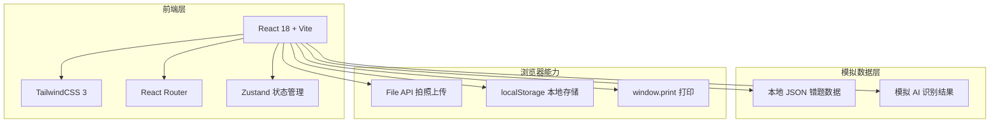
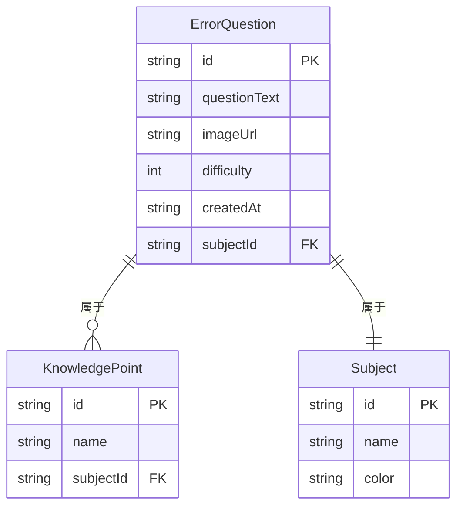

## 1. 架构设计



## 2. 技术说明
- **前端框架**:React@18 + Vite@5
- **样式方案**:TailwindCSS@3 + 自定义 CSS 变量
- **路由**:React Router@6
- **状态管理**:Zustand(轻量,适合本工具规模)
- **初始化工具**:vite-init (react-ts 模板)
- **后端**:无(Demo 阶段使用 Mock 数据 + localStorage 持久化)
- **数据库**:无,使用 localStorage 模拟错题集存储
- **AI 识别**:Demo 阶段使用模拟数据 + 延时动画模拟识别过程

## 3. 路由定义
| 路由 | 用途 |
|------|------|
| `/` | 首页:产品介绍与快速入口 |
| `/organize` | 拍照整理:上传、AI 识别、归类编辑 |
| `/collection` | 错题集:浏览、筛选、打印预览 |

## 4. API 定义
Demo 阶段无后端 API,使用本地模拟函数:

```typescript
// 模拟 AI 识别接口
interface RecognizeResult {
  questionId: string;
  subject: '数学' | '语文' | '英语' | '物理' | '化学';
  questionText: string;
  knowledgePoints: string[];
  difficulty: 1 | 2 | 3 | 4 | 5;
  imageUrl: string;
  createdAt: string;
}

// 模拟识别函数(延时返回预设结果)
declare function mockRecognize(image: File): Promise<RecognizeResult>;

// 错题集本地存储接口
interface ErrorQuestionStore {
  questions: RecognizeResult[];
  addQuestion: (q: RecognizeResult) => void;
  removeQuestion: (id: string) => void;
  updateQuestion: (id: string, patch: Partial<RecognizeResult>) => void;
  filterBy: (filters: FilterOptions) => RecognizeResult[];
}
```

## 5. 服务端架构
不适用,Demo 阶段为纯前端应用。

## 6. 数据模型

### 6.1 数据模型定义


### 6.2 数据定义语言
Demo 使用 TypeScript 类型 + localStorage JSON,核心数据结构:

```typescript
// localStorage key
const STORAGE_KEY = 'ai_error_questions';

// 初始 Mock 数据(数学/物理等学科示例错题)
const initialMockQuestions: RecognizeResult[] = [
  {
    questionId: 'q_001',
    subject: '数学',
    questionText: '已知函数 f(x) = x² - 2ax + 3,若 f(x) 在 [1,2] 上单调递增,求 a 的取值范围。',
    knowledgePoints: ['二次函数', '单调性'],
    difficulty: 3,
    imageUrl: '/mock/q1.jpg',
    createdAt: '2026-06-20T10:30:00Z',
  },
  // ...更多示例
];
```
