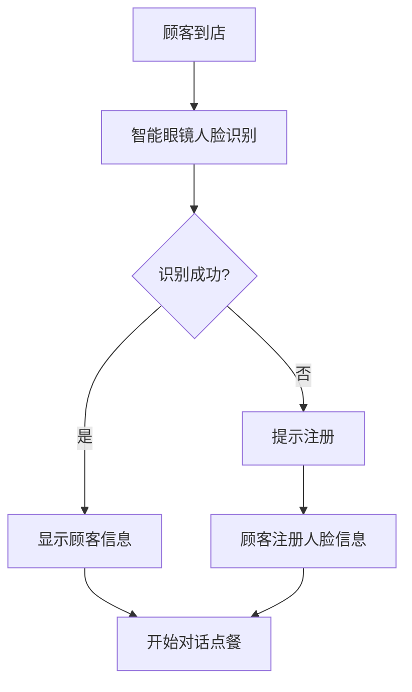
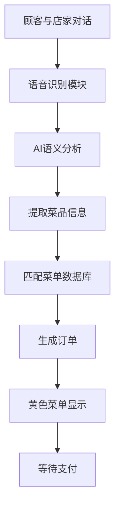
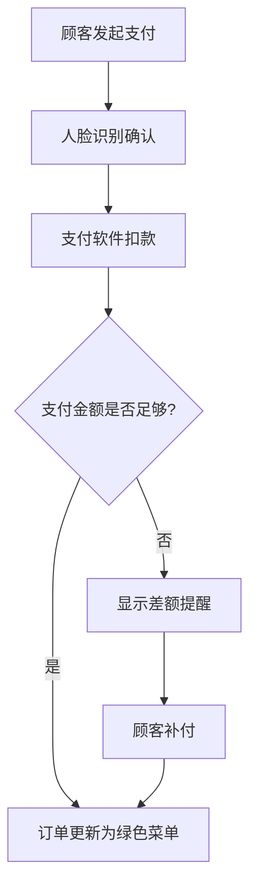

## 1. Product Overview
TRAE AI智能支付解决方案整合支付软件、智能眼镜设备及语音识别技术，打造智能化餐饮消费体验。系统通过人脸识别精准识别顾客，实时分析对话自动生成订单，提供高效安全的支付流程。

## 2. Core Features

### 2.1 User Roles
| Role | Registration Method | Core Permissions |
|------|---------------------|------------------|
| 店家/员工 | Email注册登录 | 管理菜单、查看订单、处理支付 |
| 顾客 | 人脸识别注册 | 点餐消费、完成支付 |

### 2.2 Feature Module
1. **店家管理后台**: 商品管理、订单监控、销售统计、系统设置
2. **智能眼镜AR界面**: 人脸识别、实时订单显示、语音交互
3. **语音订单系统**: 对话捕捉、AI分析、自动下单
4. **支付系统**: 人脸识别支付、账单核对、金额提醒

### 2.3 Page Details
| Page Name | Module Name | Feature description |
|-----------|-------------|---------------------|
| 登录页 | 身份认证 | 店家账号登录，支持邮箱密码验证 |
| 首页 | 数据概览 | 今日订单数、销售额、待支付订单提醒 |
| 商品管理 | 菜单配置 | 添加/编辑/删除菜品，设置名称、价格、口味选项 |
| 订单管理 | 订单监控 | 实时显示订单状态，黄色菜单(未支付)、绿色菜单(已支付) |
| AR界面 | 智能眼镜模拟 | 人脸识别顾客、语音识别对话、实时订单叠加显示 |
| 销售统计 | 数据报表 | 销售趋势、热门菜品、营收分析 |

## 3. Core Process

### 3.1 顾客到店流程

### 3.2 语音下单流程

### 3.3 支付流程

## 4. User Interface Design

### 4.1 Design Style
- **主色调**: 科技蓝(#0066FF)、活力绿(#00CC66)、警示黄(#FFCC00)
- **辅助色**: 深灰(#333333)、浅灰(#F5F5F5)、白色(#FFFFFF)
- **按钮风格**: 圆角矩形(8px)，渐变背景，悬停阴影效果
- **字体**: 标题使用Inter Bold，正文使用Inter Regular
- **布局风格**: 现代卡片式设计，左侧导航栏，右侧内容区
- **图标**: 使用lucide-react图标库，简约线条风格

### 4.2 Page Design Overview
| Page Name | Module Name | UI Elements |
|-----------|-------------|-------------|
| 登录页 | 登录表单 | 渐变背景、居中卡片、输入框带图标、圆角按钮 |
| 首页 | 数据卡片 | 统计卡片带数值动画、待支付订单列表、快捷操作按钮 |
| 商品管理 | 商品列表 | 卡片网格布局、悬浮操作按钮、模态框编辑 |
| 订单管理 | 订单列表 | 颜色状态标签(黄色/绿色)、订单详情展开、支付操作 |
| AR界面 | 模拟视图 | 摄像头画面背景、半透明信息面板、实时语音文字叠加 |

### 4.3 Responsiveness
- **Desktop-first**: 1200px+，完整功能展示
- **平板适配**: 768-1199px，响应式布局调整
- **移动适配**: <768px，侧边栏转为底部导航，内容单列显示

### 4.4 核心交互设计
- **黄色菜单**: 订单卡片黄色边框，脉冲动画提示待支付
- **绿色菜单**: 订单卡片绿色边框，勾选图标标识已完成
- **金额不足提醒**: 红色闪烁提示，显示差额金额，提供补付按钮
- **语音识别动画**: 波形动画显示正在监听，识别完成后文字显示

## 5. Technical Requirements

### 5.1 人脸识别
- 使用face-api.js实现面部检测和识别
- 支持顾客人脸特征录入和存储
- 实时比对识别，准确率≥95%

### 5.2 语音识别
- 使用Web Speech API进行中文语音识别
- 支持自然语言处理提取菜品名称和数量
- 模糊匹配算法匹配商品库

### 5.3 订单状态
- 未支付: 黄色菜单状态，等待顾客支付
- 已支付: 绿色菜单状态，订单完成
- 支付不足: 红色提醒，显示差额

### 5.4 安全性
- JWT身份认证
- 密码bcrypt加密
- 人脸识别数据加密存储
- 支付接口HTTPS传输