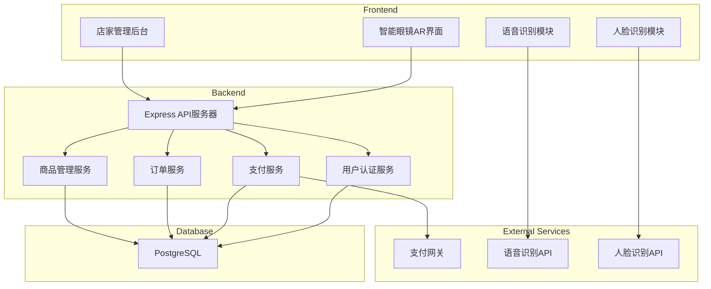
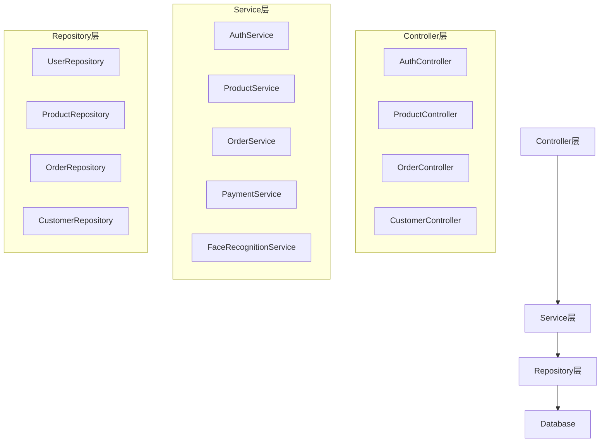

## 1. Architecture Design



## 2. Technology Description
- **Frontend**: React@18 + TypeScript + TailwindCSS@3 + Vite
- **Initialization Tool**: vite-init
- **Backend**: Express@4 + TypeScript
- **Database**: PostgreSQL
- **State Management**: Zustand
- **Icons**: lucide-react
- **AR Simulation**: CSS-based overlay with WebRTC camera feed

## 3. Route Definitions

| Route | Purpose |
|-------|---------|
| / | 店家管理后台首页 |
| /products | 商品管理页面 |
| /orders | 订单管理页面 |
| /stats | 销售统计页面 |
| /settings | 系统设置页面 |
| /ar | 智能眼镜AR模拟界面 |

## 4. API Definitions

### 4.1 Authentication APIs

#### POST /api/auth/login
- **Request**: `{ email: string, password: string }`
- **Response**: `{ token: string, user: User }`

#### POST /api/auth/register
- **Request**: `{ email: string, password: string, name: string }`
- **Response**: `{ user: User }`

### 4.2 Product APIs

#### GET /api/products
- **Response**: `{ products: Product[] }`

#### POST /api/products
- **Request**: `{ name: string, price: number, category: string, description: string }`
- **Response**: `{ product: Product }`

#### PUT /api/products/:id
- **Request**: `{ name?: string, price?: number, category?: string, description?: string }`
- **Response**: `{ product: Product }`

#### DELETE /api/products/:id
- **Response**: `{ success: boolean }`

### 4.3 Order APIs

#### GET /api/orders
- **Response**: `{ orders: Order[] }`

#### POST /api/orders
- **Request**: `{ customerId: string, items: OrderItem[], totalAmount: number }`
- **Response**: `{ order: Order }`

#### PUT /api/orders/:id/pay
- **Response**: `{ order: Order }`

### 4.4 Customer APIs

#### GET /api/customers
- **Response**: `{ customers: Customer[] }`

#### POST /api/customers
- **Request**: `{ name: string, faceEncoding: string }`
- **Response**: `{ customer: Customer }`

## 5. Server Architecture Diagram



## 6. Data Model

### 6.1 Data Model Definition

```mermaid
erDiagram
    USER ||--o{ ORDER : creates
    CUSTOMER ||--o{ ORDER : places
    ORDER ||--|{ ORDER_ITEM : contains
    PRODUCT ||--o{ ORDER_ITEM : includes
    
    USER {
        id UUID PK
        email VARCHAR unique
        password_hash VARCHAR
        name VARCHAR
        role VARCHAR
        created_at TIMESTAMP
        updated_at TIMESTAMP
    }
    
    CUSTOMER {
        id UUID PK
        name VARCHAR
        face_encoding TEXT
        phone VARCHAR
        created_at TIMESTAMP
    }
    
    PRODUCT {
        id UUID PK
        name VARCHAR
        price DECIMAL
        category VARCHAR
        description TEXT
        image_url VARCHAR
        created_at TIMESTAMP
        updated_at TIMESTAMP
    }
    
    ORDER {
        id UUID PK
        user_id UUID FK
        customer_id UUID FK
        total_amount DECIMAL
        status VARCHAR
        payment_method VARCHAR
        created_at TIMESTAMP
        paid_at TIMESTAMP
    }
    
    ORDER_ITEM {
        id UUID PK
        order_id UUID FK
        product_id UUID FK
        quantity INT
        price DECIMAL
    }
```

### 6.2 Data Definition Language

```sql
CREATE TABLE users (
    id UUID PRIMARY KEY DEFAULT uuid_generate_v4(),
    email VARCHAR(255) UNIQUE NOT NULL,
    password_hash VARCHAR(255) NOT NULL,
    name VARCHAR(100) NOT NULL,
    role VARCHAR(20) DEFAULT 'staff',
    created_at TIMESTAMP DEFAULT CURRENT_TIMESTAMP,
    updated_at TIMESTAMP DEFAULT CURRENT_TIMESTAMP
);

CREATE TABLE customers (
    id UUID PRIMARY KEY DEFAULT uuid_generate_v4(),
    name VARCHAR(100) NOT NULL,
    face_encoding TEXT,
    phone VARCHAR(20),
    created_at TIMESTAMP DEFAULT CURRENT_TIMESTAMP
);

CREATE TABLE products (
    id UUID PRIMARY KEY DEFAULT uuid_generate_v4(),
    name VARCHAR(100) NOT NULL,
    price DECIMAL(10, 2) NOT NULL,
    category VARCHAR(50),
    description TEXT,
    image_url VARCHAR(500),
    created_at TIMESTAMP DEFAULT CURRENT_TIMESTAMP,
    updated_at TIMESTAMP DEFAULT CURRENT_TIMESTAMP
);

CREATE TABLE orders (
    id UUID PRIMARY KEY DEFAULT uuid_generate_v4(),
    user_id UUID REFERENCES users(id),
    customer_id UUID REFERENCES customers(id),
    total_amount DECIMAL(10, 2) NOT NULL,
    status VARCHAR(20) DEFAULT 'pending',
    payment_method VARCHAR(50),
    created_at TIMESTAMP DEFAULT CURRENT_TIMESTAMP,
    paid_at TIMESTAMP
);

CREATE TABLE order_items (
    id UUID PRIMARY KEY DEFAULT uuid_generate_v4(),
    order_id UUID REFERENCES orders(id),
    product_id UUID REFERENCES products(id),
    quantity INT NOT NULL DEFAULT 1,
    price DECIMAL(10, 2) NOT NULL
);

CREATE INDEX idx_orders_user_id ON orders(user_id);
CREATE INDEX idx_orders_customer_id ON orders(customer_id);
CREATE INDEX idx_orders_status ON orders(status);
CREATE INDEX idx_order_items_order_id ON order_items(order_id);
CREATE INDEX idx_order_items_product_id ON order_items(product_id);
```

## 7. 核心技术实现

### 7.1 语音订单提取
- 使用Web Speech API进行语音识别
- 自然语言处理提取商品名称和数量
- 模糊匹配算法匹配商品库
- 支持中文语音识别

### 7.2 人脸识别支付
- 使用face-api.js进行面部检测和识别
- 存储顾客面部特征编码
- 实时比对识别顾客身份
- 模拟支付流程

### 7.3 AR界面渲染
- 使用CSS定位实现虚拟信息叠加
- 半透明背景和圆角设计
- 颜色状态切换动画（黄色绿色）
- 响应式布局适配不同屏幕

### 7.4 数据同步
- 使用RESTful API进行数据交互
- WebSocket实现实时订单更新
- 本地缓存优化加载速度

## 8. 安全性考虑

- 使用JWT进行身份认证
- 密码使用bcrypt加密存储
- API请求进行参数验证
- 支付接口使用HTTPS
- 人脸识别数据加密存储
