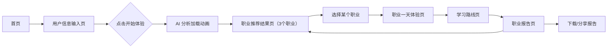

# AI 未来职业体验馆 - 产品需求文档（PRD）

## 1. 产品概述

《AI 未来职业体验馆》是一款面向学生与年轻人的未来职业探索 Web 应用，通过模拟 AI 推荐引擎，根据用户兴趣、性格、擅长科目、讨厌的工作类型与未来期待，生成 3 个个性化未来职业推荐，并提供"职业一天模拟"、学习路线、入门项目、风险提醒，最终输出一份可分享的《未来职业体验报告》。
- 解决问题：年轻人对未来职业方向迷茫，传统职业测评枯燥、缺乏沉浸感与未来感。
- 目标用户：高中生、大学生、初入职场年轻人、教育工作者。
- 市场价值：可作为教育展会、招生宣传、生涯规划课堂的互动展示工具，亦是 TRAE AI 创造力大赛的参赛作品。

## 2. 核心功能

### 2.1 用户角色
| 角色 | 注册方式 | 核心权限 |
|------|---------|---------|
| 访客 | 无需注册 | 全流程体验：输入信息 → 推荐职业 → 一天体验 → 学习路线 → 报告 |

### 2.2 功能模块
1. **首页**：未来感 Hero 区、产品价值主张、CTA 入口、特性亮点
2. **用户信息输入页**：兴趣 / 性格 / 擅长科目 / 讨厌的工作类型 / 未来期待 五维输入
3. **职业推荐结果页**：基于输入生成 3 个推荐职业卡片，含推荐理由
4. **职业一天体验页**：选定职业后展示"职业一天"时间线模拟
5. **学习路线页**：分阶段学习路线 + 所需能力 + 入门项目 + 风险提醒
6. **职业报告页**：汇总生成《未来职业体验报告》，可下载/分享

### 2.3 页面详情
| 页面名称 | 模块名称 | 功能描述 |
|---------|---------|---------|
| 首页 | Hero 区 | 全屏未来感视觉、动态粒子/网格背景、主标题 + 副标题 + CTA |
| 首页 | 特性卡片区 | 三张特性卡片：智能推荐 / 沉浸体验 / 个性报告 |
| 首页 | 流程指引区 | 4 步流程图：输入 → 推荐 → 体验 → 报告 |
| 用户信息输入页 | 兴趣标签选择 | 多选标签：科技、艺术、商业、自然、人文、运动等 |
| 用户信息输入页 | 性格自评滑块 | 5 个维度滑块：理性-感性、内向-外向、稳定-冒险等 |
| 用户信息输入页 | 擅长科目选择 | 多选：数学、物理、生物、语文、英语、计算机等 |
| 用户信息输入页 | 讨厌工作类型 | 多选：重复劳动、户外作业、人际应酬、数据报表等 |
| 用户信息输入页 | 未来期待输入 | 文本输入：希望的工作状态、薪资期待、生活方式 |
| 用户信息输入页 | 开始体验按钮 | 触发"AI 分析中"加载动画，跳转结果页 |
| 职业推荐结果页 | 推荐总览 | 显示用户画像摘要 + 3 个职业卡片 |
| 职业推荐结果页 | 职业卡片 | 职业名、匹配度、推荐理由、标签、进入详情按钮 |
| 职业一天体验页 | 时间线模拟 | 08:00-22:00 一天时间线，含场景描述与情绪曲线 |
| 职业一天体验页 | 沉浸式场景 | 每个时段卡片化展示，含图标与氛围色 |
| 学习路线页 | 能力雷达 | 所需能力雷达图 |
| 学习路线页 | 学习路线图 | 4 阶段路线：入门 → 进阶 → 实战 → 精通 |
| 学习路线页 | 入门项目 | 推荐入门项目卡片 |
| 学习路线页 | 风险提醒 | 职业风险列表 + 应对建议 |
| 职业报告页 | 报告封面 | 报告标题、生成日期、用户画像 |
| 职业报告页 | 推荐职业汇总 | 3 个职业概览 |
| 职业报告页 | 体验总结 | 用户画像分析、推荐逻辑说明 |
| 职业报告页 | 行动建议 | 短期/中期/长期行动建议 |
| 职业报告页 | 下载/分享 | 打印为 PDF / 复制分享链接 |

## 3. 核心流程

用户从首页进入 → 填写五维信息 → 点击"开始体验"触发模拟 AI 分析（加载动画 2-3 秒）→ 生成 3 个推荐职业 → 用户点击某个职业进入"一天体验" → 查看学习路线 → 生成最终报告 → 可下载/分享。

## 4. 用户界面设计

### 4.1 设计风格
- **美学方向**：复古未来主义（Retro-Futurism）+ 赛博朋克轻量版。深空背景 + 霓虹电光蓝/品红双主色 + 玻璃拟态卡片 + 网格地平线。
- **主色**：深空黑 `#0a0e1a`（背景）、电光青 `#00f0ff`（主强调）、霓虹品红 `#ff2e88`（次强调）、琥珀金 `#ffb800`（点缀）
- **辅助色**：雾灰 `#8b95a7`（次要文字）、玻璃白 `rgba(255,255,255,0.06)`（卡片底）
- **按钮风格**：霓虹边框 + 内发光 + hover 时光晕扩散，圆角 8px
- **字体**：
  - 显示字体：`Orbitron`（未来感几何字体，用于标题与数据）
  - 正文字体：`Sora`（现代几何无衬线，清晰耐读）
  - 等宽字体：`JetBrains Mono`（用于时间线、代码、数据标签）
- **布局**：桌面优先，最大宽度 1280px 居中，卡片网格 + 时间线纵向流
- **图标**：使用 `lucide-react` 线性图标，与未来感契合
- **动效**：粒子背景、网格扫描线、卡片入场 stagger、悬停光晕、加载扫描动画

### 4.2 页面设计概览
| 页面名称 | 模块名称 | UI 元素 |
|---------|---------|---------|
| 首页 | Hero 区 | 全屏深空背景 + 网格地平线 + 粒子 + 大标题 Orbitron + 副标题 Sora + 霓虹 CTA 按钮 |
| 首页 | 特性卡片区 | 3 张玻璃拟态卡片，hover 时光晕扩散 + 图标放大 |
| 首页 | 流程指引区 | 4 步横向时间线，霓虹连接线 + 序号徽章 |
| 输入页 | 标签选择区 | 多选标签胶囊，选中时霓虹边框 + 内发光 |
| 输入页 | 滑块区 | 自定义霓虹滑块，实时显示数值标签 |
| 输入页 | 文本输入区 | 玻璃拟态输入框，聚焦时霓虹边框 |
| 输入页 | CTA 区 | 大型霓虹按钮 + 加载扫描动画 |
| 结果页 | 用户画像卡 | 顶部摘要卡，显示五维输入可视化 |
| 结果页 | 职业卡片 | 玻璃卡 + 匹配度环形进度 + 标签 + 推荐理由 |
| 一天体验页 | 时间线 | 纵向时间线 + 时段卡片 + 情绪曲线 SVG |
| 学习路线页 | 雷达图 | SVG 雷达图，霓虹描边 |
| 学习路线页 | 路线图 | 4 阶段卡片 + 连接线 + 进度点 |
| 报告页 | 报告封面 | 大标题 + 日期戳 + 装饰边框 |
| 报告页 | 总结区 | 分栏布局 + 数据可视化 |

### 4.3 响应式
- 桌面优先（≥1024px）：完整布局，多列网格
- 平板（768-1023px）：单列卡片，时间线保持纵向
- 移动（<768px）：单列流式，导航折叠为汉堡菜单，按钮全宽

### 4.4 3D 场景指引
本项目不使用 3D 场景，采用 CSS 3D 变换 + SVG + Canvas 粒子实现未来感视觉效果，保证性能与兼容性。
