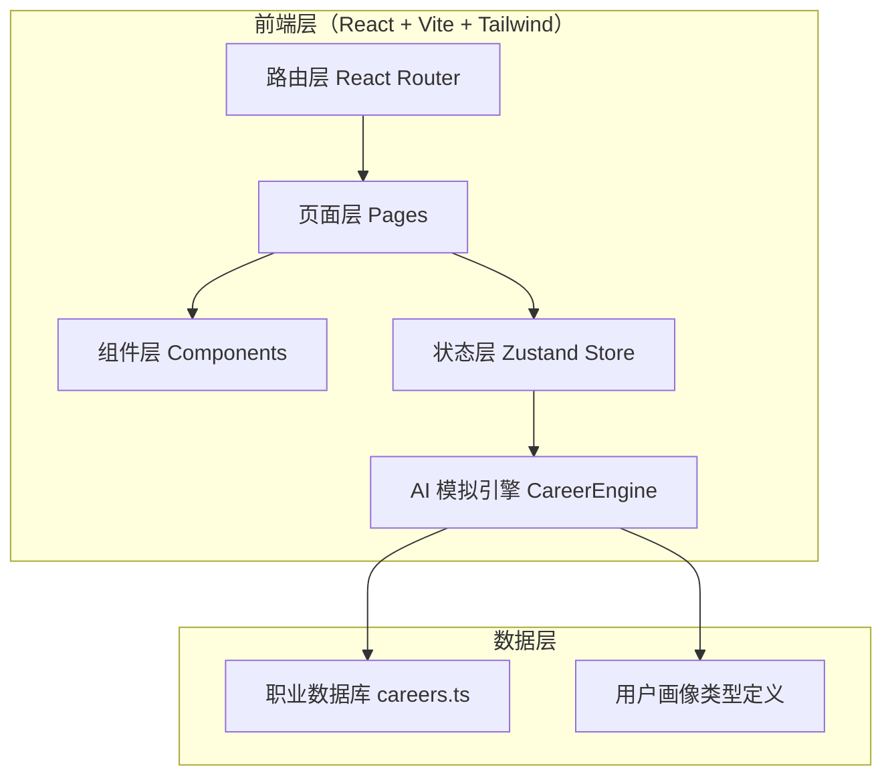

# AI 未来职业体验馆 - 技术架构文档

## 1. 架构设计



纯前端架构，无后端服务。AI 推荐通过本地 `CareerEngine` 模块基于关键词匹配 + 权重评分算法模拟实现。

## 2. 技术说明

- **前端**：React@18 + TypeScript + tailwindcss@3 + vite
- **路由**：react-router-dom@6
- **状态管理**：zustand
- **图标**：lucide-react
- **初始化工具**：vite-init（react-ts 模板）
- **后端**：无（前端模拟 AI 生成结果）
- **数据存储**：localStorage 持久化用户输入与报告

## 3. 路由定义

| 路由 | 用途 |
|------|------|
| `/` | 首页：Hero 区 + 特性 + 流程指引 |
| `/input` | 用户信息输入页：五维信息采集 |
| `/results` | 职业推荐结果页：3 个推荐职业 |
| `/experience/:careerId` | 职业一天体验页：时间线模拟 |
| `/roadmap/:careerId` | 学习路线页：能力 + 路线 + 项目 + 风险 |
| `/report` | 职业报告页：汇总报告 |

## 4. 数据模型

### 4.1 用户画像

```typescript
interface UserProfile {
  interests: string[];        // 兴趣标签
  personality: {              // 性格维度 0-100
    rational: number;         // 理性-感性
    introvert: number;        // 内向-外向
    stable: number;           // 稳定-冒险
    creative: number;         // 务实-创造
    collaborative: number;    // 独立-协作
  };
  strongSubjects: string[];   // 擅长科目
  dislikedWork: string[];     // 讨厌的工作类型
  futureExpectation: string;  // 未来期待文本
}
```

### 4.2 职业数据模型

```typescript
interface Career {
  id: string;
  name: string;               // 职业名称
  enName: string;             // 英文名
  icon: string;               // lucide 图标名
  tagline: string;            // 一句话标语
  tags: string[];             // 标签
  matchWeights: {             // 匹配权重（用于评分）
    interests: Record<string, number>;
    subjects: Record<string, number>;
    personality: Record<string, number>;
    avoidDislike: string[];   // 该职业会触发哪些讨厌项
  };
  reason: string;             // 推荐理由模板
  abilities: { name: string; level: number }[];  // 所需能力 + 雷达值
  dayTimeline: {              // 一天时间线
    time: string;
    title: string;
    desc: string;
    mood: number;             // 情绪值 0-100
    icon: string;
  }[];
  roadmap: {                  // 学习路线
    stage: string;
    title: string;
    duration: string;
    items: string[];
  }[];
  starterProject: {           // 入门项目
    name: string;
    desc: string;
    steps: string[];
  };
  risks: { title: string; desc: string; mitigation: string }[];  // 风险提醒
  accentColor: string;        // 职业主色调
}
```

### 4.3 推荐报告

```typescript
interface CareerReport {
  userProfile: UserProfile;
  recommendedCareers: { career: Career; matchScore: number; reason: string }[];
  selectedCareerId: string;
  generatedAt: string;
  actionPlan: { short: string[]; mid: string[]; long: string[] };
}
```

## 5. AI 模拟推荐引擎算法

`CareerEngine.match(userProfile, careers)` 流程：
1. **兴趣匹配**（权重 30%）：用户兴趣标签与职业 `matchWeights.interests` 命中得分
2. **科目匹配**（权重 25%）：擅长科目与 `matchWeights.subjects` 命中得分
3. **性格匹配**（权重 25%）：五维性格与 `matchWeights.personality` 的欧氏距离归一化
4. **讨厌项惩罚**（权重 20%）：若职业触发用户讨厌项，扣分
5. **综合排序**：取 Top 3，匹配度 = 综合分 × 100，保留 1 位小数

## 6. 项目目录结构

```
src/
├── components/           # 通用组件
│   ├── Layout.tsx        # 布局壳
│   ├── NeonButton.tsx    # 霓虹按钮
│   ├── ParticleBackground.tsx  # 粒子背景
│   ├── GridHorizon.tsx   # 网格地平线
│   └── CareerCard.tsx    # 职业卡片
├── pages/                # 页面
│   ├── Home.tsx
│   ├── Input.tsx
│   ├── Results.tsx
│   ├── Experience.tsx
│   ├── Roadmap.tsx
│   └── Report.tsx
├── store/                # zustand 状态
│   └── useAppStore.ts
├── data/                 # 数据
│   └── careers.ts        # 职业数据库（10+ 职业）
├── engine/               # AI 模拟引擎
│   └── careerEngine.ts
├── types/                # 类型定义
│   └── index.ts
├── utils/                # 工具函数
└── App.tsx               # 路由配置
```
