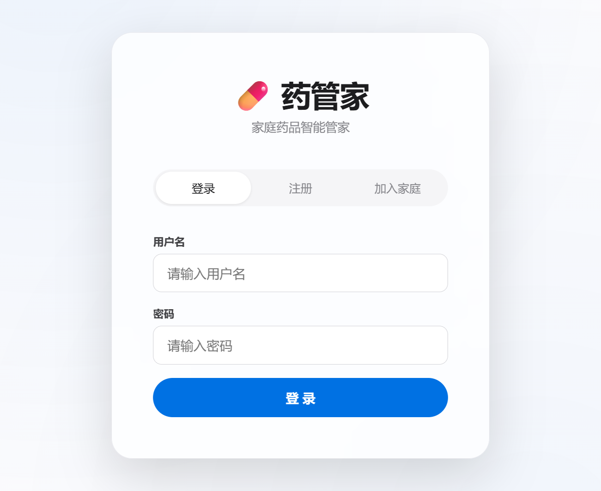
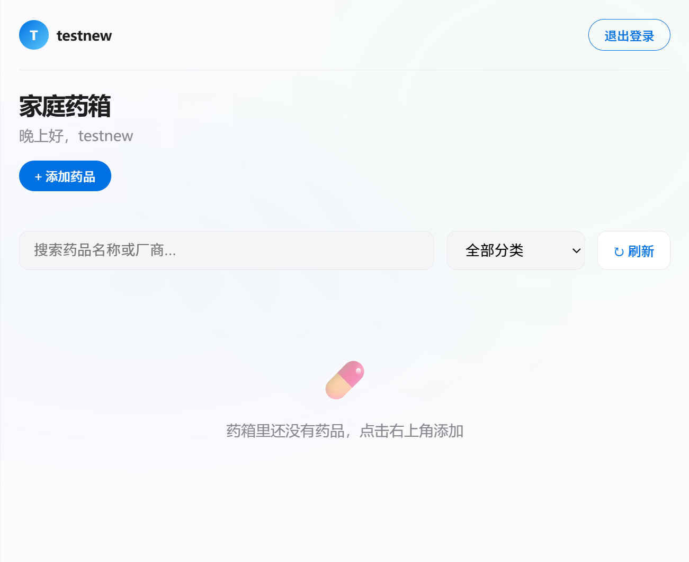
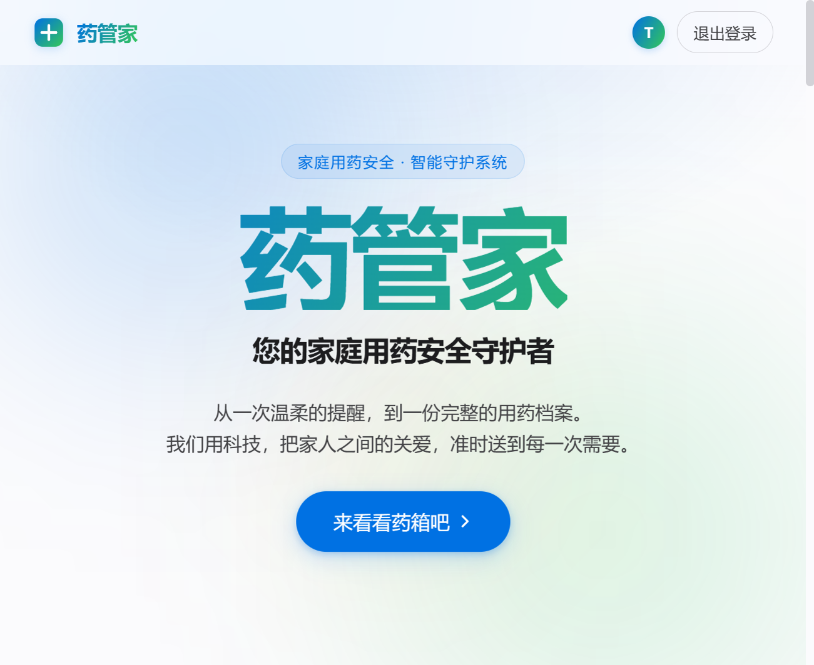
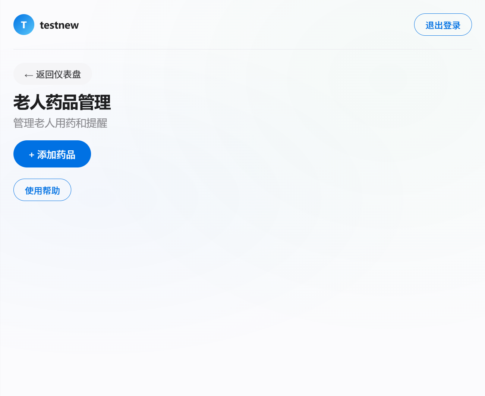
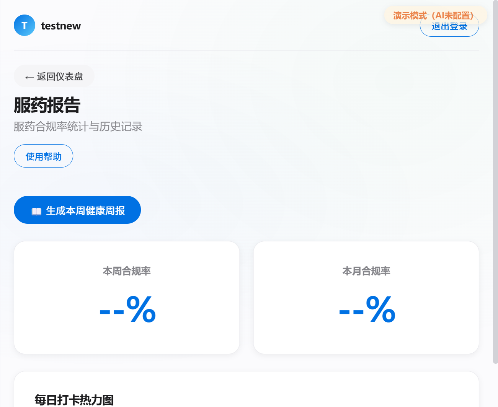

## 【标签】社会服务 / 社会公益

## 【标题】【社会服务赛道】药管家 —— 家庭用药安全智能守护系统

---

### 【正文】

#### 0. 先和大家打个招呼吧 👋

**你是谁：** 一名关注老年人健康的独立开发者，希望用技术为家庭带来更多温暖与安全。

**你是怎么用 TRAE 把 Demo 做出来的：**

从一个想法到完整的系统，TRAE 帮我实现了质的飞跃。一开始我只是想做一个简单的药品管理工具，但在和 TRAE 的对话中，它一步步引导我思考更完整的解决方案。

让我印象最深的是**老人用药监控功能**的实现——原本我觉得视频存档和强制置顶通知很难实现，但 TRAE 帮我设计了完整的后端 API 和前端交互，甚至考虑了老年人的操作习惯。还有**药品冲突检测**功能，TRAE 帮我搭建了 AI 服务框架，让原本复杂的药物相互作用分析变得可行。

最让我惊喜的是**家庭多成员协同**功能，通过邀请码机制实现全家共享药箱，这个方案是 TRAE 在讨论中提出的，完美解决了家庭成员异地管理的痛点。

---

#### 1. Demo 简介

**是什么：** 一款基于 Web 的家庭用药安全智能管理系统，专为老年人设计，强调与老人的交互与关心。

**面向谁：**
- **老年人**（核心用户）：需要简单易用的服药提醒和健康管理工具
- **子女/照护者**：远程关注父母用药情况，及时了解健康状态
- **家庭成员**：共同管理家庭药箱，避免过期药品风险

**主要功能：**

##### 👵 老人专属界面
专为老年人优化的简化界面，大字体、大按钮设计，支持视频/语音/文字三种提问方式



##### 💊 服药提醒与打卡
精准到分钟的服药提醒，支持强制置顶通知，未服药自动预警并通知家属


##### 📊 服药报告与健康统计
服药合规率统计、历史记录查询、AI 健康周报生成



##### 🏠 家庭药箱管理
药品录入、过期预警、库存监控、家庭成员协同管理



##### 🔍 药品安全检测
AI 药物相互作用检测、处方冲突识别、智能用药建议



##### 💬 语音明信片
子女可以给老人发送语音问候，让关爱跨越距离



---

#### 2. Demo 创作思路

**灵感来源：**

在一次家庭整理中，我发现父母家中竟有超过半数药品已过期，而他们完全不知情。老人视力下降看不清保质期，也没有定期检查的习惯。更让我担忧的是，父母独自在家时，我无法知道他们是否按时服药。

这让我意识到：家庭需要一个"智能药品管家"，不仅管理药品，更要守护老人。

**想解决的问题：**

1. **用药不规律**：老年人容易忘记服药或重复服药，子女无法及时知晓
2. **过期药品风险**：约78%的家庭药箱中存有过期药品，误服风险高
3. **沟通不便**：老人不会使用复杂的通讯工具，与子女沟通用药问题困难
4. **异地牵挂**：子女在外工作，无法实时了解父母的健康状况

**为什么做这个方向：**

选择"社会服务"赛道，是因为我相信科技应该服务于人。在老龄化社会背景下，老年人的用药安全问题日益突出。

药管家不仅仅是一个药品管理工具，更是**子女对父母关爱的延伸**：
- 每一次用药提醒，都传递着家人的牵挂
- 每一条视频回复，都拉近着彼此的距离
- 每一份健康报告，都让守护更有温度

相比市场上其他药品管理 App，药管家的差异化在于：
- **专为老年人优化**：大字体、大按钮、语音播报，降低使用门槛
- **家庭协同设计**：多角色权限、邀请码机制、实时状态同步
- **情感关怀设计**：语音明信片、视频提问、温暖的问候语

---

#### 3. Demo 体验地址

**部署体验链接：** http://127.0.0.1:5000

**测试账号：**
- 管理员：`testnew` / `123`（完整权限，可管理老人用药、发送语音明信片）
- 普通成员：`applytest` / `123`（家庭药箱管理权限）
- 老人账号：`_test_elderly` / `123`（专属简化界面，支持视频提问）

---

#### 4. TRAE 实践过程

**完整开发流程：**

1. **需求分析与架构设计**（约 2 小时）
   - 和 TRAE 讨论核心功能需求，重点强调对老人的关注与陪伴
   - 设计三角色系统架构：管理员、普通成员、老人
   - 规划数据库表结构（用户、家庭、药品、服药记录、问题问答等）

2. **后端 API 开发**（约 3 小时）
   - 用户认证系统（登录、注册、角色权限）
   - 药品 CRUD 接口
   - 家庭邀请码机制
   - SSE 实时推送（服药提醒、库存同步）
   - AI 药物相互作用检测服务
   - 视频/语音提问与回复系统

3. **前端界面实现**（约 4 小时）
   - 苹果风格登录页设计
   - 老人专属简化界面（大字体、大按钮、语音播报）
   - 管理员仪表盘（药品卡片、老人管理、服药报告）
   - 产品展示页（landing page）
   - 响应式适配移动端

4. **功能优化与测试**（约 2 小时）
   - 删除按钮逻辑优化
   - 数量调整交互改进
   - 家庭信息页面添加
   - 邀请功能完善
   - 老人界面易用性优化

**开发关键步骤截图：**

📸 **截图1：登录界面** - 简洁优雅的苹果风格登录页，支持登录/注册/加入家庭三种模式


📸 **截图2：产品展示页** - 温暖的产品介绍，展示核心价值主张


📸 **截图3：管理员仪表盘** - 家庭药箱管理，药品卡片网格布局


📸 **截图4：老人药品管理** - 管理员管理老人用药和提醒的界面


📸 **截图5：服药报告** - 服药合规率统计与历史记录


**关键任务对话 Session ID：**

- `6a4db846562e152aca56c4a5` - 药品卡片删除按钮与数量调整交互优化
- `6a4db846562e152aca56c4a5` - 普通成员页面功能完善（保质期、生产日期等字段）
- `6a4db846562e152aca56c4a5` - 家庭信息页面与药品同步功能实现
- `6a4db846562e152aca56c4a5` - 家庭邀请功能开发（邀请码机制、审批流程）

---

#### 5. 对应的报名审核通过的帖子链接

[药管家 - TRAE 创新大赛报名帖](https://forum.trae.cn/t/topic/22549)

---

### ✨ 作品亮点

1. **关爱老人设计**：大字体、语音提醒、强制置顶通知，专为老年人操作习惯优化
2. **多模态交互**：老人支持视频/语音/文字三种提问方式，降低沟通门槛
3. **家庭协同机制**：邀请码让全家共享药箱，异地子女也能远程关注
4. **AI 安全守护**：药物相互作用检测，智能识别处方冲突
5. **情感关怀功能**：语音明信片让子女的关爱跨越距离传递给老人
6. **视频存档追溯**：服药视频自动归档，家人间的关怀被永久珍藏
7. **轻量级部署**：Web 应用无需安装，扫码即用，支持多端访问

---

### 📁 项目结构

```
药安全/
├── backend/
│   ├── app.py              # Flask 主应用
│   ├── ai_service.py       # AI 药物检测服务
│   ├── knowledge_engine.py # 药品知识库
│   ├── drug_interaction_db.py # 药物相互作用数据库
│   └── medicine.db         # SQLite 数据库
├── frontend/
│   ├── index.html          # 管理员仪表盘
│   ├── member.html         # 普通成员界面
│   ├── elderly.html        # 老人专属界面（核心）
│   ├── landing.html        # 产品介绍页
│   ├── login.html          # 登录页
│   ├── css/                # 样式文件
│   └── js/                 # 前端逻辑
├── screenshots/            # 截图文件
└── showcase.html           # 创意方案展示页
```

---

### 💝 设计理念

药管家的核心设计理念是**"用科技传递关爱"**。我们相信，最好的科技产品应该是温暖的——它不仅解决问题，更传递情感。

- **对老人**：让科技变得简单、温暖，让每一次用药都感受到家人的关怀
- **对子女**：让远方的牵挂变得可见、可触，让关爱跨越距离
- **对家庭**：让健康管理成为家人共同的责任，增进彼此的连接

感谢 TRAE 让我能够快速实现这个有温度的项目！每一次对话都是一次成长，每一行代码都是对家人健康的守护 💊❤️

---

**附：关键技术实现参考**

- [app.py](file:///e:/1Study/作品赛/Trae创新大赛/药安全/backend/app.py) - 后端 API 主文件，包含用户认证、药品管理、家庭邀请等核心逻辑
- [elderly.html](file:///e:/1Study/作品赛/Trae创新大赛/药安全/frontend/elderly.html) - 老人专属界面，大字体设计、视频提问、语音播报
- [index.html](file:///e:/1Study/作品赛/Trae创新大赛/药安全/frontend/index.html) - 管理员仪表盘，展示药品卡片和老人管理功能
- [landing.html](file:///e:/1Study/作品赛/Trae创新大赛/药安全/frontend/landing.html) - 产品介绍页，温暖的视觉设计
- [showcase.html](file:///e:/1Study/作品赛/Trae创新大赛/药安全/showcase.html) - 产品创意展示页面