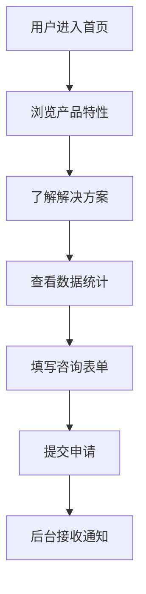

## 1. Product Overview
智能调课小助手是一款面向教育机构和师生的智能排课与调课解决方案，通过AI算法自动分析课程冲突、教师资源和教室安排，实现快速、智能的课程调整。

- **核心目的**: 解决传统排课流程繁琐、调课效率低下、容易出现冲突的痛点
- **目标用户**: 学校教务人员、教师、学生
- **市场价值**: 提升教学管理效率，优化资源配置，减少人为失误

## 2. Core Features

### 2.1 User Roles
| Role | Registration Method | Core Permissions |
|------|---------------------|------------------|
| 教务管理员 | 后台注册 | 完整排课、调课、数据分析权限 |
| 教师 | 邮箱注册 | 查看课表、申请调课 |
| 学生 | 学号注册 | 查看个人课表、接收调课通知 |

### 2.2 Feature Module
1. **首页/Hero**: 产品介绍、核心价值展示、立即体验入口
2. **功能特性**: 智能排课、冲突检测、一键调课、数据可视化
3. **解决方案**: 针对不同场景的解决方案展示
4. **数据统计**: 效率提升数据、用户案例
5. **联系我们**: 咨询表单、联系方式

### 2.3 Page Details
| Page Name | Module Name | Feature description |
|-----------|-------------|---------------------|
| 首页 | Hero Section | 产品主视觉、核心价值主张、行动按钮 |
| 首页 | Features | 四大核心功能卡片，悬停动画效果 |
| 首页 | Solutions | 场景化解决方案展示，可切换标签 |
| 首页 | Statistics | 数据可视化展示，动态数字动画 |
| 首页 | Contact | 咨询表单、公司信息、底部导航 |

## 3. Core Process

## 4. User Interface Design

### 4.1 Design Style
- **主色调**: 科技蓝 (#0066FF) 搭配清新绿 (#00CC99)
- **辅助色**: 深邃紫 (#6633FF)、活力橙 (#FF6600)
- **背景**: 渐变蓝紫背景，现代感十足
- **按钮样式**: 圆角、渐变填充、悬停缩放效果
- **字体**: 标题使用"思源黑体 Bold"，正文使用"思源黑体 Regular"
- **布局**: 卡片式布局，大量留白，视觉层次清晰
- **图标风格**: 线性图标，简洁现代

### 4.2 Page Design Overview
| Page Name | Module Name | UI Elements |
|-----------|-------------|-------------|
| 首页 | Hero Section | 大标题、副标题、渐变背景、漂浮装饰元素、CTA按钮 |
| 首页 | Features | 四列卡片、图标、标题、描述、悬停上浮效果 |
| 首页 | Solutions | 标签切换、场景图片、文字描述、统计数据 |
| 首页 | Statistics | 数字动画、进度条、图标、百分比展示 |
| 首页 | Contact | 表单输入框、提交按钮、公司信息、底部链接 |

### 4.3 Responsiveness
- **桌面端**: 完整多列布局
- **平板端**: 双列布局
- **移动端**: 单列布局，卡片堆叠

### 4.4 动画效果
- 页面加载时元素渐入动画
- 卡片悬停上浮和阴影效果
- 数字递增动画
- 平滑滚动导航
