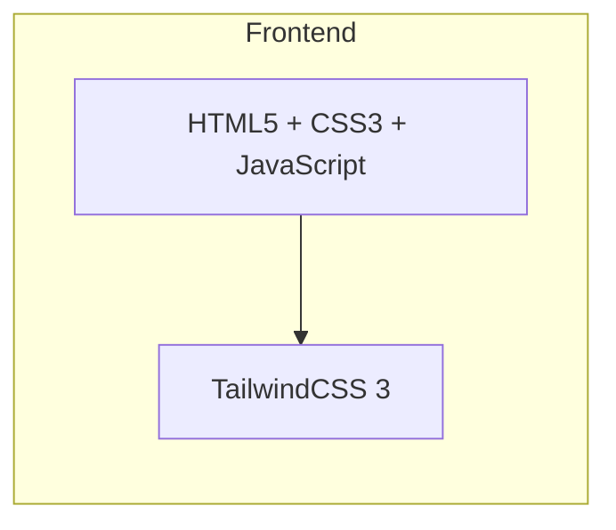

## 1. Architecture Design


## 2. Technology Description
- **Frontend**: 纯HTML + TailwindCSS 3 + JavaScript
- **Initialization Tool**: 无（直接创建HTML文件）
- **Backend**: 无（静态展示页面）
- **Database**: 无

## 3. Route Definitions
| Route | Purpose |
|-------|---------|
| /index.html | 首页，完整创意提案展示 |

## 4. API Definitions
无（纯静态页面，无需后端API）

## 5. Data Model
无（纯静态展示页面，无需数据持久化）

## 6. File Structure
```
Smart Schedule Adjustment Assistant/
├── index.html          # 主页面
├── style.css           # 自定义样式（如需要）
└── script.js           # 交互逻辑（动画、表单等）
```

## 7. Implementation Notes
- 使用TailwindCSS CDN引入样式
- 使用Lucide Icons CDN引入图标
- 所有动画使用CSS实现，JavaScript辅助
- 响应式设计，支持移动端
