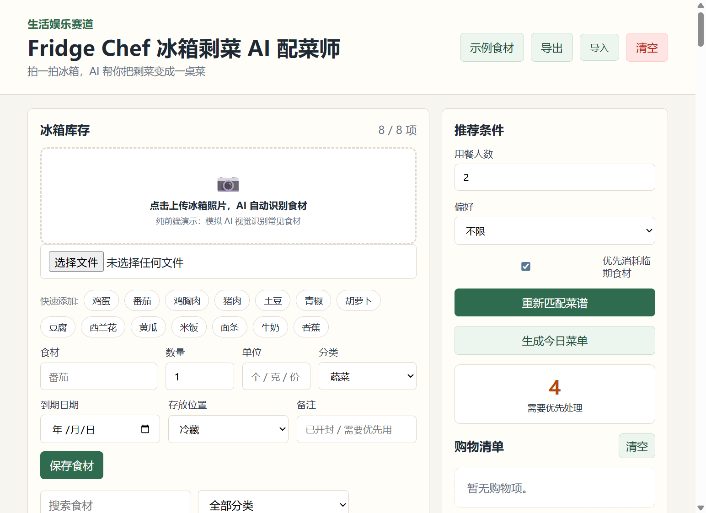
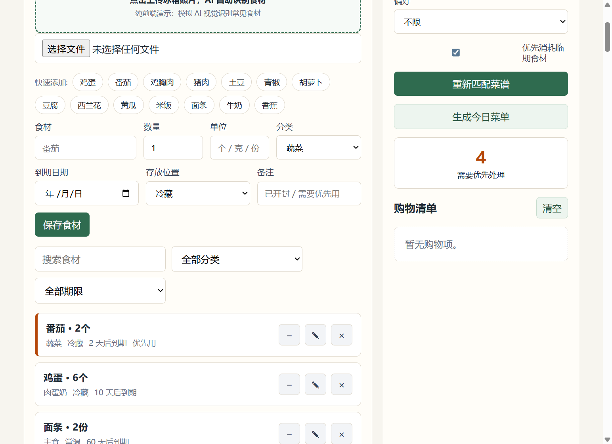
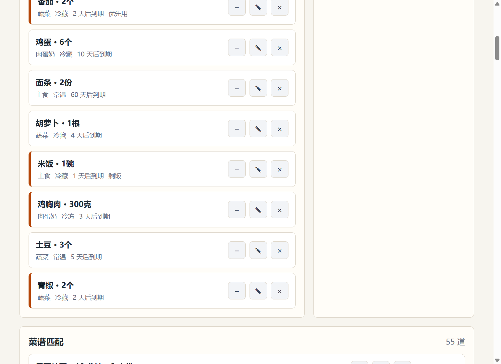
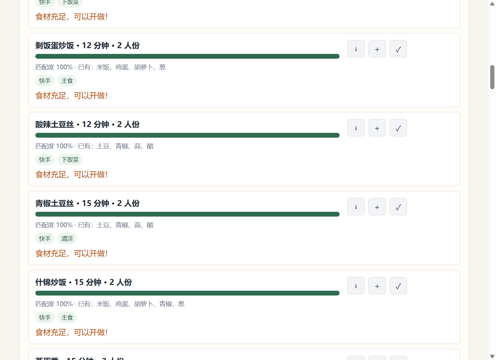

# 〖生活娱乐赛道〗Fridge Chef 冰箱配菜师 Demo

## 一、Demo 简介

Fridge Chef 是一个面向家庭厨房场景的网页 Demo，用来记录冰箱库存、提醒临期食材，并根据现有食材智能匹配可做菜谱。

它主要面向经常做饭但容易忘记冰箱里有什么的人，比如独居青年、家庭主妇/主夫、合租人群和想减少食材浪费的用户。很多人买菜时不知道家里还剩什么，做饭时又发现某些食材快过期了。这个 Demo 想解决的就是“库存看不见、临期不知道、做什么很纠结”的问题。

当前 Demo 已实现的核心功能：

- **冰箱库存管理**：记录食材名称、数量、单位、分类、到期日期、存放位置和备注；
- **AI 拍照识别（前端模拟）**：上传冰箱照片后模拟 AI 视觉识别，一键添加常见食材；
- **临期/过期提醒**：自动标记 3 天内到期和已过期食材；
- **智能菜谱匹配**：内置 55 道家常菜谱，根据库存食材计算匹配度，显示已有食材和缺少食材；
- **常备调料自动忽略**：葱、姜、蒜、生抽、醋、盐、糖、油等默认视为家里有，避免调料拖低匹配度；
- **偏好筛选**：支持快手、清淡、高蛋白、主食、下饭菜等偏好；
- **优先消耗临期食材**：可勾选“优先消耗临期食材”，让临期食材参与匹配加权；
- **今日菜单推荐**：一键生成一桌菜组合（主食 + 配菜），并统计总耗时和总热量；
- **购物清单**：一键把缺少食材按具体用量加入购物清单；
- **做菜后扣库存**：选择“做这道菜”后，按用餐人数自动扣减已使用食材数量；
- **操作反馈 Toast**：做菜、加购后底部出现轻提示；
- **数据导入导出**：支持本地 JSON 数据备份和恢复。

体验方式：

解压后打开 `02-fridge-chef/index.html` 即可运行，无需安装依赖，数据保存在浏览器本地。

## 二、Demo 创作思路

这个创意来自日常生活中的小痛点：冰箱不是没有食材，而是用户经常忘记食材是否还在、什么时候过期、能搭配做什么。结果就是一边重复买菜，一边让剩菜、蔬菜和开封食材过期浪费。

我希望做一个更轻量的“冰箱决策助手”。它不是单纯的菜谱 App，而是从用户已有库存出发，优先回答三个问题：

- 我现在有什么；
- 哪些东西要尽快吃掉；
- 用现有食材能做什么，还缺什么。

初赛阶段我优先做了可交互的库存录入、临期提醒和菜谱匹配闭环，并用前端模拟的方式加入了拍照识别入口。这样可以让评审直接体验从“录入/识别食材”到“匹配菜谱”再到“生成购物清单/扣减库存”的完整过程。

## 三、Demo 体验地址

体验地址 / 附件：

`02-fridge-chef/index.html`（直接双击打开即可运行）

建议体验路径：

1. 点击“示例食材”快速生成冰箱库存，或上传冰箱照片体验 AI 识别；
2. 查看哪些食材属于 3 天内到期；
3. 调整用餐人数和偏好，比如选择“快手”或“清淡”；
4. 点击“重新匹配菜谱”，查看匹配度、已有食材和缺少食材；
5. 对缺少食材点击“加入购物清单”；
6. 点击“做这道菜”，观察库存数量变化；
7. 点击“生成今日菜单”，查看一桌菜组合推荐。

## 四、TRAE 实践过程

这个 Demo 是使用 TRAE 辅助完成的。我的开发过程大致分为 5 步：

1. **场景定义**：让 TRAE 帮我把“冰箱剩菜 AI 配菜师”拆成库存、保质期、菜谱匹配、购物清单、库存扣减几个模块；
2. **页面生成**：让 TRAE 搭建静态页面，包括库存录入表单、筛选器、推荐条件、菜谱列表、购物清单和菜谱详情弹窗；
3. **匹配逻辑实现**：让 TRAE 编写基于食材名称和同义词的匹配算法，计算已有食材、缺少食材和匹配度，并加入临期食材加权；
4. **功能补全**：继续补充示例食材、临期/过期标记、做菜后扣库存、导入导出、本地存储和 AI 拍照识别模拟；
5. **体验优化**：扩充菜谱库到 55 道，加入常备调料忽略逻辑、今日菜单推荐和操作反馈 Toast。

产品效果截图：

- 
- 
- 
- 

关键任务 Session ID：

- Session ID 1：.4206094633680474:b3637a7ed39201838a1515744084516a_6a52ec3e40f84d4e53ea5f1b.6a52ec4e40f84d4e53ea5f1d.6a52ec4e8ccae6a0ef257f9c:Trae CN.T(2026/7/12 09:22:22)
- Session ID 2：.4206094633680474:6b78eef7d6a47d6d3deb877ab7de8898_6a52ec3e40f84d4e53ea5f1b.6a52eec740f84d4e53ea5fac.6a52eec68ccae6a0ef257f9d:Trae CN.T(2026/7/12 09:32:55)
- Session ID 3：.4206094633680474:71b8c7a1c4cc0c3de682b36802a16c95_6a52ec3e40f84d4e53ea5f1b.6a52ef3040f84d4e53ea5fb6.6a52ef308ccae6a0ef257f9e:Trae CN.T(2026/7/12 09:34:40)

## 五、作品边界与后续计划

当前版本是一个离线可运行的前端 Demo，数据保存在浏览器本地。拍照识别为前端模拟，没有接入真实视觉大模型；菜谱库为内置示例数据，未接入线上菜谱库。

如果进入复赛，我计划继续完善：

- 接入真实拍照识别食材和小票识别；
- 扩展菜谱库，并支持口味、过敏原、热量等个性化推荐；
- 增加家庭多人共享库存；
- 接入到期提醒和采购清单同步；
- 输出微信小程序版本，支持扫码、相册和订阅消息。

报名帖链接：

https://forum.trae.cn/t/topic/34646
