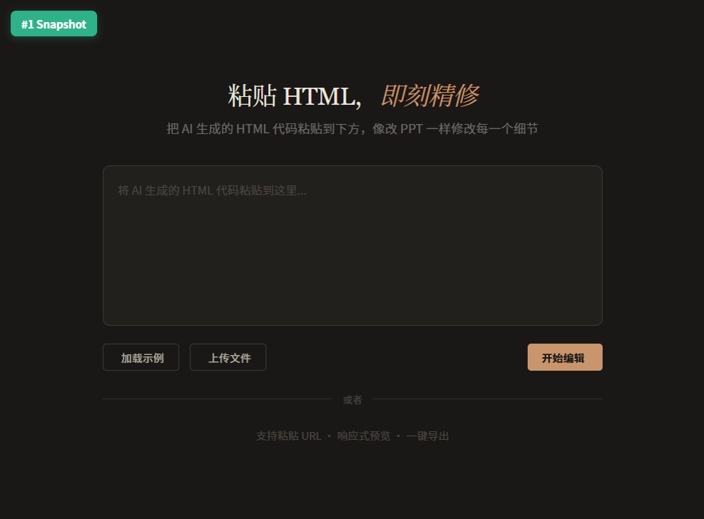
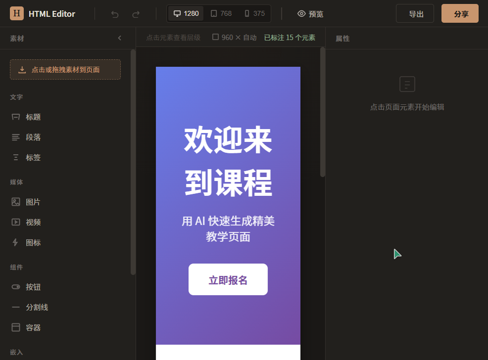
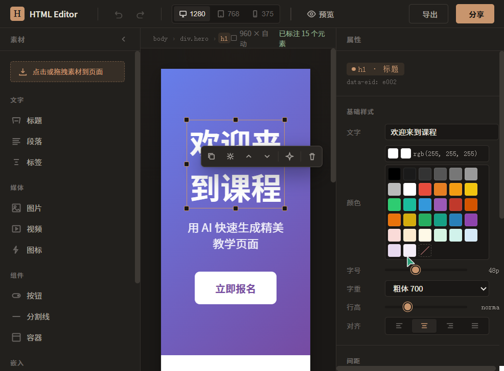
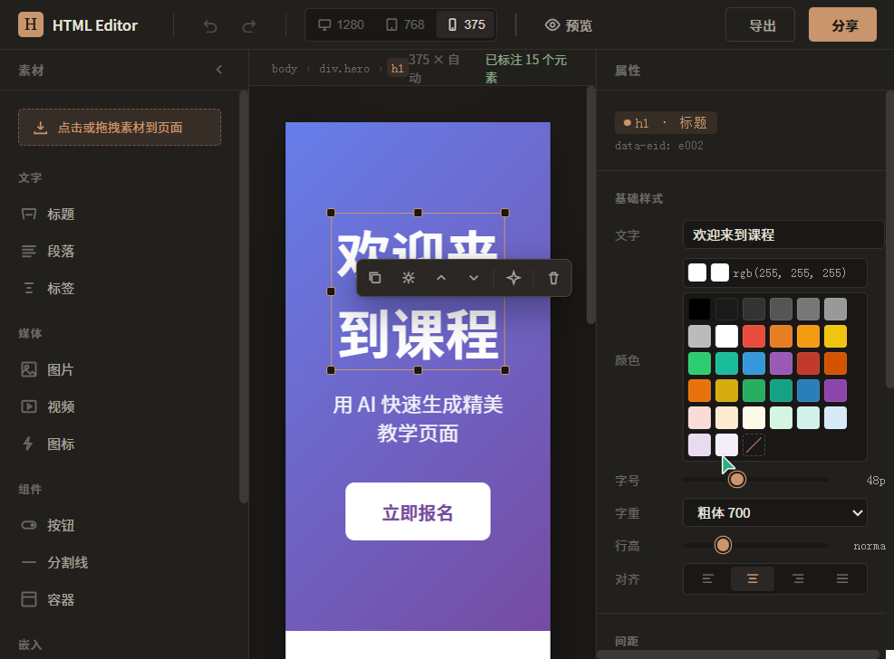

# 【学习工作赛道】HTML 可视化编辑器 — AI 生成 HTML 后的可视化精修器

**标签**：学习工作

---

## 0. 先和大家打个招呼吧 👋

大家好！我是一名产品经理兼工程师，日常工作涉及产品方案设计和技术选型。

说到和 TRAE 配合做这个 Demo 的感受，最大的体会是——**TRAE 不只是帮你写代码，更是帮你把脑子里的想法一步步落地**。我会先和它讨论产品定位（"我想做一个让非技术用户像改 PPT 一样改 HTML 的工具"），然后一起分析竞品、确定技术架构、逐个模块实现。最让我觉得"原来这么简单"的一刻是：当我提出 iframe 沙箱和 overlay 穿透的技术矛盾时，TRAE 直接给出了 `sandbox="allow-same-origin"` 的同域穿透方案——一个我原本以为搞不定的坎，一句话就跨过去了。

整个开发过程是真实的人机协作：我负责产品方向和体验判断，TRAE 负责技术实现和代码生成。遇到用户反馈（比如"颜色选择器太难用了"），我把需求讲给 TRAE，它就能在几分钟内把 PPT 式色板、原生取色器、hex 输入三合一方案落地。这种协作方式让一个人就能完成从产品到技术的全链路工作。

---

## 1. Demo 简介

**是什么**：一个零安装、打开即用的网页版 HTML 可视化编辑器（纯原生 HTML/CSS/JS，零依赖）。

**面向谁**：使用 AI 生成 HTML 但不会写代码的普通用户——教师做课件、做活动宣传页、做演示页面的人。

**核心功能**：

### ① 导入即编辑 — 粘贴 HTML，一键进入可视化编辑
用户将 AI 生成的 HTML 代码粘贴到输入框，点击"开始编辑"，系统自动标注所有可编辑元素（标题、段落、按钮、图片、容器等），进入所见即所得的编辑模式。



### ② 像改 PPT 一样修改每个细节
- **点击选中**任意元素，右侧自动显示属性面板（文字内容、颜色、字号、间距、背景、布局等）
- **双击编辑文字**，直接在页面上修改文本内容
- **PPT 式颜色选择器**：33 色预设色板 + 系统原生取色器 + hex 输入三合一，非专业用户也能轻松选色
- **拖拽排序**：选中元素后拖拽即可在页面中重新排列（基于 DOM 节点重排，不破坏布局）
- **缩放手柄**：8 方向缩放手柄，智能单位转换（px / % 自动切换）
- **自由定位模式**：一键切换 `position: absolute`，自由拖动元素到任意位置





### ③ 响应式预览 + 一键导出
- **三档断点预览**：桌面 1280px / 平板 768px / 手机 375px，实时查看不同设备效果
- **预览模式**：切换到只读预览，临时允许脚本运行，查看交互效果
- **一键导出**：导出干净的 HTML 文件（自动移除所有编辑标注属性），浏览器直接打开效果与编辑态一致
- **分享链接**：通过 IndexedDB 本地存储，生成分享链接



---

## 2. Demo 创作思路

### 灵感来源

我观察到大量非技术用户（教师、活动策划、个人博主）正在用 AI 生成 HTML 做课件、宣传页和演示文稿。但 AI 生成的 HTML 很难一次满意——颜色不对、文字要改、间距要调——每次修改都要重新和 AI 对话，效率极低。

### 想解决的问题

**核心痛点：非技术用户不需要和 AI 反复 chat，他们需要像改 PPT 一样直接改页面。**

现有工具的问题：
- **AI 建站工具**（v0、Bolt、Lovable）侧重生成，精修体验弱，改个小细节也要重新 prompt
- **传统编辑器**（Webflow、Framer）学习门槛高，不适合零基础用户
- **直接改代码**对非技术用户完全不可行

### 为什么做这个方向

我的判断是：**AI 生成 + 人工精修**才是最优组合。AI 负责快速生成初稿，可视化编辑器负责精细调整。这比纯 AI 生成效率更高（所见即改），比从零搭建门槛更低（不用学布局系统）。HTML 天然具有响应式、可交互、可分享的优势，如果能降低编辑门槛，可以真正替代 PPT。

技术选型上采用了 **DOM Annotation 混合方案**：不把 HTML 转换成自定义数据格式，而是直接在原始 DOM 上标注 `data-eid` 属性。这样保留了 HTML 的原始结构，导出时只需清除标注属性即可得到干净代码。同时使用 `sandbox="allow-same-origin"` 的 iframe 实现安全隔离 + 同域穿透，解决了选择元素的技术难题。

---

## 3. Demo 体验地址

**交互式 HTML 体验**：项目已打包为可直接运行的 HTML 文件，使用 Zip 格式上传社区。

本地体验方式：
1. 下载并解压 Zip 文件
2. 用浏览器打开 `index.html` 即可使用（无需安装任何环境）
3. 点击"加载示例"加载演示页面，然后点击"开始编辑"进入编辑模式

也可在本地启动 HTTP 服务器：
```bash
cd html-demo
python -m http.server 8080
# 浏览器访问 http://localhost:8080/
```

---

## 4. TRAE 实践过程

### 开发流程概览

整个 Demo 在 TRAE 中完成，开发流程如下：

```
需求讨论 → 竞品调研 → 技术架构设计 → 设计文档撰写 → 技术评审反馈整合
→ UI 设计规范制定 → 分模块开发 → 浏览器测试 → 用户体验优化 → 迭代修复
```

### 关键开发步骤

#### 步骤 1：需求讨论与竞品调研
与 TRAE 讨论产品定位，调研了 Webflow、Framer、v0、Bolt.new、GrapesJS、Anchor Deck 等工具，确定了"AI 生成 HTML 后的可视化精修器"定位，采用 DOM Annotation 混合架构。

#### 步骤 2：技术架构设计与评审整合
完成 14 章设计文档后，两位技术老师提出 17 条评审意见。与 TRAE 逐一讨论每条意见的合理性，最终将 DOM 拖拽改为节点重排、sandbox 通信改为同域穿透、撤销重做改为事务栈等关键优化整合进 v3 设计文档。

#### 步骤 3：P0 核心模块开发
分模块实现了 12 个 JS 文件 + 1 个 CSS 文件 + 1 个 HTML 入口，全部使用 TRAE 生成代码：
- 事件总线、事务栈撤销/重做、iframe 管理器、DOM 标注器
- 选中管理器（悬停高亮、面包屑导航、8 方向缩放手柄）
- 内联编辑器（contenteditable + 粘贴净化）
- 属性面板（颜色色板、滑块、Flex 布局可视化）
- 导出器（HTML 净化、文件下载、分享链接）


#### 步骤 4：P1 功能开发 — 素材面板 + 拖拽 + 自由定位
实现了 13 种素材类型的元素工厂（标题/段落/图片/按钮/容器/表单等），支持点击插入和拖拽放置。新增自由定位模式（`position: absolute`），用户可以自由拖动元素到任意位置。


#### 步骤 5：用户体验优化
根据测试反馈进行了多轮 UX 优化：
- 左侧素材面板新增使用指引（"点击或拖拽素材到页面"）+ hover 显示 `+` 徽章
- 颜色选择器从纯文本输入升级为 PPT 式 33 色预设色板 + 原生取色器 + hex 联动
- 新增"自由定位"按钮，支持自由拖动元素位置
- 修复长页面滚动问题（iframe 自适应高度 + 滚轮事件转发）


### Session ID

以下为本 Demo 开发过程中的关键 TRAE 对话 Session ID：

1. **Session ID: `6a532a4041c58dc8e9564f20`**
   - 涵盖从需求讨论、竞品调研、技术架构设计、设计文档撰写、P0/P1 全模块开发到 UX 优化的完整流程
   - 包括：DOM Annotation 架构设计、iframe sandbox 同域穿透、事务栈撤销/重做、PPT 式颜色选择器、自由定位模式、长页面滚动修复等关键开发任务

---

## 5. 对应的报名审核通过的帖子链接

> 请在此处补充报名审核通过的帖子链接。
