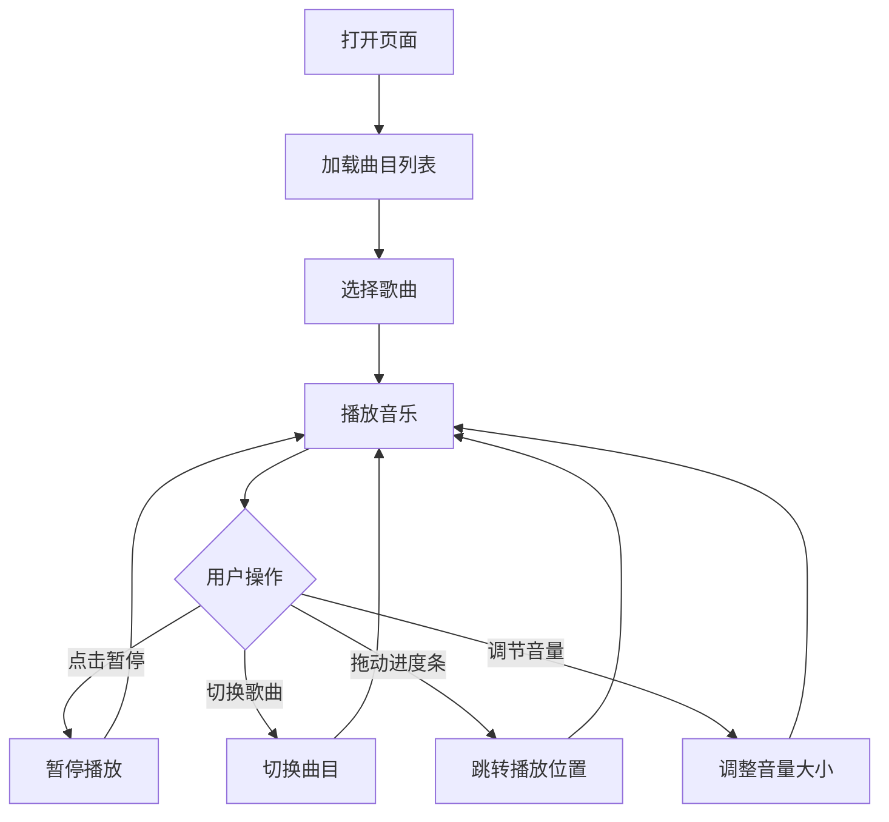

## 1. 产品概述

一款极简黑白风格的网页音乐播放器 Demo，采用毛玻璃视觉效果，提供沉浸式的音乐播放体验。

- 目标用户：喜欢极简设计、追求视觉美感的音乐爱好者
- 核心价值：以简约的交互界面和毛玻璃美学，提供优雅的音乐播放体验

## 2. 核心功能

### 2.1 功能模块

1. **播放控制**：播放/暂停、上一首、下一首
2. **进度控制**：进度条显示与拖拽、当前时间/总时长显示
3. **音量控制**：音量滑块调节
4. **曲目列表**：展示播放列表，支持点击切换歌曲
5. **封面展示**：当前歌曲封面艺术展示

### 2.2 页面详情

| 页面名称 | 模块名称 | 功能描述 |
|---------|---------|---------|
| 主页面 | 播放器面板 | 毛玻璃容器，展示专辑封面、歌曲信息 |
| 主页面 | 播放控制栏 | 播放/暂停、上一首/下一首按钮 |
| 主页面 | 进度条 | 显示播放进度，支持拖拽跳转 |
| 主页面 | 音量控制 | 音量滑块调节 |
| 主页面 | 播放列表 | 展示所有曲目，高亮当前播放曲目 |

## 3. 核心流程

用户打开页面后，播放器自动加载预设曲目列表，点击曲目或播放按钮即可开始播放。

## 4. 用户界面设计

### 4.1 设计风格

- **主题色**：黑白灰极简配色（#000000, #ffffff, #888888, rgba(255,255,255,0.1)）
- **核心效果**：毛玻璃（backdrop-filter: blur + 半透明背景）
- **按钮风格**：简约圆形图标按钮，hover 时微动效
- **字体**：系统优雅字体，粗细分明
- **布局风格**：居中卡片式布局，深色渐变背景衬托毛玻璃质感
- **背景**：深色渐变背景，营造沉浸氛围

### 4.2 页面设计总览

| 页面名称 | 模块名称 | UI 元素 |
|---------|---------|---------|
| 主页面 | 背景 | 深色径向渐变背景 |
| 主页面 | 播放器面板 | 毛玻璃卡片（模糊背景、圆角、半透明边框） |
| 主页面 | 专辑封面 | 圆形封面图，带微光晕 |
| 主页面 | 歌曲信息 | 歌曲名、艺术家名 |
| 主页面 | 控制按钮 | 播放/暂停、上一首、下一首（SVG 图标） |
| 主页面 | 进度条 | 自定义滑块进度条 |
| 主页面 | 音量控制 | 音量图标 + 滑块 |
| 主页面 | 播放列表 | 毛玻璃列表项，当前播放高亮 |

### 4.3 响应式

- 桌面端优先，居中布局，固定最大宽度
- 移动端自适应，缩小间距和尺寸
