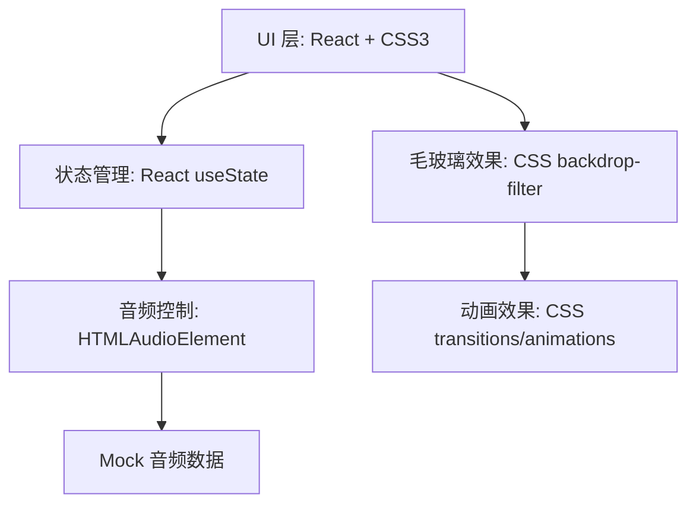

## 1. 技术架构



## 2. 技术说明

- 前端框架：React 18 + Vite
- 样式方案：纯 CSS3（自定义毛玻璃效果、Flexbox/Grid 布局）
- 构建工具：Vite
- 数据来源：Mock 预设曲目数据（含封面图 URL）
- 音频控制：HTML5 Audio API

## 3. 组件结构

| 组件名 | 说明 |
|--------|------|
| App | 主容器，管理全局状态 |
| Player | 播放器主体，毛玻璃面板容器 |
| AlbumCover | 专辑封面展示 |
| SongInfo | 歌曲名和艺术家展示 |
| Controls | 播放控制按钮组 |
| ProgressBar | 播放进度条 |
| VolumeControl | 音量控制 |
| Playlist | 曲目列表 |

## 4. 数据模型

### 4.1 曲目数据模型

```typescript
interface Track {
  id: number;
  title: string;
  artist: string;
  cover: string;       // 封面图片 URL
  audioSrc: string;    // 音频文件 URL
  duration: number;    // 时长（秒）
}
```

### 4.2 播放器状态模型

```typescript
interface PlayerState {
  currentTrack: Track | null;
  isPlaying: boolean;
  currentTime: number;
  duration: number;
  volume: number;
  playlist: Track[];
}
```
