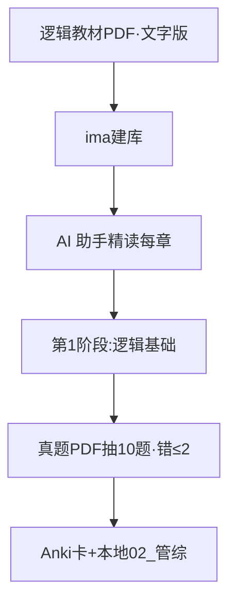

<!--
路径：D:\Ai_ide\10_kaoyan\考研知识库\SOP-每日对话沉淀.md
生成日期：2026-07-11
版本：v2.1（增强版 + 新增 §8 PDF资料纳入流水线；吸收 tech-shrimp 技术学习路线图方法论转译）
方向：AI 助手（每日对话+整理）+ ima（知识库底座）+ Anki/年轮3（记住）
适用：刘工考研（图书情报 MLIS / 英语二 / 管理类联考综合能力）
-->

# 考研每日对话沉淀 SOP v2（刘工专版）

> 一句话定位：你每天用 **AI 助手（当前这个 AI 对话）** 把知识点嚼碎 → 它自动帮你**整理**成笔记 → 你**存**进 **ima 知识库**（腾讯 AI 知识库，当"第二大脑"底座）→ 再抽关键做成 **Anki / 年轮3** 卡片在手机上**重复记忆**。三件套分工：AI 助手=嘴边老师，ima=资料柜，Anki=记忆闹钟。

## 0. 启动前必做：像体检一样先盘自己
（吸收参考 Skill 第一步"收集用户信息"）参考 Skill 先问清"当前水平/目标/时间"。考研版对应三件事，花 30 分钟用 AI 助手 问一次即可：
1. **当前水平**：英二词汇量大概多少？管综数学公式还记得几个？图情是否跨专业零基础？
2. **目标院校与专业**：图书情报（MLIS）先定 1-2 所目标院校——图情专业课是**自命题**，不先定校就不知道考啥，等于蒙眼跑步。让 AI 助手 帮你查该校往年专业课科目与真题获取渠道。
3. **每周可用小时数 × 剩余周数**：现在 2026 年 7 月，考研约在 12 月倒数第一个周末，满打满算 **约 22 周 / 5 个月**。算出你每周能稳定投入几小时（管理者再忙，建议保底 15-20h/周），AI 助手 据此反推每阶段时长。

## 1. 考研真实结构与 5 个月时间轴
**英二（100分）**：完形10(10题) / 阅读40(4篇20题) / 新题型10 / 翻译15 / 小作文10 / 大作文15。
**管综（200分）**：数学75(25题：问题求解15+条件充分性判断10) / 逻辑60(30题) / 写作65(论证有效性分析30+论说文35)。
**图情专业课**：自命题，先定校再找真题，不与统考撞车，但最容易被忽略。

四阶段宏观计划（吸收参考 Skill"分阶段路线图"思想，按月份切）：
```
基础期(7-8月)：英二单词打底 + 管综数学公式/逻辑基础 + 图情教材过一遍 → 目标=不留空白
强化期(9-10月)：英二阅读/翻译专项 + 管综刷题 + 图情真题开始 → 目标=会做题
冲刺期(11月)：英二作文模板 + 管综套卷 + 错题复盘 → 目标=提速稳分
模考期(12月)：全真模拟 + 查漏补缺 → 目标=适应考场节奏
```
（可在 ima 总览里放一张 Mermaid 时间轴图，直观看进度。）

## 2. 每日闭环四步（学→理→存→卡）随阶段演化
四步不变，但每阶段**侧重**和**时长**变（类比：同样是"做饭"，备料期重买菜、出锅期重摆盘）：

| 阶段 | 学(对话搞懂) | 理(自动整理) | 存(ima) | 卡(Anki) | 每天合计 |
|---|---|---|---|---|---|
| 基础期 | 建框架1.5h | 分类0.3h | 建库0.2h | 基础卡0.4h | ~2.4h |
| 强化期 | 专项刷题答疑1.2h | 错题归因0.3h | 真题归类0.2h | 错题卡0.5h | ~2.2h |
| 冲刺期 | 套卷复盘1.0h | 模板整理0.3h | 作文模板0.2h | 高频卡0.4h | ~1.9h |
| 模考期 | 模拟讲评0.8h | 查漏0.2h | 末清单0.1h | 只复习不新加0.3h | ~1.4h |

- **学**：基础期重"懂"，强化期重"对"，冲刺期重"快"，模考期重"稳"。
- **理**：AI 助手 每次聊完自动给"3要点+1自测"结构化输出，你只需过一眼。
- **存**：固定丢进 ima 对应分类，别堆桌面。
- **卡**：模考期**停止加新卡**，只复习，避免考前记忆超载。

## 3. 三个完整真实示例（核心）
### 示例A：管综·逻辑——假言命题推理（p→q, ¬q∴¬p）
① **AI 助手 提问原话（直接复制）**：
> 我是考研管综零基础，用大白话+生活类比讲"假言命题推理规则"，重点说清 p→q 怎么推出 ¬q∴¬p。给我3个要点和1道自测题，不要答案太绕。

② **返回样例（3要点+1自测）**：
- 要点1：把 p→q 想成"下雨→地湿"。地没湿(¬q) ⇒ 一定没下雨(¬p)，这叫**逆否**，百分百成立。
- 要点2："地湿了(q)"推不出"下雨了(p)"（可能有人洒水）——**肯定后件无效**。
- 要点3："没下雨(¬p)"也推不出"地没湿(¬q)"——**否定前件无效**。只有逆否这一招稳。
- 自测：若"张三开会→李四必到"，已知李四没到，能推出啥？用规则命名。

③ **存进 ima 的笔记长什么样**：
```markdown
# 管综逻辑·假言命题
## 唯一稳的推理
p→q 等价于逆否 ¬q→¬p。肯定后件/否定前件都❌。
## 类比
下雨→地湿。地不湿⇒没下雨(对)；地湿⇒下雨(错)；没下雨⇒地不湿(错)
## 自测答案
李四没到 ⇒ 张三没开会（逆否 ¬q→¬p）
## 真题警惕
条件充分性判断常把"肯定后件"当陷阱。
```

④ **Anki 卡片样例**：
> 正面：p→q 时已知 ¬q，推出？ ｜ 背面：¬p（逆否 ¬q→¬p，唯一稳） ｜ 标签：管综/逻辑

### 示例B：英二·阅读——主语从句拆解（What makes...difficult is that...）
① 提问原话：
> 英二阅读长难句卡我，拆解 "What makes X difficult is that..." 结构，3要点+1自测，大白话。
② 3要点+1自测：
- 要点1：What makes X difficult 整体是**主语从句**，当名词用，意"让X变难的东西"。
- 要点2：is that... 是系表，that 后解释"难在哪"。
- 要点3：翻译口诀=「让X困难的事，是……」。先抓主干 A is B，再填从句。
- 自测：拆解 "What surprised me was that he passed." 的主、表语从句。
③ ima 笔记：
```markdown
# 英二阅读·主语从句
## 句型 What makes [X] difficult is that [Y]
1. 主干：主语从句(What...) + is + 表语从句(that...)
2. 译法：「让X困难的事，是Y」
3. 类比：What从句=一个盒子，装的是主语
## 自测
What surprised me was that he passed.
→ 主语从句：What surprised me；表语从句：that he passed
```
④ Anki 卡：
> 正面：英二长句 "What makes reading hard is that..." 主干？ ｜ 背面：主语从句(What..)+is+表语从句(that..)。译「让阅读难的事，是…」 ｜ 标签：英二/阅读

### 示例C：图情专业课——查准率(Precision)与查全率(Recall)
① 提问原话：
> 图情专业课考信息检索，大白话+类比讲清 Precision 与 Recall 区别，3要点+1自测。
② 3要点+1自测：
- 要点1：查准率=搜出来的里多少是对的。P=相关命中/总命中。"捞上来的鱼几条你要的"。
- 要点2：查全率=该找的里找到多少。R=相关命中/全部相关。"池塘所有目标鱼你捞几条"。
- 要点3：二者常**此消彼长**（P-R权衡）：捞多易混坏的(准降)，只捞精的易漏(全降)。
- 自测：库有100篇相关，系统返50篇其中40相关。算 P、R。
③ ima 笔记：
```markdown
# 图情·查准率与查全率
## 定义
P=相关命中/总命中（准不准）；R=相关命中/全部相关（全不全）
## 算例
100目标鱼，nets50条含40目标 → P=40/50=80%，R=40/100=40%
## 权衡
放宽⇒R↑P↓；收紧⇒P↑R↓。F值综合。
```
④ Anki 卡：
> 正面：查准率 Precision 公式？ ｜ 背面：P=相关命中/总命中。"捞上来的里多少对" ｜ 标签：图情/专业课

## 4. Anki / 年轮3 做卡细则
**三原则**（吸收参考 Skill"作业必须具体可执行"）：
1. **一张一知识点**：别把一整章塞一张卡，否则复习时要么全对要么全错。
2. **Cloze 挖空**：用 `{{c1::关键词}}` 挖空，比问答更适合公式/定义。如 `p→q 等价于 {{c1::¬q→¬p}}`。
3. **正反面试错**：正面给情境/错法，背面给正解，逼自己先想再翻。

**每天节奏**：复习 20-30 分钟，新卡:复习卡 ≈ **1:5**（每天新卡 10-15 张，旧卡按算法自动排）。模考期只复习不加新。手机端年轮3 与 Anki 操作一致，选一个坚持到底别换来换去。

## 5. 防懈怠 / 补救机制
- **缺勤1-2天**：不补旧对话、不补 ima 笔记（避免堆积焦虑）。Anki 旧卡它自己会**重新调度**，你只接今天。
- **缺勤3-7天**：捡回节奏=只做两件事：①Anki 复习 0.5h（把落下的卡清掉）②挑**最弱一科**做 0.5h"学"。别想补全，先恢复习惯。
- **缺勤>7天**：重启周。把每日目标**砍半**，先连续 3 天完成再慢慢加量。
- **某科一直 plateau**：让 AI 助手 **换讲法**（类比→例题→反例三连）、**拆更细**（一个知识点拆子点逐个过）、**出变式题**（同考点换皮考你）、或**交叉换科**（脑子换频道反而通）。

## 6. 诚实的局限与风险（别神话 AI）
- **写作只能给框架不能给分**：管综两篇作文、英二大小作文，AI 能给结构和模板，但**必须你自己写、自己对着范文改**，没人能替你练手感。
- **必须自己刷真题**：尤其管综"条件充分性判断"和图情自命题，AI 助手 讲得再好不如你亲手错一遍。
- **不编造**：AI 偶尔给错公式/年份，凡关键定义以**官方教材/真题**为准，ima 笔记里标"待核对"。
- **不考听口**：英二无听力口语，放心；但别用 AI 练口语当复习。
- **该报班的信号**：自命题找不到真题且跨专业零基础 / 自律连续崩 2 周以上 / 模考持续低于目标院校线 20 分。AI 是助教不是救命稻草。

## 7. 文件夹结构（吸收参考 Skill 的"项目文件夹"）
**ima 知识库分类**（云端，手机电脑同步）：
```
考研总览 ｜ 英二(单词/阅读/翻译/作文) ｜ 管综(数学/逻辑/写作) ｜ 图情专业课(按院校) ｜ 真题与错题 ｜ 模板库
```
**本地备份** `D:\Ai_ide\10_kaoyan\考研知识库\`（参考 Skill 的"分阶段子目录+指南/作业"结构翻译）：
```
考研知识库\
├── 00_总览与计划\        # 路线图.md(含Mermaid) + 四阶段计划.md
├── 01_英二\              # 各阶段笔记按 学习指南/自测卡/刷题任务 分文件
├── 02_管综\
├── 03_图情专业课\        # 按目标院校再分子目录
├── 04_真题错题\
├── 05_模板库\            # 作文模板/数学公式表
└── 06_Anki导出备份\      # 每月导一次 .apkg 防丢
```
每周把 ima 导出一份丢进对应本地目录，双重保险。

## 8. PDF 资料纳入流水线（套用「学习路线图」框架）

> 类比一句话：原技术框架里最"玄"的一步，是让 AI 去网上搜资料。但你手里的 PDF——教材、真题、讲义——就是最对口的现成资料。所以**框架六步原样不动，只把"上网搜"换成"把自己买的资料喂进去"**。

### 8.1 你的 PDF 分四类，策略各不同

| 类型 | 定位（类比） | 处理策略 |
|---|---|---|
| 教材/讲义 PDF | 系统知识=课本 | 传 ima 建库 + AI 助手 一章章精读当课本 |
| 历年真题 PDF | 练手感=考题卷 | 刷 + 错题进 Anki；**别整本喂**，按题喂 |
| 网课/笔记打印稿 | 零散重点=便签 | 挑重点页存 ima，别全存（稀释重点） |
| 机构押题 PDF | 临时弹药=锦囊 | 考前集中用，**不进长期库**，考完即清 |

### 8.2 PDF 纳入的 6 步流水线（对照框架逐条改法）

- **步骤0 环境检查**：原框架验"联网搜资料的钥匙(EXA_API_KEY)"→ 改成验**「这份 PDF 是文字版还是扫描版」**。扫描版（图片式、复制不出字）得先 OCR 转文字，否则喂不进 ima 也对话不了。
- **步骤1 盘需求**：和原框架一样问水平/目标/时间，多加一句——**「你有哪些 PDF、各对应哪科、该放哪阶段？」**
- **步骤2–3 搜资源**：**删掉 Exa 搜索**，换成「PDF 上传 ima 建库 + AI 助手 精读某页/某章」。你的 PDF 就是你"搜回来"的最对口资源。
- **步骤4 分阶段路线图**：模板原样保留（目标+时长+资源+知识作业+实战作业），只换素材：**教材 PDF→基础期、真题 PDF→强化期、押题 PDF→冲刺期**。
- **步骤5 文件夹**：保留，和 §7 的 `00_总览`~`06_Anki备份` 本地目录对齐，按 PDF 类型/科目归位。
- **步骤6 Mermaid**：保留，画出「PDF 资料 → 各阶段」流向（见 §8.3）。
- **关键规则「不编造」对 PDF 更硬**：ima 喂了 PDF，答案就**只从这份 PDF 里找**；AI 引申的内容标「待核对」，以你的 PDF 为准。

### 8.3 完整示例：一份「管综逻辑教材 PDF」跑全流程

- **步骤0**：确认是文字版（能复制字）→ 通过。
- **步骤1**：水平=管综零基础；目标=逻辑基础过关；时间=基础期(7-8月)；手头=《逻辑精点》教材 PDF，对应管综/基础期。
- **步骤2–3**：整本传 ima 建「管综逻辑」库；每天贴一章给 AI 助手：「大白话讲透这章假言推理，3 要点+1 自测」。
- **步骤4 第1阶段_逻辑基础**：学习指南=该 PDF 章节(标页码)；知识作业=章后自测；实战作业=真题 PDF 抽 10 题，**验收错 ≤ 2 题**。
- **步骤5**：存本地 `02_管综\逻辑基础\`，分 `学习指南.md / 自测卡.md / 刷题任务.md`。
- **步骤6 Mermaid**：



### 8.4 与每日闭环（学→理→存→卡）的衔接

收到**新 PDF** 别慌，两步并进去：
1. **先走「步骤0–3 入库」**：验版本 → 盘它归哪科哪阶段 → 传 ima + AI 助手 精读一遍，把"生料"变"半成品"；
2. **之后每天正常四步**：从 ima 库抽一点 → 对话**学** → 自动**理** → 丢 ima**存** → 抽关键做**卡**。PDF 一旦入库就融进你每天那套节奏，不另起炉灶。

### 8.5 OCR 坑提示

扫描版 PDF（拍的书、图片式）**必须先 OCR 转成文字**才能和 AI 对话——直接喂，AI 等于"看盲文"。推荐工具一句话：用「白描」或「ABBYY FineReader」扫一遍，导出文字版 PDF 再传 ima。这步省不得，否则后面全卡住。

---

## 9. 每周 / 每月检查点清单（可打钩）
**每周：**
- [ ] 新卡 ≥ 10 张/科，Anki 复习按时率 ≥ 90%
- [ ] ima 新增笔记 ≥ 5 条（学→存闭环没断）
- [ ] 英二阅读近 4 篇正确率 ≥ 目标值（如 70%）
- [ ] 管综数学/逻辑当周错题 ≤ 15 题（超了说明要拆更细）
- [ ] 完成 1 次周测或套卷片段

**每月：**
- [ ] 四科各完成当月阶段目标（对照 §1 时间轴）
- [ ] 图情真题进度 ≥ 计划（自命题别拖）
- [ ] 弱科是否已"换讲法/拆更细"
- [ ] 距考试还剩 N 周，下月计划是否要砍或加
- [ ] 本地备份 + Anki 导出已更新

---
*本 SOP 吸收自 tech-shrimp 技术学习路线图方法论（收集信息→分轮搜资源→分阶段路线图→文件夹结构→Mermaid→作业可验收），已转译为考研场景。规则只有一条：先动起来，比完美重要。*
