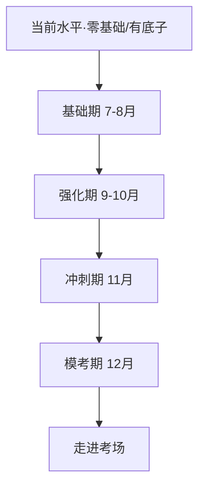

# 管综(199)考研学习路线图

> 由 `kaoyan-roadmap` Skill 生成｜**学时未填 → 采用标准 5 个月四阶段通用模板**，后续你告诉我每周几小时，我再帮你微调各阶段时长。
> 适用：管理类联考综合能力（199管综，满分200）。图书情报(MLIS)专业课为扩展位，本次未启用。

## 一、科目构成（满分 200）

| 模块 | 分值 | 题型 |
|---|---|---|
| 数学 | 75分 | 25题：问题求解15题 + 条件充分性判断10题 |
| 逻辑 | 60分 | 30题 |
| 写作 | 65分 | 论证有效性分析30分 + 论说文35分 |

## 二、四阶段总览

| 阶段 | 时间 | 重心 | 目标 |
|---|---|---|---|
| 基础期 | 7-8月 | 数学公式 + 逻辑基础 + 写作框架 | 不留空白 |
| 强化期 | 9-10月 | 分科刷题 + 真题起步 | 会做题 |
| 冲刺期 | 11月 | 套卷提速 + 错题复盘 | 稳分 |
| 模考期 | 12月 | 全真模拟 + 查漏补缺 | 适应考场节奏 |

## 三、路线图（Mermaid）

## 四、资源渠道（AI 推荐，标【待核对】）

- **B站系统课**：数学/逻辑/写作主流名师课 ——【待核对：具体老师与最新年份以你选择为准】
- **教材/教辅**：主流管综辅导书 ——【待核对：版本与出版社以你手头实物为准】
- **真题**：历年真题卷（研招网 / 报考院校官网 / 正规教辅） ——【待核对：真题年份与答案以官方/教辅为准】

> ⚠️ 关键定义、公式、分值、真题年份，一律以你的教材和真题为准；本路线图 AI 引申内容均标【待核对】。

## 五、与 SOP 的衔接

本路线图管**"分阶段大计划"**；每天具体怎么学，看 `D:\Ai_ide\10_kaoyan\考研知识库\SOP-每日对话沉淀.md` 的**每日四步闭环（学→理→存→卡）**。

各阶段详细指南（目标 / 资源 / 知识作业 / 实战作业）见对应子目录。
