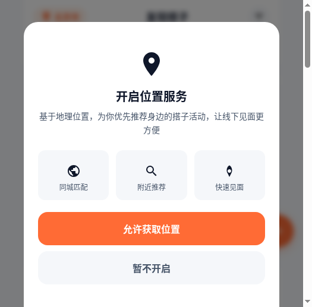
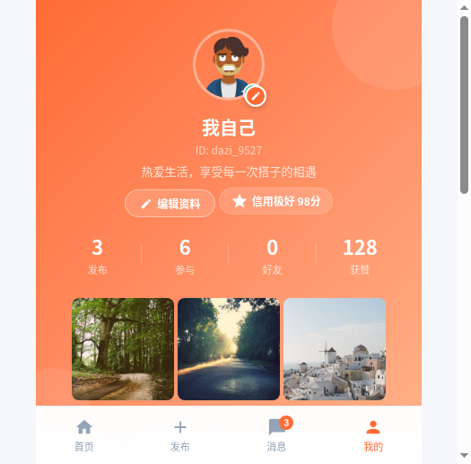
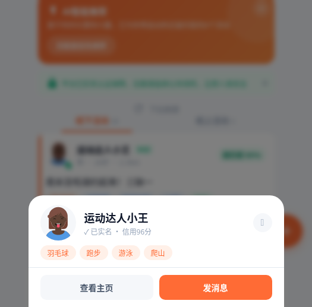
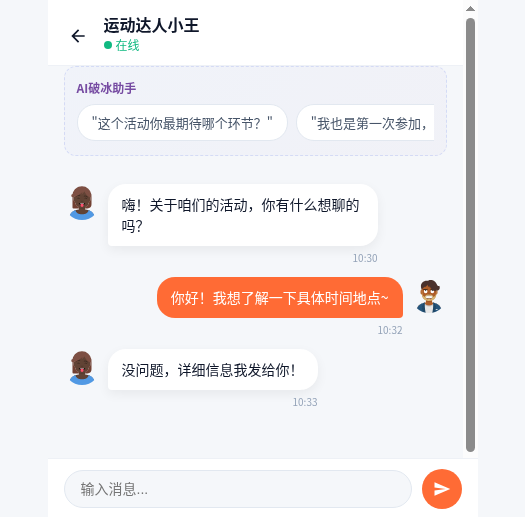

## 0. 先和大家打个招呼吧

大家好！我是一名对产品感兴趣的大学生，平时喜欢观察各种社交App的交互设计，也经常脑洞大开想一些产品点子，但一直苦于不会写代码，想法只能停留在脑海里。

这次用 TRAE 做搭子Pro，整个过程让我非常惊喜。我完全是零代码基础，就把脑子里想的东西用大白话一句句讲给 TRAE 听——"我要一个像 Soul 那样的首页"、"卡片上要显示匹配度百分比"、"聊天页面要有 AI 破冰建议"。它不仅理解了我要什么，还能主动帮我补全我没想到的细节，比如信用分系统、好友申请流程、用户评价体系。

最让我觉得"原来这么简单"的一步是 AI 智能推荐算法。我原本以为需要后端和数据库才能做推荐排序，结果 TRAE 用纯前端 JavaScript 就实现了一个基于兴趣标签加权的多维评分系统，而且匹配度解读面板做得比我想象中还好看。这一刻我真切地感受到：AI 编程不是在替你写代码，而是在帮你把想法变成现实。

## 1. Demo 简介

**是什么：** 搭子Pro —— 一款 AI 驱动的「找搭子」社交移动端 Web App，单 HTML 文件实现，打开即用，无需后端。

**面向谁：** 18-35 岁的城市年轻人，想找人一起运动、吃饭、学习、旅行、看电影、玩音乐，但身边朋友兴趣不一致或者不好意思单独约陌生人。

**主要功能：**

- **AI 智能推荐首页**：基于用户兴趣标签、地理位置、信用分等多维度加权评分，为每个活动计算匹配度百分比，按匹配度排序推荐。支持分类筛选（运动/游戏/约饭/学习/旅行/观影/音乐/宠物）、距离筛选、城市切换、线上线下模式切换、搜索、无限滚动加载。

- **完整社交闭环**：发现活动 → 查看详情（含 AI 匹配解读面板）→ 报名参加 → 一键发消息/复制微信 → AI 破冰聊天 → 线下见面 → 互评积累信用分。好友系统支持搭子→好友→密友三层关系。

- **个人中心与资料体系**：头像/昵称/签名/MBTI/兴趣标签编辑、我的相册管理、发布/参与/好友/获赞数据统计、信用中心、实名认证、完善的设置与隐私管理。

## 2. Demo 创作思路

**灵感来源：** 我自己就是"搭子文化"的重度用户。周末想打羽毛球找不到人、想吃日料放题凑不齐人、考研想找个安静自习搭子……每次都要在微信群、朋友圈、小红书到处问，效率很低，而且匹配度很低。Soul 和探探是找人聊天/约会的，但没有人专门做"找活动搭子"这个垂直场景。

**想解决的问题：**
1. **找搭子效率低**：信息分散在各个平台，没有聚合
2. **匹配不精准**：只看活动内容，不考虑兴趣契合度
3. **信任成本高**：和陌生人线下见面有顾虑，缺乏信用参考
4. **破冰尴尬**：加了微信不知道第一句话说什么

**为什么做这个方向：** "搭子经济"是当下年轻人的真实刚需（小红书"搭子"话题浏览量超百亿），但市面上没有一款专门做"找搭子"且用 AI 做智能匹配的产品。这个方向既有真实痛点，又有足够的差异化空间。AI 破冰助手和信用体系是我认为最能体现"AI 赋能社交"的两个功能点。

## 3. Demo 体验地址

请解压 ZIP 文件后，用浏览器直接打开 `index.html` 即可体验（推荐 Chrome / Safari 移动端模拟器，或手机直接打开）。

\* 附件：`dazipro-demo.zip`（含 index.html 单文件，约 60KB）

## 4. TRAE 实践过程

**开发流程：**

### 第一步：需求描述与框架搭建（Session A）
我向 TRAE 描述了产品的核心定位——"一个 AI 驱动的找搭子社交 App"。TRAE 帮我规划了整体页面架构（首页/发布/消息/我的 4 个 Tab + 10+ 个子页面）、数据模型设计（用户/帖子/聊天/好友/评价），并搭建了完整的 HTML/CSS/JS 单文件框架，包含橙色渐变品牌色系和移动端适配布局。

> **Session ID**：`（请替换为你的 Session ID）`

### 第二步：核心功能开发（Session B）
这一步实现了最核心的几个功能模块：
- AI 智能推荐算法（兴趣标签加权 + 距离 + 信用分 + 认证状态 + 热度五维评分）
- 活动详情页与 AI 匹配解读面板（可视化展示推荐理由）
- 实时聊天系统（AI 破冰助手、已读状态、消息持久化）
- 好友系统（发送/接受/拒绝申请、三层关系）
- 用户评价体系（星级 + 标签 + 文字评价）

> **Session ID**：`（请替换为你的 Session ID）`

### 第三步：UI 打磨与体验优化（Session C）
最后一步做了大量的 UI 细节打磨和体验优化：
- 登录页、新用户引导（3 步 onboarding）的动效设计
- 帖子卡片圆角阴影、信用分徽章、实名认证标识等视觉细节
- 编辑资料面板（头像选择、签名、MBTI、兴趣标签、相册管理）
- 帮助反馈页（常见问题 FAQ、使用教程、意见反馈）
- 子页面路由优化（绝对定位覆盖方案，解决白屏问题）
- 全页面返回按钮、空状态提示、加载状态等交互完善

> **Session ID**：`（请替换为你的 Session ID）`

**开发关键步骤截图：**

---

**技术说明：** 本项目为纯前端单 HTML 文件应用（3800 行），使用 HTML5 + CSS3（Flexbox/Grid、CSS 变量主题、backdrop-filter）+ 原生 JavaScript，无任何框架依赖。数据通过 localStorage 持久化，头像使用 DiceBear API 动态生成，图片使用 Picsum 占位服务。全部开发在 TRAE 中完成。