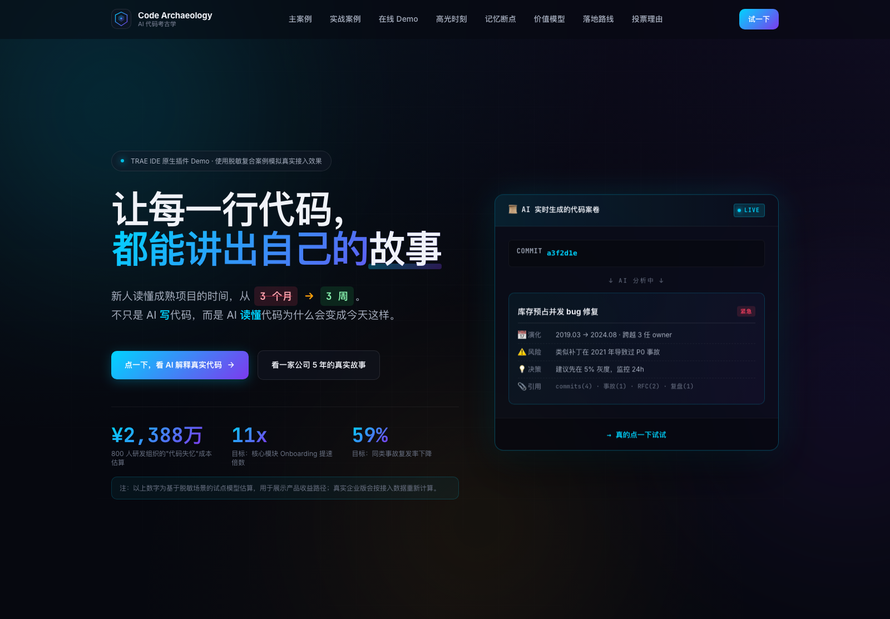
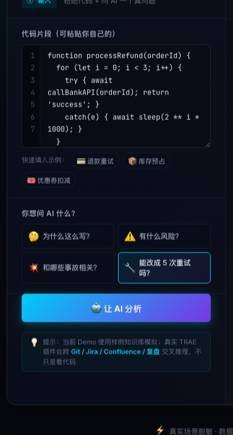
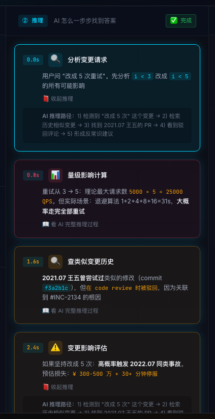
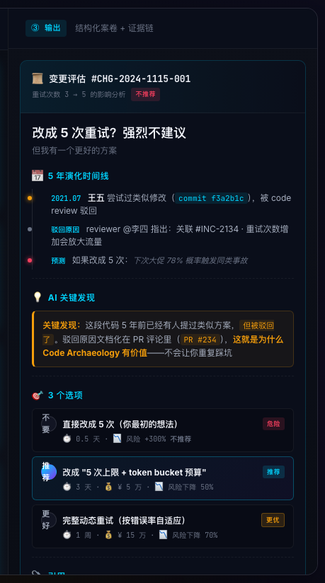
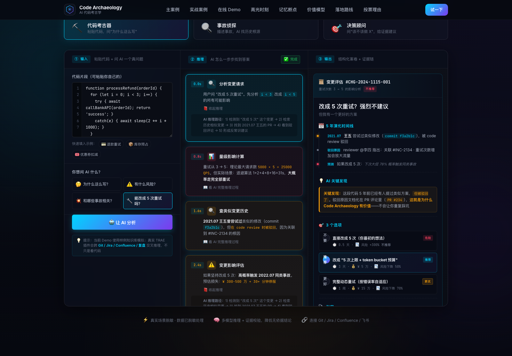
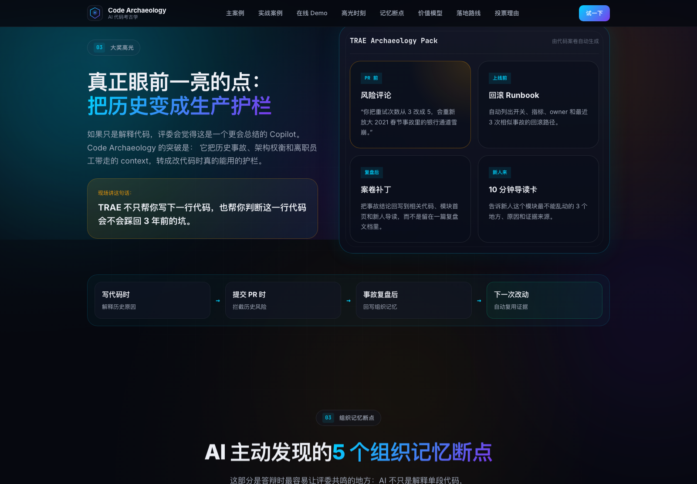
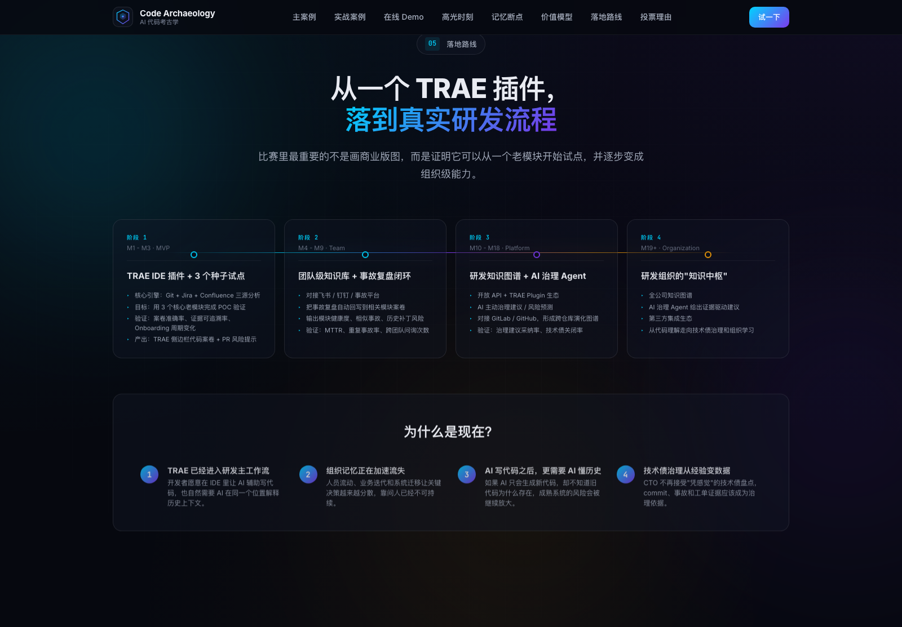

# Code Archaeology —— AI 代码考古学

TRAE AI 创意 Demo 大赛参赛作品介绍

Demo 地址：本地启动后访问 `http://localhost:8876/`

Code Archaeology 是一个面向研发团队的 TRAE 插件原型。它不解决“怎么再写一段代码”，而是解决另一个更真实的问题：成熟项目里的老代码，为什么会写成今天这样？现在能不能改？改了会不会踩回以前的事故？

在 TRAE 中，研发选中一段代码后，Code Archaeology 会把 Git 提交、Jira 工单、事故复盘、压测记录和设计文档串起来，生成一份“代码案卷”。这份案卷会告诉研发：这段代码的来龙去脉、相关事故、当前风险，以及更稳妥的改法。



## 1. 创意是什么

现在很多 AI Coding 工具都在帮助开发者更快写代码。但在真实研发团队里，很多风险并不来自“不会写”，而是来自“不知道为什么不能这么改”。

一个成熟系统往往经历过多年迭代：上线赶工、临时补丁、事故修复、架构迁移、人员流动。最后代码还在，但当年的原因散落在不同地方。新人看得懂语法，却看不懂背景；老员工知道一些，但也很难完整讲清。

Code Archaeology 的创意点是：让 TRAE 不只理解当前代码，还能理解代码背后的历史。它把原本散在各处的工程经验放回研发现场，让开发者在改代码前就能看到风险和证据。

一句话概括：

> TRAE 不只帮你写下一行代码，也帮你判断这一行代码会不会踩回 3 年前的坑。

## 2. 解决什么问题

这个 Demo 面向的是成熟研发组织中非常高频的问题：老模块不敢改、历史坑没人记得、事故经验没有沉淀到日常开发里。

典型痛点包括：

- 新人接手老代码，需要到处问人，理解周期很长。
- PR 评审高度依赖少数老员工的经验。
- 事故复盘写完以后，很少回到代码和后续开发流程里。
- 技术债治理常常靠感觉，缺少历史证据支撑。

Code Archaeology 的目标是让这些历史背景变得可查、可解释、可行动。它不是替代研发判断，而是把判断需要的证据提前放到 TRAE 里。

## 3. 谁来用

主要用户包括四类：

- 一线研发：在修改老代码前，快速判断哪里能改、哪里需要谨慎。
- Tech Lead：在评审高风险 PR 时，看到历史事故和变更依据。
- 新人导师：用代码案卷帮助新人理解模块演进，减少重复讲背景。
- 工程效能团队：把事故经验、技术债和治理建议沉淀到研发流程中。

最适合先落地的模块，是支付、权限、库存、计费、实验平台这类“代码不一定多，但改错代价很高”的核心系统。

## 4. 在线 Demo 亮点：一次真实的老代码修改

Demo 中最核心的交互，是“代码考古器”。它用一个支付退款场景演示：当研发想把退款重试从 3 次改成 5 次时，TRAE 如何帮助他判断这件事是否安全。

场景如下：电商支付团队发现退款成功率偏低，业务希望提高重试次数。新来的研发小周打开退款函数，看到代码里写死了 3 次重试：

```js
function processRefund(orderId) {
  for (let i = 0; i < 3; i++) {
    try { await callBankAPI(orderId); return 'success'; }
    catch(e) { await sleep(2 ** i * 1000); }
  }
  sendToDeadLetter(orderId);
}
```

从代码表面看，把 `i < 3` 改成 `i < 5` 很简单。但这类改动在支付链路里可能放大下游银行通道流量，引发雪崩。Code Archaeology 会把这个“小改动”背后的历史风险查出来。

### 第一步：研发在 TRAE 中提出真实问题

研发不需要离开 IDE，也不需要先去翻文档。只要选中退款重试代码，并选择问题“能改成 5 次重试吗？”，再点击“让 AI 分析”。



### 第二步：AI 展示推理过程

AI 不直接给一句“可以”或“不可以”，而是展示它查了什么、怎么判断：

- 识别当前变更意图：把最大重试次数从 3 次改成 5 次。
- 计算流量影响：重试次数增加会放大对银行通道的请求压力。
- 检索历史相似变更：找到过去有人尝试过类似修改。
- 关联事故复盘：发现该类改动与历史退款雪崩事故相关。
- 形成建议：不建议直接改成 5 次，应先加重试预算和熔断保护。



### 第三步：输出可执行的代码案卷

最终输出不是一段泛泛的解释，而是一份可以直接用于研发决策的“变更评估”：

- 结论：直接改成 5 次重试，强烈不建议。
- 证据：历史 PR 中曾有人提过类似方案，但被 code review 驳回。
- 风险：大促场景下可能重新触发同类事故。
- 替代方案：使用“5 次上限 + token bucket 预算”，或做动态重试。
- 引用来源：PR、事故复盘、code review、压测报告。



这就是 Demo 最核心的亮点：它不是帮研发把 `3` 改成 `5`，而是告诉研发为什么不能简单这么改，以及怎么改才更稳。



## 5. 用户怎么消费结果

同一份代码案卷，对不同角色都有直接价值。

对一线研发来说，它能快速回答“这段代码能不能改”。研发不需要在 Git、Jira、复盘文档之间来回切换，也不需要完全依赖老员工口头解释。

对 reviewer 来说，它可以转化成 PR 风险评论。例如：“本次改动会把退款重试流量从 3 倍放大到 5 倍，历史上曾因类似原因触发银行通道雪崩，建议先加重试预算。”

对 Tech Lead 来说，它能把一次代码评审升级成治理动作：短期加预算控制，中期引入自适应重试，长期推进退款链路隔离和异步化。

对新人导师来说，它能把模块历史做成导读材料，让新人知道这个模块最不能乱动的地方，以及背后的原因。

## 6. 产品能力

Code Archaeology 可以拆成三层能力：

- 查背景：从 Git、Jira、事故复盘、设计文档中找出与当前代码相关的信息。
- 做判断：结合历史事故、压测数据和评审记录，判断当前改动的风险。
- 给动作：输出 PR 评论、回滚 Runbook、修复建议和新人导读卡。

它最适合放在 TRAE 里，因为问题发生在写代码和改代码的现场。研发最需要背景信息的时刻，正是他盯着一段老代码准备修改的时候。



## 7. 为什么这个 Demo 有创意

这个作品不是再做一个“AI 帮我写代码”的工具，而是提出了一个新的方向：AI Coding 进入生产环境后，必须理解旧代码的历史。

如果 AI 只会生成新代码，却不知道旧代码为什么存在，开发速度越快，成熟系统里的风险可能越容易被放大。Code Archaeology 让 TRAE 多了一层判断能力：不仅知道怎么写，还知道哪些地方不能乱改。

它的创意价值体现在三点：

- 方向新：从代码生成，走向代码历史理解。
- 场景真：支付、权限、库存、实验平台都有类似老代码风险。
- 结果可用：输出不是摘要，而是能进入 PR、上线、复盘和新人学习流程的行动建议。

## 8. 落地路径

第一阶段不需要做成全公司大平台，可以从一个高风险老模块开始试点。

推荐路径：

1. 选择支付、权限、库存等核心老模块。
2. 接入 Git、Jira 和事故复盘数据。
3. 在 TRAE 侧边栏展示代码案卷和风险提示。
4. 先验证三个指标：案卷是否准确、证据是否可追溯、是否减少重复踩坑。
5. 再逐步扩展到更多模块和更多数据源。

当前 Demo 使用脱敏样例数据模拟真实接入效果，重点展示产品体验和工作流。真实落地时，应按企业权限体系接入内部数据，确保每条结论都能追溯到明确来源。



## 9. 用 TRAE 实现的过程

这个 Demo 也体现了 TRAE 在创意实现上的效率：

1. 用 TRAE 梳理产品方向，把主题从“解释代码”收敛为“改老代码前识别历史风险”。
2. 围绕支付退款这个典型场景，设计输入、推理、输出三栏交互。
3. 用 HTML、CSS、JavaScript 完成可点击原型，包括代码输入、问题选择、AI 推理过程和案卷结果。
4. 结合评委视角补齐产品介绍、演示截图和答辩材料，让作品既有创意，也能讲清真实价值。

## 10. 一句话收束

当 AI 都在帮开发者写代码，Code Archaeology 让 TRAE 帮团队记住：这段代码为什么这样写，以及这次到底能不能改。
