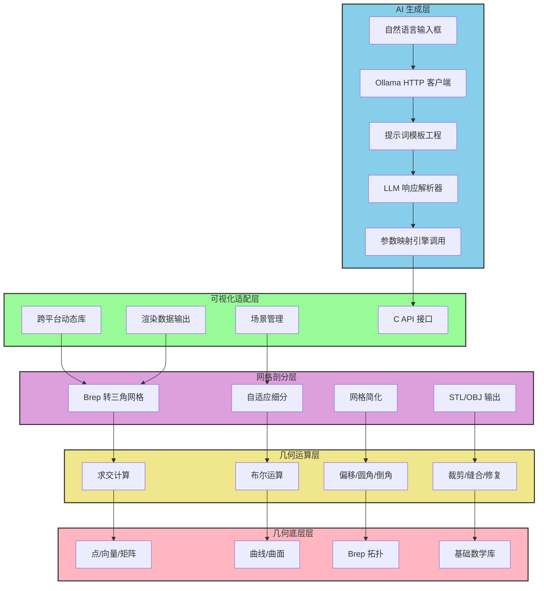
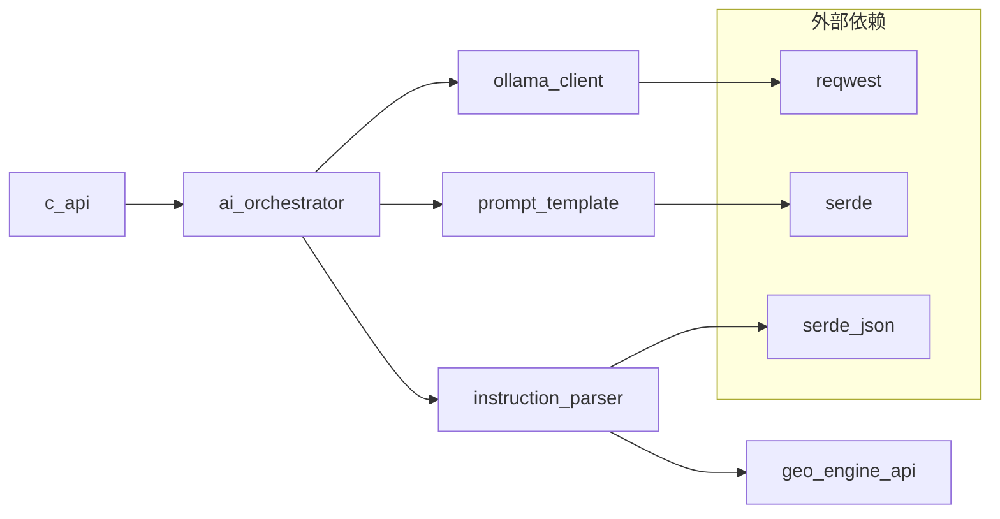
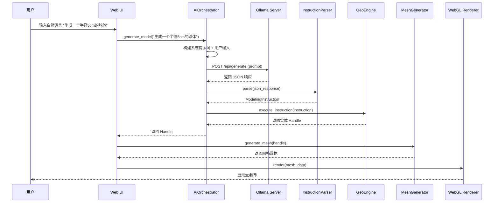

# TraeGeo 几何引擎 + AI 生成层架构设计

## 一、五层架构图



## 二、AI 生成层模块设计

### 2.1 模块划分

| 模块 | 职责 | 语言 | 关键依赖 |
|------|------|------|----------|
| `ollama_client` | HTTP 客户端，直连 Ollama API | Rust | reqwest |
| `prompt_template` | 提示词模板管理，few-shot 示例 | Rust | serde |
| `instruction_parser` | JSON 响应解析，参数校验 | Rust | serde_json |
| `ai_orchestrator` | 端到端流程编排 | Rust | 以上模块 |
| `c_api` | 跨平台 C 接口导出 | C++ | FFI |

### 2.2 模块依赖关系



### 2.3 接口设计

#### 2.3.1 Ollama 客户端接口

```rust
pub struct OllamaClient {
    base_url: String,
    model: String,
    timeout: Duration,
    max_retries: usize,
}

impl OllamaClient {
    pub fn new(model: &str) -> Self;
    pub fn with_config(model: &str, config: OllamaConfig) -> Self;
    pub async fn generate(&self, prompt: &str) -> Result<String, OllamaError>;
    pub async fn generate_streaming<F>(&self, prompt: &str, callback: F) -> Result<(), OllamaError>
        where F: FnMut(&str) -> bool;
    pub fn set_model(&mut self, model: &str);
    pub fn health_check(&self) -> Result<bool, OllamaError>;
}

pub struct OllamaConfig {
    pub base_url: String,
    pub timeout_ms: u64,
    pub max_retries: usize,
    pub temperature: f32,
    pub top_p: f32,
    pub max_tokens: usize,
}

pub enum OllamaError {
    NetworkError(String),
    Timeout,
    RetryExhausted,
    InvalidResponse(String),
    ServerError(u16, String),
    ModelNotFound(String),
}
```

#### 2.3.2 指令解析器接口

```rust
pub struct InstructionParser;

impl InstructionParser {
    pub fn parse(json_str: &str) -> Result<ModelingInstruction, ParseError>;
    pub fn validate(instruction: &ModelingInstruction) -> Result<(), ValidationError>;
}

pub struct ModelingInstruction {
    pub operations: Vec<ModelingOperation>,
    pub units: String,
}

pub enum ModelingOperation {
    CreatePrimitive(PrimitiveType, PrimitiveParams),
    Transform(Handle, TransformParams),
    Boolean(BooleanOp, Handle, Handle),
    Fillet(Handle, Vec<EdgeHandle>, f64),
    Chamfer(Handle, Vec<EdgeHandle>, f64),
    Extrude(SketchHandle, f64),
    Revolve(SketchHandle, f64),
    Shell(Handle, f64),
    Hole(Handle, HoleParams),
}

pub enum PrimitiveType {
    Box,
    Sphere,
    Cylinder,
    Cone,
    Tetrahedron,
    Octahedron,
}

pub struct PrimitiveParams {
    pub name: String,
    pub dimensions: Vec<f64>,
    pub position: Vec<f64>,
    pub rotation: Vec<f64>,
    pub scale: Vec<f64>,
}

pub struct TransformParams {
    pub translate: Vec<f64>,
    pub rotate: Vec<f64>,
    pub scale: Vec<f64>,
}

pub struct HoleParams {
    pub position: Vec<f64>,
    pub direction: Vec<f64>,
    pub diameter: f64,
    pub depth: f64,
}

pub enum BooleanOp {
    Union,
    Difference,
    Intersection,
}
```

#### 2.3.3 AI 编排器接口

```rust
pub struct AiOrchestrator {
    client: OllamaClient,
    prompt_template: PromptTemplate,
    engine: GeoEngineHandle,
}

impl AiOrchestrator {
    pub fn new(model: &str, engine: GeoEngineHandle) -> Result<Self, OrchestratorError>;
    pub async fn generate_model(&self, user_input: &str) -> Result<Handle, OrchestratorError>;
    pub fn set_prompt_template(&mut self, template: PromptTemplate);
    pub fn get_history(&self) -> &Vec<ConversationEntry>;
}

pub struct ConversationEntry {
    pub user_input: String,
    pub llm_response: String,
    pub instruction: ModelingInstruction,
    pub result_handle: Handle,
    pub timestamp: DateTime<Utc>,
}

pub enum OrchestratorError {
    OllamaError(OllamaError),
    ParseError(ParseError),
    ValidationError(ValidationError),
    EngineError(EngineError),
}
```

### 2.4 线程安全规则

- `OllamaClient`：Send + Sync，支持多线程并发调用
- `AiOrchestrator`：Send + Sync，内部使用 `Arc<Mutex>` 保护状态
- `ModelingInstruction`：Clone + Send + Sync，可安全跨线程传递
- 所有异步操作使用 `async/await`，不阻塞主线程

### 2.5 数值精度体系

| 精度类型 | 默认值 | 用途 |
|----------|--------|------|
| Epsilon | 1e-8 | 浮点比较 |
| Tolerance | 1e-6 | 几何容差 |
| AngleTolerance | 1e-4 | 角度容差 |
| LengthUnit | "mm" | 默认长度单位 |

---

## 三、端到端流程



---

## 四、跨平台接口设计

### 4.1 C API 接口

```c
typedef struct trae_geo_ai_config_t {
    const char* model;
    const char* base_url;
    uint64_t timeout_ms;
    uint32_t max_retries;
    float temperature;
    float top_p;
    uint32_t max_tokens;
} trae_geo_ai_config_t;

TRAE_GEO_API trae_geo_error_t trae_geo_ai_init(const trae_geo_ai_config_t* config);
TRAE_GEO_API trae_geo_error_t trae_geo_ai_set_model(const char* model);
TRAE_GEO_API trae_geo_error_t trae_geo_ai_generate_from_text(
    const char* text,
    trae_geo_handle_t* out_handle
);
TRAE_GEO_API trae_geo_error_t trae_geo_ai_generate_from_text_async(
    const char* text,
    void (*callback)(trae_geo_handle_t, void*),
    void* user_data
);
TRAE_GEO_API trae_geo_error_t trae_geo_ai_health_check(bool* is_healthy);
TRAE_GEO_API void trae_geo_ai_shutdown(void);
```

### 4.2 Rust API 接口

```rust
pub mod ai {
    pub use self::client::OllamaClient;
    pub use self::config::OllamaConfig;
    pub use self::orchestrator::AiOrchestrator;
    pub use self::parser::ModelingInstruction;
    pub use self::errors::{OllamaError, ParseError, OrchestratorError};
}
```

---

## 五、模块依赖汇总

| 层 | 模块 | 依赖下层 | 外部依赖 |
|----|------|----------|----------|
| AI生成层 | ollama_client | 无 | reqwest |
| AI生成层 | prompt_template | 无 | serde |
| AI生成层 | instruction_parser | 几何底层层 | serde_json |
| AI生成层 | ai_orchestrator | ollama_client, prompt_template, instruction_parser | 无 |
| 可视化适配层 | c_api | AI生成层, 网格层 | FFI |
| 网格剖分层 | mesh_generator | 几何运算层 | 无 |
| 几何运算层 | boolean | 几何底层层 | 无 |
| 几何底层层 | brep | 无 | 无 |