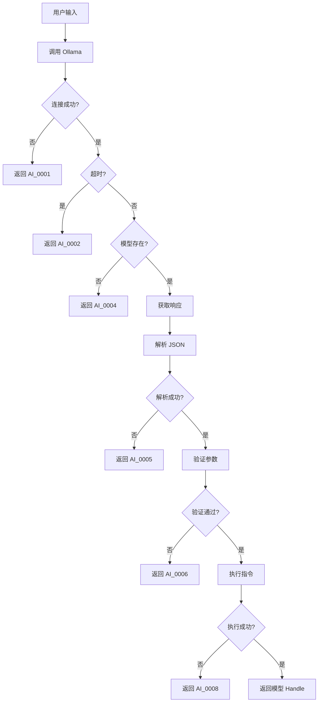

# TraeGeo Ollama 对接规范

## 一、Ollama 调用协议

### 1.1 API 端点

| 端点 | 方法 | 描述 |
|------|------|------|
| `/api/generate` | POST | 生成响应（支持流式） |
| `/api/chat` | POST | 聊天模式（支持上下文） |
| `/api/models` | GET | 获取可用模型列表 |
| `/api/show` | POST | 获取模型详情 |

### 1.2 请求格式

```json
{
  "model": "qwen",
  "prompt": "生成一个半径5cm的球体",
  "stream": true,
  "options": {
    "temperature": 0.1,
    "top_p": 0.9,
    "max_tokens": 2000,
    "stop": ["\n\n"]
  },
  "system": "<系统提示词>",
  "format": "json"
}
```

### 1.3 响应格式（流式）

```json
{
  "model": "qwen",
  "created_at": "2024-01-01T00:00:00Z",
  "response": "{\"operations\":[...]}",
  "done": false,
  "context": [123, 456, 789]
}
```

### 1.4 响应格式（非流式）

```json
{
  "model": "qwen",
  "created_at": "2024-01-01T00:00:00Z",
  "response": "{\"operations\":[...]}",
  "done": true,
  "total_duration": 1234567890,
  "load_duration": 123456789,
  "prompt_eval_count": 123,
  "prompt_eval_duration": 123456789,
  "eval_count": 456,
  "eval_duration": 1234567890
}
```

---

## 二、标准 JSON 指令格式

### 2.1 顶层结构

```json
{
  "operations": [
    {
      "type": "create_primitive",
      "primitive_type": "sphere",
      "params": {
        "name": "sphere_1",
        "dimensions": [5.0],
        "position": [0.0, 0.0, 0.0],
        "rotation": [0.0, 0.0, 0.0],
        "scale": [1.0, 1.0, 1.0]
      }
    }
  ],
  "units": "mm",
  "version": "1.0"
}
```

### 2.2 操作类型详解

#### 2.2.1 create_primitive

| primitive_type | dimensions 含义 | 示例 |
|----------------|-----------------|------|
| `"box"` | `[width, height, depth]` | `[10, 5, 3]` |
| `"sphere"` | `[radius]` | `[5]` |
| `"cylinder"` | `[radius, height]` | `[3, 10]` |
| `"cone"` | `[base_radius, height]` | `[3, 10]` |
| `"tetrahedron"` | `[edge_length]` | `[5]` |
| `"octahedron"` | `[edge_length]` | `[5]` |

#### 2.2.2 transform

```json
{
  "type": "transform",
  "target": "box_1",
  "params": {
    "translate": [10.0, 0.0, 0.0],
    "rotate": [0.0, 90.0, 0.0],
    "scale": [1.0, 2.0, 1.0]
  }
}
```

#### 2.2.3 boolean

```json
{
  "type": "boolean",
  "operation": "union",
  "target": "box_1",
  "tool": "sphere_1"
}
```

| operation | 含义 |
|-----------|------|
| `"union"` | 并集 |
| `"difference"` | 差集 |
| `"intersection"` | 交集 |

#### 2.2.4 fillet

```json
{
  "type": "fillet",
  "target": "box_1",
  "edges": ["edge_1", "edge_2", "edge_3", "edge_4"],
  "radius": 2.0
}
```

#### 2.2.5 chamfer

```json
{
  "type": "chamfer",
  "target": "box_1",
  "edges": ["edge_1", "edge_2"],
  "distance": 2.0
}
```

#### 2.2.6 hole

```json
{
  "type": "hole",
  "target": "box_1",
  "params": {
    "position": [5.0, 2.5, 0.0],
    "direction": [0.0, 0.0, 1.0],
    "diameter": 4.0,
    "depth": 5.0
  }
}
```

#### 2.2.7 extrude

```json
{
  "type": "extrude",
  "sketch": "sketch_1",
  "height": 10.0,
  "direction": [0.0, 0.0, 1.0]
}
```

#### 2.2.8 revolve

```json
{
  "type": "revolve",
  "sketch": "sketch_1",
  "angle": 360.0,
  "axis": [0.0, 1.0, 0.0],
  "origin": [0.0, 0.0, 0.0]
}
```

#### 2.2.9 shell

```json
{
  "type": "shell",
  "target": "box_1",
  "thickness": 2.0,
  "remove_faces": ["face_top"]
}
```

### 2.3 JSON Schema

```json
{
  "$schema": "http://json-schema.org/draft-07/schema#",
  "title": "ModelingInstruction",
  "type": "object",
  "required": ["operations", "units"],
  "properties": {
    "operations": {
      "type": "array",
      "items": {
        "oneOf": [
          { "$ref": "#/definitions/create_primitive" },
          { "$ref": "#/definitions/transform" },
          { "$ref": "#/definitions/boolean" },
          { "$ref": "#/definitions/fillet" },
          { "$ref": "#/definitions/chamfer" },
          { "$ref": "#/definitions/hole" },
          { "$ref": "#/definitions/extrude" },
          { "$ref": "#/definitions/revolve" },
          { "$ref": "#/definitions/shell" }
        ]
      }
    },
    "units": { "type": "string", "enum": ["mm", "cm", "m", "inch", "ft"] },
    "version": { "type": "string", "default": "1.0" }
  },
  "definitions": {
    "create_primitive": {
      "type": "object",
      "required": ["type", "primitive_type", "params"],
      "properties": {
        "type": { "const": "create_primitive" },
        "primitive_type": { "enum": ["box", "sphere", "cylinder", "cone", "tetrahedron", "octahedron"] },
        "params": {
          "type": "object",
          "required": ["name", "dimensions"],
          "properties": {
            "name": { "type": "string" },
            "dimensions": { "type": "array", "items": { "type": "number" }, "minItems": 1, "maxItems": 3 },
            "position": { "type": "array", "items": { "type": "number" }, "minItems": 3, "maxItems": 3, "default": [0, 0, 0] },
            "rotation": { "type": "array", "items": { "type": "number" }, "minItems": 3, "maxItems": 3, "default": [0, 0, 0] },
            "scale": { "type": "array", "items": { "type": "number" }, "minItems": 3, "maxItems": 3, "default": [1, 1, 1] }
          }
        }
      }
    },
    "transform": {
      "type": "object",
      "required": ["type", "target", "params"],
      "properties": {
        "type": { "const": "transform" },
        "target": { "type": "string" },
        "params": {
          "type": "object",
          "properties": {
            "translate": { "type": "array", "items": { "type": "number" }, "minItems": 3, "maxItems": 3 },
            "rotate": { "type": "array", "items": { "type": "number" }, "minItems": 3, "maxItems": 3 },
            "scale": { "type": "array", "items": { "type": "number" }, "minItems": 3, "maxItems": 3 }
          }
        }
      }
    },
    "boolean": {
      "type": "object",
      "required": ["type", "operation", "target", "tool"],
      "properties": {
        "type": { "const": "boolean" },
        "operation": { "enum": ["union", "difference", "intersection"] },
        "target": { "type": "string" },
        "tool": { "type": "string" }
      }
    },
    "fillet": {
      "type": "object",
      "required": ["type", "target", "edges", "radius"],
      "properties": {
        "type": { "const": "fillet" },
        "target": { "type": "string" },
        "edges": { "type": "array", "items": { "type": "string" } },
        "radius": { "type": "number", "minimum": 0 }
      }
    },
    "chamfer": {
      "type": "object",
      "required": ["type", "target", "edges", "distance"],
      "properties": {
        "type": { "const": "chamfer" },
        "target": { "type": "string" },
        "edges": { "type": "array", "items": { "type": "string" } },
        "distance": { "type": "number", "minimum": 0 }
      }
    },
    "hole": {
      "type": "object",
      "required": ["type", "target", "params"],
      "properties": {
        "type": { "const": "hole" },
        "target": { "type": "string" },
        "params": {
          "type": "object",
          "required": ["position", "diameter"],
          "properties": {
            "position": { "type": "array", "items": { "type": "number" }, "minItems": 3, "maxItems": 3 },
            "direction": { "type": "array", "items": { "type": "number" }, "minItems": 3, "maxItems": 3, "default": [0, 0, 1] },
            "diameter": { "type": "number", "minimum": 0 },
            "depth": { "type": "number", "minimum": 0 }
          }
        }
      }
    },
    "extrude": {
      "type": "object",
      "required": ["type", "sketch", "height"],
      "properties": {
        "type": { "const": "extrude" },
        "sketch": { "type": "string" },
        "height": { "type": "number" },
        "direction": { "type": "array", "items": { "type": "number" }, "minItems": 3, "maxItems": 3, "default": [0, 0, 1] }
      }
    },
    "revolve": {
      "type": "object",
      "required": ["type", "sketch", "angle"],
      "properties": {
        "type": { "const": "revolve" },
        "sketch": { "type": "string" },
        "angle": { "type": "number" },
        "axis": { "type": "array", "items": { "type": "number" }, "minItems": 3, "maxItems": 3, "default": [0, 1, 0] },
        "origin": { "type": "array", "items": { "type": "number" }, "minItems": 3, "maxItems": 3, "default": [0, 0, 0] }
      }
    },
    "shell": {
      "type": "object",
      "required": ["type", "target", "thickness"],
      "properties": {
        "type": { "const": "shell" },
        "target": { "type": "string" },
        "thickness": { "type": "number", "minimum": 0 },
        "remove_faces": { "type": "array", "items": { "type": "string" } }
      }
    }
  }
}
```

---

## 三、Ollama 提示词模板

### 3.1 系统提示词

```
你是一个专业的3D建模指令生成器，为TraeGeo几何引擎提供建模指令。

## 角色定位
- 输入：用户用自然语言描述的建模需求
- 输出：严格的JSON格式建模指令
- 目标：将用户的自然语言描述转换为几何引擎可执行的操作序列

## 必须遵守的规则
1. 严格输出JSON格式，不包含任何额外文本、解释或注释
2. JSON必须符合提供的Schema规范
3. 使用标准单位（默认mm，用户指定时使用用户指定的单位）
4. 操作顺序必须符合建模逻辑：先创建基本体，再进行变换和布尔运算
5. 所有数值必须是合理的正数
6. 如果用户描述不完整，使用合理的默认值

## 支持的操作类型
- create_primitive: 创建基本体（box, sphere, cylinder, cone, tetrahedron, octahedron）
- transform: 变换（平移、旋转、缩放）
- boolean: 布尔运算（union, difference, intersection）
- fillet: 圆角
- chamfer: 倒角
- hole: 打孔
- extrude: 拉伸
- revolve: 旋转成型
- shell: 抽壳

## 输出格式要求
- 必须以完整的JSON对象开始和结束
- 不要使用markdown代码块标记
- 确保JSON语法正确，所有引号配对，逗号正确
- 浮点数使用点号作为小数点

## 示例
输入：生成一个半径5cm的球体
输出：{"operations":[{"type":"create_primitive","primitive_type":"sphere","params":{"name":"sphere_1","dimensions":[50.0],"position":[0,0,0],"rotation":[0,0,0],"scale":[1,1,1]}}],"units":"mm","version":"1.0"}

输入：做一个带圆角的长方体机箱
输出：{"operations":[{"type":"create_primitive","primitive_type":"box","params":{"name":"chassis","dimensions":[400,200,400],"position":[0,0,0],"rotation":[0,0,0],"scale":[1,1,1]}},{"type":"fillet","target":"chassis","edges":["edge_1","edge_2","edge_3","edge_4","edge_5","edge_6","edge_7","edge_8"],"radius":10.0}],"units":"mm","version":"1.0"}

输入：生成一个机械零件，带孔、凹槽和倒角
输出：{"operations":[{"type":"create_primitive","primitive_type":"box","params":{"name":"part","dimensions":[100,50,30],"position":[0,0,0],"rotation":[0,0,0],"scale":[1,1,1]}},{"type":"chamfer","target":"part","edges":["edge_1","edge_2","edge_3","edge_4"],"distance":5.0},{"type":"hole","target":"part","params":{"position":[50,25,0],"direction":[0,0,1],"diameter":20.0,"depth":30.0}},{"type":"create_primitive","primitive_type":"box","params":{"name":"slot","dimensions":[80,10,15],"position":[10,20,0],"rotation":[0,0,0],"scale":[1,1,1]}},{"type":"boolean","operation":"difference","target":"part","tool":"slot"}],"units":"mm","version":"1.0"}

输入：创建一个杯子，带把手，壁厚2mm
输出：{"operations":[{"type":"create_primitive","primitive_type":"cylinder","params":{"name":"outer","dimensions":[40,100],"position":[0,0,0],"rotation":[0,0,0],"scale":[1,1,1]}},{"type":"create_primitive","primitive_type":"cylinder","params":{"name":"inner","dimensions":[38,98],"position":[0,1,0],"rotation":[0,0,0],"scale":[1,1,1]}},{"type":"boolean","operation":"difference","target":"outer","tool":"inner"},{"type":"create_primitive","primitive_type":"cylinder","params":{"name":"handle","dimensions":[15,80],"position":[45,50,0],"rotation":[0,0,90],"scale":[1,1,1]}},{"type":"create_primitive","primitive_type":"cylinder","params":{"name":"handle_inner","dimensions":[11,76],"position":[45,50,0],"rotation":[0,0,90],"scale":[1,1,1]}},{"type":"boolean","operation":"difference","target":"handle","tool":"handle_inner"},{"type":"boolean","operation":"union","target":"outer","tool":"handle"}],"units":"mm","version":"1.0"}
```

### 3.2 提示词构造规则

```rust
fn build_prompt(user_input: &str) -> String {
    format!(
        r#"### 建模需求
{}

### 输出要求
严格输出JSON格式的建模指令，不要包含任何额外文本。JSON必须符合TraeGeo指令格式规范。"#,
        user_input
    )
}
```

---

## 四、错误码规范

### 4.1 AI 模块错误码

| 错误码 | 含义 | 场景 |
|--------|------|------|
| `AI_0001` | Ollama 服务未连接 | 无法连接到 localhost:11434 |
| `AI_0002` | 请求超时 | 超过配置的超时时间 |
| `AI_0003` | 重试次数耗尽 | 网络重试失败 |
| `AI_0004` | 模型未找到 | 指定的模型不存在 |
| `AI_0005` | JSON 解析失败 | LLM 返回的 JSON 格式错误 |
| `AI_0006` | 参数验证失败 | JSON 字段不符合 Schema |
| `AI_0007` | 操作类型不支持 | JSON 中包含未知的操作类型 |
| `AI_0008` | 引擎执行失败 | 几何引擎执行建模指令失败 |

### 4.2 错误处理流程



---

## 五、配置参数

### 5.1 默认配置

```json
{
  "model": "qwen",
  "base_url": "http://localhost:11434",
  "timeout_ms": 60000,
  "max_retries": 3,
  "temperature": 0.1,
  "top_p": 0.9,
  "max_tokens": 2000,
  "system_prompt_file": "prompt_system.txt"
}
```

### 5.2 配置优先级

1. 代码中显式设置
2. 环境变量（`TRAE_GEO_AI_*`）
3. 配置文件（`trae_geo_ai.json`）
4. 默认值

---

## 六、安全规则

### 6.1 输入验证

- 所有来自 LLM 的 JSON 必须经过 Schema 验证
- 数值范围检查（非负数、合理范围）
- 字符串长度限制
- 操作序列长度限制

### 6.2 资源限制

- 单个模型的顶点数上限
- 布尔运算次数限制
- 内存使用上限
- 超时时间限制

### 6.3 防护措施

- 拒绝执行危险操作（如无限循环）
- 输入长度限制
- 速率限制
- 异常捕获和资源清理