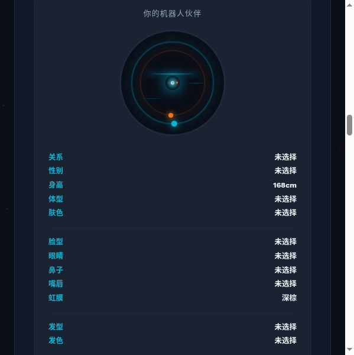
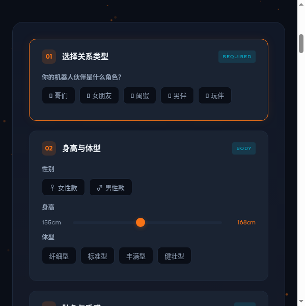
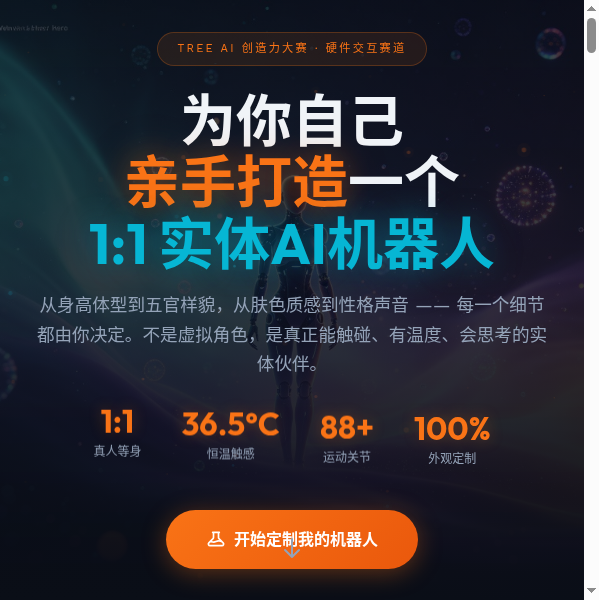
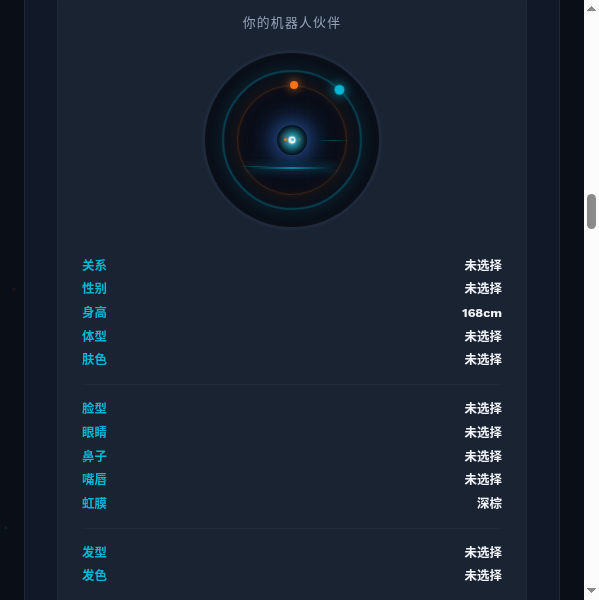

**【标签】硬件交互**

**【标题】【硬件交互赛道】My AI Robot —— 亲手打造你的1:1实体AI机器人伙伴**

---

## 0. 先和大家打个招呼吧 👋

我是一名对AI和机器人充满热情的独立创作者。

说实话，在做这个项目之前，我对前端开发、CSS动画、JavaScript这些几乎是一张白纸。整个Demo完全是我用 TRAE Work 一句一句"聊"出来的。

最开始我只是脑子里有一个模糊的想法——"如果每个人都能亲手定制一个真实存在的AI机器人伙伴会怎样？"——然后我就把这个想法用大白话讲给了TRAE听。最让我觉得"原来这么简单"的一步，是交互定制器部分：我只需要说"我要有选鼻子、选眼睛、选身高的按钮，点了要能看到变化"，TRAE 就直接生成了完整的6步交互流程和实时预览系统。还有那个科技感动画头像——双层旋转光环、扫描线、脉冲核心——我只说了一句"把脸换成高级科技感的动画效果"，它就搞定了全部CSS动画代码。

最有意思的是中间我还"带偏"过TRAE一次：第一次它帮我做成了虚拟社交App，我赶紧纠正说"不是手机里的虚拟角色，是要能触碰的实体机器人！"它立刻就理解了，重新做了一个完整的硬件定制方案。整个过程就像和一个很靠谱的搭档配合——你负责想象，它负责实现。

---

## 1. Demo 简介

### 是什么

**My AI Robot** 是一个 C2M 模式的 1:1 实体硅胶 AI 机器人定制平台的交互式 Demo。用户可以通过网页端配置器，从身高体型、肤色五官到性格声音，亲手设计一个真正能触碰、有温度、会思考的实体机器人伙伴。

### 面向谁

| 用户群体 | 需求场景 |
|---------|---------|
| 18-35岁独居青年 | 情感陪伴、日常互动、缓解孤独 |
| 科技爱好者/极客 | 将虚拟角色实体化、前沿体验 |
| 空巢老人家庭 | 日常陪伴、健康提醒 |
| 高端定制用户 | 打造独一无二的专属伙伴 |

### 主要功能

**功能一：全维度交互定制器**
6 大步骤、50+ 项定制参数，点击选项即可实时预览机器人头像变化。从关系类型（哥们/女朋友/闺蜜/男伴/玩伴）到身高体型、肤色质感、面部五官、发型发色、性格声音和独特怪癖，每一步都有视觉反馈。

**功能二：科技感动画头像实时响应**
预览区采用纯 CSS 高科技感动画头像——双层反向旋转光环、网格背景、上下扫描线、脉冲核心、HUD 数据线、闪烁数据点。选择眼睛颜色时核心光实时变色，选择发色时外环边框变色，切换选项时触发亮度闪烁反馈。

**功能三：完整商业模型展示**
四档产品线（9,800-98,000元）+ 五维盈利引擎（硬件销售、AI订阅、虚拟商城、UGC生态、品牌联名），附市场规模、用户溢价意愿、毛利率等核心数据指标，以及五阶段清晰发展路线图。

---

## 2. Demo 创作思路

### 灵感来源

灵感来自两个观察：

1. 2026年AI陪伴产业已进入规模化落地，全球市场规模突破450亿美元，但**实体AI伴侣机器人品类仍处于早期**，国内尚无头部玩家，存在12-18个月的先发窗口期。
2. 优世界U1系列人形机器人6天预售超2110台、Realbotix David在CES 2026引发热议——证明消费者对"拥有一个实体AI伙伴"有**真实且强烈的需求**。

我想，如果每个人都能像定制西装一样，亲手设计一个属于自己的实体AI伙伴呢？不是虚拟avatar，是能触碰、有温度、会思考的1:1实体机器人。

### 想解决的问题

| 痛点 | 现状 |
|-----|------|
| 情感陪伴缺口 | 中国独居人口超1.25亿，手机里聊天机器人无法提供实体存在感 |
| 个性化缺失 | 现有机器人外观固定，用户无法获得"专属感" |
| 价格高昂 | Realbotix全身款$95,000（约68万人民币），普通人买不起 |
| AI能力弱 | 很多实体机器人只是"会动的模型"，对话停留在固定话术 |
| 隐私焦虑 | 云端AI伴侣数据泄露风险高，用户需要本地化私密陪伴 |

### 为什么做这个方向

- **市场验证**：450亿美元市场规模，年增速35%+，有真实需求支撑
- **技术成熟**：硅胶工艺、伺服电机、大语言模型、TTS均已达消费级落地标准
- **差异化**：从"卖标准品"转向"卖定制服务"，C2M模式毛利率从30%提升到55%+
- **硬件交互赛道**：与纯软件项目形成差异化，技术壁垒更高

---

## 3. Demo 体验地址

**交互式 HTML 文件**：附件中的 `my-ai-robot-demo.zip`

解压后，用浏览器打开 `demo.html` 即可完整体验所有交互功能。

推荐方式：解压后在文件夹内运行 `python3 -m http.server 8090`，然后访问 `http://localhost:8090/demo.html`（字体和图片加载更稳定）。

---

## 4. TRAE 实践过程

整个 Demo 使用 **TRAE Work** 从零开始生成，历经约 8 个 Sessions，经历了"概念跑偏→纠正方向→交互打磨→商业补充→视觉升级→初赛打包→Bug修复"的完整迭代。

### 开发流程

**阶段一：概念定义**
- 最初TRAE帮我做成了"虚拟社交App"，我赶紧纠正：要的是**1:1实体硅胶机器人**
- TRAE立刻重新定位为C2M实体定制平台，输出了完整产品规划文档

**阶段二：交互设计**
- 我说"要有体验感，选鼻子、眼睛、身高的互动按键"
- TRAE生成了6步交互定制器 + 实时头像预览，每个选项点击后右侧头像即时变化
- 后续我又要求扩展选项：性格从5种增加到12种、声音从5种增加到12种，新增12项"独特怪癖"

**阶段三：商业与技术补充**
- 我说"保留所有内容，加点商业价值"
- 补充了五维盈利模型、市场规模数据、竞品分析、发展路线图

**阶段四：初赛Demo打包**
- TRAE精简出独立的 `demo.html`，添加Canvas粒子动画、滚动揭示动画
- 在浏览器测试中发现并修复了关键Bug（颜色匹配失效、emoji前缀导致匹配失败）

**阶段五：视觉与交互增强**
- 添加步骤导航点、进度条、按钮涟漪效果、结果弹窗
- AI生成3张梦幻背景图，增强发光文字和浮动动画效果

**阶段六：科技感动画头像**
- 我说"把机器人伴侣位置的脸换成高级科技感的动画效果"
- TRAE用纯CSS实现了：双层旋转光环 + 扫描线 + 脉冲核心 + HUD数据线，眼睛颜色和发色变化时还会实时变色响应

### 关键步骤截图

| 截图 | 说明 |
|-----|------|
|  | 首屏Hero区域：AI生成梦幻背景 + Canvas双色粒子动画 + 核心数据指标 |
|  | 交互定制器：6步定制流程 + 科技感动画头像实时预览 |
|  | 科技感动画头像：双层反向旋转光环 + 扫描线 + 脉冲核心 |
|  | 选择蓝色虹膜后核心光变色，验证交互反馈正常 |
|  | 商业价值区域：五维盈利模型 + 关键数据指标 |

### 踩坑复盘

**坑1：方向跑偏** — 第一次理解成"虚拟社交小程序"，我纠正后才转成实体硬件方案。教训：做产品前先确认"形态边界"。

**坑2：颜色匹配Bug** — TRAE生成的代码用 `getAttribute('style')` 获取颜色，但浏览器自动将hex转为rgb()，导致所有颜色名映射失效。Fix：为所有色块添加 `data-color` 属性直接存储中文颜色名。

**坑3：emoji文本匹配** — 按钮文本是"💖 女朋友"，但配置key是"女朋友"，直接匹配失败。Fix：正则清洗emoji前缀后再匹配。

**坑4：SVG替换后JS报错** — 将SVG人脸替换为CSS科技动画后，旧代码仍引用已删除的SVG元素ID。Fix：TRAE重写了 `updateSVG()` 为CSS动画驱动函数。

**坑5：反馈颜色名不匹配** — 审查代码时发现眼睛颜色比较值写的"琥珀色"但实际存储的是"琥珀"，发色比较的是hex值但config存的是中文色名。Fix：将比较值全部对齐为实际的 `data-color` 值。

### Session ID

> Session ID 请从 TRAE 左侧对话列表中获取，填入下方（至少3个）：

- Session 1：`（请替换为你的实际 Session ID）`
- Session 2：`（请替换为你的实际 Session ID）`
- Session 3：`（请替换为你的实际 Session ID）`
- Session 4：`（请替换为你的实际 Session ID）`
- Session 5：`（请替换为你的实际 Session ID）`
- Session 6：`（请替换为你的实际 Session ID）`
- Session 7：`（请替换为你的实际 Session ID）`
- Session 8：`（请替换为你的实际 Session ID）`

---

## 5. 对应的报名审核通过的帖子链接

`（请在此粘贴你的报名帖链接）`
