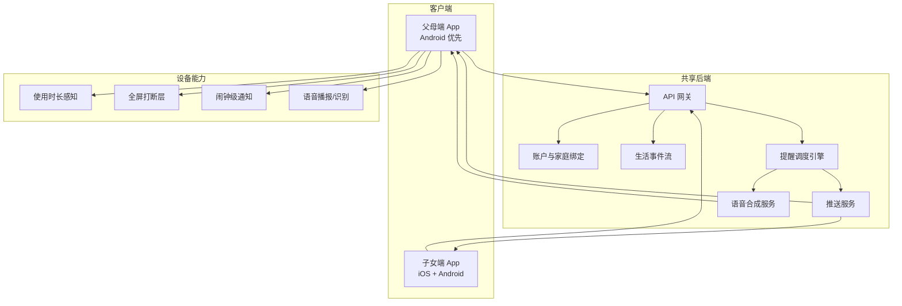
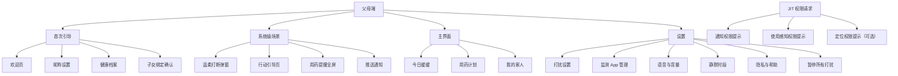
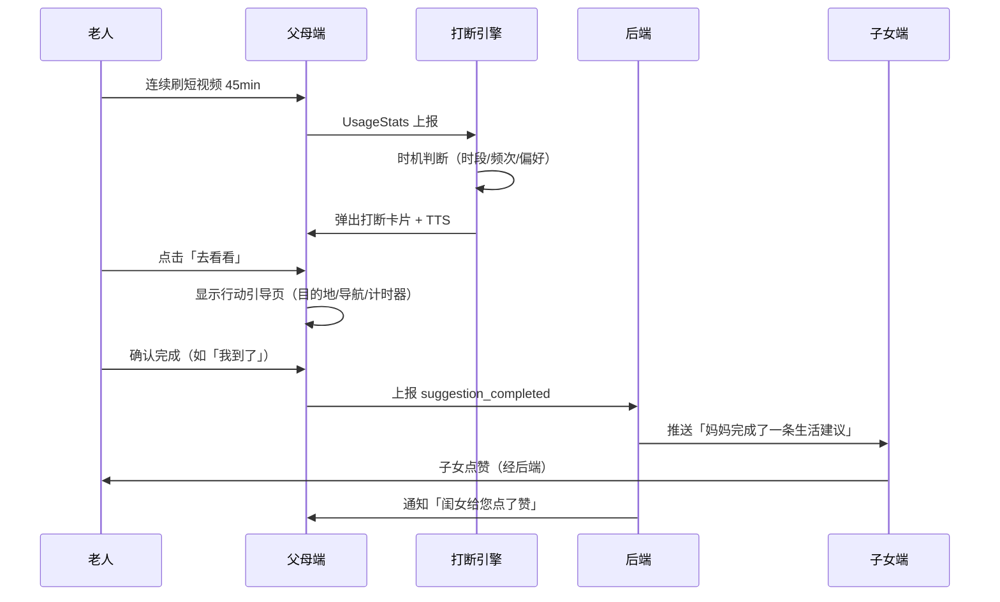
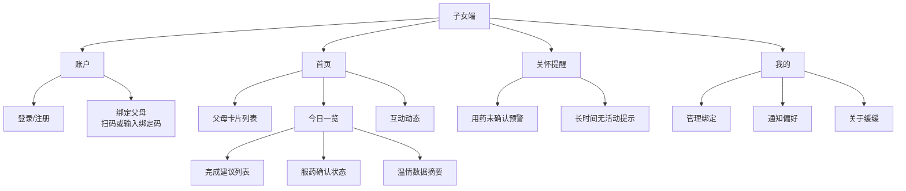
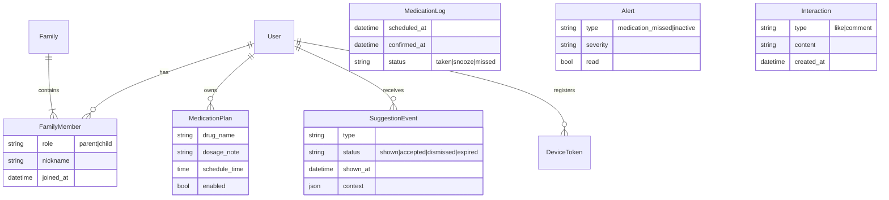

# 缓缓 · 信息架构（IA）

> 版本 V1.1 · 2026-07-11 · 对应 PRD V3.1（行动闭环 + 退出机制 + JIT 权限）

---

## 1. 产品拓扑

缓缓由**两个独立客户端 + 一个共享后端**组成，通过家庭绑定关系联通。



---

## 2. 双端角色与信息边界

| 维度 | 父母端 | 子女端 |
| :--- | :--- | :--- |
| **核心任务** | 接收陪伴建议、确认服药、完成生活行动 | 查看父母近况、温情互动、接收预警 |
| **信息粒度** | 实时提醒 + 本地执行 | **汇总态**日报，非实时监控 |
| **主动行为** | 被动接收打断/提醒为主 | 主动查看、点赞、留言 |
| **敏感数据** | 本地存储用药详情 | 仅看汇总（服药已确认/未完成），不看药名明细（可配置） |

---

## 3. 父母端信息架构

### 3.1 站点地图



### 3.2 页面层级

| 层级 | 页面 | 进入方式 | MVP |
| :--- | :--- | :--- | :--- |
| L0 系统层 | 温柔打断弹窗 | 后台感知触发，覆盖任意 App | ✅ |
| L0 系统层 | 行动引导页 | 打断弹窗点击「去看看」后 | ✅ |
| L0 系统层 | 用药提醒全屏 | 闹钟/推送触发 | ✅ |
| L1 引导层 | Onboarding（3 步） | 首次安装 | ✅ |
| L1 引导层 | JIT 权限提示 | 首次使用对应功能时 | ✅ |
| L2 主页层 | 今日缓缓 | 点击图标 / 通知跳转 | ✅ |
| L2 主页层 | 用药计划 | 底部导航 | ✅ |
| L2 主页层 | 我的家人 | 底部导航 | ✅ |
| L3 设置层 | 打扰与权限设置 | 主页右上角 | ✅ |

### 3.3 父母端导航结构

采用 **3 Tab 底部导航 + 系统级全屏覆盖**，主页信息极简，避免老人迷路。

```
┌─────────────────────────────────────┐
│  缓缓          [⚙️ 设置]            │
├─────────────────────────────────────┤
│                                     │
│           （页面内容区）              │
│                                     │
├─────────────────────────────────────┤
│  🌿今日   💊用药   👨‍👩‍👧家人          │
└─────────────────────────────────────┘
```

| Tab | 职责 | 核心信息 |
| :--- | :--- | :--- |
| **今日缓缓** | 今天发生了什么 | 已完成建议数、最近一条陪伴记录、语音助手入口 |
| **用药** | 今日服药计划 | 待服用 / 已服用时间轴，大按钮操作 |
| **家人** | 家庭连接 | 绑定的子女头像、绑定码、语音留言入口 |

> **设计原则**：父母端日常几乎不需要打开 App——核心体验在「系统打断」和「推送提醒」中完成。主页是兜底入口，不是主战场。

### 3.4 核心数据流



---

## 4. 子女端信息架构

### 4.1 站点地图



### 4.2 页面层级

| 层级 | 页面 | MVP |
| :--- | :--- | :--- |
| L1 | 登录 + 绑定父母 | ✅ |
| L2 | 首页（父母今日一览） | ✅ |
| L2 | 互动（点赞/留言） | ✅ |
| L2 | 关怀提醒列表 | ✅ |
| L3 | 父母详情（周报摘要） | ⬜ V1.5 |
| L3 | 远程任务共创 | ⬜ V2.0 |

### 4.3 子女端导航结构

```
┌─────────────────────────────────────┐
│           （页面内容区）              │
├─────────────────────────────────────┤
│   🏠 首页    💬 互动    🔔 提醒    👤 我的  │
└─────────────────────────────────────┘
```

| Tab | 职责 |
| :--- | :--- |
| **首页** | 父母卡片 + 今日完成事项摘要 |
| **互动** | 点赞、留言历史，发起语音问候 |
| **提醒** | 用药未确认、无活动等预警 |
| **我的** | 账户、绑定管理、通知设置 |

---

## 5. 内容分类体系

所有「陪伴建议」在后端统一建模为 **Suggestion（建议卡片）**，按类型分发的模块在 V1.5 逐步扩展。

| 类型 code | 模块名 | 示例 | MVP |
| :--- | :--- | :--- | :--- |
| `interrupt_rest` | 温柔打断·休息 | 歇歇眼睛，下楼看花 | ✅ |
| `interrupt_indoor` | 温柔打断·室内 | 听段戏曲，闭目养神 | ✅ |
| `medication` | 安康·用药 | 该吃降压药了 | ✅ |
| `cooking` | 食光·烹饪 | 午饭菜谱推荐 | ⬜ V1.5 |
| `market` | 食光·买菜 | 去菜场挑黄瓜 | ⬜ V1.5 |
| `outdoor` | 四季·出行 | 去滨河公园散步 | ⬜ V1.5 |
| `hobby` | 闲情·慢时光 | 钩针/浇花 | ⬜ V1.5 |

### 建议卡片数据结构

```
SuggestionCard
├── id
├── type            # 见上表
├── title           # 「歇歇眼睛吧」
├── body            # 「楼下月季开得正好…」
├── image_url       # 配图（花、菜、公园）
├── voice_text      # TTS 播报全文
├── actions[]       # [{label:"去看看", action:"accept"}, {label:"不了谢谢", action:"dismiss"}]
├── context         # {time, weather, location, user_preference}
└── expires_at      # 过期自动关闭
```

---

## 6. 后端领域模型



---

## 7. 权限与能力矩阵

| 能力 | 父母端 | 子女端 | 说明 |
| :--- | :---: | :---: | :--- |
| 读取 App 使用时长 | ✅ | — | 仅父母端，Android UsageStats |
| 全屏遮罩打断 | ✅ | — | 仅 Android |
| 用药计划 CRUD | ✅ | 代设（需父母确认） | 子女可协助初始化 |
| 查看建议完成汇总 | ✅ | ✅ | 子女只看汇总 |
| 发起点赞/留言 | — | ✅ | |
| 接收安全预警 | ✅（告知） | ✅ | 双方需提前授权 |
| 实时 GPS 轨迹 | — | — | **不做** |

---

## 8. MVP 范围对照

| 信息架构节点 | MVP | 备注 |
| :--- | :---: | :--- |
| 父母端 Onboarding（3 步） | ✅ | JIT 权限请求拆出 |
| JIT 权限提示 | ✅ | 通知、感知、定位随用随请 |
| 温柔打断弹窗 | ✅ | Android 完整，iOS 通知替代 |
| 行动引导页 | ✅ | 户外/室内/简单确认三类 |
| 用药提醒 + 确认 | ✅ | |
| 子女端绑定 | ✅ | 6 位码 |
| 子女端今日一览 | ✅ | |
| 点赞/留言 | ✅ | |
| 安全预警 | ✅ | 用药未确认 + 无活动 |
| 语音记录健康指标 | ⬜ | V1.5 |
| 买菜/出行/烹饪 | ⬜ | V1.5 |
| 远程任务共创 | ⬜ | V2.0 |
