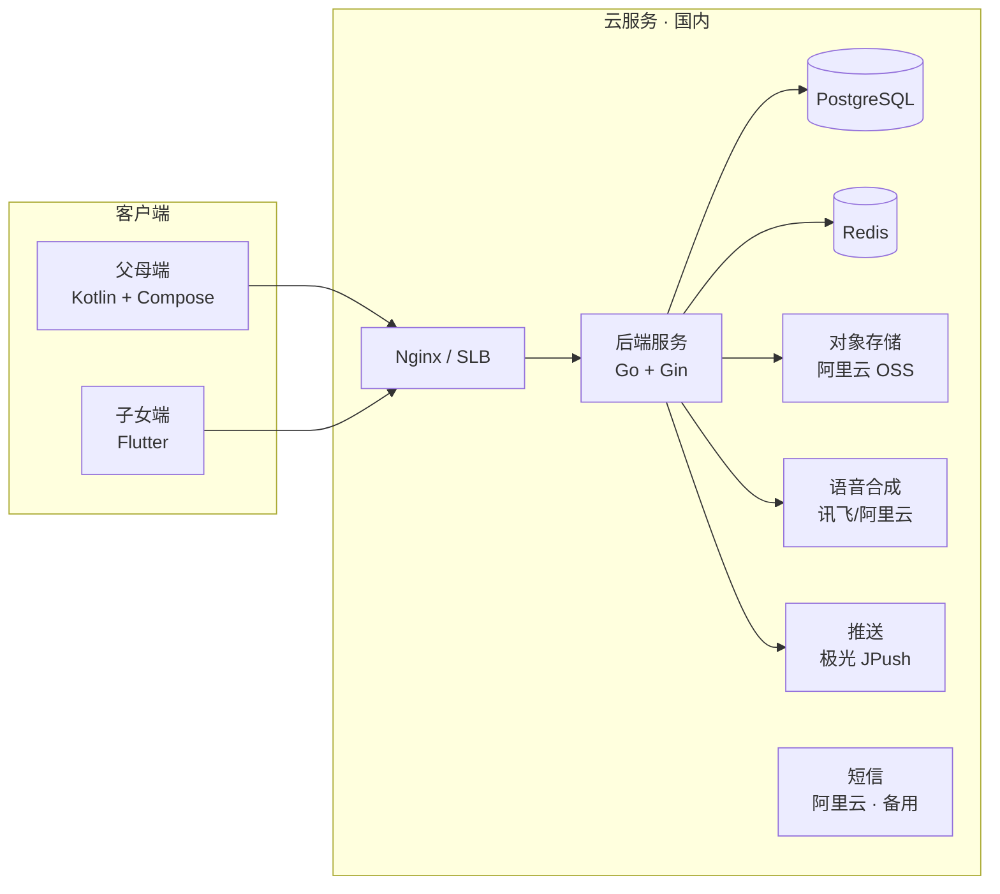

# 缓缓 · MVP 技术选型

> 版本 V1.0 · 2026-07-10 · 目标：8–10 周验证「愿不愿听、能不能执行」

---

## 1. 选型原则

| 原则 | 说明 |
| :--- | :--- |
| **Android 优先** | 温柔打断依赖 UsageStats + 悬浮窗，MVP 在父母端先跑通完整体验 |
| **双端异构可接受** | 父母端重系统能力，子女端重跨平台效率——允许不同技术栈 |
| **少自建、快验证** | MVP 阶段 TTS/推送等优先用成熟云服务，避免重复造轮子 |
| **合规前置** | 健康数据加密、最小采集、审计日志从第一版就做 |

---

## 2. 总体架构



---

## 3. 客户端选型

### 3.1 父母端：Kotlin + Jetpack Compose（Android Native）

| 项目 | 选择 | 理由 |
| :--- | :--- | :--- |
| 语言/框架 | Kotlin + Compose | 无障碍定制、系统 API 接入最顺畅 |
| 最低 SDK | API 26（Android 8.0） | 覆盖 95%+ 国内存量机 |
| 目标 SDK | API 34 | 应用商店合规 |
| 架构 | MVVM + Clean Architecture 轻量版 | ViewModel + Repository + UseCase |
| 本地存储 | Room + DataStore | 用药计划离线可用 |
| 后台任务 | WorkManager + Foreground Service | 用药提醒、使用时长轮询 |
| 依赖注入 | Hilt | 社区成熟 |

#### 关键系统能力实现

| 能力 | 实现方案 | 备选 |
| :--- | :--- | :--- |
| App 使用时长监测 | `UsageStatsManager` + `PACKAGE_USAGE_STATS` 权限 | — |
| 全屏打断 | `TYPE_APPLICATION_OVERLAY` 悬浮窗 + 全屏 Activity fallback | 厂商白名单引导 |
| 用药准时提醒 | `AlarmManager.setExactAndAllowWhileIdle` | 比 WorkManager 更准时 |
| 语音播报 | Android `TextToSpeech`（MVP）→ 云端 TTS（V1.5 音质升级） | 讯飞离线包 |
| 保活策略 | 前台服务 + 电池优化白名单引导 + 厂商通道推送兜底 | 不做违规保活 |

#### 为什么不选 Flutter/React Native 做父母端

- 全屏遮罩、UsageStats、精确闹钟均需深度原生代码，跨平台优势被抵消
- 老人端 UI 稳定性要求高，原生调试系统级问题更直接
- MVP 只发 Android，无跨平台刚需

### 3.2 子女端：Flutter 3.x

| 项目 | 选择 | 理由 |
| :--- | :--- | :--- |
| 框架 | Flutter 3.x + Dart | 一套代码覆盖 iOS + Android，子女用户 iPhone 占比高 |
| 状态管理 | Riverpod | 轻量、可测试 |
| 网络 | Dio + Retrofit 风格封装 | |
| 推送 | JPush Flutter Plugin | 国内到达率 |
| UI 组件 | 自定义 + Material 3 基底 | 与品牌视觉统一 |

#### 子女端不需要原生深度的理由

- 功能为标准 CRUD + 推送 + 列表，无系统级权限需求
- Flutter 开发效率高于双端各写一套

### 3.3 iOS 父母端（MVP 策略：不做，或极简版）

| 能力 | iOS 替代方案 |
| :--- | :--- |
| 使用时长监测 | **无法实现**等效 Android 监测 → 不做 |
| 打断 | 高优先级推送 + 强铃声 + Deep Link 回 App |
| 用药提醒 | `UNNotificationTrigger` 本地通知 |
| 语音播报 | `AVSpeechSynthesizer` |

> **MVP 决策**：父母端仅发布 Android。子女端 iOS 正常发布。在应用商店文案中诚实说明平台差异。

---

## 4. 后端选型

### 4.1 主栈：Go + Gin

| 项目 | 选择 | 理由 |
| :--- | :--- | :--- |
| 语言/框架 | Go 1.22 + Gin | 高并发推送调度、部署简单、单二进制 |
| API 风格 | REST + JSON | MVP 够用；V2 可加 gRPC 内部通信 |
| 鉴权 | JWT（Access 2h + Refresh 30d） | 子女端标准方案 |
| 父母端鉴权 | 设备 ID + 绑定码激活 → 长期 Token | 降低老人登录门槛 |
| 文档 | Swagger (swaggo) | 前后端协作 |

#### 备选：Node.js (NestJS)

适合团队前端背景强的情况。若团队 Go 经验少，可换 NestJS，架构不变。

### 4.2 数据存储

| 存储 | 用途 | 说明 |
| :--- | :--- | :--- |
| **PostgreSQL 15** | 主库 | 用户、家庭、用药、事件、互动 |
| **Redis 7** | 缓存 + 调度 | 打断频次计数、提醒去重、Session |
| **阿里云 OSS** | 静态资源 | 建议卡片配图、语音缓存文件 |

#### 核心表（MVP）

```
users, families, family_members,
medication_plans, medication_logs,
suggestion_events, alerts, interactions,
device_tokens, audit_logs
```

### 4.3 任务调度

| 场景 | 方案 |
| :--- | :--- |
| 用药提醒触发 | 父母端本地 AlarmManager 为主，服务端 Cron 兜底推送 |
| 子女端预警（用药未确认） | 后端 Cron（每 5 分钟扫描）+ JPush |
| 无活动检测 | 父母端心跳上报（每 30 分钟）+ 后端规则判断 |

---

## 5. 云服务选型（国内）

| 能力 | 推荐 | MVP 成本预估 |
| :--- | :--- | :--- |
| 云主机 | 阿里云 ECS 2C4G × 2 | ¥200–400/月 |
| 数据库 | RDS PostgreSQL 基础版 | ¥150/月 |
| 对象存储 | 阿里云 OSS | ¥10/月 |
| 推送 | 极光推送 JPush | 免费额度内 |
| 语音合成 TTS | 讯飞开放平台 / 阿里云智能语音 | 按量，MVP ¥50–100/月 |
| 语音识别 ASR | 讯飞（V1.5 健康记录用） | MVP 不用 |
| 短信 | 阿里云短信（绑定验证码备用） | 按量 |
| 域名 + HTTPS | 阿里云 + Let's Encrypt | ¥50/年 |

> **MVP 月成本估算**：¥500–800（低流量验证期）

---

## 6. 安全与合规

| 项目 | 方案 |
| :--- | :--- |
| 传输加密 | 全站 HTTPS，TLS 1.2+ |
| 健康数据 | 字段级 AES 加密（药品名、指标值） |
| 密钥管理 | 阿里云 KMS 或环境变量 + 轮换策略 |
| 日志 | 操作审计日志，保留 180 天 |
| 隐私 | 隐私政策 + 用户协议 + 明示权限用途 |
| 等保 | MVP 不做等保测评，架构预留审计能力 |

---

## 7. 研发工具链

| 类别 | 工具 |
| :--- | :--- |
| 代码仓库 | GitHub / GitLab |
| CI/CD | GitHub Actions → 阿里云 |
| 父母端构建 | Gradle + Android Studio |
| 子女端构建 | Flutter CLI + Codemagic（iOS 证书） |
| 后端部署 | Docker + docker-compose（MVP）→ K8s（规模化） |
| API 测试 | Postman / Bruno |
| 监控 | Sentry（崩溃）+ 阿里云 ARMS（后端） |
| 设计协作 | Figma（线框图 → 高保真） |

---

## 8. 项目目录结构（建议）

```
huanhuan/
├── apps/
│   ├── parent-android/     # Kotlin + Compose 父母端
│   └── child-flutter/      # Flutter 子女端
├── services/
│   └── api/                # Go 后端
├── packages/
│   └── shared-models/      # OpenAPI 生成的 DTO（可选）
├── docs/                   # 设计文档
├── infra/
│   └── docker-compose.yml
└── README.md
```

---

## 9. MVP 技术里程碑

| 周次 | 交付物 |
| :--- | :--- |
| W1–2 | 后端骨架 + 家庭绑定 API + 父母端 Onboarding |
| W3–4 | UsageStats 监测 + 打断弹窗 + TTS 播报 |
| W5–6 | 用药提醒（本地闹钟 + 确认闭环）+ 子女端首页 |
| W7 | 子女端互动（点赞/留言）+ 安全预警 |
| W8 | 联调、内测、崩溃修复 |
| W9–10 | 小范围灰度（20–50 个家庭） |

---

## 10. 关键技术风险与对策

| 风险 | 等级 | 对策 |
| :--- | :--- | :--- |
| 悬浮窗权限被用户拒绝 | 高 | Onboarding 分步引导 + 无可替代则降级为全屏 Activity |
| 后台服务被杀 | 高 | 前台服务 + 白名单教程 + 推送兜底 |
| 厂商系统差异（小米/华为/OPPO） | 中 | 主流 5 品牌真机测试矩阵 |
| TTS 音质机械感 | 低 | MVP 用系统 TTS，V1.5 换云端音色 |
| 父母端无 iOS | 中 | 产品文案管理预期；子女端 iOS 正常 |
| 健康数据合规 | 中 | 最小采集 + 加密 + 不在第三方 App 读取输入 |

---

## 11. 选型决策摘要

| 层 | 最终选择 |
| :--- | :--- |
| 父母端 | **Kotlin + Jetpack Compose**（Android Only MVP） |
| 子女端 | **Flutter 3.x**（iOS + Android） |
| 后端 | **Go + Gin + PostgreSQL + Redis** |
| 推送 | **极光 JPush** |
| TTS | **系统 TTS（MVP）→ 讯飞/阿里云（V1.5）** |
| 部署 | **Docker on 阿里云 ECS** |

此组合在 **8–10 周** 内可完成 MVP，并在 Android 上跑通核心差异化能力「温柔打断」。
