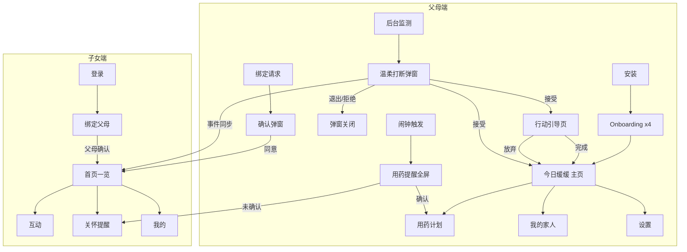

# 缓缓 · UI 线框图

> 版本 V1.1 · 2026-07-11 · MVP 范围 · 低保真线框
> V1.1 变更：新增行动引导页、打断弹窗增加退出机制、Onboarding 改为 3 步 + JIT 权限

---

## 0. 设计规范速查

| Token | 值 | 用途 |
| :--- | :--- | :--- |
| 主色 | `#2D6A4F` 深绿 | 按钮、导航选中态 |
| 辅色 | `#F4F1DE` 暖米白 | 卡片背景 |
| 强调 | `#E07A5F` 暖珊瑚 | 用药提醒、预警 |
| 背景 | `#FFFFFF` | 页面底色 |
| 正文色 | `#1B1B1B` | 主要文字 |
| 最小字号 | 18sp（父母端）/ 14sp（子女端） | |
| 按钮高度 | ≥ 56dp（父母端）/ 48dp（子女端） | |
| 圆角 | 16dp 卡片 / 12dp 按钮 | |
| 间距 | 8dp 基准网格 | |

---

# 一、父母端线框图

## 1.1 Onboarding · 欢迎页

```
┌─────────────────────────────────────┐
│                                     │
│                                     │
│         ┌───────────────┐           │
│         │   🌿 缓缓      │           │
│         │   logo 区      │           │
│         └───────────────┘           │
│                                     │
│      您好，我是缓缓                    │
│      往后日子缓缓过，                  │
│      我轻轻陪着您。                    │
│                                     │
│                                     │
│   ┌─────────────────────────────┐   │
│   │         开始使用              │   │
│   └─────────────────────────────┘   │
│                                     │
│              ● ○ ○                   │
└─────────────────────────────────────┘
```

**交互**：点击「开始使用」→ 昵称设置。无跳过。3 步引导（去掉了独立的权限说明页，权限改为随用随请求）。

---

## 1.2 Onboarding · 昵称设置

```
┌─────────────────────────────────────┐
│  ←                           2/3   │
│                                     │
│      您希望我怎样称呼您？              │
│                                     │
│   ┌─────────────────────────────┐   │
│   │  王阿姨                       │   │
│   └─────────────────────────────┘   │
│                                     │
│   常用：                              │
│   ┌────────┐ ┌────────┐ ┌────────┐  │
│   │ 老朋友  │ │ 王阿姨  │ │ 李叔叔  │  │
│   └────────┘ └────────┘ └────────┘  │
│                                     │
│                                     │
│   ┌─────────────────────────────┐   │
│   │           下一步              │   │
│   └─────────────────────────────┘   │
│                                     │
│              ○ ● ○                   │
└─────────────────────────────────────┘
```

---

## 1.3 Onboarding · 健康档案（可跳过）

```
┌─────────────────────────────────────┐
│  ←                           3/3   │
│                                     │
│      告诉我一些健康小事                │
│      我好贴心提醒您                   │
│                                     │
│   有没有这些情况？（可多选）            │
│   ┌────────┐ ┌────────┐ ┌────────┐  │
│   │ ✓高血压 │ │  糖尿病 │ │  关节炎 │  │
│   └────────┘ └────────┘ └────────┘  │
│                                     │
│   需要提醒吃药吗？                    │
│   ┌─────────────────────────────┐   │
│   │  + 添加药品                    │   │
│   └─────────────────────────────┘   │
│                                     │
│   ┌──────────┐  ┌────────────────┐  │
│   │ 先不设置  │  │     完成设置      │  │
│   └──────────┘  └────────────────┘  │
│                                     │
│              ○ ○ ●                   │
└─────────────────────────────────────┘
```

---

## 1.3b JIT 权限提示（首次进入主页时）

```
┌─────────────────────────────────────┐
│                                     │
│   ┌─────────────────────────────┐   │
│   │  🔔 开启通知                  │   │
│   │                             │   │
│   │  开启通知后，我能准时提醒您     │   │
│   │  吃药、喝水和出门散步~         │   │
│   │                             │   │
│   │  ⚠️ 不会读取您的聊天和支付信息  │   │
│   │                             │   │
│   │  ┌──────────────────────┐  │   │
│   │  │     好的，开启通知      │  │   │
│   │  └──────────────────────┘  │   │
│   │                             │   │
│   │  暂不开启 >                   │   │
│   └─────────────────────────────┘   │
│                                     │
└─────────────────────────────────────┘
```

> 权限提示在使用对应功能时自然弹出（JIT），不堆砌在 Onboarding 中。
> - 通知权限：首次进入「今日缓缓」主页时弹出
> - 使用感知权限：首次进入「设置 > 监测 App 管理」时弹出
> - 定位权限：首次触发出行建议时弹出

---

## 1.5 主页 · 今日缓缓（Tab 1）

```
┌─────────────────────────────────────┐
│  缓缓                    ⚙️         │
├─────────────────────────────────────┤
│                                     │
│   早上好，王阿姨 🌿                    │
│   今天已完成 1 件小事                  │
│                                     │
│   ┌─────────────────────────────┐   │
│   │  ✅ 上午 8:00                  │   │
│   │  服用了降压药                    │   │
│   └─────────────────────────────┘   │
│                                     │
│   ┌─────────────────────────────┐   │
│   │  🌺 今天 15:30                 │   │
│   │  您接受了「下楼看花」建议         │   │
│   │  闺女给您点了赞 ❤️              │   │
│   └─────────────────────────────┘   │
│                                     │
│   ┌─────────────────────────────┐   │
│   │  🎤  有事跟缓缓说               │   │
│   │      按住说话                   │   │
│   └─────────────────────────────┘   │
│                                     │
├─────────────────────────────────────┤
│   🌿今日     💊用药     👨‍👩‍👧家人      │
│   ━━━━                              │
└─────────────────────────────────────┘
```

---

## 1.6 用药计划（Tab 2）

```
┌─────────────────────────────────────┐
│  用药计划                            │
├─────────────────────────────────────┤
│                                     │
│   今天 · 3月15日 周六                 │
│                                     │
│   ┌─────────────────────────────┐   │
│   │  08:00  ✅ 已服用              │   │
│   │  降压药（苯磺酸氨氯地平）         │   │
│   └─────────────────────────────┘   │
│                                     │
│   ┌─────────────────────────────┐   │
│   │  12:30  ⏳ 待服用              │   │
│   │  钙片                          │   │
│   │  ┌──────────┐ ┌──────────┐    │   │
│   │  │ ✅ 已服用  │ │ ⏰ 等会提醒 │    │   │
│   │  └──────────┘ └──────────┘    │   │
│   └─────────────────────────────┘   │
│                                     │
│   ┌─────────────────────────────┐   │
│   │  20:00  · 未到时间             │   │
│   │  降压药                        │   │
│   └─────────────────────────────┘   │
│                                     │
│   ┌─────────────────────────────┐   │
│   │  + 添加提醒                    │   │
│   └─────────────────────────────┘   │
│                                     │
├─────────────────────────────────────┤
│   🌿今日     💊用药     👨‍👩‍👧家人      │
│          ━━━━                       │
└─────────────────────────────────────┘
```

---

## 1.7 我的家人（Tab 3）

```
┌─────────────────────────────────────┐
│  我的家人                            │
├─────────────────────────────────────┤
│                                     │
│   已绑定的家人                        │
│                                     │
│   ┌─────────────────────────────┐   │
│   │  👤 小明（儿子）               │   │
│   │  已关注您的生活建议              │   │
│   │  今天给您点了赞 ❤️              │   │
│   └─────────────────────────────┘   │
│                                     │
│   ┌─────────────────────────────┐   │
│   │  绑定新家人                    │   │
│   │                              │   │
│   │      您的绑定码：               │   │
│   │      ┌─────────────┐          │   │
│   │      │   8 3 5 2 1 6  │          │   │
│   │      └─────────────┘          │   │
│   │      让家人在缓缓里输入此码       │   │
│   │                              │   │
│   │      [ 显示二维码 ]            │   │
│   └─────────────────────────────┘   │
│                                     │
├─────────────────────────────────────┤
│   🌿今日     💊用药     👨‍👩‍👧家人      │
│                    ━━━━             │
└─────────────────────────────────────┘
```

---

## 1.8 系统层 · 温柔打断弹窗（核心）

```
┌─────────────────────────────────────┐
│▓▓▓▓▓▓▓▓▓▓▓▓▓▓▓▓▓▓▓▓▓▓▓▓▓▓▓▓▓▓▓▓▓▓▓▓▓│
│▓▓▓▓▓▓▓▓▓▓▓▓▓▓▓▓▓▓▓▓▓▓▓▓▓▓▓▓▓▓▓▓▓▓▓▓▓│
│▓▓▓▓  (半透明遮罩，下层为短视频)  ▓▓▓▓▓│
│▓▓▓▓▓▓▓▓▓▓▓▓▓▓▓▓▓▓▓▓▓▓▓▓▓▓▓▓▓▓▓▓▓▓▓▓▓│
│▓▓▓▓  ┌───────────────────────┐  ▓▓▓▓│
│▓▓▓▓  │                       │  ▓▓▓▓│
│▓▓▓▓  │   [ 月季花高清图 ]      │  ▓▓▓▓│
│▓▓▓▓  │                       │  ▓▓▓▓│
│▓▓▓▓  │  王阿姨，歇歇眼睛吧      │  ▓▓▓▓│
│▓▓▓▓  │                       │  ▓▓▓▓│
│▓▓▓▓  │  楼下月季开得正好，      │  ▓▓▓▓│
│▓▓▓▓  │  咱们下楼看看？          │  ▓▓▓▓│
│▓▓▓▓  │  走路只要 5 分钟~        │  ▓▓▓▓│
│▓▓▓▓  │                       │  ▓▓▓▓│
│▓▓▓▓  │   🔊 再听一遍            │  ▓▓▓▓│
│▓▓▓▓  └───────────────────────┘  ▓▓▓▓│
│▓▓▓▓▓▓▓▓▓▓▓▓▓▓▓▓▓▓▓▓▓▓▓▓▓▓▓▓▓▓▓▓▓▓▓▓▓│
│▓▓▓▓  ┌──────────┐ ┌──────────┐  ▓▓▓▓│
│▓▓▓▓  │ 去看看 🌺 │ │不了，谢谢 │  ▓▓▓▓│
│▓▓▓▓  └──────────┘ └──────────┘  ▓▓▓▓│
│▓▓▓▓▓▓▓▓▓▓▓▓▓▓▓▓▓▓▓▓▓▓▓▓▓▓▓▓▓▓▓▓▓▓▓▓▓│
│▓▓▓▓▓▓▓▓▓  暂时不想被打扰 >  ▓▓▓▓▓▓▓▓│
└─────────────────────────────────────┘
```

**要点**：
- 两个按钮**等宽等高**
- 自动 TTS 播报，「再听一遍」可重复
- **「暂时不想被打扰」底部小字链接，5 秒后淡入显示**，点击后当日不再弹出打断
- 用户点击「不了，谢谢」后，卡片直接收起，无二次确认
- 用药提醒等健康类弹窗**不包含退出机制**

---

## 1.8b 系统层 · 行动引导页（新增）

打断弹窗点击「去看看」后弹出，提供明确的下一步行动引导。

### 户外散步引导

```
┌─────────────────────────────────────┐
│  ←  去楼下看看                       │
├─────────────────────────────────────┤
│                                     │
│   ┌─────────────────────────────┐   │
│   │                             │   │
│   │   [ 滨河公园实景图 ]          │   │
│   │                             │   │
│   └─────────────────────────────┘   │
│                                     │
│   📍 滨河公园                         │
│   离您约 800 米，步行 12 分钟          │
│   🌡️ 现在 25°C，微风，适合散步        │
│                                     │
│   ┌─────────────────────────────┐   │
│   │        📍 一键导航             │   │
│   └─────────────────────────────┘   │
│                                     │
│   ┌──────────┐  ┌────────────┐      │
│   │  🚶 我到了  │ │ 这次算了    │      │
│   └──────────┘  └────────────┘      │
│                                     │
└─────────────────────────────────────┘
```

### 室内活动引导

```
┌─────────────────────────────────────┐
│  ←  休息一下                         │
├─────────────────────────────────────┤
│                                     │
│         🎵 来听段戏曲吧              │
│                                     │
│      ▶  京剧《贵妃醉酒》选段          │
│                                     │
│   ┌────────┐ ┌────────┐ ┌────────┐  │
│   │ 15分钟  │ │ 30分钟  │ │ 60分钟  │  │
│   └────────┘ └────────┘ └────────┘  │
│                                     │
│   ┌─────────────────────────────┐   │
│   │          ▶ 开始播放           │   │
│   └─────────────────────────────┘   │
│                                     │
│                                     │
│              ○○○○○○                  │
│           （倒计时进度条）             │
│                                     │
│   ┌─────────────────────────────┐   │
│   │        ✅ 听完了，感觉不错     │   │
│   └─────────────────────────────┘   │
│                                     │
└─────────────────────────────────────┘
```

**要点**：
- 每种建议类型对应不同的引导页模板
- 户外类包含：目的地信息 + 天气 + 一键导航 + 「我到了」确认
- 室内类包含：内容播放 + 计时器 + 完成确认
- 用户点击「我到了」/「听完了」→ 记入北极星指标
- 「这次算了」→ 回到主页，不记完成

---

## 1.9 系统层 · 用药提醒全屏

```
┌─────────────────────────────────────┐
│                                     │
│         🫀 安康守护                  │
│                                     │
│         现在时刻                     │
│         08:00                        │
│                                     │
│   ┌─────────────────────────────┐   │
│   │                             │   │
│   │     💊 该吃降压药了            │   │
│   │                             │   │
│   │   苯磺酸氨氯地平片              │   │
│   │   1 片，温水送服               │   │
│   │                             │   │
│   │      🔊 再听一遍               │   │
│   │                             │   │
│   └─────────────────────────────┘   │
│                                     │
│   ┌────────────┐  ┌────────────┐    │
│   │  ✅ 已服用   │  │ ⏰ 等会提醒  │    │
│   └────────────┘  └────────────┘    │
│                                     │
└─────────────────────────────────────┘
```

---

## 1.10 设置页

```
┌─────────────────────────────────────┐
│  ←  设置                            │
├─────────────────────────────────────┤
│                                     │
│   打扰设置                           │
│   ┌─────────────────────────────┐   │
│   │  刷手机多久后提醒    45分钟 >   │   │
│   │  每天最多提醒        3次  >    │   │
│   │  静默时段      21:00-07:00 >  │   │
│   └─────────────────────────────┘   │
│                                     │
│   监测的 App                         │
│   ┌─────────────────────────────┐   │
│   │  ✓ 抖音   ✓ 快手   ✓ 今日头条  │   │
│   │  ✓ 小游戏  + 添加更多          │   │
│   └─────────────────────────────┘   │
│                                     │
│   语音                               │
│   ┌─────────────────────────────┐   │
│   │  播报音量            ████░ >  │   │
│   │  播报语速            慢速  >  │   │
│   └─────────────────────────────┘   │
│                                     │
│   ┌─────────────────────────────┐   │
│   │  ⏸ 暂停所有打扰（今天）         │   │
│   └─────────────────────────────┘   │
│                                     │
│   隐私与帮助 · 关于缓缓 · 退出          │
│                                     │
└─────────────────────────────────────┘
```

---

# 二、子女端线框图

## 2.1 登录 / 注册

```
┌─────────────────────────────────────┐
│                                     │
│         ┌───────────────┐           │
│         │   🌿 缓缓      │           │
│         └───────────────┘           │
│         日子缓缓，陪伴轻轻              │
│                                     │
│   ┌─────────────────────────────┐   │
│   │  手机号                        │   │
│   └─────────────────────────────┘   │
│   ┌─────────────────────────────┐   │
│   │  验证码               [获取]   │   │
│   └─────────────────────────────┘   │
│                                     │
│   ┌─────────────────────────────┐   │
│   │           登录               │   │
│   └─────────────────────────────┘   │
│                                     │
└─────────────────────────────────────┘
```

---

## 2.2 绑定父母

```
┌─────────────────────────────────────┐
│  ←  绑定父母                         │
├─────────────────────────────────────┤
│                                     │
│   请父母在缓缓 App 中                │
│   查看绑定码或二维码                   │
│                                     │
│   ┌─────────────────────────────┐   │
│   │                             │   │
│   │      [ 扫描二维码 ]            │   │
│   │                             │   │
│   └─────────────────────────────┘   │
│                                     │
│   或手动输入绑定码                     │
│   ┌───┐ ┌───┐ ┌───┐ ┌───┐ ┌───┐ ┌───┐│
│   │ 8 │ │ 3 │ │ 5 │ │ 2 │ │ 1 │ │ 6 ││
│   └───┘ └───┘ └───┘ └───┘ └───┘ └───┘│
│                                     │
│   称呼                                │
│   ┌─────────────────────────────┐   │
│   │  妈妈                         │   │
│   └─────────────────────────────┘   │
│                                     │
│   ┌─────────────────────────────┐   │
│   │         发送绑定请求           │   │
│   └─────────────────────────────┘   │
│                                     │
│   ⚠️ 需父母在手机上确认后生效          │
│                                     │
└─────────────────────────────────────┘
```

---

## 2.3 首页 · 父母今日一览（Tab 1）

```
┌─────────────────────────────────────┐
│  缓缓                                │
├─────────────────────────────────────┤
│                                     │
│   ┌─────────────────────────────┐   │
│   │  👵 妈妈          今天 ✅ 良好  │   │
│   │  ─────────────────────────  │   │
│   │  ✅ 08:00 按时服药             │   │
│   │  🌺 15:30 下楼看花             │   │
│   │  ⏳ 12:30 钙片待确认            │   │
│   │                             │   │
│   │  ┌────────┐ ┌────────────┐  │   │
│   │  │ ❤️ 点赞  │ │ 💬 留言     │  │   │
│   │  └────────┘ └────────────┘  │   │
│   └─────────────────────────────┘   │
│                                     │
│   ┌─────────────────────────────┐   │
│   │  + 绑定更多父母                │   │
│   └─────────────────────────────┘   │
│                                     │
│   本周小结                            │
│   ┌─────────────────────────────┐   │
│   │  完成生活建议  5 次             │   │
│   │  按时服药      6/7 天           │   │
│   │  您的互动      3 次             │   │
│   └─────────────────────────────┘   │
│                                     │
├─────────────────────────────────────┤
│  🏠首页   💬互动   🔔提醒   👤我的    │
│  ━━━━                               │
└─────────────────────────────────────┘
```

---

## 2.4 互动页（Tab 2）

```
┌─────────────────────────────────────┐
│  互动                                │
├─────────────────────────────────────┤
│                                     │
│   ┌─────────────────────────────┐   │
│   │  👵 妈妈                      │   │
│   │  今天 16:00                   │   │
│   │  您点赞了「下楼看花」           │   │
│   └─────────────────────────────┘   │
│                                     │
│   ┌─────────────────────────────┐   │
│   │  👵 妈妈                      │   │
│   │  今天 08:15                   │   │
│   │  您留言：吃药真乖，周末来看您 ❤️  │   │
│   └─────────────────────────────┘   │
│                                     │
│   ┌─────────────────────────────┐   │
│   │  给妈妈留言                     │   │
│   │  ┌───────────────────────┐    │   │
│   │  │ 妈，天冷了多穿点...      │    │   │
│   │  └───────────────────────┘    │   │
│   │              [ 发送 ]          │   │
│   └─────────────────────────────┘   │
│                                     │
├─────────────────────────────────────┤
│  🏠首页   💬互动   🔔提醒   👤我的    │
│        ━━━━                         │
└─────────────────────────────────────┘
```

---

## 2.5 关怀提醒（Tab 3）

```
┌─────────────────────────────────────┐
│  关怀提醒                     全部已读  │
├─────────────────────────────────────┤
│                                     │
│   ┌─────────────────────────────┐   │
│   │  🔴 妈妈 · 10分钟前             │   │
│   │  12:30 的钙片还未确认服用         │   │
│   │  ┌──────────┐ ┌──────────┐    │   │
│   │  │ 打电话    │ │ 稍后提醒   │    │   │
│   │  └──────────┘ └──────────┘    │   │
│   └─────────────────────────────┘   │
│                                     │
│   ┌─────────────────────────────┐   │
│   │  🟡 妈妈 · 2小时前              │   │
│   │  今天下午手机使用较少             │   │
│   │  可能休息得不错 😊               │   │
│   └─────────────────────────────┘   │
│                                     │
│   ┌─────────────────────────────┐   │
│   │  ⚪ 妈妈 · 昨天                 │   │
│   │  降压药已按时服用 ✅             │   │
│   └─────────────────────────────┘   │
│                                     │
├─────────────────────────────────────┤
│  🏠首页   💬互动   🔔提醒   👤我的    │
│              ━━━━                   │
└─────────────────────────────────────┘
```

---

## 2.6 我的（Tab 4）

```
┌─────────────────────────────────────┐
│  我的                                │
├─────────────────────────────────────┤
│                                     │
│   👤 小明                            │
│   138****5678                        │
│                                     │
│   绑定的父母                          │
│   ┌─────────────────────────────┐   │
│   │  👵 妈妈              管理 >  │   │
│   └─────────────────────────────┘   │
│                                     │
│   通知设置                            │
│   ┌─────────────────────────────┐   │
│   │  用药未确认预警        [开]     │   │
│   │  生活建议完成通知      [开]     │   │
│   │  每日晚报摘要          [关]     │   │
│   └─────────────────────────────┘   │
│                                     │
│   关于缓缓 · 隐私政策 · 退出登录         │
│                                     │
├─────────────────────────────────────┤
│  🏠首页   💬互动   🔔提醒   👤我的    │
│                        ━━━━         │
└─────────────────────────────────────┘
```

---

## 2.7 父母端绑定确认弹窗（父母收到绑定请求时）

```
┌─────────────────────────────────────┐
│▓▓▓▓▓▓▓▓▓▓▓▓▓▓▓▓▓▓▓▓▓▓▓▓▓▓▓▓▓▓▓▓▓▓▓▓▓│
│▓▓▓▓  ┌───────────────────────┐  ▓▓▓▓│
│▓▓▓▓  │                       │  ▓▓▓▓│
│▓▓▓▓  │  小明想关注您的生活       │  ▓▓▓▓│
│▓▓▓▓  │  建议完成情况             │  ▓▓▓▓│
│▓▓▓▓  │                       │  ▓▓▓▓│
│▓▓▓▓  │  他不会看到您的聊天记录    │  ▓▓▓▓│
│▓▓▓▓  │  和支付信息               │  ▓▓▓▓│
│▓▓▓▓  │                       │  ▓▓▓▓│
│▓▓▓▓  │ ┌────────┐┌────────┐  │  ▓▓▓▓│
│▓▓▓▓  │ │  同意   ││  不同意  │  │  ▓▓▓▓│
│▓▓▓▓  │ └────────┘└────────┘  │  ▓▓▓▓│
│▓▓▓▓  └───────────────────────┘  ▓▓▓▓│
│▓▓▓▓▓▓▓▓▓▓▓▓▓▓▓▓▓▓▓▓▓▓▓▓▓▓▓▓▓▓▓▓▓▓▓▓▓│
└─────────────────────────────────────┘
```

---

# 三、页面流转总览



---

# 四、MVP 页面清单

| 端 | 页面 | 优先级 |
| :--- | :--- | :---: |
| 父母端 | Onboarding ×3 | P0 |
| 父母端 | JIT 权限提示 | P0 |
| 父母端 | 温柔打断弹窗（含退出机制） | P0 |
| 父母端 | 行动引导页（户外/室内） | P0 |
| 父母端 | 用药提醒全屏 | P0 |
| 父母端 | 今日缓缓 | P0 |
| 父母端 | 用药计划 | P0 |
| 父母端 | 我的家人 + 绑定码 | P0 |
| 父母端 | 绑定确认弹窗 | P0 |
| 父母端 | 设置 | P0 |
| 子女端 | 登录 | P0 |
| 子女端 | 绑定父母 | P0 |
| 子女端 | 首页一览 | P0 |
| 子女端 | 互动 | P0 |
| 子女端 | 关怀提醒 | P0 |
| 子女端 | 我的 | P1 |
