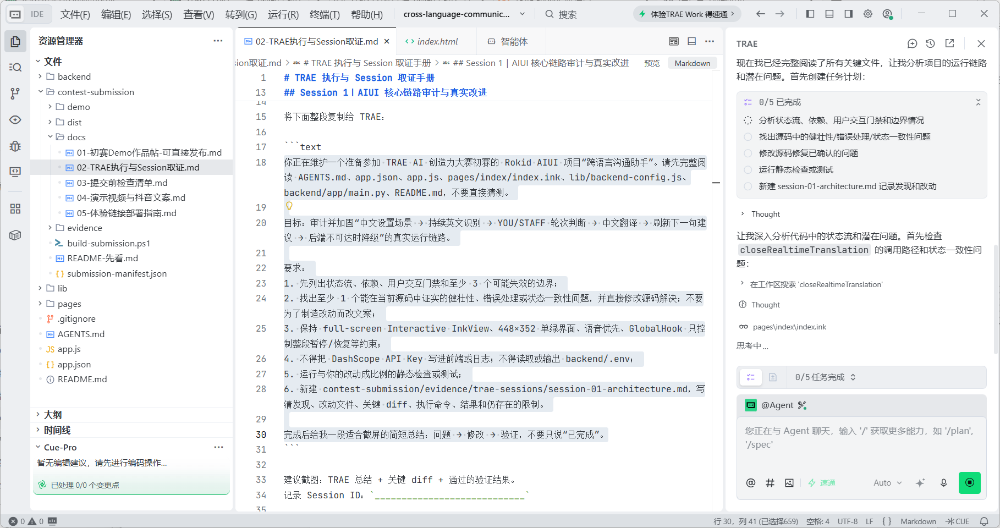
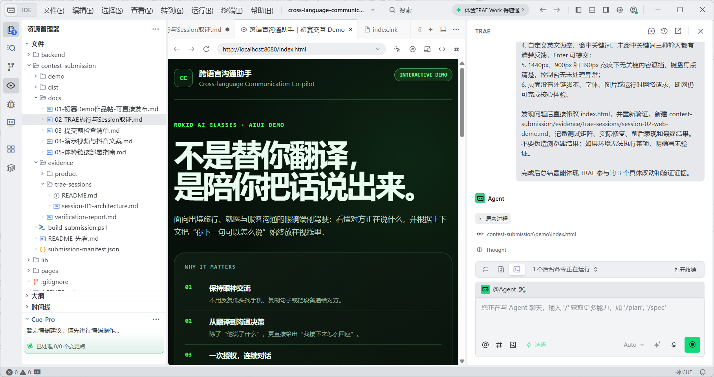
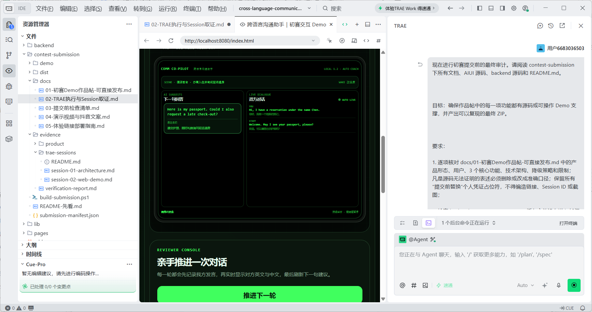

# 【硬件交互】跨语言沟通助手：把“翻译”变成眼镜里的现场沟通副驾驶

> TRAE Session ID、过程截图、HTML 体验包和社区报名帖链接均已归档。发布前只需确认赛道与已通过审核的报名帖保持一致；如果报名赛道不是“硬件交互”，请同步修改标题和标签。

## 1. Demo 简介

### 是什么

“跨语言沟通助手”是一款运行在 Rokid AI 眼镜上的全屏 AIUI 应用。它不只是把一句英文翻译成中文，而是在面对面沟通中持续完成三件事：听懂双方对话、把原文和中文放在视线里、根据当前场景和上下文推荐“我下一句可以怎么说”。

### 面向谁

- 在海外办理入住、点餐、问路时容易紧张或临时想不起英文的人；
- 需要在就医、过敏说明等高压力场景中保持信息准确的人；
- 希望继续与对方保持眼神交流、不想反复低头操作手机的人。

### 三个核心功能

1. **中文描述场景，生成第一句英文。** 用户用中文说清地点、对象和目标，例如“我在酒店前台办理入住，还想问能否延迟退房”，左侧立即给出可直接开口的自然英文和表达目的。
2. **连续记录双方双语对话。** 完成一次麦克风交互授权后持续监听，通过建议相似度和 YOU / STAFF 对话轮次区分双方，将英文原文和中文翻译同步显示在右侧。
3. **对方每次回答后刷新下一句建议。** AI 根据场景、最近对话和对方回复生成下一句，不让用户停在“看懂了但不知道怎么接”的位置。

产品截图：

- 图 1：`01-酒店场景-首屏.png`——酒店入住场景与第一句建议
- 图 2：`02-餐厅场景-连续对话.png`——过敏信息确认后的上下文建议
- 图 3：`03-医院场景-自定义回复.png`——医院挂号场景与双语记录

## 2. Demo 创作思路

### 灵感来源

传统翻译工具通常要求用户低头打开手机、选择语言、按住说话，再把屏幕递给对方。这个流程在酒店前台、餐厅点餐或医院接待处会不断打断眼神交流。更现实的问题是：很多时候用户已经看懂了翻译，却仍然不知道下一句怎样说得自然、礼貌又准确。

因此我把产品定义成“沟通副驾驶”，而不是“自动替用户说话的翻译器”：用户仍然亲自表达，AI 负责降低理解和组织语言的负担。

### 想解决的问题

- **交互割裂：** 手机翻译会让用户从真实对话中频繁抽离；
- **只译不教：** 看到中文翻译后，用户仍要自己组织下一句；
- **高压场景易漏信息：** 过敏、费用、时间和就医信息如果没跟上上下文，容易造成误解；
- **眼镜端资源受限：** 448×352 单绿显示需要非常克制的信息层级，不能照搬手机界面。

### 关键判断与取舍

1. **左右双栏而不是聊天气泡瀑布。** 左侧始终固定“下一句”，右侧滚动记录对话，让最重要的行动建议不被历史消息挤走。
2. **语音优先、按键只控整段会话。** 唤醒词负责设置场景，`GlobalHook` 镜腿键只用于暂停或恢复持续同传，避免每句话都要操作。
3. **单麦克风不假装能做声纹识别。** 当前版本用“建议相似度 + 对话轮次 + 对方提示词”判断说话方，并在文档中明确边界。
4. **评审版必须随时可体验。** 除真实眼镜端外，额外制作了完全离线的单文件 HTML，预置酒店、餐厅过敏和医院挂号三个闭环；没有眼镜和 API Key 也能验证核心价值。
5. **Key 不进入前端。** DashScope / Qwen Key 只保存在 FastAPI 代理，眼镜端只配置受限代理地址。

## 3. Demo 体验地址

### 社区 HTML 附件（本次正式体验入口）

附件：`跨语言沟通助手-初赛HTML体验包.zip`

解压后双击 `index.html` 即可。页面无账号、无外部依赖、无 API Key；建议依次体验：切换场景 → 连续点击两次“推进下一轮” → “换一种说法” → 输入一句自定义英文。

如后续补充公网部署或硬件实拍，可在这里增加公开链接；本次提交以社区 HTML ZIP 为有效体验入口，不依赖可选视频。

## 4. TRAE 实践过程

本次使用 TRAE IDE 将任务拆成了“架构与核心链路”“可体验评审版”“回归验证与参赛打包”三段，每段均在独立 Session 中完成，方便保留真实过程。

### Session 1：梳理 AIUI 架构并加固核心语音链路

- 让 TRAE 阅读 `AGENTS.md`、`app.json`、`pages/index/index.ink` 和 `backend/`，先画清“场景理解 → 持续识别 → 翻译 → 下一句建议”的状态流；
- 检查 full-screen Interactive InkView、语音唤醒、`GlobalHook`、连续识别重建、后端不可达降级等关键路径；
- 要求 TRAE 找出并落地至少一项真实的健壮性改进，同时记录修改文件和验证命令。

过程截图：`trae-01-架构与核心链路.png`  


Session ID：`.3379245433487736:edbc663799fb5fdd9233903963b380fd_6a577e0c5221f8a253b0a167.6a5785595221f8a253b0a169.6a5785573f7c073714451ea4:Trae CN.T(2026/7/15 21:04:25)`

### Session 2：完成无硬件依赖的交互式评审 Demo

- 让 TRAE 检查单文件 `contest-submission/demo/index.html`；
- 验证三个场景、连续轮次、替代表达、语音朗读、自定义对方回复和移动端布局；
- 修复实际发现的问题，确保无账号、无网络、无外部资源也能完成核心体验。

过程截图：`trae-02-交互Demo回归.png`  


Session ID：`.3379245433487736:04d1481c51bd5238215c7cf670e0c8c2_6a577e0c5221f8a253b0a167.6a5789d55221f8a253b0a200.6a5789d43f7c073714451ea5:Trae CN.T(2026/7/15 21:23:33)`

### Session 3：测试、事实核对与提交物打包

- 让 TRAE 运行后端单元测试和浏览器交互检查；
- 对照源码核对作品帖中的功能、模型、降级策略与限制，删除无法证明的表述；
- 运行打包脚本生成 HTML ZIP 和 AIUI 导入包，并输出文件哈希与最终检查记录。

过程截图：`trae-03-测试与打包.png`  


Session ID：`.3379245433487736:87f92ba0cdcdb756302f0a9c5415fb42_6a577e0c5221f8a253b0a167.6a578ca95221f8a253b0a291.6a578ca83f7c073714451ea6:Trae CN.T(2026/7/15 21:35:37)`

### 我在 TRAE 开发中解决的三个具体问题

1. **只读卡片无法触发麦克风。** 最终把应用明确为 full-screen Interactive InkView，并把这一约束写入 Agent Manifest 和页面描述，避免宿主把它当 conversation-flow card。
2. **长时间复用语音识别会话会在部分固件上停止回调。** 改成每句话结束后销毁并重建识别会话，同时保留自动重试和去重，用户不需要逐句按键。
3. **实时后端不可达时 Demo 不能失效。** 设计 `HOST LIVE` 降级路径，继续使用宿主连续识别和翻译；另外提供完全离线 HTML 评审版，保证核心闭环始终可见。

## 5. 体验说明与边界

- 眼镜端是 448×352 单绿显示，界面只使用绿色透明度、描边和纯黑背景表达层级；
- 眼镜只有一个麦克风，当前版本不是声纹识别，建议双方一人一句并短暂停顿；
- 离线 HTML 是确定性评审体验，不会上传录音或文本；真实眼镜端才通过安全代理接入 Qwen；
- 医疗与过敏场景用于辅助沟通，不替代专业判断，重要信息仍需与现场人员确认。

## 6. 项目结构

```text
cross-language-communication-assistant/
├── AGENTS.md                     # Agent 身份、能力与交互约束
├── app.json / app.js             # AIUI 全局配置
├── pages/index/index.ink         # 眼镜端完整 UI 与交互状态机
├── lib/backend-config.js         # 只配置代理地址，不保存模型 Key
├── backend/                      # FastAPI + Qwen 安全代理
└── contest-submission/
    ├── demo/index.html           # 单文件交互评审版
    ├── docs/                     # 作品帖、取证、视频与部署文档
    └── dist/                     # 最终 ZIP
```

报名帖链接：https://forum.trae.cn/t/topic/147579

感谢体验。这个 Demo 还不完美，但它已经跑通了我最想验证的价值：当语言让人犹豫时，AI 不必抢走表达，而是可以让人更有把握地亲自开口。
