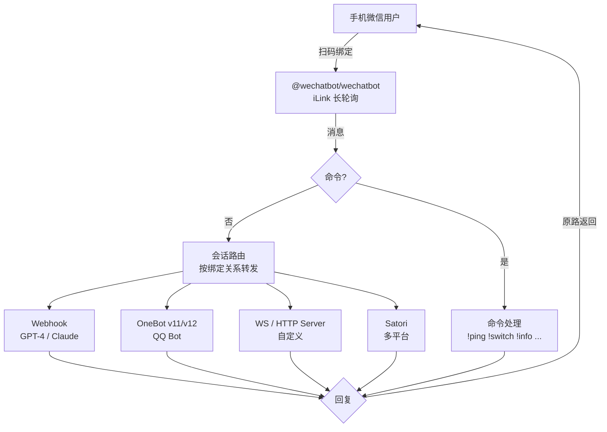

# iLink-Router

> 一个微信账号 → 多协议上游聚合路由。扫码绑定微信后，用户消息按会话绑定关系转发到任意上游渠道（Webhook / OneBot / WebSocket / HTTP / Satori），回复原路返回。

## 为什么用

普通微信机器人是「一账号一后端」。iLink-Router 把一个微信账号变成**消息路由器**：

- 用户 A 发 `!switch gpt4` → 后续消息走 GPT-4 渠道
- 用户 B 发 `!switch claude` → 后续消息走 Claude 渠道
- 同一个微信账号，不同会话独立绑定、独立切换
- 上游渠道可达 11 种协议，无需改代码即插即用

底层基于官方 [iLink 协议](https://www.wechatbot.dev/zh/protocol)（微信原生 ClawBot HTTP/JSON API），由 [`@wechatbot/wechatbot`](https://www.npmjs.com/package/@wechatbot/wechatbot) SDK 实现 QR 扫码登录、长轮询收发消息。

## 核心能力

| 能力 | 说明 |
| --- | --- |
| 扫码绑定 | 手机微信扫 iLink QR 登录，凭据自动持久化，重启免扫码 |
| 会话路由 | 每个微信用户独立会话，`!switch` 切换上游渠道，上下文隔离 |
| 11 种渠道协议 | Webhook / HTTP Client / HTTP Server / SSE / OneBot v11/v12 / WS / WS Server / Satori |
| 同步 + 异步转发 | 上游可 HTTP 同步返回，也可稍后回调 `/api/inbound` 异步回传 |
| 命令系统 | `!ping` `!switch` `!info` `!status` `!channels` `!help` |
| 管理 UI | 仪表盘 + 渠道管理 + 会话查看 + 消息日志 + 聊天调试 + API 调试 |
| 多数据库 | SQLite（零配置）/ PostgreSQL / MySQL，Prisma 驱动 |
| Token 鉴权 | 可选 `ADMIN_TOKEN` 保护所有管理 API |

## 架构



## 快速开始

> 需 Node.js 22+（`@wechatbot/wechatbot` 要求）

```bash
# 1. 安装依赖
pnpm install

# 2. 配置环境（默认 SQLite，零配置可跑）
cp .env.example .env

# 3. 初始化数据库
pnpm db:push

# 4. 启动
pnpm dev
```

打开 [http://localhost:3000](http://localhost:3000)，进入「路由控制」扫码绑定微信账号。

### 环境变量

```env
# 数据库（默认 SQLite，切换 PG/MySQL 需同步改 schema.prisma 的 provider）
DATABASE_URL="file:./dev.db"

# iLink SDK
ILINK_BASE_URL="https://ilinkai.weixin.qq.com"
ILINK_STORAGE_DIR="~/.wechatbot"        # 凭据持久化目录
ILINK_LOG_LEVEL="info"

# 路由
COMMAND_PREFIX="!"                        # 命令前缀
DEFAULT_CHANNEL_ALIAS=""                  # 新会话默认渠道
FORWARD_TIMEOUT_MS=30000                  # 上游转发超时

# 安全（可选，生产强烈建议）
ADMIN_TOKEN=""                            # 管理 API 鉴权
UPSTREAM_WEBHOOK_SECRET=""                # 上游回调签名密钥
```

## 支持的渠道协议

| 类型 | 传输 | 用途 |
| --- | --- | --- |
| **Webhook** | HTTP | 生成专属 URL，客户端 POST 推送消息给微信用户；可配 outbound_url 主动转发到上游 |
| **HTTP 客户端** | HTTP | 路由主动请求上游 API，支持 `{{userId}}` `{{message}}` 变量模板 + JSON path 提取回复 |
| **HTTP 服务端** | HTTP | 路由启动 HTTP 服务，客户端 `POST /send` 发送、`GET /messages` 拉取 |
| **HTTP SSE 服务端** | HTTP | HTTP 服务 + SSE 实时消息流 |
| **OneBot v11** | HTTP | 对接 go-cqhttp / Lagrange 等 OneBot v11 实现 |
| **OneBot v12** | HTTP | OneBot v12 协议，支持多平台 |
| **OneBot v11 反向 WS** | WS | 路由启动 WS 服务端，OneBot 实现作为客户端连接 |
| **OneBot v12 反向 WS** | WS | OneBot v12 反向 WS 模式 |
| **Satori** | HTTP | 对接 Satori 协议服务 |
| **WebSocket** | WS | 路由作为 WS 客户端连接上游 |
| **WebSocket 服务端** | WS | 路由启动 WS 服务端，外部客户端连接 |

每种渠道在 UI 上有独立的配置表单（端口 / Token / endpoint / 模板等），字段定义见 [src/lib/channel-types.ts](src/lib/channel-types.ts)。

## 用户命令

用户向路由账号发消息，以 `!` 开头触发命令（前缀可在 `.env` 自定义）：

| 命令 | 作用 |
| --- | --- |
| `!ping` | 在线检查，回复 `pong!` |
| `!switch <别名>` | 切换当前会话的上游渠道 |
| `!info` | 查看当前会话信息（绑定渠道、消息数） |
| `!status` | 路由系统状态 + 各渠道健康度 |
| `!channels` | 列出所有可用渠道 |
| `!help` | 命令帮助 |

示例：

```
用户: !channels
路由: 📡 可用渠道
      1. gpt4 — GPT-4 Turbo
      2. claude — Claude 3 Opus

用户: !switch claude
路由: ✅ 已切换到渠道「Claude 3 Opus」

用户: 你好
路由: (来自 claude 渠道的回复)

用户: !info
路由: 📊 当前渠道: claude | 消息: 12 收/6 发
```

## 上游转发协议

路由向 HTTP 类上游渠道转发消息的请求格式：

```http
POST <channel.webhookUrl 或 url_template 渲染后>
Content-Type: application/json
X-ILink-Channel: <alias>
X-ILink-Key: <api_key>
X-ILink-Router-Secret: <UPSTREAM_WEBHOOK_SECRET>

{
  "sessionId": "cuid...",
  "userId": "wxid_xxx",
  "userName": "张三",
  "message": "你好",
  "receivedAt": "2026-07-12T12:34:56.789Z",
  "channelAlias": "gpt4",
  "history": [
    { "role": "user", "text": "...", "ts": "..." },
    { "role": "assistant", "text": "...", "ts": "..." }
  ]
}
```

**同步响应**：上游在 HTTP 响应里直接返回 `{"reply": "..."}`

**异步回调**：上游稍后 POST 到 `/api/inbound`（携带 `X-ILink-Router-Secret`）：

```json
{ "sessionId": "cuid...", "reply": "稍后处理的结果..." }
```

## 项目结构

```
iLink-Router/
├── prisma/schema.prisma          # 数据模型 (Channel / Session / Message)
├── src/
│   ├── app/
│   │   ├── api/                  # API 路由
│   │   │   ├── router/status/    # 路由控制 (start/stop/reset)
│   │   │   ├── channels/         # 渠道 CRUD + test
│   │   │   ├── sessions/         # 会话 + 消息历史
│   │   │   ├── messages/         # 消息日志
│   │   │   ├── inbound/          # 上游异步回调入口
│   │   │   ├── webhook/[alias]/  # Webhook 渠道入口
│   │   │   ├── qr/               # 二维码 (dataurl/png/text)
│   │   │   ├── chat/             # 聊天调试
│   │   │   ├── stats/            # 仪表盘统计
│   │   │   └── settings/
│   │   ├── page.tsx              # 仪表盘
│   │   ├── router/               # 路由控制页 (扫码绑定)
│   │   ├── channels/             # 渠道管理
│   │   ├── sessions/             # 会话列表 + 详情
│   │   ├── messages/             # 消息日志
│   │   ├── chat/                 # 聊天调试
│   │   ├── debug/                # API 调试
│   │   └── settings/
│   ├── components/
│   │   ├── app-shell.tsx         # 侧边栏布局
│   │   ├── qr-dropzone.tsx       # 二维码识别组件
│   │   └── ui/toaster.tsx        # Toast 通知
│   └── lib/
│       ├── router.ts             # 路由核心 (bot 生命周期 + 登录循环)
│       ├── forwarder.ts          # 上游转发 (HTTP/WS/OneBot/Satori)
│       ├── ws-transport.ts       # WS 服务端/客户端传输
│       ├── http-transport.ts     # HTTP 服务端传输
│       ├── channel-types.ts      # 11 种渠道类型定义
│       ├── commands.ts           # 命令处理
│       ├── sessions.ts           # 会话辅助
│       ├── settings.ts           # 设置读写
│       ├── db.ts                 # Prisma 单例 (adapter 模式)
│       ├── auth.ts               # Admin Token 鉴权
│       ├── api-client.ts         # 前端 API 封装
│       ├── qr-parse.ts           # 二维码解析
│       ├── types.ts              # 共享类型
│       ├── config.ts             # 环境配置
│       └── utils.ts
└── .env.example
```

## 技术栈

| 层 | 技术 |
| --- | --- |
| 前端 | Next.js 16 (App Router, Turbopack) · React 19 · Tailwind v4 · [Cloudflare Kumo](https://github.com/cloudflare/kumo) UI · Phosphor Icons |
| 后端 | Next.js API Routes (Node.js runtime) · `@wechatbot/wechatbot` SDK · `ws` |
| 数据 | Prisma 7 (adapter 模式) · SQLite / PostgreSQL / MySQL |
| 校验 | Zod 4 |
| 语言 | TypeScript 6 |

## API 速览

| 方法 | 路径 | 说明 |
| --- | --- | --- |
| GET | `/api/router/status` | 路由状态 |
| POST | `/api/router/status` | 控制 (`{action: "start"\|"stop"\|"reset"\|"restart"}`) |
| GET | `/api/qr?format=dataurl\|png\|text` | 当前扫码二维码 |
| GET/POST | `/api/channels` | 渠道列表 / 创建 |
| GET/PATCH/DELETE | `/api/channels/[id]` | 渠道 CRUD |
| POST | `/api/channels/[id]/test` | 测试渠道可达性 |
| GET | `/api/sessions?search=` | 会话列表 |
| GET/DELETE | `/api/sessions/[id]` | 会话详情 + 消息历史 |
| GET | `/api/messages?kind=&direction=` | 消息日志 |
| POST | `/api/inbound` | 上游异步回传 |
| POST | `/api/webhook/[alias]?key=token` | Webhook 渠道消息入口 |
| POST | `/api/chat` | 聊天调试 (模拟微信用户) |
| GET | `/api/stats` | 仪表盘统计 |
| GET/PUT | `/api/settings` | 全局设置 |

设置 `ADMIN_TOKEN` 后，所有 `/api/*`（除 `/api/qr`）需 `Authorization: Bearer <token>`。

## 生产部署

```bash
pnpm build
pnpm start
```

建议：
- 配置 `ADMIN_TOKEN` 保护管理 API
- 配置 `UPSTREAM_WEBHOOK_SECRET` 让上游验证回调来源
- 数据库使用 PostgreSQL
- 用 PM2 / systemd 守护进程（iLink 长轮询需进程长驻）
- 反向代理（Nginx / Caddy）处理 HTTPS + 转发 3000 端口

## 相关链接

- **GitHub**: [ZHYxulei/iLink-Router](https://github.com/ZHYxulei/iLink-Router)
- **iLink 协议文档**: [wechatbot.dev/zh/protocol](https://www.wechatbot.dev/zh/protocol)
- **SDK**: [`@wechatbot/wechatbot`](https://www.npmjs.com/package/@wechatbot/wechatbot)
- **DeepWiki**: [corespeed-io/wechatbot](https://deepwiki.com/corespeed-io/wechatbot)

## License

MIT
