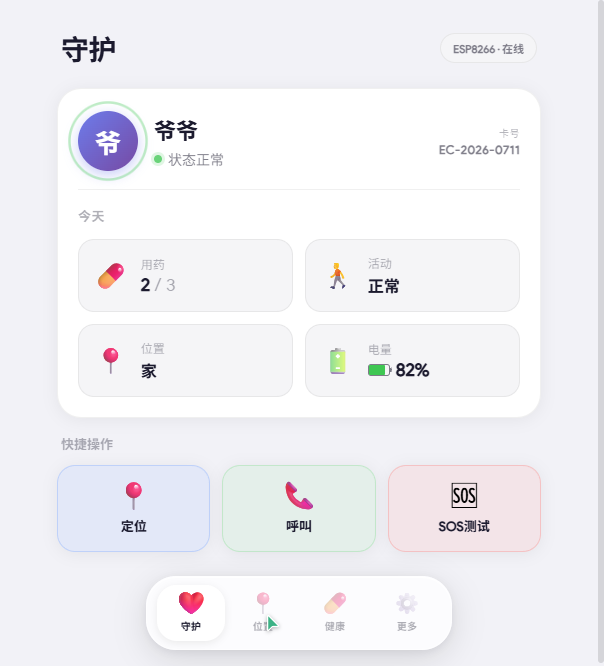
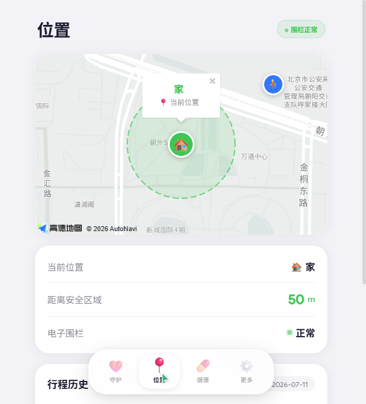
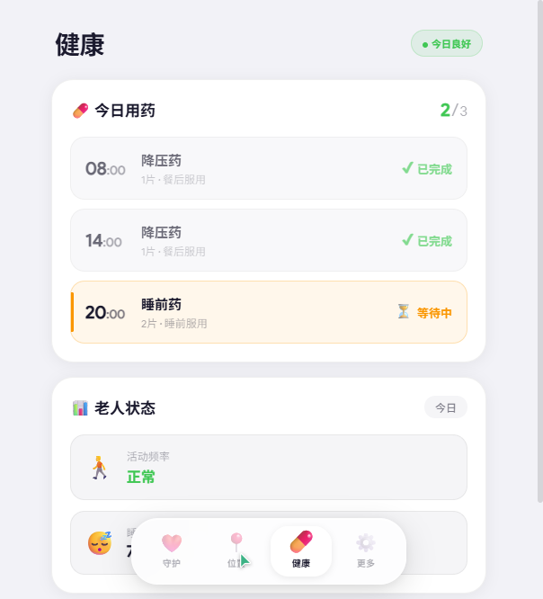
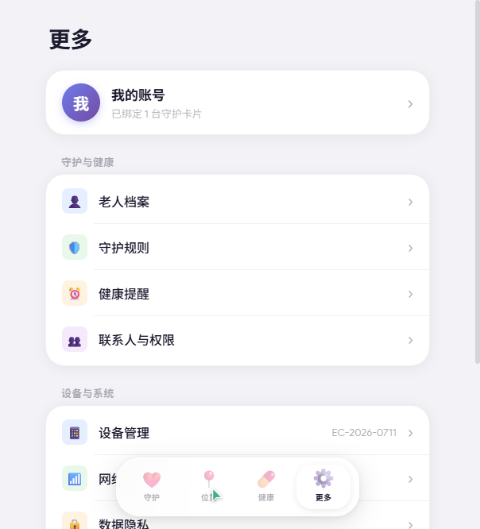

# 守护卡片 · 老人关怀控制面板

> 参赛：TRAE AI 创造力大赛 · 硬件交互赛道

---

## 1. Demo 简介

### 是什么

守护卡片是一套**硬件 + Web 控制面板**的助老系统。硬件端基于 ESP8266 + 墨水屏，做成银行卡大小的随身卡片；软件端为响应式 HTML 控制面板，适配手机与 PC 浏览器，供家属远程查看老人状态。

### 面向谁

- **核心用户**：家中有老人（尤其是患有高血压、阿尔茨海默症等慢性病）的子女与护理人员
- **最终受益者**：独居或半独居的老年人，无需操作智能手机即可获得守护

### 主要功能

**1. 实时守护概览**

一眼查看老人当前状态：用药进度（2/3）、活动状态、所在位置、设备电量，并提供定位、呼叫、SOS 三个快捷操作按钮。



**2. 地图定位与电子围栏**

基于高德地图 JS API 展示老人实时位置、安全区域围栏及行程历史轨迹，支持家、公园、超市等多个路径点的自动记录。



**3. 健康数据与用药管理**

展示每日用药计划（时间 + 药名 + 服用状态）、活动频率、睡眠时间等健康指标，待执行项以橙色高亮提醒。



**4. 完整设置体系**

包含老人档案、守护规则（电子围栏 + 安全路径点 + 活动异常检测）、提醒与通知（用药提醒方式 + 免打扰）、联系人与权限、设备管理、网络设置、数据隐私、账号设置等 8 个二级页面。



---

## 2. Demo 创作思路

### 灵感来源

家中老人患有高血压，需要长期按时服药，但子女不在身边时无法确认老人是否已用药。同时老人偶尔外出散步，家人担心走失风险。市面上的智能手表操作复杂、老年人抗拒佩戴，而传统老年手机功能单一。

由此想到：做一个**银行卡大小的轻量卡片**，老人只需随身携带，无需任何操作；家属通过手机控制面板即可远程掌握老人的健康与安全状态。

### 想解决的问题

- **用药遗忘**：老人忘吃药、多吃药，家属无法及时知晓
- **走失风险**：老人外出后家人不知道其位置，阿尔茨海默症老人有走失危险
- **紧急求助困难**：老人突发不适时无法快速联系家人
- **设备接受度低**：智能手表/手机对老年人来说操作门槛过高

### 为什么做这个方向

- **卡片形态 > 手表形态**：老人对"卡片"接受度更高（类似门禁卡/公交卡），佩戴无感
- **墨水屏 > OLED 屏**：低功耗、阳光下可读、信息常显，适合老人查看
- **Web 面板 > 专属 App**：家属无需下载 App，浏览器打开即用，降低使用门槛
- **ESP8266 方案**：成本低、生态成熟、功耗可控，适合大赛 Demo 快速验证

---

## 3. Demo 体验地址

本项目采用**交互式 HTML 文件**形式提交，已打包为 ZIP：

```
elder-card-panel.zip
```

**本地体验方式：**

1. 解压 ZIP 文件
2. 在解压目录下启动本地 HTTP 服务器：
   ```
   python -m http.server 8080
   ```
3. 浏览器打开 `http://localhost:8080`

> 注：地图功能依赖高德地图 JS API，需在联网环境下使用。

---

## 4. TRAE 实践过程

### 开发流程概览

本项目从零开始，全部使用 TRAE IDE 完成开发，包括 HTML 结构搭建、CSS 样式设计、JavaScript 交互逻辑编写，全程通过自然语言对话驱动。

### 关键开发步骤

**步骤一：项目搭建与 HTML 骨架**

向 TRAE 描述需求：银行卡大小的助老卡片控制面板，底部 iOS 26 液态玻璃风格 Dock 栏，4 个 Tab（守护/位置/健康/更多），高德地图集成。TRAE 一次性生成了完整的 HTML 结构、CSS 液态玻璃样式和 JS 地图初始化逻辑。


**步骤二：样式迭代与设计调整**

通过多轮对话迭代调整视觉风格：从初始的科技光斑背景改为白色背景，再改为灰色背景 + 白色卡片；中文字体替换为思源黑体，英文字体替换为 Google Product Sans；开关按钮调整为参考 iOS 截图的扁椭圆样式。

**步骤三：健康与设置页面开发**

描述健康 Tab 需求（用药计划 + 老人状态），TRAE 生成了完整的用药时间线和状态展示卡片。随后描述设置页面 8 个功能栏目，TRAE 生成了设置列表 + 滑入式二级子页面系统。


**步骤四：二级页面详细设计**

逐一描述每个子页面的内容需求：老人档案表单、守护规则（电子围栏 + 安全路径点 + 活动异常）、提醒与通知（用药提醒方式 + 每日用药计划 + 免打扰）、联系人与权限、设备管理、网络设置、数据隐私、账号设置与关于帮助。TRAE 为每个子页面生成了对应的表单、开关、单选等交互组件。


### 项目结构

```
elder-card-panel/
├── index.html              # 主页面（4 个 Tab + 9 个二级子页面）
├── css/
│   └── style.css           # 完整样式（液态玻璃 Dock + 卡片 + 表单组件）
├── js/
│   └── app.js             # 交互逻辑（Tab 切换 + 地图 + 子页面 + 开关）
├── screenshot_guard.png    # 产品截图 - 守护页
├── screenshot_location.png # 产品截图 - 位置页
├── screenshot_health.png   # 产品截图 - 健康页
└── screenshot_more.png     # 产品截图 - 设置页
```

### 关键任务对话 Session ID

> 请在此处填入 TRAE 开发过程中的关键 Session ID（不少于 3 个）：

1. Session ID: `________________` — 项目搭建、HTML 骨架、CSS 液态玻璃 Dock、高德地图集成
2. Session ID: `________________` — 健康页面用药计划、设置页面框架与 8 个二级子页面
3. Session ID: `________________` — 样式迭代（白底/灰底、字体替换、开关按钮调整、子页面细节）

### 技术栈

| 层级 | 技术选型 |
|:---|:---|
| 硬件 | ESP8266 + 墨水屏 |
| 前端 | 原生 HTML / CSS / JavaScript（无框架依赖） |
| 地图 | 高德地图 JS API 2.0 |
| 字体 | Google Product Sans（英文）+ Noto Sans SC 思源黑体（中文） |
| 设计 | iOS 26 液态玻璃风格 + 响应式布局（手机/PC 适配） |
| 交互 | 滑入式子页面 + iOS 风格开关/单选/Toast 通知 |

---

## 总结

守护卡片以"一张银行卡"为载体，让老人零门槛获得守护；以"一个网页"为入口，让家属随时掌握老人状态。通过 TRAE 的自然语言驱动开发，从需求描述到完整可交互 Demo 仅耗时数小时，充分体现了 AI 辅助开发在快速原型验证中的价值。
