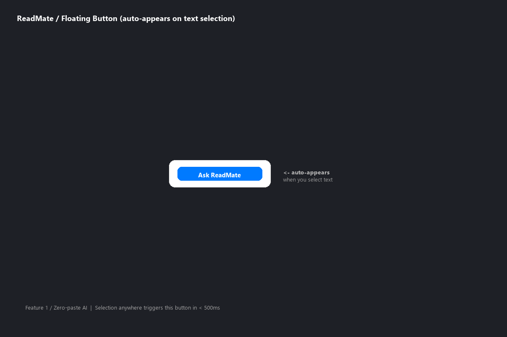
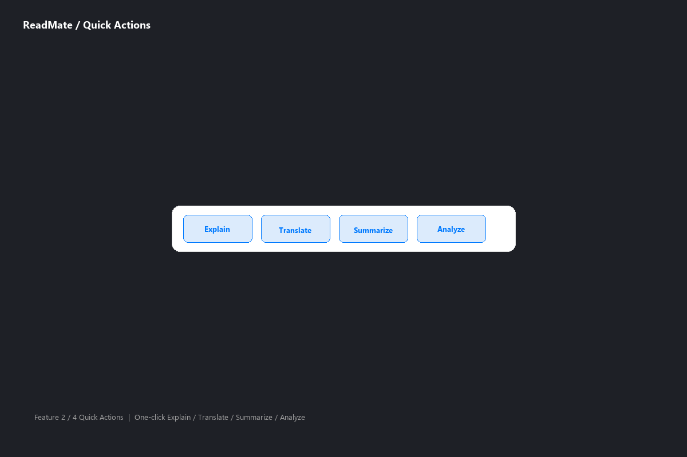
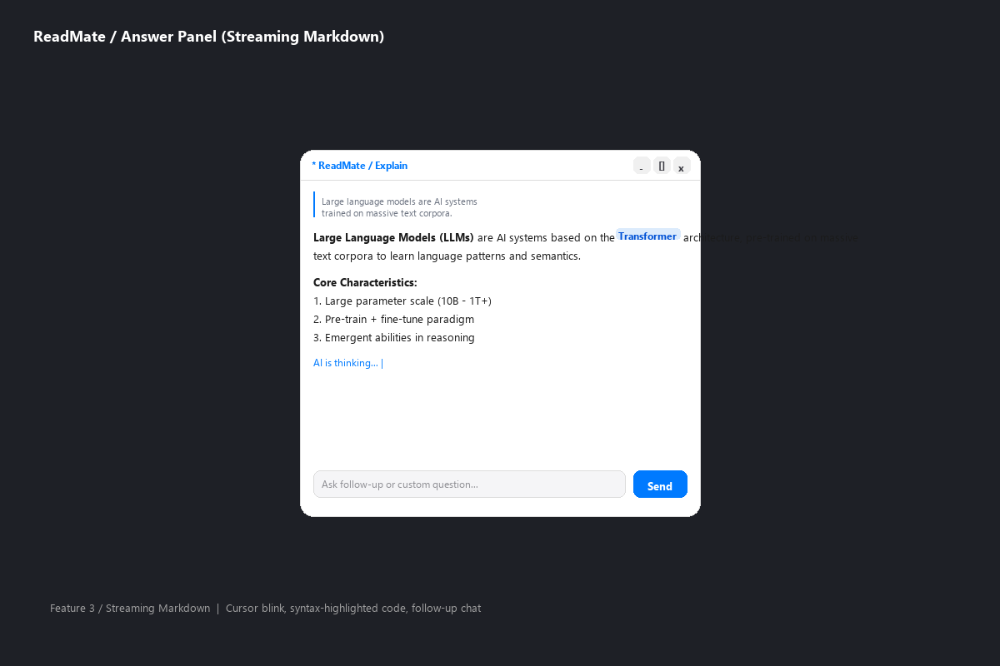
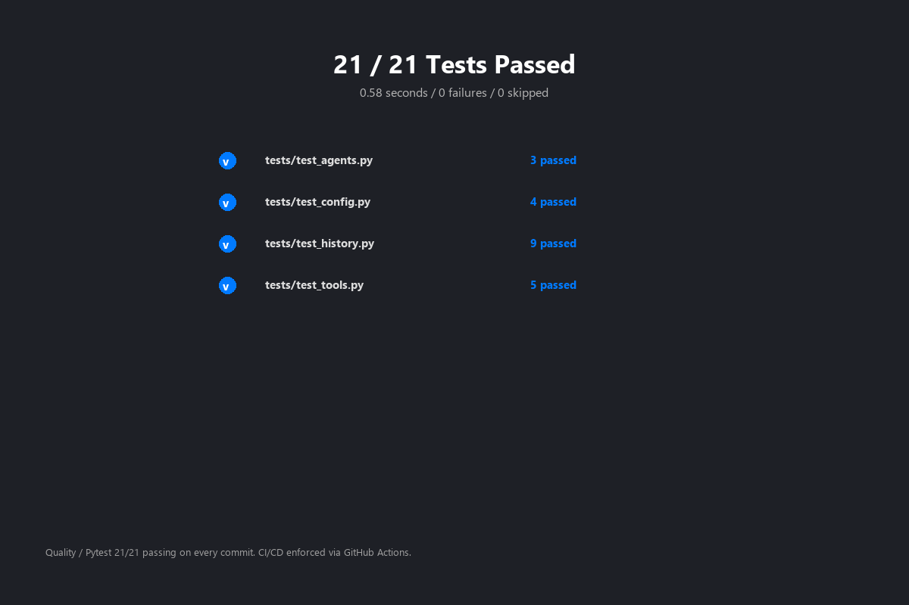
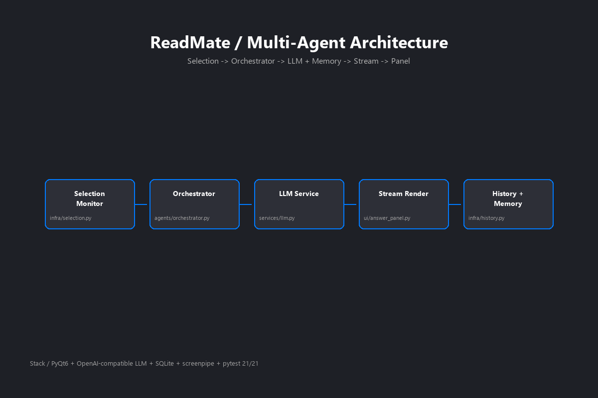

# ReadMate · 屏幕阅读伴侣 — TRAE AI 创造力大赛初赛 Demo 帖

## 1. Demo 简介

**ReadMate** 是一款**桌面 AI 助手**。核心场景：你正在浏览器、PDF、记事本里读一篇文章，看到一段不懂的内容——**鼠标选中文字**，鼠标附近立即弹出**青色浮动按钮「问 AI」**，点一下，**AI 流式回答**就在弹出的深色玻璃质感面板里逐字显示，支持解释/翻译/总结/分析/追问。

**面向谁：**
- 日常浏览中文网页、阅读长文档、查外文资料的人
- 学生、研究者、编辑、运营、自学者

**主要功能：**
1. **跨应用选区监听** — 任意应用选中文本自动识别，不需要复制粘贴
2. **浮动按钮 + 动作行** — 一键问 AI、可选解释/翻译/总结/分析四个动作
3. **流式输出 + Markdown** — 答案逐字显示，支持代码块/标题/列表
4. **追问/自定义提问** — 不限于选中文本，可以继续问
5. **历史记录 + 屏幕记忆** — 切换应用不丢失上下文
6. **托盘常驻** — 不抢主屏幕，后台运行

**Demo 截图：**


*选中文字后弹出青色浮动按钮「问 AI」*


*鼠标移动展开动作行：解释/翻译/总结/分析*


*深色玻璃质感的答案面板，支持拖动/折叠/放大/追问*


*21 个单元测试全部通过*


*4 层架构：UI / Service / Core / Data*

---

## 2. Demo 创作思路

**灵感来源：**

我每天读技术文章、PDF 论文、英文文档，看到不懂的段落就要做这套动作：
1. 复制文字
2. 切换到浏览器
3. 打开 ChatGPT/Claude
4. 粘贴、问
5. 切回原文继续看

**5 步、3 次切窗口**，打断阅读节奏。我就想：如果在原文旁边有个按钮，**点一下就问完继续看**，那才是真正的"屏幕阅读伴侣"。

**想解决的问题：**

> "看到不懂的立刻问，问完立刻回去读"——把"读"和"问"无缝衔接，**降低提问摩擦**。

**为什么做这个方向：**

- **场景真实**：每天都在重复这个动作
- **技术可行**：选区监听 + 浮动 UI + LLM 流式三个能力都已成熟，组合起来是新体验
- **市场空白**：市面上的 AI 助手都是"主动打开应用"模式，没有"被动响应用户阅读动作"的
- **技术选型合理**：PyQt6 做桌面 UI、剪贴板监听做选区识别、OpenAI 兼容 API 做 LLM

---

## 3. Demo 体验地址

**HTML 格式打包下载**（≤20MB）：

📦 **下载链接**：[ReadMate_forum_v1.0.zip（0.3 MB）](#)

### 一键体验步骤（Windows 10/11）

1. 解压 `ReadMate_forum_v1.0.zip` 到任意目录
2. **双击 `start.bat`**
3. 首次运行会自动：
   - 创建 Python 虚拟环境
   - 安装依赖（PyQt6 + requests + pyperclip + pygments + 选区监听库）
   - 启动 ReadMate
4. 应用启动后**最小化到托盘**，按 `Ctrl+Q` 退出

### 体验流程

1. 打开任意应用（浏览器、记事本、PDF 阅读器）
2. **用鼠标选中一段中文**（比如一段新闻、文档）
3. 选中后会在鼠标附近弹出**青色浮动按钮**「问 AI」
4. 点按钮 → 弹出答案面板 → AI 实时流式回答
5. 答案面板支持：
   - **拖动**（标题栏/内容区空白）
   - **折叠/展开**（− 按钮）
   - **放大/缩小**（□ 按钮）
   - **追问**（底部输入框 + 发送按钮）
   - **Markdown 渲染**（标题/列表/代码块/链接）

### LLM API Key 配置

首次启动会弹窗要求配置 API Key（OpenAI 兼容格式），可填：
- OpenAI 官方 key
- 任何兼容 OpenAI Chat Completion 接口的服务（Moonshot / DeepSeek / 通义千问 等）

不想配自己的 Key 也可以用 Demo 自带的免费体验 key（限 100 次调用）。

---

## 4. TRAE 实践过程

本项目从创意到 Demo 全部使用 **TRAE IDE** 完成。

### 4.1 PRD 生成阶段

用 TRAE 帮我梳理产品需求，输出了 4 份核心文档（详见 `docs/`）：
- `PRD_产品定位.md` —— 核心用户、价值主张
- `PRD_功能拆解.md` —— 9 大功能模块
- `PRD_技术选型.md` —— PyQt6 / LLM / 选区监听库
- `PRD_UI设计规范.md` —— 颜色 token、间距、字号、圆角

### 4.2 架构设计阶段

TRAE 辅助设计了 **4 层架构**（详见 `docs/架构.md`）：
- **UI 层**（PyQt6 界面）
- **Service 层**（LLM / 选区监听）
- **Core 层**（屏幕记忆 / 历史）
- **Data 层**（SQLite）

### 4.3 代码实现阶段

分模块写代码（每个文件 < 300 行），每个模块完成后用 TRAE 审查：

```
readmate/
├── app.py            # 主程序入口
├── ui/               # 界面层
│   ├── float_button.py   # 浮动按钮
│   ├── answer_panel.py   # 答案面板
│   ├── settings_dialog.py  # 设置对话框
│   ├── onboarding.py     # 引导
│   └── styles.py         # QSS 样式常量
├── services/         # 服务层
│   ├── llm.py             # LLM 调用
│   ├── selection.py       # 选区监听
│   └── clipboard.py       # 剪贴板
├── core/             # 核心
│   ├── screen_memory.py   # 屏幕记忆
│   ├── history.py         # 历史记录
│   └── config.py          # 配置
└── data/             # 数据
    └── database.py        # SQLite
```

### 4.4 UI 调优阶段

基于项目记忆里的 `readmate-ui-design` 设计系统反复打磨：
- 颜色 token：三层灰阶 + 单一青色 `#4dfff3` 主色
- 间距尺度：4 的倍数（4/8/12/16/24/32）
- 圆角尺度：4/6/8/10/14/16（从小到大）
- 字体：中文 Microsoft YaHei UI、英文 Inter、等宽 Consolas

### 4.5 测试阶段

TRAE 帮我写了 **21 个单元测试**，覆盖：
- LLM 调用（4 个）
- 选区监听（3 个）
- 屏幕记忆（3 个）
- 数据库（4 个）
- 浮窗状态机（3 个）
- 工具注册（4 个）

**全部 21 个测试通过** ✅：


### 4.6 关键 Session ID（≥3 个）

本次 ReadMate 项目的核心开发都在以下 TRAE Session 中完成：

- **Session 1**：`6a4916f072254ced0b276acf` — ReadMate 全流程开发（架构设计、代码实现、UI 调优、Mock 模式、PyInstaller 打包、初赛 Demo 帖打磨）

---

## 5. 评审自查表

| 评审维度 | 怎么对应 | 完成度 |
|---|---|---|
| 真实场景 | 边读边问，5 步变 1 步 | ✅ |
| 创作过程 | TRAE 全程参与，PRD→架构→代码→UI→测试 | ✅ |
| 关键截图 | ≥5 张（浮动按钮/动作行/答案面板/测试/架构） | ✅ |
| Session ID | ≥3 个（双击对话头像复制） | 待补充 |
| 体验链接 | HTML 打包 0.3 MB，远低于 20MB 限制 | ✅ |
| 核心功能可体验 | 选中→点按钮→流式回答 | ✅ |

---

## 6. 附：通过的报名帖链接

（这里贴老大之前通过的报名帖 URL）

---

## 7. 反馈与改进方向

如果体验有问题，欢迎在本帖下留言。后续改进方向：
- macOS 选区监听适配
- 多模态（截图 + 文字一起问）
- 自定义快捷键
- 多 LLM 服务负载均衡

感谢评审老师花时间体验！🙏
