# 智慧赛事服务系统 - 用户操作流程图

## 1. 文档概述

### 1.1 文档目的

本文档详细描述智慧赛事服务系统的核心业务流程和用户操作流程，为设计、开发和测试团队提供流程参考，确保系统功能的逻辑闭环和用户体验的连贯性。

### 1.2 流程设计原则

- **用户中心**：从用户视角出发设计流程
- **简洁高效**：减少不必要的操作步骤
- **逻辑清晰**：流程分支明确，状态转换合理
- **容错性强**：支持操作撤销和错误恢复
- **闭环完整**：每个流程都有明确的起点和终点

---

## 2. 系统整体架构流程

### 2.1 四大子系统关系图

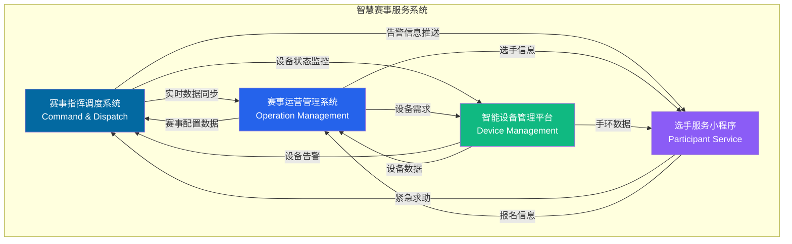

### 2.2 数据流转关系

| 数据类型 | 数据流向 | 说明 |
|----------|----------|------|
| 赛事配置 | 运营管理 → 指挥调度 | 赛事基本信息、项目配置、人员名单 |
| 实时位置 | 设备管理 → 指挥调度 | 选手和设备实时位置数据 |
| 告警信息 | 指挥调度 → 运营管理 | 告警处置记录、调度任务日志 |
| 设备状态 | 设备管理 → 指挥调度 | 设备在线状态、电量、信号 |
| 紧急求助 | 小程序 → 指挥调度 | 选手紧急求助信号（含位置） |
| 成绩数据 | 运营管理 → 小程序 | 选手成绩查询、证书下载 |

---

## 3. 核心业务流程

### 3.1 赛事全生命周期流程

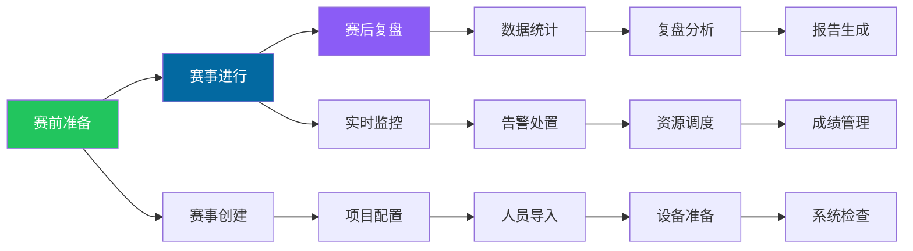

### 3.2 赛前准备流程

#### 3.2.1 赛事创建流程

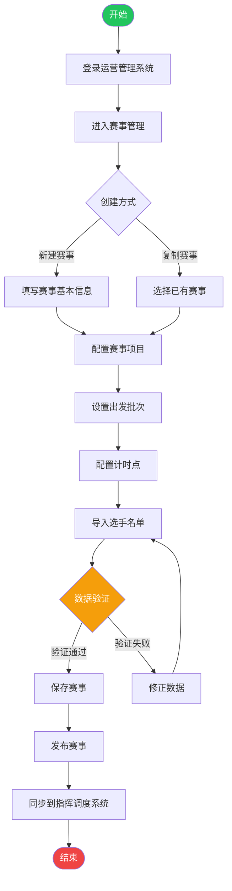

**流程说明**：

1. **登录系统**：用户登录赛事运营管理系统
2. **创建赛事**：支持新建赛事或复制已有赛事
3. **配置项目**：设置赛事项目、出发批次、计时点等
4. **导入选手**：批量导入选手名单，支持Excel导入
5. **数据验证**：系统自动验证数据完整性和准确性
6. **发布赛事**：赛事配置完成后发布，同步到指挥调度系统

#### 3.2.2 设备准备流程

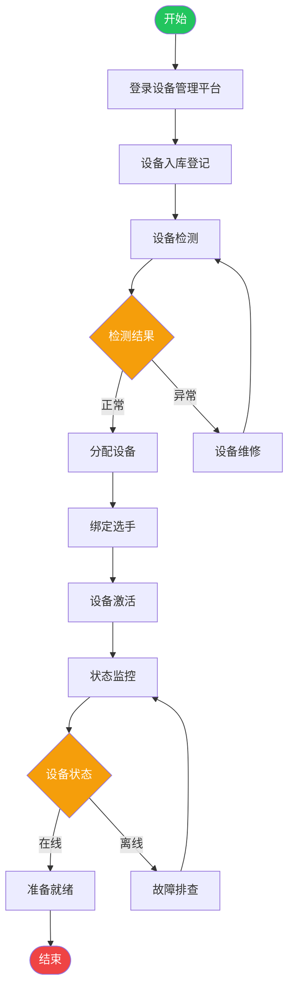

**流程说明**：

1. **设备入库**：新设备登记入库，录入设备信息
2. **设备检测**：检测设备功能和性能
3. **分配设备**：将设备分配给选手或工作人员
4. **绑定选手**：设备与选手信息绑定
5. **设备激活**：激活设备，开始实时监控
6. **状态监控**：实时监控设备在线状态、电量、信号等

---

## 4. 赛事进行中流程

### 4.1 告警处置流程

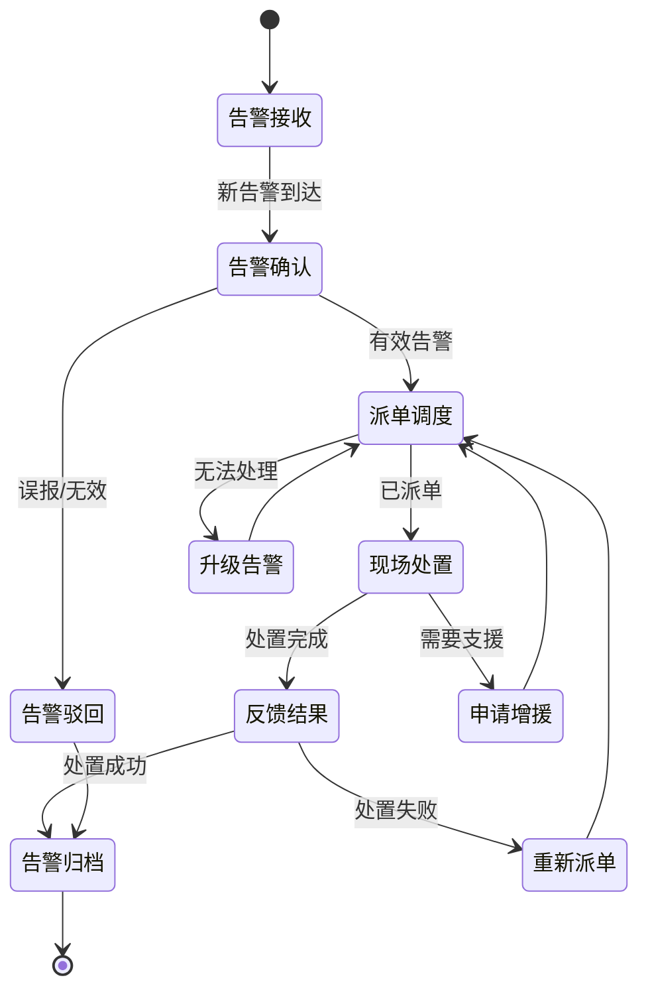

**流程详解**：

#### 4.1.1 告警接收

| 步骤 | 操作 | 系统 | 用户 |
|------|------|------|------|
| 1 | 告警源触发 | 接收告警信息 | - |
| 2 | 告警标准化 | 转换为统一格式 | - |
| 3 | 告警去重 | 合并重复告警 | - |
| 4 | 告警定级 | 自动判定告警级别 | - |
| 5 | 告警通知 | - | 接收告警通知（声音+弹窗） |

#### 4.1.2 告警确认

| 步骤 | 操作 | 系统 | 用户 |
|------|------|------|------|
| 1 | 查看告警详情 | 展示告警信息 | 查看告警详情 |
| 2 | 查看告警位置 | 地图定位展示 | 确认告警位置 |
| 3 | 查看周边资源 | 展示周边资源 | 评估处置方案 |
| 4 | 查看关联视频 | 自动关联视频 | 了解现场情况 |
| 5 | 确认告警有效性 | - | 确认告警是否有效 |

#### 4.1.3 派单调度

| 步骤 | 操作 | 系统 | 用户 |
|------|------|------|------|
| 1 | 选择调度模式 | - | 选择手动/智能调度 |
| 2 | 查询可用资源 | 筛选可用资源 | - |
| 3 | 推荐调度方案 | 智能推荐最优方案 | 查看推荐方案 |
| 4 | 确认调度方案 | - | 确认或调整方案 |
| 5 | 下达调度指令 | 发送调度通知 | - |

#### 4.1.4 现场处置

| 步骤 | 操作 | 系统 | 用户（现场人员） |
|------|------|------|------|
| 1 | 接收调度指令 | 推送任务通知 | 接收任务 |
| 2 | 查看任务详情 | 展示任务信息 | 了解任务要求 |
| 3 | 导航到现场 | 提供导航路线 | 前往现场 |
| 4 | 现场处置 | - | 执行处置任务 |
| 5 | 反馈处置结果 | 接收反馈信息 | 上报处置结果 |

#### 4.1.5 告警归档

| 步骤 | 操作 | 系统 | 用户 |
|------|------|------|------|
| 1 | 审核处置结果 | - | 审核处置结果 |
| 2 | 确认归档 | 记录处置过程 | 确认归档 |
| 3 | 生成处置记录 | 保存完整记录 | - |
| 4 | 更新统计数据 | 更新告警统计 | - |

### 4.2 资源调度流程

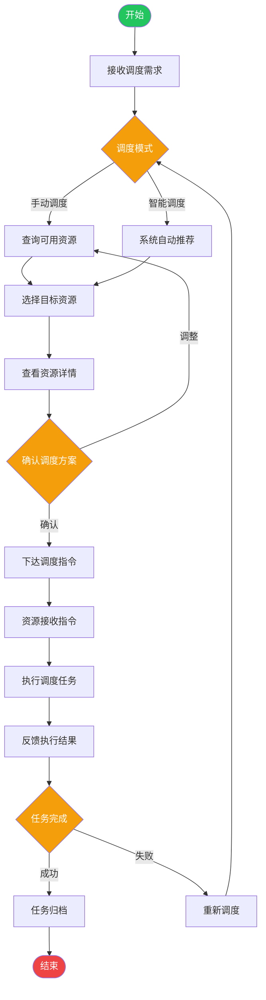

**智能调度算法逻辑**：

1. **距离优先**：优先推荐距离最近的资源
2. **状态优先**：优先推荐空闲状态的资源
3. **技能匹配**：根据任务类型匹配具备相应技能的资源
4. **历史表现**：参考资源的历史处置效率和成功率
5. **负载均衡**：避免过度调度同一资源

### 4.3 成绩管理流程

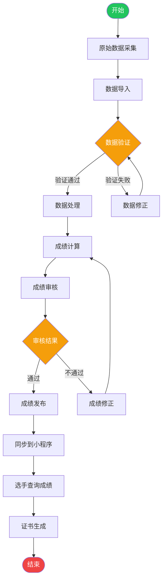

**成绩计算规则**：

1. **总用时**：终点时间 - 起点时间
2. **净用时**：终点时间 - 通过起点时间
3. **分段成绩**：各计时点之间的用时
4. **排名规则**：按净用时排序，相同用时按通过顺序
5. **团队成绩**：根据团队算法配置计算

---

## 5. 用户角色操作流程

### 5.1 指挥长操作流程

**核心功能**：

1. **数字孪生大屏**：实时查看赛事全局态势
2. **数据总览**：查看关键指标和统计数据
3. **视频监控**：查看实时视频和历史录像
4. **告警处置**：处理升级告警，做出决策
5. **复盘分析**：查看赛事总结报告，分析改进点

### 5.2 调度员操作流程

**核心功能**：

1. **告警中心**：接收、确认、处置告警
2. **资源调度**：手动或智能调度资源
3. **任务追踪**：追踪调度任务执行进度
4. **沟通协作**：与现场人员语音/文字沟通
5. **数据统计**：查看告警和调度统计数据

### 5.3 现场人员操作流程

**核心功能**：

1. **任务接收**：接收调度任务通知
2. **任务详情**：查看任务详情和导航路线
3. **位置上报**：实时上报位置和状态
4. **结果反馈**：反馈处置结果（文字/照片/视频）
5. **沟通协作**：与调度员语音/文字沟通

### 5.4 参赛选手操作流程

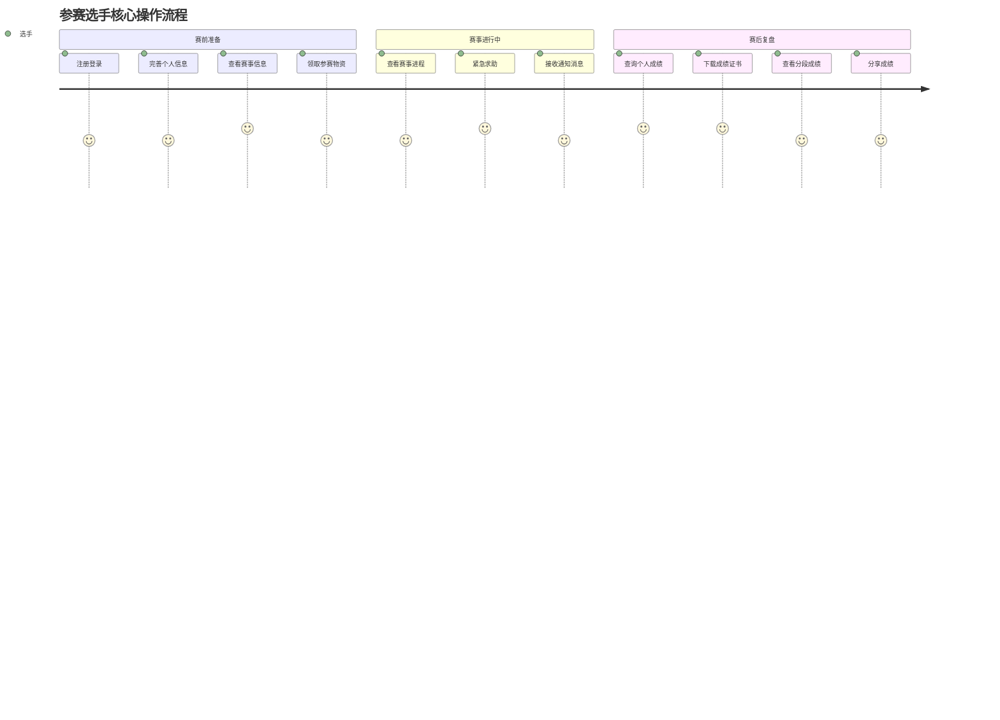

**核心功能**：

1. **赛事信息**：查看赛事详情、赛程安排
2. **成绩查询**：查询个人成绩和排名
3. **证书下载**：下载成绩证书
4. **紧急求助**：发送紧急求助信号
5. **消息通知**：接收赛事相关通知

---

## 6. 系统间集成流程

### 6.1 运营管理与指挥调度集成流程

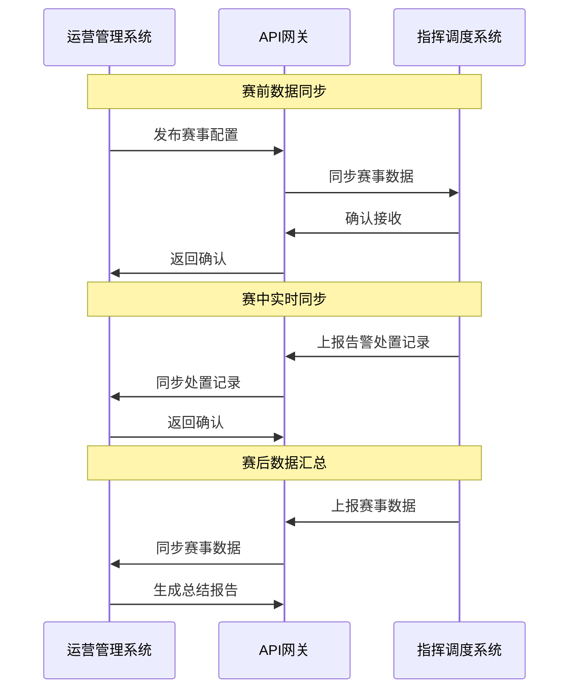

### 6.2 设备管理与指挥调度集成流程

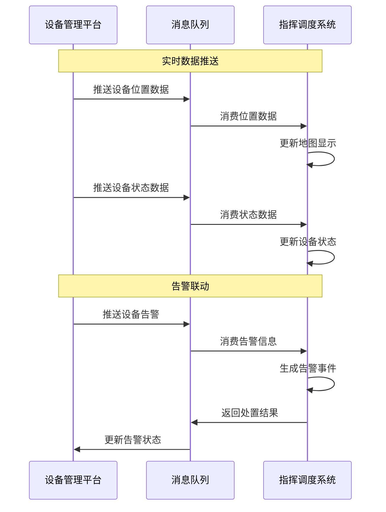

### 6.3 小程序与指挥调度集成流程

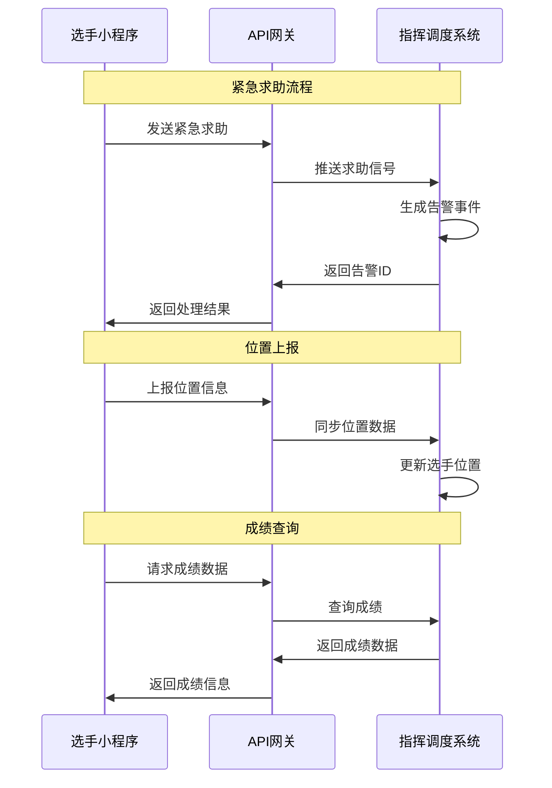

---

## 7. 异常处理流程

### 7.1 网络异常处理流程

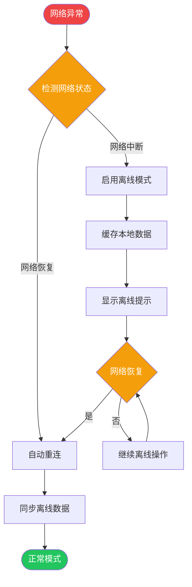

### 7.2 系统故障处理流程

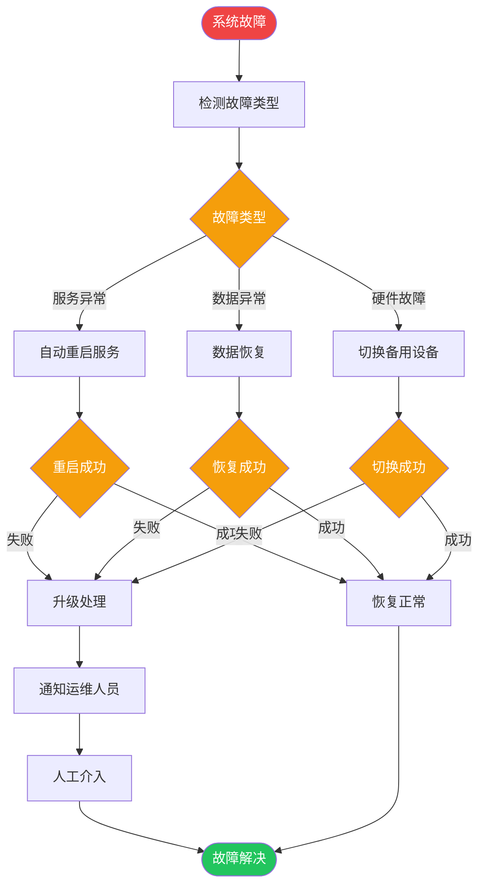

### 7.3 数据异常处理流程

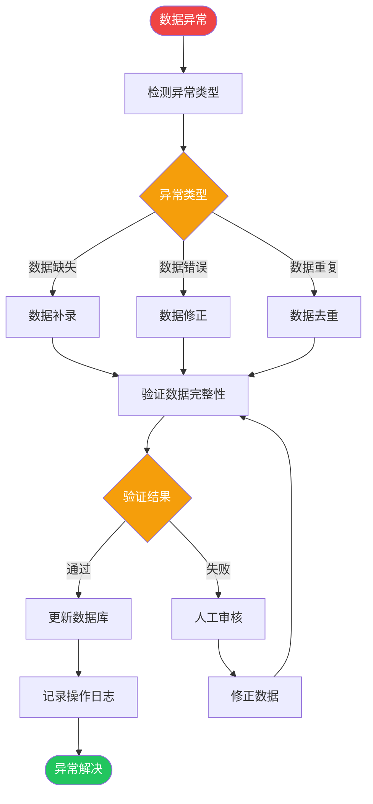

---

## 8. 关键操作检查清单

### 8.1 赛前准备检查清单

| 检查项 | 检查内容 | 责任人 | 状态 |
|--------|----------|--------|------|
| 赛事配置 | 赛事基本信息完整、项目配置正确 | 运营管理员 | □ |
| 选手名单 | 选手信息完整、分组正确 | 运营管理员 | □ |
| 设备准备 | 设备在线、电量充足、绑定正确 | 设备管理员 | □ |
| 系统检查 | 各子系统运行正常、数据同步正常 | 系统管理员 | □ |
| 告警规则 | 告警规则配置正确、通知渠道畅通 | 调度员 | □ |
| 资源配置 | 安保、医疗等资源配置到位 | 调度员 | □ |
| 视频监控 | 摄像头在线、画面清晰 | 指挥长 | □ |
| 通信测试 | 语音通信、消息推送正常 | 调度员 | □ |

### 8.2 赛事进行中检查清单

| 检查项 | 检查内容 | 检查频率 | 责任人 |
|--------|----------|----------|--------|
| 系统状态 | 各子系统运行状态 | 实时 | 系统管理员 |
| 设备状态 | 设备在线率、电量、信号 | 5分钟 | 设备管理员 |
| 告警处理 | 告警及时处置率 | 实时 | 调度员 |
| 资源状态 | 资源使用情况、空闲率 | 10分钟 | 调度员 |
| 数据同步 | 数据同步延迟 | 5分钟 | 系统管理员 |
| 视频监控 | 视频画面质量 | 10分钟 | 指挥长 |

### 8.3 赛后复盘检查清单

| 检查项 | 检查内容 | 责任人 | 状态 |
|--------|----------|--------|------|
| 数据完整性 | 所有数据完整保存 | 系统管理员 | □ |
| 统计报告 | 各类统计报告生成 | 运营管理员 | □ |
| 经验总结 | 处置经验、改进建议 | 调度员 | □ |
| 设备回收 | 设备回收、数据清除 | 设备管理员 | □ |
| 系统维护 | 系统维护、数据备份 | 系统管理员 | □ |

---

## 9. 流程优化建议

### 9.1 效率优化

1. **批量操作**：支持批量导入、导出、删除等操作
2. **快捷入口**：常用功能提供快捷入口
3. **智能推荐**：系统辅助决策，减少人工判断
4. **自动化流程**：自动触发相关流程，减少人工操作

### 9.2 体验优化

1. **操作引导**：首次使用提供操作引导
2. **错误提示**：错误信息清晰，提供解决方案
3. **操作反馈**：操作后及时反馈结果
4. **离线支持**：核心功能支持离线使用

### 9.3 安全优化

1. **权限控制**：严格的角色权限控制
2. **操作审计**：所有操作记录审计日志
3. **数据加密**：敏感数据加密存储和传输
4. **异常监控**：实时监控系统异常

---

## 10. 更新日志

| 版本 | 日期 | 更新内容 | 作者 |
|------|------|----------|------|
| v1.0 | 2026-03-26 | 初始版本创建 | UI/UX设计团队 |

---

**文档维护者**：UI/UX设计团队  
**最后更新时间**：2026-03-26
