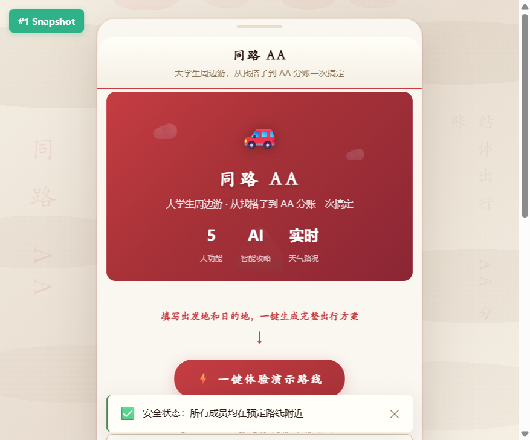
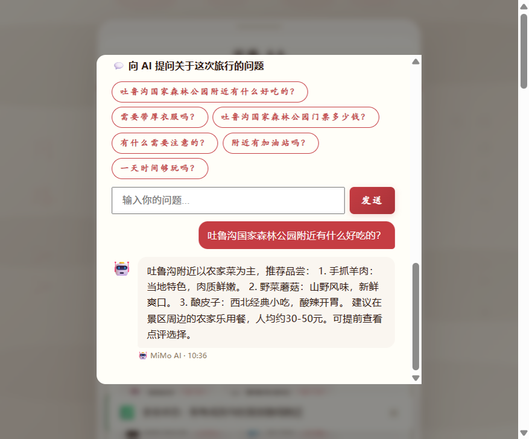
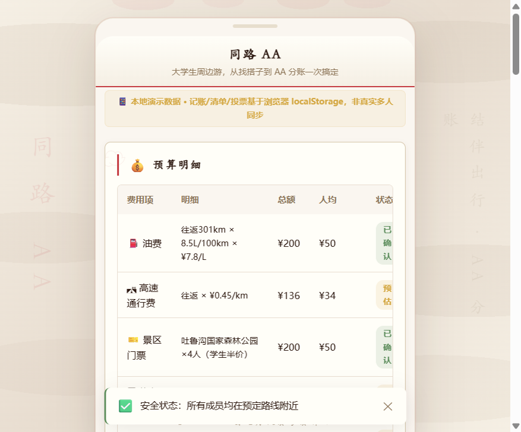
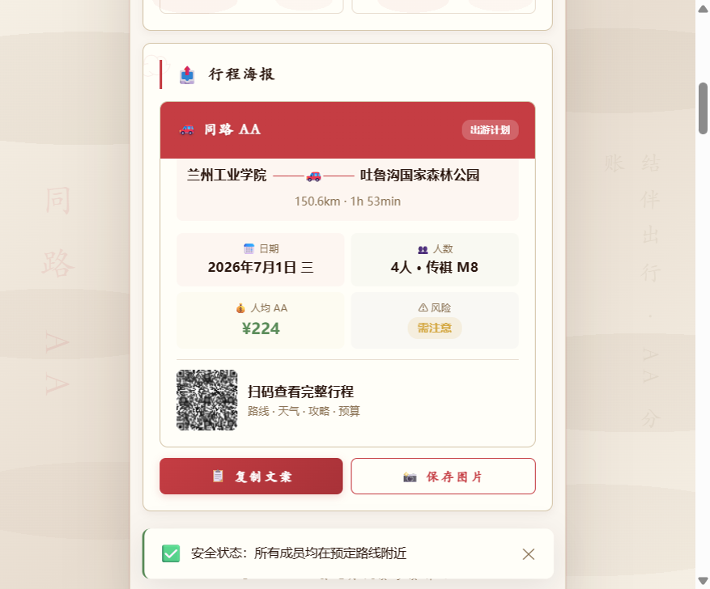

# 【生活娱乐赛道】同路 AA — 大学生周边游结伴出行

> 标签：#生活娱乐 #大学生周边游 #AI 攻略 #AA 分账

---

## 0. 先和大家打个招呼 👋

大家好，我是一名在校大学生，平时喜欢和同学一起拼车出去玩。每次组局都头疼同一件事：有人出车、有人出油钱、有人买门票，最后算账算到吵架。于是我想，能不能做个工具，把"找搭子—规划路线—算清账"一次搞定？

我没有任何前端开发经验，只学过一点 Python 课。用 TRAE 做这个 Demo 的过程，说实话有点出乎意料——我把脑子里想的功能一句句讲给它听，它直接把 Vue 组件、地图集成、API 调用都写出来了。最让我惊讶的是，我说"加一个 AI 问答，让人能问目的地附近有什么好吃的"，它不光接好了 MiMo API，还自动加了对话历史和推荐问题。那一刻我真觉得：原来做产品可以这么简单。

---

## 1. Demo 简介

**同路 AA** 是一个移动端优先的网页应用，面向大学生群体，解决周边自驾游中"找搭子难、规划路线繁琐、AA 分账算不清"三个痛点。

### 核心功能

**🗺️ 智能路线规划**
输入出发地和目的地，自动调用 OSRM 路线 API 计算真实距离和车程，在 Leaflet 地图上绘制完整路线，标注沿途 POI。

**💰 AA 分账 + 票据识别**
自动计算油费、高速费、门票、餐饮，按人数均摊。支持拍照记账，按类别分类，最后生成可分享的费用清单。

**🤖 AI 个性化攻略**
接入 MiMo AI，根据路线、天气、人数生成游玩建议、美食推荐、风险提示。支持自由提问，带对话历史和推荐问题。

**🤝 搭子匹配 + 位置共享**
发布出行计划，按目的地、日期、预算、兴趣标签匹配同行伙伴。出行中实时共享位置，偏离路线自动预警，一键 SOS。

---

## 2. Demo 创作思路

### 灵感来源

上学期和四个同学拼车去吐鲁沟玩，一路上问题不断：出发前群里刷屏问"谁有车""几个人去""油钱怎么算"；路上有人走错路没人发现；回来后算账，光油费就吵了三天。我翻了一圈应用商店，没有一款产品同时覆盖"找人—规划—记账"全流程。

### 想解决的痛点

- **痛点1 找搭子难**：微信群发消息效率低，很难按目的地和出行日期精准匹配同行人。
- **痛点2 路线规划散**：用地图 App 查路线、用天气 App 看预报、用小红书找攻略，三个工具来回切换。
- **痛点3 AA 分账乱**：有人出车、有人加油、有人买门票，回来对账全凭记忆和微信转账记录，容易扯皮。

### 为什么做这个方向

大学生周边游是高频刚需场景，但现有工具都只解决单一环节。同路 AA 把整个出行链路串起来：从"发计划找搭子"到"生成路线"到"实时位置共享"再到"AA 分账"，一个页面跑完全流程。选择网页应用形态，是因为大学生换手机频繁，不想下载 App，浏览器打开即用最省事。

---

## 3. Demo 体验地址

### 线上体验

部署在 IGA Pages，浏览器直接打开即可体验全部功能：

**在线体验：** https://tonglu-aa-k2y072ce55-3vw56ym984.preview.iga-pages.com?iga_token=0ab5394f7c3a656173519a84b163f832&iga_time=1782454071

> 打开后点击首页"一键体验演示路线"按钮，即可快速预览路线规划、AI 攻略、AA 分账等全部功能。

### 本地体验

本作品同时以可交互的 HTML 格式文件提供，已使用 Zip 打包上传社区。下载后解压，双击 `start.bat` 即可自动启动本地服务器并打开浏览器。

**本地启动方式：** 解压 → 双击 start.bat → 浏览器自动打开 http://localhost:8000

> 需安装 Python 或 Node.js（任一即可）。脚本会自动检测并选择可用运行时。

---

## 4. TRAE 实践过程

### 技术栈一览

| 技术 | 作用 |
|------|------|
| Vue 3.4 | 响应式框架 |
| Leaflet 1.9 | 交互式地图 |
| OSRM | 路线规划 API |
| Open-Meteo | 天气 + 地理编码 |
| MiMo AI | 攻略文案生成 |
| Pinia | 状态管理 |

### 开发流程

1. **需求描述**：向 TRAE 描述产品形态——"做一个大学生周边游的网页应用，包含路线规划、AA 分账、AI 攻略、搭子匹配"。TRAE 自动生成了项目骨架和 Vue 组合式 API 结构。
2. **地图 + 路线集成**：让 TRAE 集成 Leaflet 地图和 OSRM 路线 API，自动处理地理编码、路线绘制、POI 标注。TRAE 还主动加了路线偏离检测逻辑。
3. **AI 攻略接入**：描述"接入 MiMo AI，生成游玩攻略和美食推荐"。TRAE 完成了 API 封装、请求重试、本地 fallback 模板、对话历史、推荐问题等全套功能。
4. **AA 分账模块**：描述分账规则——"油费按里程、高速费按公里、门票学生半价、餐饮按人头"。TRAE 实现了完整的费用计算和票据识别功能。
5. **位置共享 + SOS**：让 TRAE 加实时位置共享和安全预警。它实现了 Geolocation API 降级策略、模拟位置 fallback、偏离路线检测、SOS 紧急求助。
6. **UI 视觉升级**：要求"中国传统色 + 首屏 Hero + 卡片层次 + Loading 动画"。TRAE 设计了红金绿三色左边框体系、脉冲动画按钮、步骤进度条、海报风格分享卡片。
7. **Bug 修复 + 启动脚本**：修复了位置获取失败（降级策略）、分享卡片二维码丢失（Canvas ref 冲突）、地图标记图标遮挡、start.bat 编码和路径问题。

### 开发关键步骤截图

**截图1：首屏 Hero + 路线规划表单**

**截图2：AI 攻略弹窗 + 对话问答**

**截图3：AA 分账页面**

**截图4：分享卡片海报**

> 注：以上截图为 TRAE 中运行 Demo 的实际效果。如需补充 TRAE 对话界面截图，可在 TRAE 中对开发对话窗口截图后追加。

### 关键任务对话 Session ID

| 对应任务 | Session ID |
|----------|------------|
| 路线规划 + 地图集成 | `1488068562167132:1f594544030f8f3a163d2a1dd985839d_6a30d848115a7da81b72d9eb.6a39f4fae8b36debad506cfb.6a3a4f4ce02cafafc1436162:TRAE Work CN.0.1.23.no_sid.no_ppe.T(2026/6/23 17:18:39)` |
| AI 攻略 + 对话问答 | `1488068562167132:1f594544030f8f3a163d2a1dd985839d_6a36a0b1d4d99a36f1f06337.6a36a0b1d4d99a36f1f06338.6a36a0b1d4d99a36f1f06338:TRAE Work CN.0.1.23.no_sid.no_ppe.T(2026/6/20 22:25:18)` |
| UI 视觉升级 + Bug 修复 | `1488068562167132:1f594544030f8f3a163d2a1dd985839d_6a36a03ed4d99a36f1f062c9.6a36a03ed4d99a36f1f062ca.6a36a084d4d99a36f1f0630b:TRAE Work CN.0.1.23.no_sid.no_ppe.T(2026/6/20 22:39:22)` |

---

## 5. 对应的报名审核通过的帖子链接

**报名帖链接：** https://forum.trae.cn/t/topic/23054

---

同路 AA · TRAE AI 创造力大赛参赛作品
生活娱乐赛道 · 大学生周边游结伴出行
