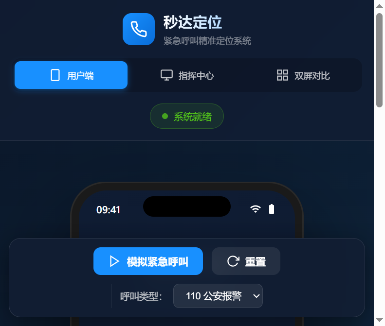
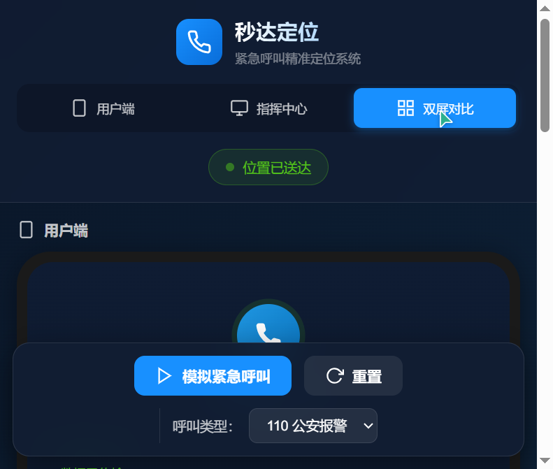
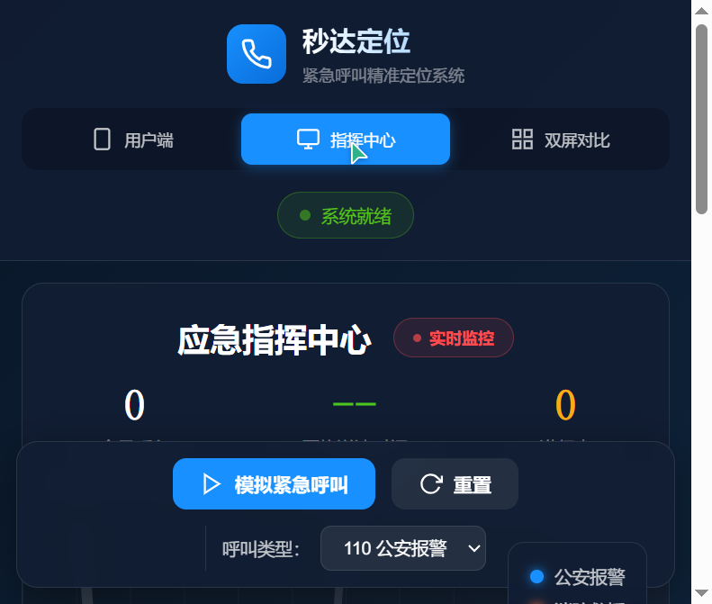

【标签】 社会服务 社会公益

【标题】 社会服务 + 秒达定位 — 紧急呼叫精准定位系统

【正文】

## 1. Demo 简介

**是什么：** 秒达定位是一套紧急呼叫精准定位系统，由用户端（手机SDK）、后端API服务和应急指挥中心三部分组成。当用户拨打110/119/120等紧急电话时，手机会自动、静默地将精准位置信息传输到应急指挥中心，让救援力量"秒级"获知报警人位置。

**面向谁：**
- 全体社会公众（特别是老年人、儿童、语言障碍者、身处陌生环境的人）
- 公安、消防、医疗等应急救援指挥中心
- 智能手机厂商和电信运营商

**主要功能：**

### 功能一：一键紧急呼叫 + 自动定位
用户只需点击紧急呼叫按钮，系统自动获取当前精准位置（GPS+基站+WiFi融合定位），无需手动描述地址。



### 功能二：应急指挥中心实时监控
指挥中心大屏实时展示所有紧急呼叫位置、类型、状态，支持地图可视化和呼叫详情查看，辅助快速调度决策。


### 功能三：双屏对比 — 数据流转可视化
左右分屏同步展示用户端拨号与指挥中心接收的全过程，直观呈现位置数据从手机到指挥中心的秒级传输链路。



---

## 2. Demo 创作思路

**灵感来源：**
在新闻和现实生活中，经常看到因为报警人无法准确描述位置而导致救援延误的案例。特别是当报警人处于紧张、陌生环境，或者是老人、儿童、语言障碍者时，"说清自己在哪"变成了一件难事。随着智能手机的普及，几乎人人随身携带高精度定位设备，为什么不能让位置信息"自己"跑到指挥中心呢？这个问题催生了"秒达定位"的想法。

**想解决的问题：**
1. **位置描述困难：** 报警人紧张时难以准确描述位置，陌生环境下更是如此
2. **黄金救援时间：** 每多花1分钟确认位置，就少1分钟救援时间
3. **特殊群体困境：** 老人、儿童、聋哑人等群体在紧急情况下无法有效沟通
4. **多源信息分散：** 通话、位置、调度信息分散在不同系统，效率低下

**为什么做这个方向：**
- **社会价值大：** 直接关乎生命安全，每缩短10秒定位时间，可能就能多挽救一条生命
- **技术可行性高：** 智能手机普及率高，定位技术成熟，5G网络传输延迟低
- **可落地性强：** 不需要新增硬件，通过系统SDK+运营商网络侧对接即可实现
- **边际成本低：** 系统建成后，覆盖用户越多，平均成本越低，社会普惠效应越显著

经过权衡，选择从"系统级定位SDK + 标准API接口 + 指挥中心可视化"三个维度入手，构建一套完整的端到端解决方案Demo，既能体现核心价值，又具备实际可落地的技术参考性。

---

## 3. Demo 体验地址

**交互式HTML体验文件：** 项目根目录下的 `index.html` 可直接在浏览器中打开体验，无需部署。

> 体验方式：下载项目后，双击 `index.html` 即可在浏览器中运行完整Demo。支持三种视图切换（用户端/指挥中心/双屏对比），点击"模拟紧急呼叫"按钮可体验完整的拨号→定位→传输→送达流程。

**本地运行后端API服务：**
```bash
cd server
npm install
node server.js
# 访问 http://localhost:3000/health 验证服务状态
```

---

## 4. TRAE 实践过程

整个项目从需求分析到Demo完成，全程使用 TRAE 进行开发。以下是关键开发步骤：

### 步骤一：需求分析与方案设计
在 TRAE 中描述项目背景和目标，AI 助手协助梳理系统架构，明确"用户端-服务端-指挥中心"三层结构，并输出详细的功能清单和技术选型建议。



**关键产出：**
- 系统整体架构设计
- 核心功能模块划分
- 技术栈选型（前端原生HTML/CSS/JS，后端Node.js + Express）

### 步骤二：前端Demo开发
使用 TRAE 快速搭建前端界面，包括手机端拨号界面、指挥中心地图监控、双屏对比视图。通过对话式开发，逐步完善交互动画、数据模拟和视觉效果。

**开发亮点：**
- 纯CSS/SVG模拟地图，避免外部瓦片服务依赖，确保离线可用
- 三视图切换（用户端/指挥中心/双屏对比），全方位展示系统
- 真实的呼叫流程动画，包含定位获取→数据传输→指挥中心接收全过程

### 步骤三：后端API与防DDoS安全体系
在完成前端Demo后，进一步开发后端标准API接口，并设计了完整的多层防DDoS攻击防护体系，包含令牌桶限流、IP黑白名单、请求签名验证、服务降级管理、WAF应用防火墙五大中间件。

**安全中间件架构：**
```
请求 → IP限流 → WAF → 服务降级 → 令牌桶限流 → 签名验证 → 业务逻辑
```

### 步骤四：测试验证与文档输出
使用 TRAE 编写测试脚本，对API功能和安全防护进行全面测试，确保核心功能正常、防护机制有效。同时输出完整的API接口规范文档和防DDoS攻击方案文档。

**测试结果：** 10项测试全部通过 ✅

---

### 关键任务 Session ID

以下是使用 TRAE 开发过程中的关键对话 Session ID（共4个）：

1. **`8d6296fcc0142edf73c93d08636f8d2e`** — 项目初期：Demo原型设计与前端界面开发
2. **`fab755da9575b42df622f53713c7d06c`** — 可行性分析：项目可行性研究与问题清单梳理
3. **`70abb0c14f5701e79140f3599baa31bc`** — 安全体系：防DDoS攻击方案设计
4. **`24accde924eb7fdbd704b483064317e6`** — 标准API：接口规范编写与后端代码实现

---

### 项目文件结构

```
DC/
├── index.html                  # 前端Demo主页面
├── app.js                      # 前端交互逻辑
├── styles.css                  # 样式文件
├── screenshots/                # Demo截图
│   ├── screenshot-1-user-view.png
│   ├── screenshot-2-control-center.png
│   ├── screenshot-3-call-active.png
│   └── screenshot-4-dual-view.png
├── docs/
│   ├── 防DDoS攻击方案.md        # 完整的DDoS防护方案文档
│   └── API接口规范.md           # 标准API接口规范文档
└── server/
    ├── server.js               # Express API主服务
    ├── test-api.js             # API测试脚本
    └── middleware/
        ├── tokenBucketLimiter.js   # 令牌桶限流中间件
        ├── ipLimiter.js            # IP黑白名单中间件
        ├── signatureAuth.js        # 请求签名验证中间件
        ├── degradeManager.js       # 服务降级管理中间件
        └── simpleWaf.js            # WAF应用防火墙中间件
```

---

### 开发心得

使用 TRAE 开发这个项目的最大感受是**效率的飞跃**：

1. **从想法到原型的速度极快：** 描述需求后，TRAE 能快速输出可运行的Demo，极大缩短了"构思→验证"的循环
2. **全栈能力覆盖：** 从前端界面到后端API，再到安全架构设计和文档编写，TRAE 都能提供专业级的支持
3. **代码质量有保障：** 生成的代码结构清晰、注释规范，并且会主动考虑异常处理和边界情况
4. **文档自动生成：** 开发完成后，TRAE 可以直接根据代码生成规范的技术文档，省时省力

秒达定位虽然只是一个Demo，但背后承载的是对公共安全的思考。希望这个项目能为应急救援领域的数字化升级贡献一点微薄的力量。🚀
