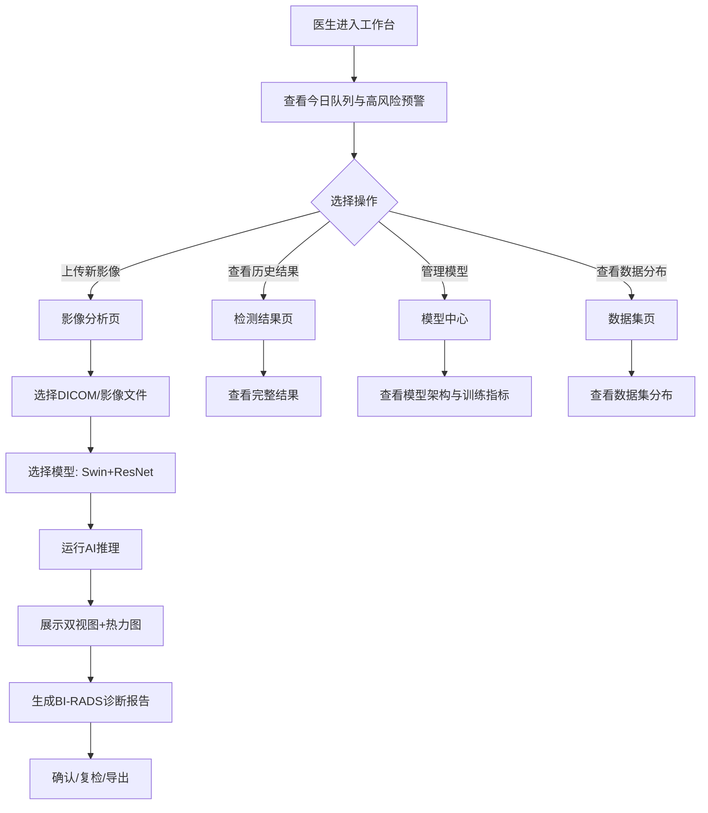

# 乳腺钼靶AI智能检测平台 - 产品需求文档(PRD)

## 1. 产品概述

**MammoSentry - 基于乳腺钼靶的乳腺癌智能检测平台**，是一款面向临床医生与影像科研工作者的医学AI辅助诊断Demo。
平台以乳腺钼靶影像为输入，依托Swin Transformer（自监督预训练）+ ResNet-18（下游微调）双阶段模型架构，提供BI-RADS分级、病灶定位、良恶性分类等智能化能力。
**目标用户**：放射科医生、乳腺影像科研人员、临床筛查机构；**核心价值**：将传统钼靶阅片从"经验驱动"升级为"AI增强的循证决策"，提升早期乳腺癌检出率与诊断一致性。

## 2. 核心功能

### 2.1 用户角色
本Demo不设登录，使用统一视角展示完整工作流。

| 角色 | 入口 | 核心权限 |
|------|------|----------|
| 临床医生 | 全功能入口 | 查看AI分析结果、对比历史报告、导出诊断建议 |
| 科研人员 | 模型中心/数据集 | 查看模型架构、训练指标、数据分布 |
| 系统管理员 | 仪表盘 | 系统状态、模型版本、推理性能监控 |

### 2.2 功能模块
1. **工作台 (Dashboard)**：实时推理队列、模型状态、今日检测统计、风险病例预警
2. **影像分析 (Analysis)**：钼靶影像上传/选择、AI推理交互、左右乳对比视图、检测热力图
3. **检测结果 (Result)**：BI-RADS分级详情、病灶定位标注、置信度可视化、临床报告生成
4. **模型中心 (Models)**：Swin Transformer + ResNet-18架构可视化、训练曲线、模型版本管理
5. **数据集 (Dataset)**：CBIS-DDSM/TCIA数据分布、正负样本比例、训练/测试集划分

### 2.3 页面详细功能
| 页面 | 模块 | 功能描述 |
|------|------|----------|
| 工作台 | 实时推理流 | 滚动展示正在推理的病例，显示患者ID、检查类型、AI状态、置信度 |
| 工作台 | 关键指标卡 | 今日检测数、阳性检出率、平均推理时长、模型AUC |
| 工作台 | 高风险预警 | 优先展示BI-RADS 4-5级病例，进入复检流程 |
| 影像分析 | 上传组件 | 支持DICOM/PNG/JPG拖拽上传，模拟DICOM元数据解析 |
| 影像分析 | 双视图对比 | L-CC/L-MLO左乳视图与R-CC/R-MLO右乳视图并排展示 |
| 影像分析 | AI推理控制台 | 模型选择、推理参数调节、运行日志、推理进度 |
| 检测结果 | 病灶标注 | 在原图叠加边界框、像素级热力图、关键点标记 |
| 检测结果 | 诊断报告 | 自动生成结构化报告，含BI-RADS分级、建议、风险评估 |
| 模型中心 | 架构图 | Swin Transformer→ResNet-18双阶段pipeline可视化 |
| 模型中心 | 训练曲线 | Loss/Accuracy/AUC随epoch变化曲线，含训练集与验证集 |
| 数据集 | 分布图 | 病灶类型(钙化/肿块/不对称)分布、良恶性比例、患者年龄分布 |
| 数据集 | 训练集详情 | 阳性病例30-40%、总量10000-12000例、测试集3000-5000例 |

## 3. 核心流程

## 4. 用户界面设计

### 4.1 设计风格
- **整体调性**：「放射科控制台」—— 暗色高对比、专业克制、技术感强，避免传统医疗网站的粉/蓝暖色调
- **主色板**：
  - 背景：深墨蓝/近黑 `#070A12` (主) / `#0E1320` (卡片)
  - 扫描青：`#00E5E5` (主强调色，代表数据/扫描线)
  - 警示珊瑚：`#FF6B7A` (高风险/阳性)
  - 琥珀暖：`#FFB84D` (中风险/待复检)
  - 数据翠：`#5EE6A8` (良性/低风险)
  - 文本：奶白 `#E8ECF4` / 灰阶 `#7A8499`
- **按钮**：直角化细线边框 (1px solid + hover发光)，去除圆角泛化；强调按钮采用描边+微动画
- **字体**：
  - 展示：`Fraunces` (衬线，编辑感) - 大标题/品牌名
  - 正文：`Geist` / `Manrope` (人文无衬线) - 段落
  - 数据：`JetBrains Mono` (等宽) - ID/数值/时间戳
- **布局**：12列网格 + 不对称布局；大量使用诊断报告式的左右分栏与重影效果
- **图标**：lucide-react，线性、统一线宽
- **特色元素**：
  - 扫描网格背景 (8px × 8px 青色细线)
  - 十字准线 / 标尺刻度 (医学影像的视觉符号)
  - 数据编号、方括号标记 `[CASE_001]` / `// INFO` 等代码注释风格
  - 序号标记：使用 `01 / 05` 大号显示章节

### 4.2 页面设计概览
| 页面 | 模块 | UI元素 |
|------|------|--------|
| 全局 | 侧边栏 | 深色窄栏 + 序号导航 + 当前页指示点 + 底部系统状态 |
| 全局 | 顶栏 | 品牌「MammoSentry / 乳腺钼靶AI」+ 搜索 + 通知 + 用户 |
| 工作台 | 实时流 | 等宽字体滚动行 + 进度条 + 状态色条 |
| 工作台 | 指标卡 | 大号衬线数字 + 等宽单位 + 微缩sparkline |
| 影像分析 | 双视图 | 黑色框线+十字标线+缩放控制+底部元数据条 |
| 影像分析 | 推理控制台 | 命令行风格输入框 + 运行日志流 |
| 检测结果 | 标注图层 | 边界框+热力图+关键点三层叠加，半透明 |
| 检测结果 | 报告卡 | 编辑设计风格，白底纸质感反衬 |
| 模型中心 | 架构图 | 节点间连线+参数标签+激活函数标注 |
| 数据集 | 分布图 | 自绘SVG环形/直方图，data-labelled |

### 4.3 响应式
- **Desktop 优先** (≥1280px)，主要面向放射科工作站双屏环境
- 1024-1280px：侧边栏可折叠
- < 1024px：移动端简化视图（本Demo不重点优化，但保留可读性）

### 4.4 视觉/动效引导
- 进入动画：自上而下分层淡入，错位 80ms
- 数据流动：实时推理队列使用 `requestAnimationFrame` 平滑滚动
- 扫描线效果：检测热力图叠加动态扫描横线 (CSS animation)
- 悬停反馈：边框颜色 + 微小位移 (1-2px)
- 过渡：缓动 `cubic-bezier(0.22, 1, 0.36, 1)`，时长 300-500ms

## 5. 范围与非目标
- **包含**：UI Demo、模拟数据、Mock 推理流程、模型信息展示
- **不包含**：真实后端推理、用户登录、病例存储、DICOM解析后端、报告导出文件生成
