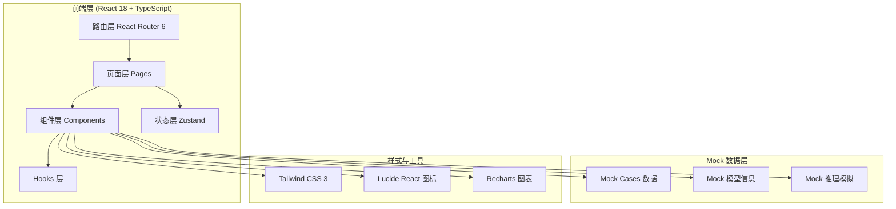

# 乳腺钼靶AI智能检测平台 - 技术架构文档

## 1. 架构设计

本项目为 **纯前端 Demo**，聚焦于界面与交互的高保真还原，使用 Mock 数据模拟后端推理与数据流。



## 2. 技术栈说明

- **前端框架**：React 18 + TypeScript
- **构建工具**：Vite 5
- **样式方案**：Tailwind CSS 3 + CSS Variables（设计令牌）
- **路由**：react-router-dom v6
- **状态管理**：Zustand（轻量级全局状态）
- **图标**：lucide-react
- **图表**：Recharts（训练曲线、ROC、分布图）
- **字体**：Google Fonts (Fraunces, Geist, JetBrains Mono)
- **后端**：无（纯前端 Demo）
- **数据库**：无
- **包管理器**：pnpm（若不可用则降级到 npm）

## 3. 路由定义

| 路由 | 页面 | 用途 |
|------|------|------|
| `/` | Dashboard 工作台 | 系统概览、实时推理流、关键指标 |
| `/analysis` | ImageAnalysis 影像分析 | 上传钼靶、运行AI推理、查看热力图 |
| `/results` | DetectionResult 检测结果 | BI-RADS详情、标注图、诊断报告 |
| `/models` | ModelHub 模型中心 | Swin+ResNet架构可视化、训练指标 |
| `/dataset` | DatasetStats 数据集 | 数据分布、正负样本、训练测试集 |

## 4. 数据模型 (Mock)

### 4.1 病例数据模型 (Case)
```typescript
interface Case {
  id: string;                  // 例如: "CASE_2026_00142"
  patientId: string;           // 匿名化: "P-A8F2-1039"
  examType: 'L-CC' | 'L-MLO' | 'R-CC' | 'R-MLO';
  patientAge: number;
  breastDensity: 'A' | 'B' | 'C' | 'D';  // BI-RADS 密度分级
  biradsScore: 0 | 1 | 2 | 3 | 4 | 5 | 6;
  lesionType: 'mass' | 'calcification' | 'asymmetry' | 'none';
  malignant: boolean;
  confidence: number;          // 0-1
  inferenceTime: number;       // ms
  timestamp: string;
  imageUrl: string;            // 占位图
  hasHeatmap: boolean;
}
```

### 4.2 模型信息 (ModelInfo)
```typescript
interface ModelInfo {
  name: string;
  version: string;
  backbone: 'Swin Transformer' | 'ResNet-18';
  pretrainedDataset: 'CBIS-DDSM' | 'TCIA' | 'ImageNet-1k';
  accuracy: number;
  auc: number;
  sensitivity: number;
  specificity: number;
  f1Score: number;
  trainLoss: number[];
  valLoss: number[];
  trainAcc: number[];
  valAcc: number[];
  epochs: number;
  batchSize: number;
  learningRate: number;
}
```

### 4.3 数据集统计 (DatasetStats)
```typescript
interface DatasetStats {
  totalTrain: number;          // 10000-12000
  totalTest: number;           // 3000-5000
  positiveRate: number;        // 0.30-0.40
  lesionTypeDistribution: {
    mass: number;
    calcification: number;
    asymmetry: number;
    none: number;
  };
  ageDistribution: { range: string; count: number }[];
  densityDistribution: { A: number; B: number; C: number; D: number };
}
```

## 5. 关键组件设计

### 5.1 布局组件
- `AppLayout`：包含侧边栏、顶栏、内容区
- `Sidebar`：序号化导航
- `TopBar`：品牌、搜索、通知

### 5.2 通用组件
- `MetricCard`：大号衬线数字 + 单位 + sparkline
- `ScanlineOverlay`：扫描线动画层
- `CrosshairFrame`：影像十字准线框
- `Terminal`：命令行风格的运行日志
- `DataTable`：等宽字体表格
- `StatusDot`：状态指示点（扫描青/警示珊瑚/数据翠）

### 5.3 业务组件
- `MammoViewer`：钼靶影像查看器（双视图）
- `HeatmapOverlay`：AI 热力图叠加层
- `RoiAnnotation`：病灶边界框
- `ModelArchitecture`：Swin+ResNet 架构可视化
- `TrainingCurves`：训练曲线图
- `DatasetDistribution`：数据分布图表

## 6. 设计令牌 (CSS Variables)

```css
:root {
  --bg-base: #070A12;
  --bg-card: #0E1320;
  --bg-elevated: #161C2E;
  --border-subtle: #1F2940;
  --border-strong: #2E3A5C;
  --accent-scan: #00E5E5;
  --accent-warn: #FF6B7A;
  --accent-caution: #FFB84D;
  --accent-ok: #5EE6A8;
  --text-primary: #E8ECF4;
  --text-secondary: #7A8499;
  --text-mono: #B8C2D9;
}
```

## 7. 字体加载

通过 `<link>` 引入 Google Fonts:
- `Fraunces` (display, 400/500/700) - 衬线展示
- `Geist` (body, 400/500/600) - 正文
- `JetBrains Mono` (mono, 400/500) - 数据

## 8. 项目结构

```
src/
├── App.tsx                 # 路由 + 布局
├── main.tsx
├── index.css               # 全局样式 + 字体
├── components/
│   ├── layout/
│   │   ├── AppLayout.tsx
│   │   ├── Sidebar.tsx
│   │   └── TopBar.tsx
│   ├── common/
│   │   ├── MetricCard.tsx
│   │   ├── ScanlineOverlay.tsx
│   │   ├── CrosshairFrame.tsx
│   │   ├── Terminal.tsx
│   │   ├── StatusDot.tsx
│   │   └── DataTable.tsx
│   └── medical/
│       ├── MammoViewer.tsx
│       ├── HeatmapOverlay.tsx
│       ├── RoiAnnotation.tsx
│       ├── ModelArchitecture.tsx
│       └── BiradsBadge.tsx
├── pages/
│   ├── Dashboard.tsx
│   ├── ImageAnalysis.tsx
│   ├── DetectionResult.tsx
│   ├── ModelHub.tsx
│   └── DatasetStats.tsx
├── store/
│   └── useAppStore.ts      # Zustand 全局状态
├── data/
│   ├── mockCases.ts
│   ├── mockModel.ts
│   └── mockDataset.ts
└── utils/
    └── format.ts
```

## 9. 性能与质量
- 使用 Vite 构建，开发体验快
- TypeScript 严格模式
- 关键页面保持组件 < 300 行
- 图片使用 CSS 渐变/SVG 占位，避免外部网络请求
- 数据更新使用 rAF 节流
