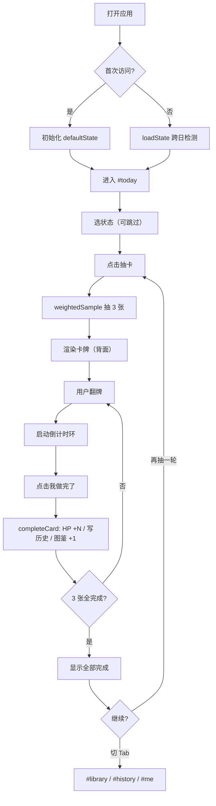

# 工位回血卡 · 产品需求文档（PRD）

> 版本：v1.0.0 · 全新实现版（不复刻原项目视觉，独立设计语言）
> 形态：纯前端、零构建、零后端、纯 LocalStorage，解压即用的静态站点

---

## 1. 产品概述

「工位回血卡」是一款面向**久坐办公人群**的**游戏化健康微习惯**单页应用。用户通过"抽卡"机制把枯燥的健康提醒转化为日常仪式感，每张卡都是一项 30-180 秒的微小恢复动作（喝水、远眺、拉伸、深呼吸等）。

- **解决问题**：健康"知而不行"——道理人人懂，但久坐、盯屏、压力的伤害无人坚持对抗
- **目标用户**：白领 / 程序员 / 设计师 / 学生 / 任何长时间坐在屏幕前的人
- **市场价值**：把"自律"从负担变成可视化的小成就，用 HP、连签、稀有度卡牌、收集图鉴维持长期使用动机

---

## 2. 核心功能

### 2.1 用户角色

| 角色 | 注册方式 | 核心权限 |
|------|----------|----------|
| 单机本地用户 | 无需注册，浏览器打开即用 | 全部功能（数据存于本地 LocalStorage，可手动导出导入） |

### 2.2 功能模块

应用由 **2 个页面 × 4 个 SPA Tab** 组成：

**主应用 [app.html](file:///Users/tyzhang/Learn/trae_app/work_head_cards/app.html)（哈希路由 SPA）**

1. **今日回血 (#today)**：HP 进度、状态多选、抽卡 CTA、三段式抽卡区（进度概览 / 卡牌 / 行动）
2. **卡牌图鉴 (#library)**：28 张卡的收集进度、按稀有度筛选、详情弹窗
3. **历史 & 周报 (#history)**：4 周热力图、本周回血曲线、周报数据卡
4. **我的 (#me)**：个人 Hero 卡、回血提醒、卡池偏好、数据导入导出、关于

**宣传介绍页 [intro.html](file:///Users/tyzhang/Learn/trae_app/work_head_cards/intro.html)（单页静态）**

5. **营销介绍页**：Hero、痛点、玩法四步、稀有度示例、使用场景、价值定位、未来规划、CTA、Footer

### 2.3 页面详情

| 页面名称 | 模块名称 | 功能描述 |
|---------|---------|---------|
| 今日回血 #today | HP 进度面板 | 0-100 HP 进度条，requestAnimationFrame 缓动；完成卡牌时飘 `+N` HP 数字 |
| 今日回血 #today | 状态选择面板 | 10 个状态 chip（久坐 / 眼疲劳 / 肩颈僵 / 腰背酸 / 会议轰炸 / 赶 DDL / 心情烦躁 / 困倦 / 脑子卡壳 / 饿肚子），多选 toggle |
| 今日回血 #today | 抽卡 CTA | 文案随批次状态动态变化（"开始抽卡" / "第 N 轮再来一次" / "全部完成再抽下一批"），按需禁用 |
| 今日回血 #today | 进度概览段 | 已完成 / 总数 徽标、进度条、三态文案（未抽卡 / 进行中 / 全部完成） |
| 今日回血 #today | 卡牌段 | 3 张卡的翻牌动画、稀有度徽标、HP 标签、emoji、名称、描述、倒计时环、"我做完了"按钮 |
| 今日回血 #today | 行动段 | 实时汇总（已完成 N 张 · +X HP · 第 R 轮）、一键全部翻牌、重抽（二次确认） |
| 卡牌图鉴 #library | Hero 收集进度 | 收集进度环（已点亮 / 28）、按稀有度分类统计（N/R/SR/SSR 各自抽中次数与已收集数） |
| 卡牌图鉴 #library | 稀有度筛选 | 5 个 chip：全部 / N / R / SR / SSR |
| 卡牌图鉴 #library | 图鉴网格 | 已抽过卡：显示名称 + 抽中次数；未抽过：显示 `?` 与"未解锁"；点击弹详情 |
| 卡牌图鉴 #library | 详情弹窗 | 稀有度、HP、时长、描述、抽中次数、对应状态标签 |
| 历史 & 周报 #history | 4 周热力图 | 按日聚合 HP 分 5 档色阶；hover 显示日期与 HP |
| 历史 & 周报 #history | 本周回血曲线 | 本周（周一为起点）每日累计 HP 折线 / 柱状图 |
| 历史 & 周报 #history | 周报数据卡 | 本周累计 HP、完成卡数、活跃天数、最佳一天；动态鼓励文案 |
| 我的 #me | 个人 Hero 卡 | 累计 HP / 当前连签 / 完成卡牌数 / 图鉴收集 N/28；副标题"已陪伴你 N 天" |
| 我的 #me | 回血提醒 | 总开关 + 时间选择器；申请 Notification 权限；setTimeout 触发提醒 |
| 我的 #me | 卡池偏好 | 饭点限定卡开关、10 个状态标签的禁用切换 |
| 我的 #me | 数据管理 | 导出 JSON 文件、导入 JSON（覆盖式）、重置（二次确认） |
| 我的 #me | 关于 | 应用名、版本、已上线模块、卡池规模、致谢 |
| 介绍页 intro.html | 顶部导航 | 品牌 + 6 个锚点链接（#problem / #how / #cards / #scenario / #value / #future） |
| 介绍页 intro.html | Hero | 主标、副标、4 个特征标签、CTA"立即体验" |
| 介绍页 intro.html | Problem | 6 个痛点卡：久坐成疾 / 盯屏过度 / 饮水不足 / 情绪紧绷 / 打卡疲劳 / 缺少趣味 |
| 介绍页 intro.html | Gameplay | 四步玩法（选状态 / 生成卡池 / 抽取回血卡 / 完成获反馈） |
| 介绍页 intro.html | Card System | 4 张代表卡 + 4 张更多示例；饭点限定卡机制说明 |
| 介绍页 intro.html | Scenarios | 5 个使用场景：会议间隙 / 久坐间歇 / 午后困倦 / 任务卡顿 / DDL 紧绷 |
| 介绍页 intro.html | Value | 效率提升价值 + 社会价值 |
| 介绍页 intro.html | Future | 已实装 + 未来规划（多设备同步、团队协作、AI 推荐、企业版） |
| 介绍页 intro.html | CTA + Footer | "立即体验抽卡" + 版权 |

---

## 3. 核心流程

### 3.1 自然语言描述

**首次进入** → 默认进入今日回血 Tab → 可选多个状态 → 点击「开始抽卡」→ 三张卡依次飞入（带稀有度徽标）→ 点卡翻面 → 倒计时启动 → 倒计时结束或主动点击「我做完了」→ HP 累加 + 飘字反馈 + 写入历史 + 图鉴解锁 + 连签 +1 → 三张全做完 → 可选「再抽一轮」或切到其他 Tab。

**跨日**：再次打开应用时 `loadState()` 检测日期变化，重置 today 字段，根据 `lastDrawDate` 判断连签是否延续。

**数据管理**：「我的」Tab 可导出全部 state 为 JSON 备份；导入 JSON 时**覆盖**当前 state；重置清空 LocalStorage。

### 3.2 流程图

---

## 4. 用户界面设计

### 4.1 设计风格（自由发挥版 · 与原项目无关联）

**整体定位**：**新拟态 + 像素游戏感** 的混合现代风。一种"温柔机能美学"，既像 RPG 卡牌游戏，又像现代健康 App。

- **主色调**：
  - 背景：`#0E1116` 深空灰（深色模式优先，护眼）
  - 卡面：`#1A1F28` 卡片底 / `#222831` 二级面板
  - 主品牌色：`#7CFFB2` 薄荷绿（健康、回血、生机）
  - 强调色：`#FF9F7C` 落日橙（HP 进度、CTA、稀有度高光）
  - 文字主色：`#E8EDF2`；次要：`#8A94A6`
- **稀有度色卡**：
  - N（普通）→ `#A8B3C7` 银灰
  - R（稀有）→ `#5DB4FF` 钴蓝
  - SR（史诗）→ `#C77DFF` 紫罗兰
  - SSR（传说）→ `#FFD66B` 金渐变（带 shimmer 高光动效）
- **按钮风格**：
  - 主按钮：圆角 14px，薄荷绿底 + 黑字，hover 升起阴影 + 微亮
  - 次按钮：透明底 + 1px 描边，hover 反色
  - 卡牌：圆角 20px，背面磨砂玻璃 + emoji 闪烁；正面带稀有度色环
- **字体**：
  - 显示标题：`'Space Grotesk', 'PingFang SC', sans-serif` 现代几何感
  - 数字字体：`'JetBrains Mono', monospace`（HP、倒计时、连签）
  - 正文：系统中文 `'PingFang SC', 'Microsoft YaHei'`
  - 标题尺寸：H1 32px / H2 24px / H3 18px / body 14px / caption 12px
- **布局风格**：
  - 左侧固定 sidebar（240px）+ 顶部 topbar（72px）+ 右侧主内容自适应
  - 桌面优先；窄屏（< 900px）sidebar 折叠为底部 tab bar
  - 卡片采用 12 栅格，gap 16px
- **图标/Emoji 风格**：
  - 系统 Emoji（apple color emoji）作为卡牌主视觉
  - 功能图标使用 [Lucide CDN SVG](https://lucide.dev) 内联（轻量、统一线条）
- **动效特色**：
  - 抽卡：3 张依次延迟 150ms 从下方滑入 + 轻微旋转
  - 翻牌：CSS `transform: rotateY(180deg)` + `transition: 0.6s cubic-bezier(.4,.0,.2,1)`
  - HP 进度：rAF 缓动 900ms
  - +N 飘字：从 HP 数字处向上飘 60px 同时 fade out
  - SSR 卡：金色 shimmer 横扫 + 边框流光
  - 全部完成：粒子礼花（CSS 关键帧伪元素，纯前端无依赖）

### 4.2 页面设计概览

| 页面名称 | 模块名称 | UI 要素 |
|---------|---------|--------|
| 今日回血 | HP 面板 | 深底卡 + 薄荷渐变进度条 + 大号数字 HP / 100 + `+N` 飘字动效 |
| 今日回血 | 状态 chip | 圆角 9999px 标签，选中态薄荷描边 + 内填底色，点击 scale 1.05 弹动 |
| 今日回血 | 卡牌 | 3 卡横排（窄屏 1 列），翻牌 3D 透视；稀有度色环呼吸光 |
| 今日回血 | 倒计时环 | SVG `<circle>` strokeDashoffset 动画，环周显示秒数 |
| 卡牌图鉴 | Hero | 大环形进度（SVG）+ 中央数字 N/28 + 四稀有度小卡 |
| 卡牌图鉴 | 网格 | 4 列 × 7 行（响应式 2-4 列），已解锁高亮、未解锁灰阶 + `?` |
| 卡牌图鉴 | 详情弹窗 | 中央模态 + 暗背景遮罩；ESC 关闭；点击外部关闭 |
| 历史 & 周报 | 热力图 | 4 行 × 7 列方格，5 档色阶（#1A1F28 → #7CFFB2），tooltip |
| 历史 & 周报 | 本周曲线 | Pure CSS / SVG 折线图，柱子悬停高亮 |
| 历史 & 周报 | 周报卡 | 4 数据卡 + 鼓励文案带 emoji |
| 我的 | Hero 卡 | 4 指标横排 + 副标题 + 头像 emoji（🌱 → 🌿 → 🌳 随等级演变） |
| 我的 | 设置区块 | 折叠面板风格，每块独立卡片，开关使用纯 CSS 拨片 |
| 我的 | 数据管理 | 三按钮一排：导出 / 导入 / 重置，重置带二次确认 |
| 介绍页 | Hero | 全屏渐变背景 + 主标 + 4 个特征 chip + CTA 大按钮 |
| 介绍页 | 痛点 6 卡 | 3×2 网格，每卡 emoji + 标题 + 1 行描述 |
| 介绍页 | 玩法 4 步 | 横向 step 流程图，步骤编号 + 标题 + 小段说明 |

### 4.3 响应式策略

- **桌面优先**（≥ 1200px）：sidebar 240px + 主内容 max-width 1080px
- **平板**（768-1200px）：sidebar 收窄为 64px 图标列
- **手机**（< 768px）：sidebar 转换为底部固定 tab bar（4 个图标）；卡牌网格 1 列；图鉴 2 列
- **触控优化**：所有可点击区域最小 44×44px；hover 状态在触控设备上不依赖

### 4.4 3D 场景指引

不适用（本项目为 2D Web App，不涉及 3D）。

---

## 5. 卡池数据

完整 28 张卡牌从原项目 [CARD_POOL](file:///Users/tyzhang/Learn/trae_app/workstation-heal-card/app.html#L3190-L3226) 提取，结构保持一致：

| 字段 | 类型 | 说明 |
|------|------|------|
| `id` | string | 唯一 ID |
| `name` | string | 中文名（如"社畜补水卡"） |
| `emoji` | string | 卡面主图 emoji |
| `rarity` | 'n' \| 'r' \| 'sr' \| 'ssr' | 稀有度 |
| `hp` | number | 完成奖励的 HP |
| `dur` | number | 倒计时秒数（建议执行时长） |
| `tags` | string[] | 关联的状态标签 |
| `desc` | string | 任务描述 |
| `hourRange?` | [number, number][] | 仅"饭点限定卡"有，如 [[11.5, 13.5], [17.5, 19.5]] |

**稀有度分布与权重**：
| 稀有度 | 张数 | 权重 | HP 区间 | 时长 |
|---|---|---|---|---|
| N | 14 | 65% | 8–10 | 30–60s |
| R | 8 | 25% | 14–18 | 20–180s |
| SR | 4 | 8% | 22–25 | 60–90s |
| SSR | 2 | 2% | 35 | 120–180s |

---

## 6. 非功能需求

- **零依赖部署**：解压 zip → 双击 `index.html`（或 `app.html`）即可运行，无需服务器
- **离线可用**：所有资源（HTML/CSS/JS/字体）本地化，无 CDN 强依赖（字体可降级到系统字体）
- **数据持久化**：仅依赖 `localStorage`，键名 `heal-app-state-v1`
- **浏览器兼容**：Chrome 100+ / Edge 100+ / Safari 15+ / Firefox 100+
- **性能**：首屏 < 200KB（不含字体），无任何运行时 npm 依赖
- **可访问性**：所有按钮带 aria-label；键盘可导航；色彩对比度 ≥ 4.5:1
