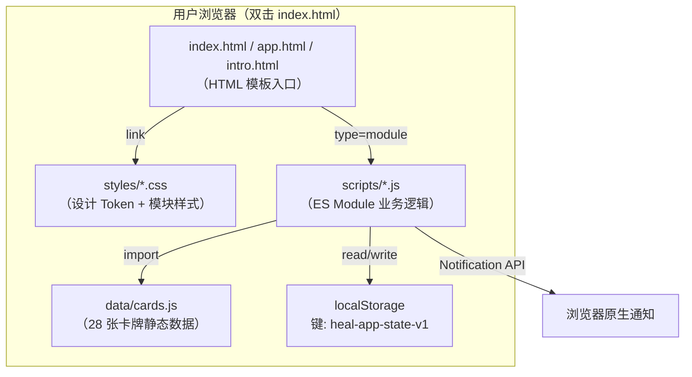

# 工位回血卡 · 技术架构文档

> 配套 [PRD.md](file:///Users/tyzhang/Learn/trae_app/work_head_cards/.trae/documents/PRD.md)
> 部署目标：**纯静态文件，解压双击即用，打包成 zip 交付**

---

## 1. 架构设计



**关键决定**：
- **零构建链路**：浏览器原生支持 ES Modules（`<script type="module">`），无需 webpack/vite/rollup
- **零运行时依赖**：不使用 React/Vue/任何 npm 包；CSS 框架若需要可走 CDN（按用户允许），但为保证"解压离线可用"，**核心样式手写**，仅可选引入字体 CDN（带系统字体降级）
- **多文件可维护**：把原 4000+ 行单文件 [app.html](file:///Users/tyzhang/Learn/trae_app/workstation-heal-card/app.html) 拆成 HTML 模板 / CSS 模块 / JS 模块的标准三层结构

---

## 2. 技术描述

| 类别 | 选型 | 说明 |
|------|------|------|
| **结构** | HTML5（`<template>` 模板克隆） | 4 个 Tab 用 `<template id="tpl-xxx">` 占位，JS 克隆挂载 |
| **样式** | 原生 CSS3 + CSS 变量 + CSS Grid/Flex | 不使用任何 CSS 框架（保证零依赖与离线可用） |
| **脚本** | 原生 ES2020 JavaScript + ES Modules | 浏览器原生模块化，无 TypeScript 编译需求 |
| **状态管理** | 单例 `state` 对象 + LocalStorage 同步 | 简洁的 `loadState() / saveState()` 模式 |
| **路由** | 哈希路由（`window.hashchange`） | `#today / #library / #history / #me` |
| **数据持久化** | LocalStorage（键 `heal-app-state-v1`） | 全部数据本地，导入导出 JSON 文件 |
| **通知** | Web Notification API + `setTimeout` | 仅页面打开时生效（符合用户期望的简化实现） |
| **字体** | 系统字体优先 + 可选 Google Fonts CDN | 离线下自动降级到 PingFang/Microsoft YaHei |
| **图标** | Emoji + 内联 SVG（少量功能图标手写） | 不引入图标库 |
| **打包** | 手动 `zip -r heal-card.zip .` | 排除 `.trae/`、`PROJECT_OVERVIEW.md` 等非必需文件 |
| **初始化工具** | 无（手工创建文件结构） | 跳过 `vite-init`，因用户明确要求"解压即用" |

---

## 3. 项目目录结构

```
work_head_cards/
├── index.html               # 入口跳转页（默认跳到 app.html）
├── app.html                 # 主应用 SPA（4 个 Tab）
├── intro.html               # 营销介绍页
├── styles/
│   ├── tokens.css           # 设计 Token（颜色、字体、间距、圆角变量）
│   ├── base.css             # reset + 排版基础
│   ├── layout.css           # sidebar + topbar + 主区域布局
│   ├── components.css       # 按钮 / chip / 卡牌 / 进度条 / 弹窗
│   ├── today.css            # #today Tab 专属样式
│   ├── library.css          # #library Tab 专属样式
│   ├── history.css          # #history Tab 专属样式
│   ├── me.css               # #me Tab 专属样式
│   ├── intro.css            # intro.html 专属样式
│   └── animations.css       # 翻牌 / 飘字 / 礼花 / shimmer 等关键帧
├── scripts/
│   ├── main.js              # 入口：路由初始化、全局事件绑定
│   ├── state.js             # LocalStorage 读写 + 跨日重置 + defaultState
│   ├── router.js            # 哈希路由 + 模板克隆 + onMount 分发
│   ├── utils.js             # 通用工具（dateKey, mondayOf, hpLevel, formatTime）
│   ├── draw.js              # 抽卡核心（weightedSample / inHourWindow / notDisabled / drawCards）
│   ├── ui.js                # 通用 UI 工具（animateHp, popHpDelta, toast, modal）
│   ├── views/
│   │   ├── today.js         # mountToday + 三段式抽卡区逻辑
│   │   ├── library.js       # mountLibrary + 图鉴渲染 + 详情弹窗
│   │   ├── history.js       # mountHistory + 热力图 + 周报
│   │   └── me.js            # mountMe + 设置 + 提醒 + 导入导出
│   └── notifications.js     # Web Notification 权限申请 + setTimeout 调度
├── data/
│   └── cards.js             # CARD_POOL（28 张）+ RARITY_WEIGHT + TAG_LABEL
├── assets/
│   └── favicon.svg          # 应用图标
├── README.md                # 使用说明（如何打开、如何打包）
└── .trae/                   # 开发文档（不打包进 zip）
    └── documents/
        ├── PRD.md
        └── TECHNICAL_ARCHITECTURE.md
```

**模块拆分原则**：
- 每个 JS 模块 ≤ 300 行；超过则继续拆分
- 视图层（`scripts/views/*.js`）只关心 DOM 渲染 + 事件绑定，业务逻辑下沉到 `draw.js / state.js`
- 样式按"通用 → 模块"分层，避免单文件 CSS 过大

---

## 4. 路由定义

| 路由 Hash | 视图模块 | 模板 ID | 标题 |
|----------|---------|--------|------|
| `#today`（默认） | [today.js](file:///Users/tyzhang/Learn/trae_app/work_head_cards/scripts/views/today.js) | `tpl-today` | 今日回血 |
| `#library` | [library.js](file:///Users/tyzhang/Learn/trae_app/work_head_cards/scripts/views/library.js) | `tpl-library` | 卡牌图鉴 |
| `#history` | [history.js](file:///Users/tyzhang/Learn/trae_app/work_head_cards/scripts/views/history.js) | `tpl-history` | 历史 & 周报 |
| `#me` | [me.js](file:///Users/tyzhang/Learn/trae_app/work_head_cards/scripts/views/me.js) | `tpl-me` | 我的 |

**路由流程**：
```
hashchange → router.render()
  → 清空 #viewRoot
  → 克隆 <template id="tpl-xxx">
  → 调用对应 mountXxx() 绑定事件
  → 更新 topbar 标题 + 同步 sidebar active 态
```

---

## 5. API 定义

**本项目无后端**，所有"接口"均为内部 JS 模块函数。关键 API 签名：

```typescript
// scripts/state.js
defaultState(): State
loadState(): State          // 含跨日重置逻辑
saveState(state: State): void
bumpStreakIfFirstToday(): void

// scripts/draw.js
weightedSample(candidates: Card[], n: number): Card[]
inHourWindow(card: Card, now?: Date): boolean
notDisabled(card: Card): boolean
drawCards(moods: string[]): Card[]   // 主流程：过滤 → 加权抽 3 张

// scripts/ui.js
animateHp(target: number, instant?: boolean): void
popHpDelta(amount: number, anchorEl: HTMLElement): void
toast(msg: string, kind?: 'info'|'success'|'error'): void
openModal(content: HTMLElement): void
closeModal(): void

// scripts/notifications.js
requestNotificationPermission(): Promise<boolean>
scheduleReminder(time: string /* "HH:mm" */): void
cancelReminder(): void

// scripts/router.js
getTab(): TabId
render(): void
```

---

## 6. 数据模型

### 6.1 State 数据结构（TypeScript 风格描述）

```typescript
interface State {
  streak: number                  // 连签天数
  lastDrawDate: string            // "YYYY-MM-DD"，上次抽卡日期
  installDate: string             // "YYYY-MM-DD"，首次启动日期
  today: {
    date: string                  // "YYYY-MM-DD"
    drawn: number                 // 今日累计抽卡数
    round: number                 // 今日第几轮
    hpToday: number               // 今日累计 HP（封顶 100）
    cards: { id: string; done: boolean }[]   // 当前批次
    moods: string[]               // 当前选择的状态标签
  }
  hpTotal: number                 // 全时累计 HP（不封顶）
  library: Record<string, number> // 图鉴解锁次数表 cardId → count
  history: {
    date: string                  // "YYYY-MM-DD"
    ts: number                    // 时间戳
    id: string                    // 卡牌 ID
    hp: number                    // 本次回血 HP
    rarity: 'n'|'r'|'sr'|'ssr'
  }[]
  settings: {
    remindOn: boolean
    remindTime: string            // "HH:mm"
    hourLimit: boolean            // 饭点限定卡开关
    disabledTags: string[]        // 用户关闭的状态标签
  }
}

interface Card {
  id: string
  name: string
  emoji: string
  rarity: 'n'|'r'|'sr'|'ssr'
  hp: number
  dur: number                     // 倒计时秒数
  tags: string[]
  desc: string
  hourRange?: [number, number][]  // 饭点限定，如 [[11.5,13.5],[17.5,19.5]]
}
```

### 6.2 LocalStorage Schema

```
key:   heal-app-state-v1
value: JSON.stringify(State)
size:  典型 < 50KB（千次完成后仍 < 200KB）
```

**跨日重置规则**（[loadState()](file:///Users/tyzhang/Learn/trae_app/work_head_cards/scripts/state.js)）：
1. 读取并 JSON.parse
2. 若 `today.date !== todayStr()`：
   - 昨天有抽卡 → 连签延续
   - 昨天无抽卡 → `streak = 0`
   - 重置 `today` 字段
3. 兼容老数据：补齐 `round` 与 `settings` 默认字段

---

## 7. 打包交付流程

**目标**：生成 `heal-card.zip`，用户解压后双击 `index.html`（或 `app.html`）即可使用。

### 7.1 打包脚本（手动执行）

```bash
cd /Users/tyzhang/Learn/trae_app/work_head_cards

# 排除开发文档与 macOS 元数据
zip -r heal-card.zip . \
  -x ".trae/*" \
  -x "PROJECT_OVERVIEW.md" \
  -x ".DS_Store" \
  -x "**/.DS_Store" \
  -x "*.zip"
```

### 7.2 zip 内文件清单

```
heal-card/
├── index.html        # 入口
├── app.html
├── intro.html
├── README.md
├── styles/           # 10 个 CSS
├── scripts/          # 1 个入口 + 7 个模块 + 4 个视图
├── data/cards.js
└── assets/favicon.svg
```

### 7.3 验证

- 解压 → 双击 `index.html` → 应自动跳转 `app.html#today`
- 关闭网络 → 刷新 → 仍可正常使用（无 CDN 强依赖）
- 在 `app.html` 中抽卡 → 关闭再打开 → 数据持久化

---

## 8. 关键技术决策与权衡

| 决策 | 选择 | 理由 |
|------|------|------|
| 是否用 Vite/React | **否** | 用户明确要求"解压即用"，构建产物需配 base path 与服务器 |
| 是否用 TypeScript | **否** | 浏览器不能直接运行 TS；保留 JSDoc 注释获得 IDE 类型提示 |
| 是否用 Tailwind | **否** | 离线场景下 CDN 不可靠；本地化又增加构建步骤 |
| 是否用 React Router | **否** | 哈希路由 + `<template>` 克隆已足够，避免大型库 |
| 是否引入 Chart.js | **否** | 周报曲线用纯 SVG / CSS Grid 实现，体积更小 |
| ES Modules vs IIFE | **ES Modules** | 现代浏览器原生支持，结构清晰；唯一注意：`file://` 协议下需用支持 module 的浏览器（Chrome/Edge/Firefox 100+ 均 OK） |
| 字体 | **系统优先 + Google Fonts 兜底** | 离线降级自动 |

> ⚠️ **关于 file:// 协议的注意**：极少数浏览器配置（如严格 CORS 的 Firefox 默认设置）可能阻止 `file://` 下的 ES Module 加载。**README 会附备用启动方案**：
> ```bash
> # 备用方案：在解压目录运行任一命令启动本地静态服务器
> python3 -m http.server 8080
> npx serve .
> ```
> 然后访问 `http://localhost:8080`。

---

## 9. 开发与验证

- **本地预览**：开发期间可用 `python3 -m http.server 8080` 启动静态服务器
- **手工测试清单**（每个 Tab 必测）：
  - [ ] #today：抽卡 / 翻牌 / 倒计时 / 完成 / 全部完成 / 重抽 / 跨日
  - [ ] #library：解锁状态显示 / 筛选 / 详情弹窗 / ESC 关闭
  - [ ] #history：本周柱状图 / 4 周热力图 / 周报数字
  - [ ] #me：开关 / 时间选择器 / Notification 权限 / 导出 JSON / 导入覆盖 / 重置
  - [ ] intro.html：所有锚点跳转 / CTA 跳回 app.html
- **无 lint/typecheck**：原生 JS 项目，依赖人工 review；可选 ESLint 但不强制
