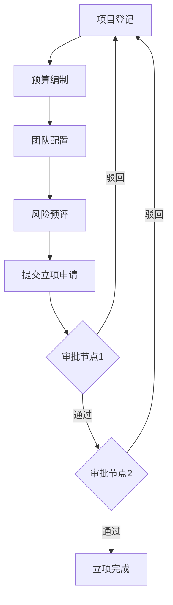

# 网络建设项目管理系统 - 产品需求文档

## 1. 产品概述

网络建设项目管理系统是一款面向工程建设行业的数字化管理平台，涵盖机房建设、分配网建设、入户安装等项目的全生命周期管理。平台通过透明化、高效协同的一站式数字化管理体验，帮助企业实现项目从立项到结算的全流程管控。

**目标用户**：企业员工、项目经理、监理方、施工队等多角色人员

## 2. 核心功能模块

### 2.1 用户角色定义

| 角色 | 注册方式 | 核心权限 |
|------|----------|----------|
| 企业员工 | 手机号注册 | 基础浏览、我的项目 |
| 项目经理 | 手机号注册 + 管理员授权 | 项目立项、进度管理、报表查看 |
| 监理方 | 企业邀请注册 | 项目监督、验收签字 |
| 施工队 | 企业邀请注册 | 人员管理、工时填报、材料申报 |

### 2.2 功能模块清单

1. **用户注册登录模块**
   - 手机号验证登录
   - 微信扫码登录
   - 单点登录（SSO）集成
   - 角色权限精细控制

2. **项目信息查询模块**
   - 多维度快速检索
   - 项目编号查询
   - 工程类型筛选
   - 自定义条件筛选
   - 数据导出功能

3. **项目立项模块**
   - 项目登记表单
   - 预算编制工具
   - 团队配置管理
   - 风险预评估
   - 立项申请单生成

4. **项目审批模块**
   - 多级在线审批
   - 流程灵活配置（会签/或签）
   - 催办、转办、加签功能
   - 全程留痕追溯

5. **报表查询模块**
   - 按施工时间段查询
   - 按立项时间段查询
   - 进度报表自动汇总
   - 成本报表生成
   - 材料消耗报表
   - 质量安全报表
   - 图表可视化展示
   - 周/月自动推送

6. **合同管理模块**
   - 合同起草与模板
   - 电子签章集成
   - 合同变更管理
   - 履约跟踪
   - 付款节点提醒
   - 结算归档

7. **施工人员管理模块**
   - 人员动态档案
   - 考勤记录管理
   - 工种资质管理
   - 安全教育培训记录
   - 奖惩情况记录
   - 工资发放录入
   - 工时绩效统计

8. **单价信息录入模块**
   - 材料单价管理
   - 设备单价管理
   - 人工单价管理
   - 分包单价管理
   - 版本管理
   - 历史价格曲线
   - 成本测算关联

## 3. 核心流程

### 3.1 项目立项审批流程

### 3.2 合同管理流程

## 4. 用户界面设计

### 4.1 设计风格

- **主色调**：深蓝色 #1a365d（专业、稳重）
- **辅助色**：科技蓝 #3182ce，活力橙 #ed8936（警示/重要）
- **背景色**：浅灰 #f7fafc，深灰 #edf2f7
- **字体**：思源黑体（标题）、思源宋体（正文）
- **布局**：左侧导航 + 右侧内容区的经典后台布局
- **图标**：线性图标风格

### 4.2 页面设计概览

| 页面名称 | 主要模块 | UI元素描述 |
|----------|----------|------------|
| 登录页 | 登录表单、微信扫码、SSO按钮 | 居中卡片布局，背景渐变，动画过渡 |
| 工作台 | 项目统计、待办事项、快捷入口 | 仪表盘风格，图表展示，卡片布局 |
| 项目列表 | 筛选栏、项目卡片列表 | 表格+卡片双视图切换，批量操作 |
| 项目详情 | 基础信息、进度、文档、审批 | Tab切换，侧边详情面板 |
| 立项表单 | 多步骤表单向导 | 步骤指示器，表单验证，实时预览 |
| 审批流程 | 流程图、审批历史 | 可视化流程节点，审批意见展示 |
| 报表中心 | 筛选条件、图表、报表列表 | 图表可视化，导出按钮，时间选择器 |
| 合同管理 | 合同列表、详情、签章 | 文件预览区，状态标签，签署按钮 |
| 人员管理 | 人员列表、档案详情 | 头像+信息卡片，统计图表 |
| 单价管理 | 价格列表、曲线图、版本对比 | 数据表格，折线图，版本时间线 |

### 4.3 响应式策略

- 桌面端优先设计，支持1024px以上屏幕
- 平板适配（768px-1024px）：导航折叠，单列布局
- 移动端适配（<768px）：底部导航，汉堡菜单

## 5. 数据可视化规范

### 5.1 图表配色

- 进度类：#38a169（完成）、#3182ce（进行中）、#ed8936（延误）
- 成本类：#38a169（节约）、#e53e3e（超支）
- 质量类：#38a169（合格）、#e53e3e（不合格）

### 5.2 图表类型

- 进度展示：环形进度图、甘特图
- 资金流向：柱状图、折线图
- 人员统计：饼图、柱状图
- 趋势分析：折线图、面积图
